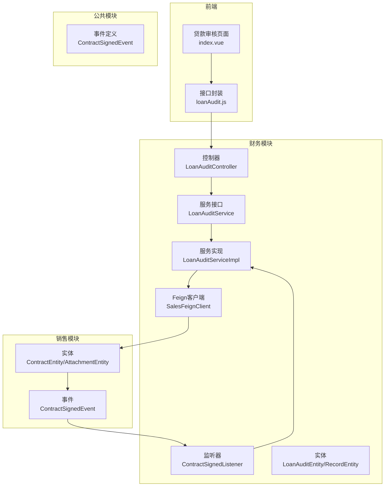
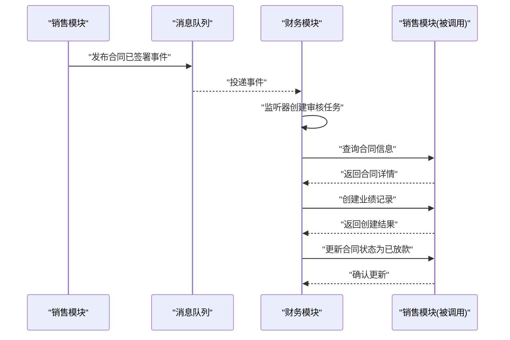
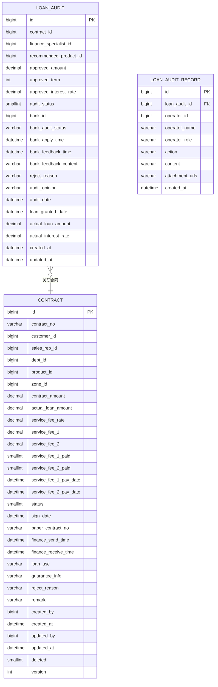
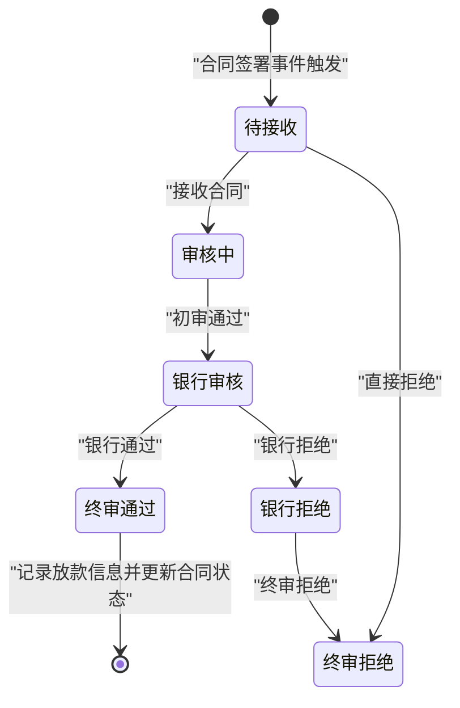
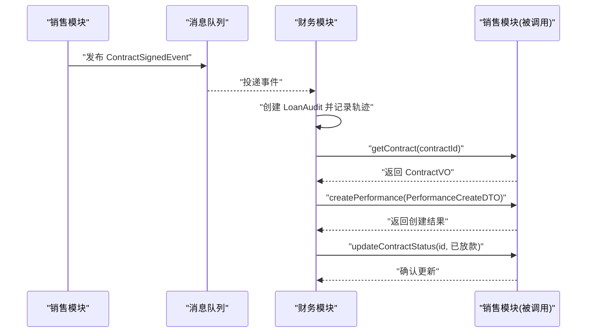
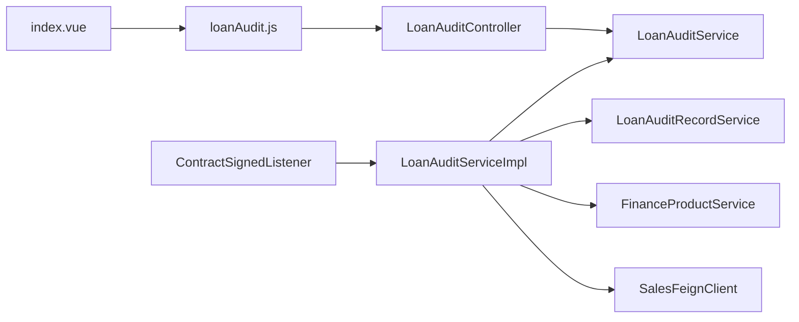

# 贷款审核管理

<cite>
**本文引用的文件**
- [LoanAuditController.java](file://finance/src/main/java/com/dafuweng/finance/controller/LoanAuditController.java)
- [LoanAuditService.java](file://finance/src/main/java/com/dafuweng/finance/service/LoanAuditService.java)
- [LoanAuditServiceImpl.java](file://finance/src/main/java/com/dafuweng/finance/service/impl/LoanAuditServiceImpl.java)
- [LoanAuditEntity.java](file://finance/src/main/java/com/dafuweng/finance/entity/LoanAuditEntity.java)
- [LoanAuditRecordEntity.java](file://finance/src/main/java/com/dafuweng/finance/entity/LoanAuditRecordEntity.java)
- [ContractEntity.java](file://sales/src/main/java/com/dafuweng/sales/entity/ContractEntity.java)
- [ContractAttachmentEntity.java](file://sales/src/main/java/com/dafuweng/sales/entity/ContractAttachmentEntity.java)
- [ContractSignedEvent.java](file://common/src/main/java/com/dafuweng/common/mq/event/ContractSignedEvent.java)
- [ContractSignedListener.java](file://finance/src/main/java/com/dafuweng/finance/mq/ContractSignedListener.java)
- [SalesFeignClient.java](file://finance/src/main/java/com/dafuweng/finance/feign/SalesFeignClient.java)
- [ContractSignedEvent.java](file://common/src/main/java/com/dafuweng/common/mq/event/ContractSignedEvent.java)
- [index.vue](file://ruoyi-ui/src/views/finance/loan-audit/index.vue)
- [loanAudit.js](file://ruoyi-ui/src/api/finance/loanAudit.js)
- [init-db.sql](file://scripts/init-db.sql)
</cite>

## 目录
1. [简介](#简介)
2. [项目结构](#项目结构)
3. [核心组件](#核心组件)
4. [架构总览](#架构总览)
5. [详细组件分析](#详细组件分析)
6. [依赖关系分析](#依赖关系分析)
7. [性能考虑](#性能考虑)
8. [故障排查指南](#故障排查指南)
9. [结论](#结论)
10. [附录](#附录)

## 简介
本文件面向贷款审核管理功能，系统性阐述从合同签署到放款完成的全生命周期流程，涵盖审核标准与权限、审核记录与轨迹、风险控制机制、实体数据模型、业务流程、规则引擎要点、与销售模块合同数据的集成与同步、以及文档管理与电子签名支持。目标是帮助技术与非技术读者快速理解并正确使用该功能。

## 项目结构
贷款审核管理涉及四个主要模块：
- 销售模块（sales）：负责合同生成、签署、附件管理、业绩创建等
- 财务模块（finance）：负责贷款审核流程编排、审核记录、与销售/系统服务交互
- 公共模块（common）：提供通用返回体、分页、消息队列事件定义
- 前端（ruoyi-ui）：提供贷款审核管理界面与接口封装

图表来源
- [LoanAuditController.java:1-143](file://finance/src/main/java/com/dafuweng/finance/controller/LoanAuditController.java#L1-L143)
- [LoanAuditService.java:1-63](file://finance/src/main/java/com/dafuweng/finance/service/LoanAuditService.java#L1-L63)
- [LoanAuditServiceImpl.java:1-260](file://finance/src/main/java/com/dafuweng/finance/service/impl/LoanAuditServiceImpl.java#L1-L260)
- [ContractSignedListener.java:1-55](file://finance/src/main/java/com/dafuweng/finance/mq/ContractSignedListener.java#L1-L55)
- [ContractEntity.java:1-91](file://sales/src/main/java/com/dafuweng/sales/entity/ContractEntity.java#L1-L91)
- [ContractAttachmentEntity.java:1-39](file://sales/src/main/java/com/dafuweng/sales/entity/ContractAttachmentEntity.java#L1-L39)
- [ContractSignedEvent.java:1-21](file://common/src/main/java/com/dafuweng/common/mq/event/ContractSignedEvent.java#L1-L21)
- [SalesFeignClient.java:1-23](file://finance/src/main/java/com/dafuweng/finance/feign/SalesFeignClient.java#L1-L23)

章节来源
- [LoanAuditController.java:1-143](file://finance/src/main/java/com/dafuweng/finance/controller/LoanAuditController.java#L1-L143)
- [LoanAuditService.java:1-63](file://finance/src/main/java/com/dafuweng/finance/service/LoanAuditService.java#L1-L63)
- [LoanAuditServiceImpl.java:1-260](file://finance/src/main/java/com/dafuweng/finance/service/impl/LoanAuditServiceImpl.java#L1-L260)
- [ContractSignedListener.java:1-55](file://finance/src/main/java/com/dafuweng/finance/mq/ContractSignedListener.java#L1-L55)
- [ContractEntity.java:1-91](file://sales/src/main/java/com/dafuweng/sales/entity/ContractEntity.java#L1-L91)
- [ContractAttachmentEntity.java:1-39](file://sales/src/main/java/com/dafuweng/sales/entity/ContractAttachmentEntity.java#L1-L39)
- [ContractSignedEvent.java:1-21](file://common/src/main/java/com/dafuweng/common/mq/event/ContractSignedEvent.java#L1-L21)
- [SalesFeignClient.java:1-23](file://finance/src/main/java/com/dafuweng/finance/feign/SalesFeignClient.java#L1-L23)

## 核心组件
- 贷款审核实体（LoanAuditEntity）：承载合同关联、推荐产品、审批金额、期限、利率、审核状态、银行反馈、放款信息等字段
- 审核记录实体（LoanAuditRecordEntity）：记录每次操作的操作人、角色、动作、内容与附件URL
- 控制器（LoanAuditController）：提供REST接口，覆盖查询、分页、接收、初审、提交银行、银行结果、终审、拒绝等
- 服务接口与实现（LoanAuditService/LoanAuditServiceImpl）：实现状态机流转、轨迹记录、与销售模块的业绩创建与合同状态更新
- 合同签署事件（ContractSignedEvent）与监听器（ContractSignedListener）：在销售模块合同签署后自动创建审核任务
- 前端界面与API封装：提供贷款审核列表、详情、批准/拒绝操作

章节来源
- [LoanAuditEntity.java:1-64](file://finance/src/main/java/com/dafuweng/finance/entity/LoanAuditEntity.java#L1-L64)
- [LoanAuditRecordEntity.java:1-37](file://finance/src/main/java/com/dafuweng/finance/entity/LoanAuditRecordEntity.java#L1-L37)
- [LoanAuditController.java:1-143](file://finance/src/main/java/com/dafuweng/finance/controller/LoanAuditController.java#L1-L143)
- [LoanAuditService.java:1-63](file://finance/src/main/java/com/dafuweng/finance/service/LoanAuditService.java#L1-L63)
- [LoanAuditServiceImpl.java:1-260](file://finance/src/main/java/com/dafuweng/finance/service/impl/LoanAuditServiceImpl.java#L1-L260)
- [ContractSignedEvent.java:1-21](file://common/src/main/java/com/dafuweng/common/mq/event/ContractSignedEvent.java#L1-L21)
- [ContractSignedListener.java:1-55](file://finance/src/main/java/com/dafuweng/finance/mq/ContractSignedListener.java#L1-L55)
- [index.vue:1-215](file://ruoyi-ui/src/views/finance/loan-audit/index.vue#L1-L215)
- [loanAudit.js:1-107](file://ruoyi-ui/src/api/finance/loanAudit.js#L1-L107)

## 架构总览
系统采用微服务架构，前端通过HTTP调用财务模块接口；财务模块通过消息队列监听销售模块的合同签署事件，自动生成贷款审核任务；财务模块再通过Feign调用销售模块以创建业绩与更新合同状态。

图表来源
- [ContractSignedListener.java:27-53](file://finance/src/main/java/com/dafuweng/finance/mq/ContractSignedListener.java#L27-L53)
- [LoanAuditServiceImpl.java:203-242](file://finance/src/main/java/com/dafuweng/finance/service/impl/LoanAuditServiceImpl.java#L203-L242)
- [SalesFeignClient.java:11-18](file://finance/src/main/java/com/dafuweng/finance/feign/SalesFeignClient.java#L11-L18)

## 详细组件分析

### 实体模型与数据结构
- 贷款审核实体（LoanAuditEntity）关键字段
  - 关联标识：contractId、recommendedProductId、bankId
  - 审批信息：approvedAmount、approvedTerm、approvedInterestRate
  - 实际放款：actualLoanAmount、actualInterestRate、loanGrantedDate
  - 审核状态：auditStatus（含待接收、审核中、银行审核、银行通过、银行拒绝、终审通过、终审拒绝等）
  - 银行交互：bankAuditStatus、bankApplyTime、bankFeedbackTime、bankFeedbackContent
  - 备注与时间：rejectReason、auditOpinion、auditDate、createdAt、updatedAt
- 审核记录实体（LoanAuditRecordEntity）关键字段
  - 关联标识：loanAuditId
  - 操作信息：operatorId、operatorName、operatorRole、action（receive/review/submit_bank/bank_result/approve/reject）
  - 内容与附件：content、attachmentUrls
  - 时间：createdAt

图表来源
- [LoanAuditEntity.java:1-64](file://finance/src/main/java/com/dafuweng/finance/entity/LoanAuditEntity.java#L1-L64)
- [LoanAuditRecordEntity.java:1-37](file://finance/src/main/java/com/dafuweng/finance/entity/LoanAuditRecordEntity.java#L1-L37)
- [ContractEntity.java:1-91](file://sales/src/main/java/com/dafuweng/sales/entity/ContractEntity.java#L1-L91)

章节来源
- [LoanAuditEntity.java:1-64](file://finance/src/main/java/com/dafuweng/finance/entity/LoanAuditEntity.java#L1-L64)
- [LoanAuditRecordEntity.java:1-37](file://finance/src/main/java/com/dafuweng/finance/entity/LoanAuditRecordEntity.java#L1-L37)
- [ContractEntity.java:1-91](file://sales/src/main/java/com/dafuweng/sales/entity/ContractEntity.java#L1-L91)

### 业务流程与状态机
贷款审核流程包含以下关键节点与状态：
- 待接收（1）→ 接收合同（2）
- 审核中（2）→ 初审（3）
- 初审（3）→ 提交银行（4）
- 银行审核（4）→ 银行通过（6）或 银行拒绝（5）
- 终审通过（6）→ 记录放款信息并触发业绩创建与合同状态更新
- 银行通过/拒绝/终审拒绝（4/5/7）→ 终审拒绝（7）

图表来源
- [LoanAuditServiceImpl.java:113-181](file://finance/src/main/java/com/dafuweng/finance/service/impl/LoanAuditServiceImpl.java#L113-L181)
- [LoanAuditServiceImpl.java:185-258](file://finance/src/main/java/com/dafuweng/finance/service/impl/LoanAuditServiceImpl.java#L185-L258)

章节来源
- [LoanAuditController.java:59-141](file://finance/src/main/java/com/dafuweng/finance/controller/LoanAuditController.java#L59-L141)
- [LoanAuditServiceImpl.java:113-258](file://finance/src/main/java/com/dafuweng/finance/service/impl/LoanAuditServiceImpl.java#L113-L258)

### 审核规则引擎说明
当前实现未内置复杂的规则引擎类文件。规则执行主要体现在：
- 银行反馈决策：根据银行反馈内容与通过标记决定进入“银行通过”或“银行拒绝”
- 终审通过时的放款信息记录：仅记录实际放款金额、实际利率与放款日期，不包含复杂规则计算
- 业绩创建：基于合同金额与产品提成率计算提成金额，作为风控与激励的间接手段

建议扩展方向（概念性）：
- 引入规则定义与执行引擎，支持信用评分阈值、收入负债比上限、担保物价值折扣等指标
- 将规则与产品类型、客户类型解耦，便于动态调整
- 在初审阶段增加自动化初筛，减少人工干预

章节来源
- [LoanAuditServiceImpl.java:162-181](file://finance/src/main/java/com/dafuweng/finance/service/impl/LoanAuditServiceImpl.java#L162-L181)
- [LoanAuditServiceImpl.java:210-231](file://finance/src/main/java/com/dafuweng/finance/service/impl/LoanAuditServiceImpl.java#L210-L231)

### 与销售模块合同数据的集成与同步
- 事件驱动：销售模块合同签署后发布“合同已签署”事件，财务模块监听并创建贷款审核任务
- 业绩联动：终审通过后，财务模块查询合同信息并通过Feign调用销售模块创建业绩记录
- 状态同步：终审通过后，财务模块调用销售模块将合同状态更新为“已放款”

图表来源
- [ContractSignedListener.java:27-53](file://finance/src/main/java/com/dafuweng/finance/mq/ContractSignedListener.java#L27-L53)
- [LoanAuditServiceImpl.java:203-242](file://finance/src/main/java/com/dafuweng/finance/service/impl/LoanAuditServiceImpl.java#L203-L242)
- [SalesFeignClient.java:11-18](file://finance/src/main/java/com/dafuweng/finance/feign/SalesFeignClient.java#L11-L18)

章节来源
- [ContractSignedEvent.java:1-21](file://common/src/main/java/com/dafuweng/common/mq/event/ContractSignedEvent.java#L1-L21)
- [ContractSignedListener.java:1-55](file://finance/src/main/java/com/dafuweng/finance/mq/ContractSignedListener.java#L1-L55)
- [LoanAuditServiceImpl.java:203-242](file://finance/src/main/java/com/dafuweng/finance/service/impl/LoanAuditServiceImpl.java#L203-L242)
- [SalesFeignClient.java:1-23](file://finance/src/main/java/com/dafuweng/finance/feign/SalesFeignClient.java#L1-L23)

### 文档管理与电子签名
- 文档管理：销售模块提供合同附件实体，用于存储文件URL、名称、大小、MD5等元数据，支持上传与归档
- 电子签名：前端贷款审核页面未直接展示电子签名控件；建议在合同签署阶段集成电子签章能力，并将签章信息与附件关联

章节来源
- [ContractAttachmentEntity.java:1-39](file://sales/src/main/java/com/dafuweng/sales/entity/ContractAttachmentEntity.java#L1-L39)
- [index.vue:1-215](file://ruoyi-ui/src/views/finance/loan-audit/index.vue#L1-L215)

## 依赖关系分析
- 控制器依赖服务接口，服务实现依赖DAO、记录服务、产品服务与Feign客户端
- 监听器依赖服务接口与记录服务
- 前端通过API封装调用控制器接口
- 模块间通过消息队列与Feign进行异步与同步通信

图表来源
- [LoanAuditController.java:1-143](file://finance/src/main/java/com/dafuweng/finance/controller/LoanAuditController.java#L1-L143)
- [LoanAuditService.java:1-63](file://finance/src/main/java/com/dafuweng/finance/service/LoanAuditService.java#L1-L63)
- [LoanAuditServiceImpl.java:1-260](file://finance/src/main/java/com/dafuweng/finance/service/impl/LoanAuditServiceImpl.java#L1-L260)
- [ContractSignedListener.java:1-55](file://finance/src/main/java/com/dafuweng/finance/mq/ContractSignedListener.java#L1-L55)
- [loanAudit.js:1-107](file://ruoyi-ui/src/api/finance/loanAudit.js#L1-L107)

章节来源
- [LoanAuditController.java:1-143](file://finance/src/main/java/com/dafuweng/finance/controller/LoanAuditController.java#L1-L143)
- [LoanAuditServiceImpl.java:1-260](file://finance/src/main/java/com/dafuweng/finance/service/impl/LoanAuditServiceImpl.java#L1-L260)
- [ContractSignedListener.java:1-55](file://finance/src/main/java/com/dafuweng/finance/mq/ContractSignedListener.java#L1-L55)
- [loanAudit.js:1-107](file://ruoyi-ui/src/api/finance/loanAudit.js#L1-L107)

## 性能考虑
- 分页查询：控制器提供分页接口，服务层使用MyBatis-Plus分页插件，避免一次性加载大量数据
- 状态校验：服务实现对状态转换进行严格校验，防止并发状态下状态错乱
- 事件幂等：监听器在创建审核任务前检查是否存在相同合同的审核记录，避免重复创建
- 异步处理：通过消息队列解耦合同签署与审核任务创建，提升响应速度

章节来源
- [LoanAuditController.java:33-36](file://finance/src/main/java/com/dafuweng/finance/controller/LoanAuditController.java#L33-L36)
- [LoanAuditServiceImpl.java:29-76](file://finance/src/main/java/com/dafuweng/finance/service/impl/LoanAuditServiceImpl.java#L29-L76)
- [ContractSignedListener.java:29-33](file://finance/src/main/java/com/dafuweng/finance/mq/ContractSignedListener.java#L29-L33)

## 故障排查指南
- 审核状态异常
  - 现象：状态不可转换或抛出非法状态异常
  - 排查：确认当前auditStatus是否符合预期；检查服务实现的状态判断逻辑
  - 参考：[LoanAuditServiceImpl.java:113-181](file://finance/src/main/java/com/dafuweng/finance/service/impl/LoanAuditServiceImpl.java#L113-L181)
- 业绩创建失败
  - 现象：终审通过后无法创建业绩或合同状态未更新
  - 排查：检查SalesFeignClient返回码与消息；确认产品提成率是否为空
  - 参考：[LoanAuditServiceImpl.java:203-242](file://finance/src/main/java/com/dafuweng/finance/service/impl/LoanAuditServiceImpl.java#L203-L242)
- 事件未触发
  - 现象：合同已签署但未创建审核任务
  - 排查：确认消息队列配置与监听器是否启用；检查事件序列化与反序列化
  - 参考：[ContractSignedListener.java:27-53](file://finance/src/main/java/com/dafuweng/finance/mq/ContractSignedListener.java#L27-L53)
- 前端操作异常
  - 现象：批准/拒绝按钮不可用或请求失败
  - 排查：确认用户权限与状态映射；检查API封装与控制器路径
  - 参考：[index.vue:171-211](file://ruoyi-ui/src/views/finance/loan-audit/index.vue#L171-L211)，[loanAudit.js:90-106](file://ruoyi-ui/src/api/finance/loanAudit.js#L90-L106)

章节来源
- [LoanAuditServiceImpl.java:113-258](file://finance/src/main/java/com/dafuweng/finance/service/impl/LoanAuditServiceImpl.java#L113-L258)
- [ContractSignedListener.java:27-53](file://finance/src/main/java/com/dafuweng/finance/mq/ContractSignedListener.java#L27-L53)
- [index.vue:171-211](file://ruoyi-ui/src/views/finance/loan-audit/index.vue#L171-L211)
- [loanAudit.js:90-106](file://ruoyi-ui/src/api/finance/loanAudit.js#L90-L106)

## 结论
贷款审核管理功能通过事件驱动与服务间协作实现了从合同签署到放款完成的闭环管理。现有实现具备清晰的状态机、完善的审核轨迹与与销售模块的可靠集成。建议后续增强规则引擎、完善电子签名与文档管理能力，并持续优化性能与可观测性。

## 附录

### 数据库初始化脚本（概览）
- 初始化多个服务数据库（认证、系统、销售、财务等）
- 授权root用户远程访问

章节来源
- [init-db.sql:1-22](file://scripts/init-db.sql#L1-L22)