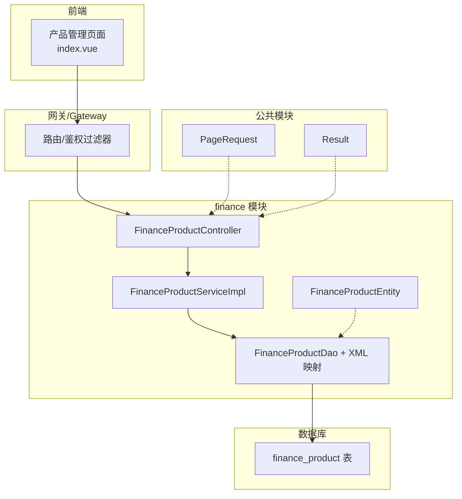
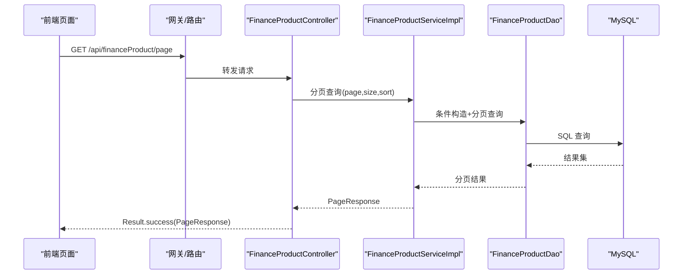
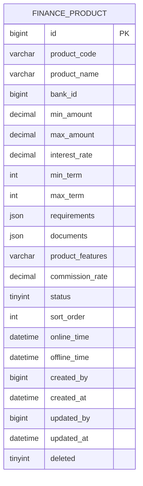
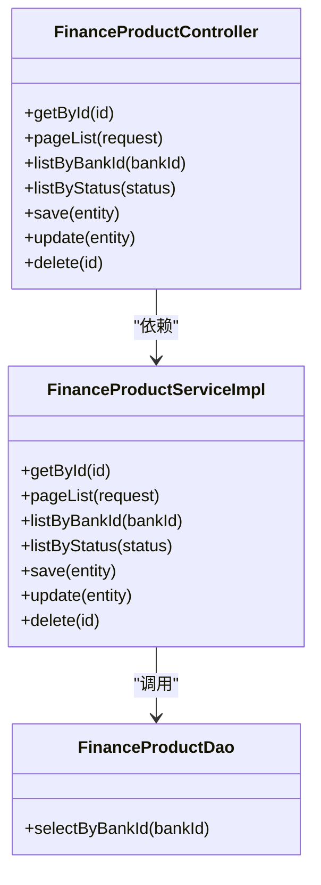
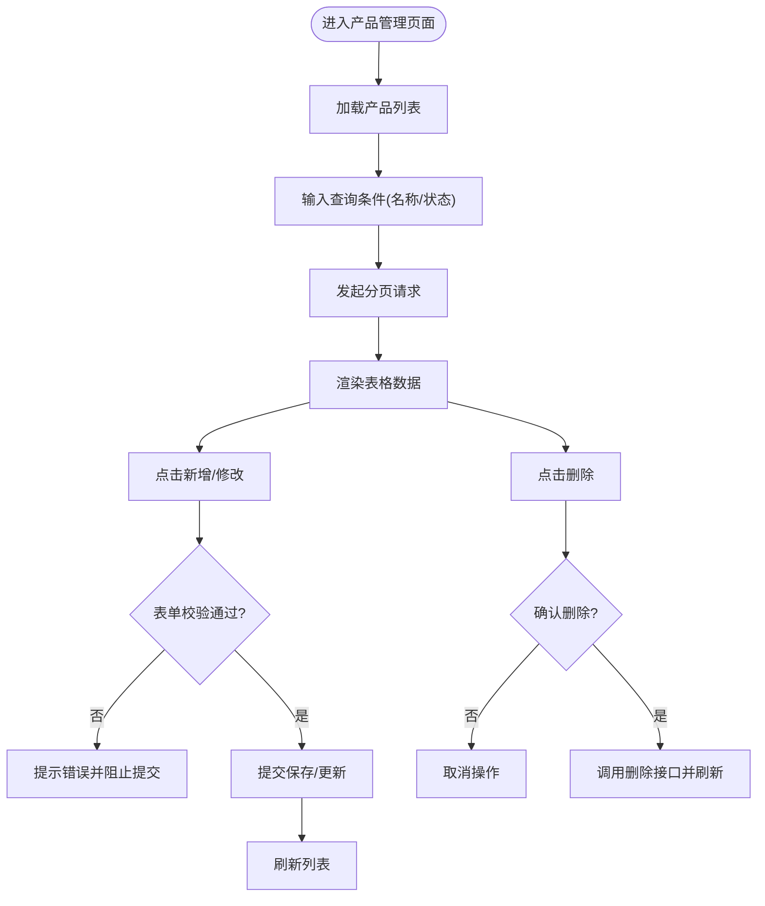
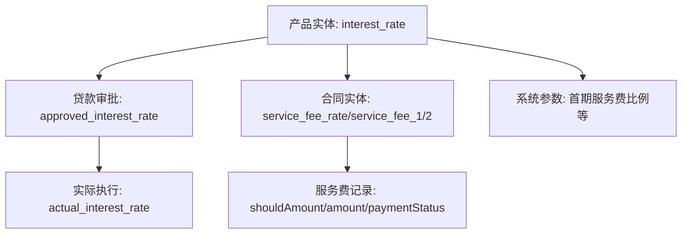
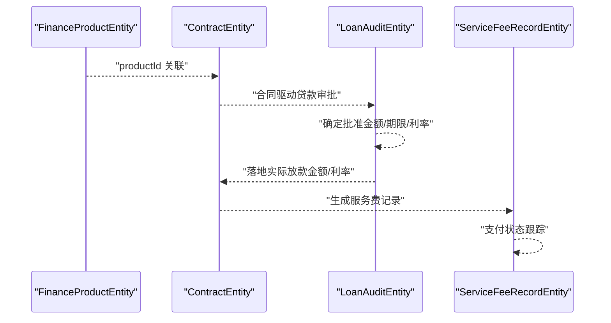
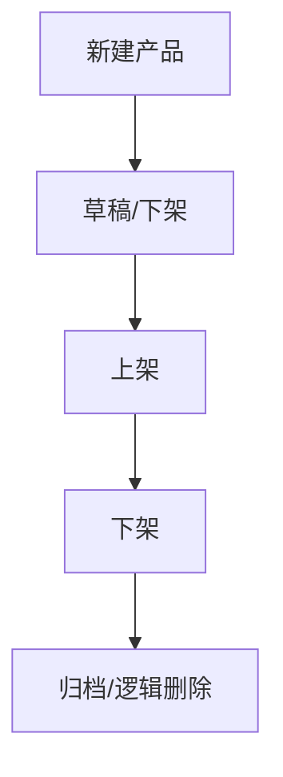
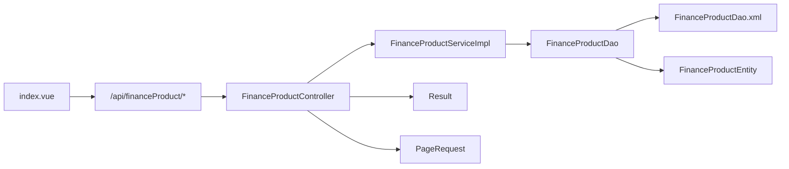

# 金融产品管理

<cite>
**本文引用的文件**
- [FinanceProductEntity.java](file://finance/src/main/java/com/dafuweng/finance/entity/FinanceProductEntity.java)
- [FinanceProductController.java](file://finance/src/main/java/com/dafuweng/finance/controller/FinanceProductController.java)
- [FinanceProductServiceImpl.java](file://finance/src/main/java/com/dafuweng/finance/service/impl/FinanceProductServiceImpl.java)
- [FinanceProductDao.java](file://finance/src/main/java/com/dafuweng/finance/dao/FinanceProductDao.java)
- [FinanceProductDao.xml](file://finance/src/main/resources/finance/mapper/FinanceProductDao.xml)
- [PageRequest.java](file://common/src/main/java/com/dafuweng/common/entity/PageRequest.java)
- [Result.java](file://common/src/main/java/com/dafuweng/common/entity/Result.java)
- [index.vue](file://ruoyi-ui/src/views/finance/product/index.vue)
- [database.sql](file://database.sql)
- [ContractEntity.java](file://sales/src/main/java/com/dafuweng/sales/entity/ContractEntity.java)
- [LoanAuditEntity.java](file://finance/src/main/java/com/dafuweng/finance/entity/LoanAuditEntity.java)
- [ServiceFeeRecordEntity.java](file://finance/src/main/java/com/dafuweng/finance/entity/ServiceFeeRecordEntity.java)
</cite>

## 目录
1. [简介](#简介)
2. [项目结构](#项目结构)
3. [核心组件](#核心组件)
4. [架构总览](#架构总览)
5. [详细组件分析](#详细组件分析)
6. [依赖分析](#依赖分析)
7. [性能考虑](#性能考虑)
8. [故障排查指南](#故障排查指南)
9. [结论](#结论)
10. [附录](#附录)

## 简介
本文件面向金融产品管理功能，系统化梳理产品配置管理、参数设置、利率计算规则、风险评估与合规风控、产品上线流程以及与贷款审核、费用计算等模块的集成关系。文档以代码为依据，结合数据库表结构，提供从实体设计到业务流程、再到前后端交互的全景说明。

## 项目结构
金融产品管理位于 finance 模块，采用典型的分层架构：控制器层负责对外接口；服务层封装业务逻辑；持久层通过 MyBatis-Plus 访问数据库；公共模块提供通用响应体与分页请求对象；前端使用 Vue + Element Plus 实现产品列表与编辑界面。

图表来源
- [FinanceProductController.java:1-56](file://finance/src/main/java/com/dafuweng/finance/controller/FinanceProductController.java#L1-L56)
- [FinanceProductServiceImpl.java:1-79](file://finance/src/main/java/com/dafuweng/finance/service/impl/FinanceProductServiceImpl.java#L1-L79)
- [FinanceProductDao.java:1-15](file://finance/src/main/java/com/dafuweng/finance/dao/FinanceProductDao.java#L1-L15)
- [FinanceProductDao.xml:1-42](file://finance/src/main/resources/finance/mapper/FinanceProductDao.xml#L1-L42)
- [FinanceProductEntity.java:1-68](file://finance/src/main/java/com/dafuweng/finance/entity/FinanceProductEntity.java#L1-L68)
- [PageRequest.java:1-22](file://common/src/main/java/com/dafuweng/common/entity/PageRequest.java#L1-L22)
- [Result.java:1-50](file://common/src/main/java/com/dafuweng/common/entity/Result.java#L1-L50)
- [index.vue:1-171](file://ruoyi-ui/src/views/finance/product/index.vue#L1-L171)

章节来源
- [FinanceProductController.java:1-56](file://finance/src/main/java/com/dafuweng/finance/controller/FinanceProductController.java#L1-L56)
- [FinanceProductServiceImpl.java:1-79](file://finance/src/main/java/com/dafuweng/finance/service/impl/FinanceProductServiceImpl.java#L1-L79)
- [FinanceProductDao.java:1-15](file://finance/src/main/java/com/dafuweng/finance/dao/FinanceProductDao.java#L1-L15)
- [FinanceProductDao.xml:1-42](file://finance/src/main/resources/finance/mapper/FinanceProductDao.xml#L1-L42)
- [FinanceProductEntity.java:1-68](file://finance/src/main/java/com/dafuweng/finance/entity/FinanceProductEntity.java#L1-L68)
- [PageRequest.java:1-22](file://common/src/main/java/com/dafuweng/common/entity/PageRequest.java#L1-L22)
- [Result.java:1-50](file://common/src/main/java/com/dafuweng/common/entity/Result.java#L1-L50)
- [index.vue:1-171](file://ruoyi-ui/src/views/finance/product/index.vue#L1-L171)

## 核心组件
- 控制器层：提供产品查询、分页、按银行/状态筛选、新增、更新、删除等接口。
- 服务层：实现分页查询、按条件查询、保存/更新/删除等业务逻辑。
- 持久层：基于 MyBatis-Plus 的 Mapper 接口与 XML 映射，支持按银行 ID 查询与通用 CRUD。
- 实体层：定义金融产品核心字段，含金额区间、利率、期限、佣金率、状态、排序、上下架时间等。
- 前端页面：提供产品列表展示、搜索、新增/修改弹窗、删除确认等交互。

章节来源
- [FinanceProductController.java:1-56](file://finance/src/main/java/com/dafuweng/finance/controller/FinanceProductController.java#L1-L56)
- [FinanceProductServiceImpl.java:1-79](file://finance/src/main/java/com/dafuweng/finance/service/impl/FinanceProductServiceImpl.java#L1-L79)
- [FinanceProductDao.java:1-15](file://finance/src/main/java/com/dafuweng/finance/dao/FinanceProductDao.java#L1-L15)
- [FinanceProductDao.xml:1-42](file://finance/src/main/resources/finance/mapper/FinanceProductDao.xml#L1-L42)
- [FinanceProductEntity.java:1-68](file://finance/src/main/java/com/dafuweng/finance/entity/FinanceProductEntity.java#L1-L68)
- [index.vue:1-171](file://ruoyi-ui/src/views/finance/product/index.vue#L1-L171)

## 架构总览
金融产品管理遵循“控制器-服务-持久层-实体-映射”的分层设计，前端通过网关访问后端接口，返回统一结果包装与分页信息。

图表来源
- [FinanceProductController.java:25-28](file://finance/src/main/java/com/dafuweng/finance/controller/FinanceProductController.java#L25-L28)
- [FinanceProductServiceImpl.java:30-45](file://finance/src/main/java/com/dafuweng/finance/service/impl/FinanceProductServiceImpl.java#L30-L45)
- [FinanceProductDao.xml:30-39](file://finance/src/main/resources/finance/mapper/FinanceProductDao.xml#L30-L39)
- [Result.java:11-21](file://common/src/main/java/com/dafuweng/common/entity/Result.java#L11-L21)

## 详细组件分析

### 金融产品实体与数据模型
金融产品实体涵盖产品基本信息、金额与期限约束、利率、佣金率、状态与排序、上下架时间、创建/更新元数据及逻辑删除标志。部分字段以 JSON 类型存储扩展信息（如需求与文档），便于灵活扩展。

图表来源
- [FinanceProductEntity.java:14-67](file://finance/src/main/java/com/dafuweng/finance/entity/FinanceProductEntity.java#L14-L67)
- [FinanceProductDao.xml:5-28](file://finance/src/main/resources/finance/mapper/FinanceProductDao.xml#L5-L28)

章节来源
- [FinanceProductEntity.java:1-68](file://finance/src/main/java/com/dafuweng/finance/entity/FinanceProductEntity.java#L1-L68)
- [FinanceProductDao.xml:1-42](file://finance/src/main/resources/finance/mapper/FinanceProductDao.xml#L1-L42)

### 控制器与服务层
- 控制器提供产品详情、分页列表、按银行/状态查询、新增、更新、删除接口。
- 服务层实现分页排序、按银行查询、按状态查询、事务性保存/更新/删除。
- 持久层通过 XML 自定义查询按银行 ID 返回产品列表并按排序字段排序。

图表来源
- [FinanceProductController.java:13-55](file://finance/src/main/java/com/dafuweng/finance/controller/FinanceProductController.java#L13-L55)
- [FinanceProductServiceImpl.java:18-78](file://finance/src/main/java/com/dafuweng/finance/service/impl/FinanceProductServiceImpl.java#L18-L78)
- [FinanceProductDao.java:10-14](file://finance/src/main/java/com/dafuweng/finance/dao/FinanceProductDao.java#L10-L14)

章节来源
- [FinanceProductController.java:1-56](file://finance/src/main/java/com/dafuweng/finance/controller/FinanceProductController.java#L1-L56)
- [FinanceProductServiceImpl.java:1-79](file://finance/src/main/java/com/dafuweng/finance/service/impl/FinanceProductServiceImpl.java#L1-L79)
- [FinanceProductDao.java:1-15](file://finance/src/main/java/com/dafuweng/finance/dao/FinanceProductDao.java#L1-L15)

### 前端交互与表单校验
前端产品管理页面提供：
- 列表展示：ID、产品代码、名称、银行ID、金额范围、利率、期限、佣金率、状态。
- 查询：按产品名称、状态筛选。
- 新增/修改：必填项校验（产品代码、产品名称、银行ID）。
- 删除：二次确认弹窗。
- 分页：兼容 pageNum/pageSize。

图表来源
- [index.vue:100-171](file://ruoyi-ui/src/views/finance/product/index.vue#L100-L171)
- [PageRequest.java:6-21](file://common/src/main/java/com/dafuweng/common/entity/PageRequest.java#L6-L21)
- [Result.java:6-32](file://common/src/main/java/com/dafuweng/common/entity/Result.java#L6-L32)

章节来源
- [index.vue:1-171](file://ruoyi-ui/src/views/finance/product/index.vue#L1-L171)
- [PageRequest.java:1-22](file://common/src/main/java/com/dafuweng/common/entity/PageRequest.java#L1-L22)
- [Result.java:1-50](file://common/src/main/java/com/dafuweng/common/entity/Result.java#L1-L50)

### 产品定价与利率计算规则
根据现有实体与数据库参数，可识别以下定价相关字段与参数：
- 年化利率：产品实体包含“interest_rate”字段，用于产品层面的基准利率。
- 银行/渠道佣金：产品实体包含“commission_rate”，用于渠道或银行侧的返佣比例。
- 合同服务费：合同实体包含“service_fee_rate”、“service_fee_1/2”等字段，体现服务费策略。
- 系统参数：数据库中存在“首期服务费比例”等系统参数，可用于默认值或校验。

图表来源
- [FinanceProductEntity.java:33](file://finance/src/main/java/com/dafuweng/finance/entity/FinanceProductEntity.java#L33)
- [LoanAuditEntity.java:27-55](file://finance/src/main/java/com/dafuweng/finance/entity/LoanAuditEntity.java#L27-L55)
- [ContractEntity.java:35-57](file://sales/src/main/java/com/dafuweng/sales/entity/ContractEntity.java#L35-L57)
- [ServiceFeeRecordEntity.java:21-41](file://finance/src/main/java/com/dafuweng/finance/entity/ServiceFeeRecordEntity.java#L21-L41)
- [database.sql:190-197](file://database.sql#L190-L197)

章节来源
- [FinanceProductEntity.java:1-68](file://finance/src/main/java/com/dafuweng/finance/entity/FinanceProductEntity.java#L1-L68)
- [LoanAuditEntity.java:1-64](file://finance/src/main/java/com/dafuweng/finance/entity/LoanAuditEntity.java#L1-L64)
- [ContractEntity.java:1-91](file://sales/src/main/java/com/dafuweng/sales/entity/ContractEntity.java#L1-L91)
- [ServiceFeeRecordEntity.java:1-50](file://finance/src/main/java/com/dafuweng/finance/entity/ServiceFeeRecordEntity.java#L1-L50)
- [database.sql:190-197](file://database.sql#L190-L197)

### 产品与贷款审核、费用计算的集成
- 产品与合同：合同实体包含“productId”，用于绑定具体产品；同时包含服务费相关字段，支撑费用计算。
- 产品与贷款审核：贷款审核实体包含“recommendedProductId”、“approvedAmount/term/rate”、“actualLoanAmount/actualInterestRate”等，体现产品在审批与放款阶段的映射与落地。
- 产品与服务费记录：服务费记录实体记录费用发生、应缴、实缴、支付状态等，支撑财务结算。

图表来源
- [ContractEntity.java:30](file://sales/src/main/java/com/dafuweng/sales/entity/ContractEntity.java#L30)
- [LoanAuditEntity.java:25-55](file://finance/src/main/java/com/dafuweng/finance/entity/LoanAuditEntity.java#L25-L55)
- [ServiceFeeRecordEntity.java:21-41](file://finance/src/main/java/com/dafuweng/finance/entity/ServiceFeeRecordEntity.java#L21-L41)

章节来源
- [ContractEntity.java:1-91](file://sales/src/main/java/com/dafuweng/sales/entity/ContractEntity.java#L1-L91)
- [LoanAuditEntity.java:1-64](file://finance/src/main/java/com/dafuweng/finance/entity/LoanAuditEntity.java#L1-L64)
- [ServiceFeeRecordEntity.java:1-50](file://finance/src/main/java/com/dafuweng/finance/entity/ServiceFeeRecordEntity.java#L1-L50)

### 产品上线流程与状态管理
- 上线/下线：产品实体包含“status”、“onlineTime”、“offlineTime”等字段，支持产品状态切换与时间记录。
- 排序与可见性：通过“sortOrder”控制展示顺序；前端按该字段排序。
- 逻辑删除：实体包含“deleted”字段，服务层与映射均支持逻辑删除。

图表来源
- [FinanceProductEntity.java:49](file://finance/src/main/java/com/dafuweng/finance/entity/FinanceProductEntity.java#L49)
- [FinanceProductEntity.java:53](file://finance/src/main/java/com/dafuweng/finance/entity/FinanceProductEntity.java#L53)
- [FinanceProductEntity.java:55](file://finance/src/main/java/com/dafuweng/finance/entity/FinanceProductEntity.java#L55)
- [FinanceProductDao.xml:37](file://finance/src/main/resources/finance/mapper/FinanceProductDao.xml#L37)
- [FinanceProductServiceImpl.java:75-77](file://finance/src/main/java/com/dafuweng/finance/service/impl/FinanceProductServiceImpl.java#L75-L77)

章节来源
- [FinanceProductEntity.java:1-68](file://finance/src/main/java/com/dafuweng/finance/entity/FinanceProductEntity.java#L1-L68)
- [FinanceProductDao.xml:1-42](file://finance/src/main/resources/finance/mapper/FinanceProductDao.xml#L1-L42)
- [FinanceProductServiceImpl.java:1-79](file://finance/src/main/java/com/dafuweng/finance/service/impl/FinanceProductServiceImpl.java#L1-L79)

### 风险评估与合规检查
- 需求与文档：产品实体包含“requirements”和“documents”字段，建议用于存放合规与风控所需材料与要求说明。
- 风险等级：当前实体未直接暴露风险等级字段，可在扩展时引入相应枚举或字段以满足风控模型对接。
- 银行反馈：贷款审核实体包含“bankFeedbackContent/Status”，可用于记录外部银行风控反馈。

章节来源
- [FinanceProductEntity.java:39](file://finance/src/main/java/com/dafuweng/finance/entity/FinanceProductEntity.java#L39)
- [FinanceProductEntity.java:42](file://finance/src/main/java/com/dafuweng/finance/entity/FinanceProductEntity.java#L42)
- [LoanAuditEntity.java:37-47](file://finance/src/main/java/com/dafuweng/finance/entity/LoanAuditEntity.java#L37-L47)

## 依赖分析
- 控制器依赖服务层；服务层依赖持久层；持久层依赖实体与 XML 映射；前端依赖控制器提供的接口。
- 统一响应体 Result 与分页请求 PageRequest 在跨模块复用，保证接口风格一致。

图表来源
- [index.vue:100-101](file://ruoyi-ui/src/views/finance/product/index.vue#L100-L101)
- [FinanceProductController.java:13-18](file://finance/src/main/java/com/dafuweng/finance/controller/FinanceProductController.java#L13-L18)
- [FinanceProductServiceImpl.java:21-22](file://finance/src/main/java/com/dafuweng/finance/service/impl/FinanceProductServiceImpl.java#L21-L22)
- [FinanceProductDao.java:10-14](file://finance/src/main/java/com/dafuweng/finance/dao/FinanceProductDao.java#L10-L14)
- [FinanceProductDao.xml:3-28](file://finance/src/main/resources/finance/mapper/FinanceProductDao.xml#L3-L28)
- [FinanceProductEntity.java:14-67](file://finance/src/main/java/com/dafuweng/finance/entity/FinanceProductEntity.java#L14-L67)
- [Result.java:6-9](file://common/src/main/java/com/dafuweng/common/entity/Result.java#L6-L9)
- [PageRequest.java:6-10](file://common/src/main/java/com/dafuweng/common/entity/PageRequest.java#L6-L10)

章节来源
- [FinanceProductController.java:1-56](file://finance/src/main/java/com/dafuweng/finance/controller/FinanceProductController.java#L1-L56)
- [FinanceProductServiceImpl.java:1-79](file://finance/src/main/java/com/dafuweng/finance/service/impl/FinanceProductServiceImpl.java#L1-L79)
- [FinanceProductDao.java:1-15](file://finance/src/main/java/com/dafuweng/finance/dao/FinanceProductDao.java#L1-L15)
- [FinanceProductDao.xml:1-42](file://finance/src/main/resources/finance/mapper/FinanceProductDao.xml#L1-L42)
- [FinanceProductEntity.java:1-68](file://finance/src/main/java/com/dafuweng/finance/entity/FinanceProductEntity.java#L1-L68)
- [Result.java:1-50](file://common/src/main/java/com/dafuweng/common/entity/Result.java#L1-L50)
- [PageRequest.java:1-22](file://common/src/main/java/com/dafuweng/common/entity/PageRequest.java#L1-L22)
- [index.vue:1-171](file://ruoyi-ui/src/views/finance/product/index.vue#L1-L171)

## 性能考虑
- 分页查询：服务层使用 MyBatis-Plus 分页插件，默认按创建时间倒序，可结合 sortField/ sort 排序优化。
- 排序字段：数据库与映射中对“sort_order”进行排序，建议在产品列表查询时优先使用该字段以减少排序成本。
- 逻辑删除：统一使用逻辑删除，避免全表扫描与重建索引，提升删除与恢复效率。
- JSON 扩展字段：requirements/documents 使用 JSON 存储，便于扩展但需注意查询与索引策略。

章节来源
- [FinanceProductServiceImpl.java:30-45](file://finance/src/main/java/com/dafuweng/finance/service/impl/FinanceProductServiceImpl.java#L30-L45)
- [FinanceProductDao.xml:37](file://finance/src/main/resources/finance/mapper/FinanceProductDao.xml#L37)
- [FinanceProductEntity.java:39](file://finance/src/main/java/com/dafuweng/finance/entity/FinanceProductEntity.java#L39)
- [FinanceProductEntity.java:42](file://finance/src/main/java/com/dafuweng/finance/entity/FinanceProductEntity.java#L42)

## 故障排查指南
- 接口返回格式：统一使用 Result 包装，若出现异常，检查 Result.error* 方法与异常处理器。
- 分页参数：前端传入 pageNum/pageSize 会映射到 page/size，确保分页参数正确传递。
- 查询条件：按 bankId/status 查询时，确认传参与实体字段一致。
- 删除行为：确认逻辑删除生效且查询时过滤 deleted 字段。

章节来源
- [Result.java:11-48](file://common/src/main/java/com/dafuweng/common/entity/Result.java#L11-L48)
- [PageRequest.java:13-20](file://common/src/main/java/com/dafuweng/common/entity/PageRequest.java#L13-L20)
- [FinanceProductDao.xml:37](file://finance/src/main/resources/finance/mapper/FinanceProductDao.xml#L37)
- [FinanceProductServiceImpl.java:75-77](file://finance/src/main/java/com/dafuweng/finance/service/impl/FinanceProductServiceImpl.java#L75-L77)

## 结论
金融产品管理模块以清晰的分层架构实现了产品配置、参数设置、状态管理与上下架流程；通过与贷款审核、合同与服务费记录的实体关联，形成从产品到放款与收费的闭环。建议后续在实体中补充风险等级字段，并完善合规与风控相关字段的标准化，以满足更严格的风控与监管要求。

## 附录
- 数据库参数参考：系统参数中包含“首期服务费比例”等关键指标，可作为默认值或校验依据。
- 前端交互：产品页面支持搜索、分页、新增/修改/删除，具备良好的用户体验与可维护性。

章节来源
- [database.sql:190-197](file://database.sql#L190-L197)
- [index.vue:1-171](file://ruoyi-ui/src/views/finance/product/index.vue#L1-L171)