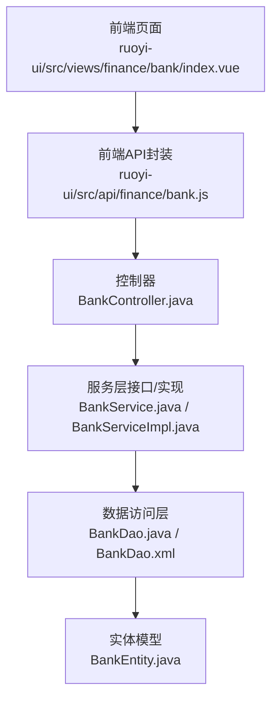
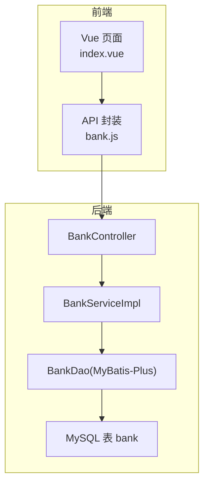
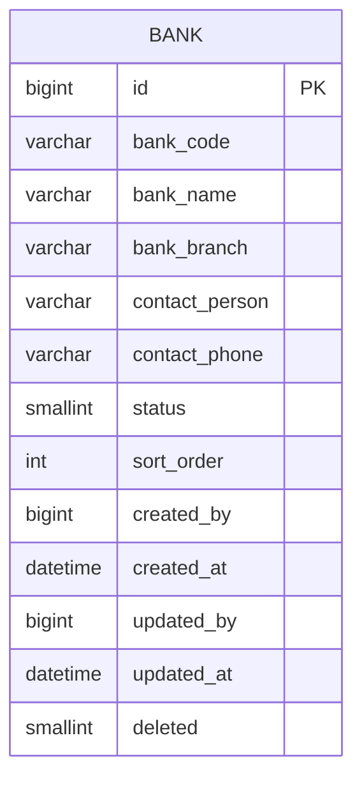
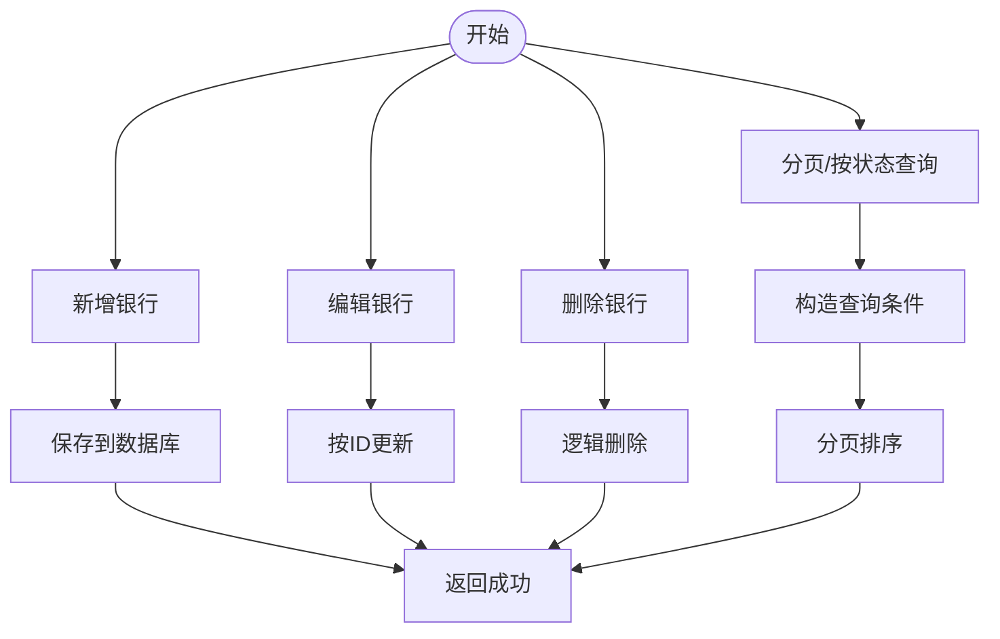
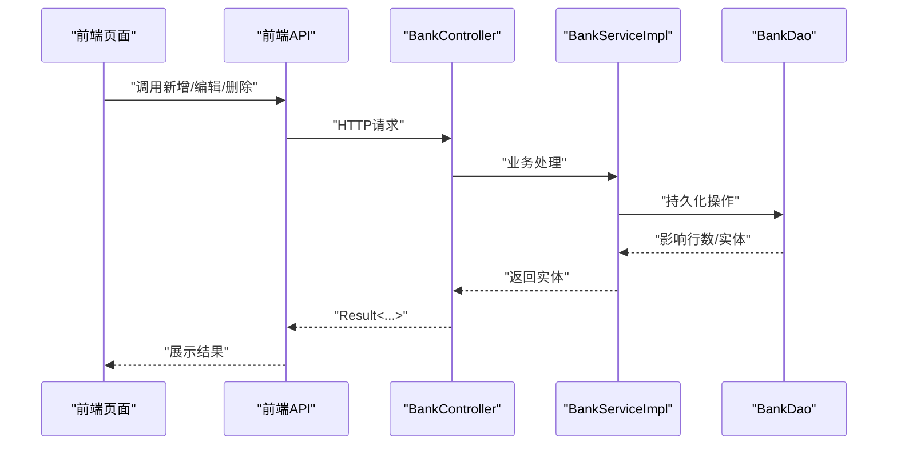
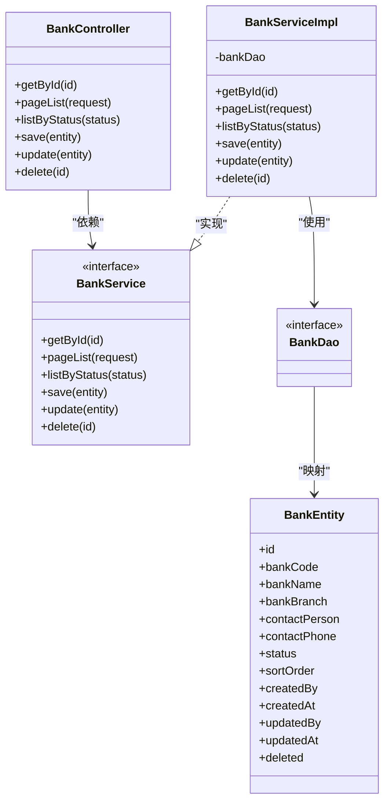

# 银行管理

<cite>
**本文引用的文件**
- [BankController.java](file://finance/src/main/java/com/dafuweng/finance/controller/BankController.java)
- [BankService.java](file://finance/src/main/java/com/dafuweng/finance/service/BankService.java)
- [BankServiceImpl.java](file://finance/src/main/java/com/dafuweng/finance/service/impl/BankServiceImpl.java)
- [BankDao.java](file://finance/src/main/java/com/dafuweng/finance/dao/BankDao.java)
- [BankDao.xml](file://finance/src/main/resources/finance/mapper/BankDao.xml)
- [BankEntity.java](file://finance/src/main/java/com/dafuweng/finance/entity/BankEntity.java)
- [PageRequest.java](file://common/src/main/java/com/dafuweng/common/entity/PageRequest.java)
- [PageResponse.java](file://common/src/main/java/com/dafuweng/common/entity/PageResponse.java)
- [Result.java](file://common/src/main/java/com/dafuweng/common/entity/Result.java)
- [bank.js](file://ruoyi-ui/src/api/finance/bank.js)
- [index.vue](file://ruoyi-ui/src/views/finance/bank/index.vue)
- [LoanAuditEntity.java](file://finance/src/main/java/com/dafuweng/finance/entity/LoanAuditEntity.java)
- [ContractEntity.java](file://sales/src/main/java/com/dafuweng/sales/entity/ContractEntity.java)
- [database.sql](file://database.sql)
</cite>

## 目录
1. [简介](#简介)
2. [项目结构](#项目结构)
3. [核心组件](#核心组件)
4. [架构总览](#架构总览)
5. [详细组件分析](#详细组件分析)
6. [依赖关系分析](#依赖关系分析)
7. [性能考虑](#性能考虑)
8. [故障排查指南](#故障排查指南)
9. [结论](#结论)
10. [附录](#附录)

## 简介
本文件为银行管理功能的完整API文档，覆盖银行信息维护、账户信息维护、资金划转接口与对账机制的说明。重点包括：
- 银行实体数据结构与字段定义
- 银行业务流程：新增、编辑、删除、启用/禁用
- 完整RESTful API接口规范：方法、路径、参数、响应与错误处理
- 与合同、贷款审核等业务模块的集成关系
- 安全控制与权限验证机制

## 项目结构
银行管理功能位于finance模块，采用经典的分层架构：Controller → Service → DAO（MyBatis）→ Entity。前端通过RuoYi前端工程调用后端API。

图表来源
- [BankController.java:1-51](file://finance/src/main/java/com/dafuweng/finance/controller/BankController.java#L1-L51)
- [BankService.java:1-33](file://finance/src/main/java/com/dafuweng/finance/service/BankService.java#L1-L33)
- [BankServiceImpl.java:1-74](file://finance/src/main/java/com/dafuweng/finance/service/impl/BankServiceImpl.java#L1-L74)
- [BankDao.java:1-10](file://finance/src/main/java/com/dafuweng/finance/dao/BankDao.java#L1-L10)
- [BankDao.xml:1-22](file://finance/src/main/resources/finance/mapper/BankDao.xml#L1-L22)
- [BankEntity.java:1-45](file://finance/src/main/java/com/dafuweng/finance/entity/BankEntity.java#L1-L45)
- [bank.js:1-54](file://ruoyi-ui/src/api/finance/bank.js#L1-L54)
- [index.vue:1-155](file://ruoyi-ui/src/views/finance/bank/index.vue#L1-L155)

章节来源
- [BankController.java:1-51](file://finance/src/main/java/com/dafuweng/finance/controller/BankController.java#L1-L51)
- [BankService.java:1-33](file://finance/src/main/java/com/dafuweng/finance/service/BankService.java#L1-L33)
- [BankServiceImpl.java:1-74](file://finance/src/main/java/com/dafuweng/finance/service/impl/BankServiceImpl.java#L1-L74)
- [BankDao.java:1-10](file://finance/src/main/java/com/dafuweng/finance/dao/BankDao.java#L1-L10)
- [BankDao.xml:1-22](file://finance/src/main/resources/finance/mapper/BankDao.xml#L1-L22)
- [BankEntity.java:1-45](file://finance/src/main/java/com/dafuweng/finance/entity/BankEntity.java#L1-L45)
- [bank.js:1-54](file://ruoyi-ui/src/api/finance/bank.js#L1-L54)
- [index.vue:1-155](file://ruoyi-ui/src/views/finance/bank/index.vue#L1-L155)

## 核心组件
- 控制器：提供RESTful接口，统一返回包装对象
- 服务层：封装业务逻辑，支持分页、按状态查询、事务性保存/更新/删除
- 数据访问层：基于MyBatis-Plus的通用Mapper
- 实体模型：映射bank表，包含基础字段、状态、排序、创建/更新信息及逻辑删除
- 前端API封装与页面：提供列表、查询、新增/编辑、删除交互

章节来源
- [BankController.java:1-51](file://finance/src/main/java/com/dafuweng/finance/controller/BankController.java#L1-L51)
- [BankService.java:1-33](file://finance/src/main/java/com/dafuweng/finance/service/BankService.java#L1-L33)
- [BankServiceImpl.java:1-74](file://finance/src/main/java/com/dafuweng/finance/service/impl/BankServiceImpl.java#L1-L74)
- [BankDao.java:1-10](file://finance/src/main/java/com/dafuweng/finance/dao/BankDao.java#L1-L10)
- [BankEntity.java:1-45](file://finance/src/main/java/com/dafuweng/finance/entity/BankEntity.java#L1-L45)
- [bank.js:1-54](file://ruoyi-ui/src/api/finance/bank.js#L1-L54)
- [index.vue:1-155](file://ruoyi-ui/src/views/finance/bank/index.vue#L1-L155)

## 架构总览
银行管理采用前后端分离架构，前端通过HTTP请求调用后端接口；后端以Spring MVC + MyBatis-Plus实现数据持久化与业务处理。

图表来源
- [BankController.java:1-51](file://finance/src/main/java/com/dafuweng/finance/controller/BankController.java#L1-L51)
- [BankServiceImpl.java:1-74](file://finance/src/main/java/com/dafuweng/finance/service/impl/BankServiceImpl.java#L1-L74)
- [BankDao.java:1-10](file://finance/src/main/java/com/dafuweng/finance/dao/BankDao.java#L1-L10)
- [BankDao.xml:1-22](file://finance/src/main/resources/finance/mapper/BankDao.xml#L1-L22)

## 详细组件分析

### 银行实体模型
银行实体映射bank表，包含以下关键字段：
- 主键与标识：id、bankCode
- 基本信息：bankName、bankBranch
- 联系方式：contactPerson、contactPhone
- 状态与排序：status、sortOrder
- 创建与更新：createdBy、createdAt、updatedBy、updatedAt
- 逻辑删除：deleted

图表来源
- [BankEntity.java:1-45](file://finance/src/main/java/com/dafuweng/finance/entity/BankEntity.java#L1-L45)
- [BankDao.xml:1-22](file://finance/src/main/resources/finance/mapper/BankDao.xml#L1-L22)

章节来源
- [BankEntity.java:1-45](file://finance/src/main/java/com/dafuweng/finance/entity/BankEntity.java#L1-L45)
- [BankDao.xml:1-22](file://finance/src/main/resources/finance/mapper/BankDao.xml#L1-L22)

### 银行管理业务流程
- 新增：提交银行信息，服务层插入记录并返回
- 编辑：根据主键更新银行信息
- 删除：逻辑删除（软删），不影响历史数据
- 启用/禁用：通过status字段切换
- 列表查询：支持分页、按状态筛选、默认按创建时间倒序

图表来源
- [BankServiceImpl.java:54-72](file://finance/src/main/java/com/dafuweng/finance/service/impl/BankServiceImpl.java#L54-L72)
- [BankServiceImpl.java:29-45](file://finance/src/main/java/com/dafuweng/finance/service/impl/BankServiceImpl.java#L29-L45)

章节来源
- [BankServiceImpl.java:1-74](file://finance/src/main/java/com/dafuweng/finance/service/impl/BankServiceImpl.java#L1-L74)

### RESTful API 接口说明

- 获取单个银行
  - 方法：GET
  - 路径：/api/bank/{id}
  - 请求参数：路径变量 id（Long）
  - 响应：Result<BankEntity>
  - 错误：未找到时由Result错误码封装

- 分页查询银行列表
  - 方法：GET
  - 路径：/api/bank/page
  - 查询参数：page/pageNum、size/pageSize、sortField、sortOrder
  - 响应：Result<PageResponse<BankEntity>>
  - 说明：兼容RuoYi前端参数命名

- 按状态查询银行列表
  - 方法：GET
  - 路径：/api/bank/listByStatus
  - 查询参数：status（Short）
  - 响应：Result<List<BankEntity>>

- 新增银行
  - 方法：POST
  - 路径：/api/bank
  - 请求体：BankEntity
  - 响应：Result<BankEntity>

- 更新银行
  - 方法：PUT
  - 路径：/api/bank
  - 请求体：BankEntity
  - 响应：Result<BankEntity>

- 删除银行
  - 方法：DELETE
  - 路径：/api/bank/{id}
  - 请求参数：路径变量 id（Long）
  - 响应：Result<Void>

- 响应包装与错误码
  - 成功：code=200，message="success"
  - 错误：code=500，或400/401/403等具体错误码
  - 分页：PageResponse 包含 total、records、page、size

章节来源
- [BankController.java:1-51](file://finance/src/main/java/com/dafuweng/finance/controller/BankController.java#L1-L51)
- [PageRequest.java:1-22](file://common/src/main/java/com/dafuweng/common/entity/PageRequest.java#L1-L22)
- [PageResponse.java:1-22](file://common/src/main/java/com/dafuweng/common/entity/PageResponse.java#L1-L22)
- [Result.java:1-50](file://common/src/main/java/com/dafuweng/common/entity/Result.java#L1-L50)
- [bank.js:1-54](file://ruoyi-ui/src/api/finance/bank.js#L1-L54)

### 前端交互与页面
- 列表页提供查询条件（银行名称、状态）、分页控件、新增/编辑/删除按钮
- 新增/编辑弹窗校验必填项（银行代码、银行名称）
- 删除前二次确认

章节来源
- [index.vue:1-155](file://ruoyi-ui/src/views/finance/bank/index.vue#L1-L155)
- [bank.js:1-54](file://ruoyi-ui/src/api/finance/bank.js#L1-L54)

### 银行与合同、贷款审核的集成关系
- 贷款审核流程中，银行作为“提交银行”与“银行反馈”的关键节点：
  - 提交银行：将bank_id写入贷款审核记录，状态推进至“银行审核中”
  - 银行反馈：根据审批结果更新审核状态与反馈时间/内容
- 合同实体包含服务费支付相关字段，与银行管理存在间接关联（资金结算）

图表来源
- [BankController.java:1-51](file://finance/src/main/java/com/dafuweng/finance/controller/BankController.java#L1-L51)
- [BankServiceImpl.java:1-74](file://finance/src/main/java/com/dafuweng/finance/service/impl/BankServiceImpl.java#L1-L74)
- [BankDao.java:1-10](file://finance/src/main/java/com/dafuweng/finance/dao/BankDao.java#L1-L10)

章节来源
- [LoanAuditEntity.java:1-64](file://finance/src/main/java/com/dafuweng/finance/entity/LoanAuditEntity.java#L1-L64)
- [ContractEntity.java:1-91](file://sales/src/main/java/com/dafuweng/sales/entity/ContractEntity.java#L1-L91)
- [database.sql:526-555](file://database.sql#L526-L555)

## 依赖关系分析

图表来源
- [BankController.java:1-51](file://finance/src/main/java/com/dafuweng/finance/controller/BankController.java#L1-L51)
- [BankService.java:1-33](file://finance/src/main/java/com/dafuweng/finance/service/BankService.java#L1-L33)
- [BankServiceImpl.java:1-74](file://finance/src/main/java/com/dafuweng/finance/service/impl/BankServiceImpl.java#L1-L74)
- [BankDao.java:1-10](file://finance/src/main/java/com/dafuweng/finance/dao/BankDao.java#L1-L10)
- [BankEntity.java:1-45](file://finance/src/main/java/com/dafuweng/finance/entity/BankEntity.java#L1-L45)

章节来源
- [BankController.java:1-51](file://finance/src/main/java/com/dafuweng/finance/controller/BankController.java#L1-L51)
- [BankService.java:1-33](file://finance/src/main/java/com/dafuweng/finance/service/BankService.java#L1-L33)
- [BankServiceImpl.java:1-74](file://finance/src/main/java/com/dafuweng/finance/service/impl/BankServiceImpl.java#L1-L74)
- [BankDao.java:1-10](file://finance/src/main/java/com/dafuweng/finance/dao/BankDao.java#L1-L10)
- [BankEntity.java:1-45](file://finance/src/main/java/com/dafuweng/finance/entity/BankEntity.java#L1-L45)

## 性能考虑
- 分页查询：建议在高频查询场景下限制每页大小，避免一次性加载过多数据
- 排序策略：默认按创建时间倒序，可结合索引优化
- 状态过滤：按status过滤可利用索引提升查询效率
- 逻辑删除：软删减少物理删除带来的锁竞争与数据丢失风险

## 故障排查指南
- 常见错误码
  - 400：请求参数不合法
  - 401：未认证或令牌无效
  - 403：无权限访问
  - 500：服务器内部错误
- 建议排查步骤
  - 检查请求路径与参数类型是否匹配
  - 确认分页参数（page/pageNum、size/pageSize）范围合理
  - 核对状态值（status）是否为预期枚举值
  - 查看服务日志定位异常堆栈

章节来源
- [Result.java:1-50](file://common/src/main/java/com/dafuweng/common/entity/Result.java#L1-L50)

## 结论
银行管理模块提供了完善的银行信息维护能力，具备良好的扩展性与可维护性。通过清晰的分层设计与统一的响应包装，满足了业务对银行基础数据管理的需求。后续可在以下方面持续优化：
- 引入更细粒度的权限控制与审计日志
- 对高频查询增加缓存策略
- 在贷款审核流程中完善银行状态流转与对账机制

## 附录

### 数据模型与表结构
- 表名：bank
- 字段：id、bank_code、bank_name、bank_branch、contact_person、contact_phone、status、sort_order、created_by、created_at、updated_by、updated_at、deleted

章节来源
- [BankDao.xml:1-22](file://finance/src/main/resources/finance/mapper/BankDao.xml#L1-L22)
- [database.sql:526-555](file://database.sql#L526-L555)