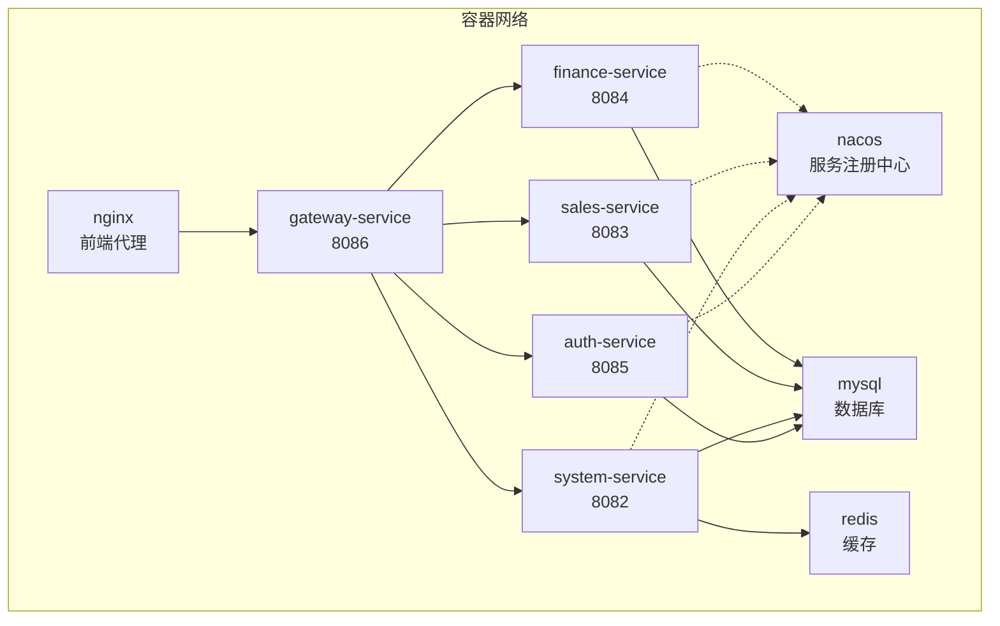
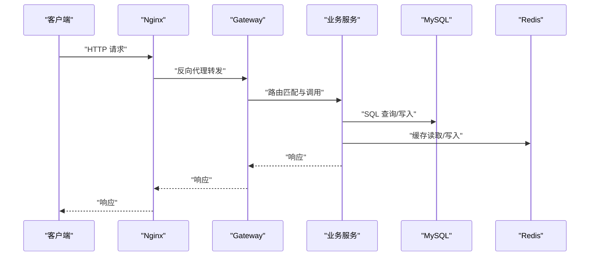
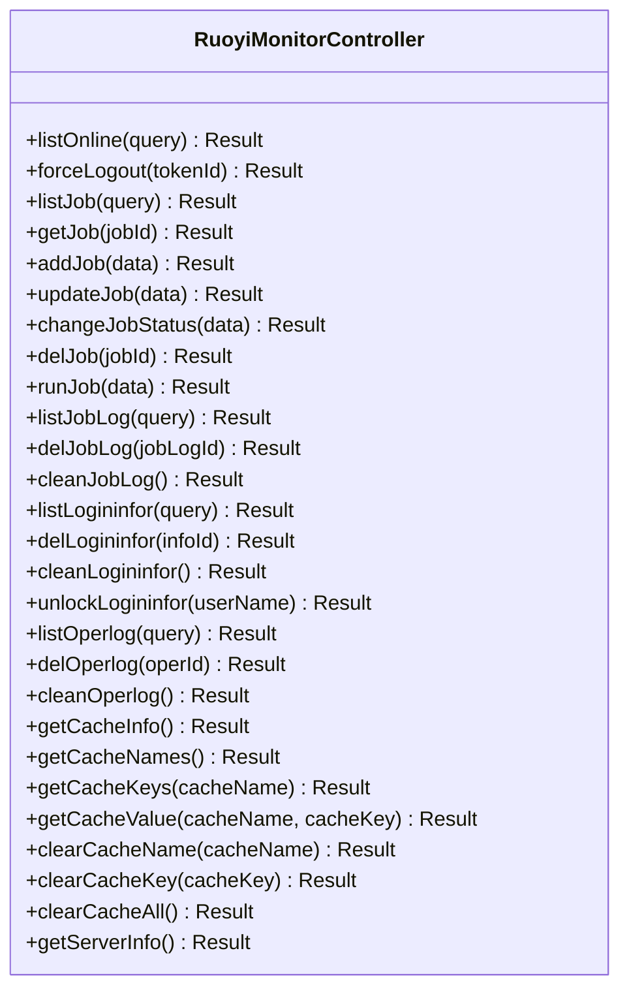
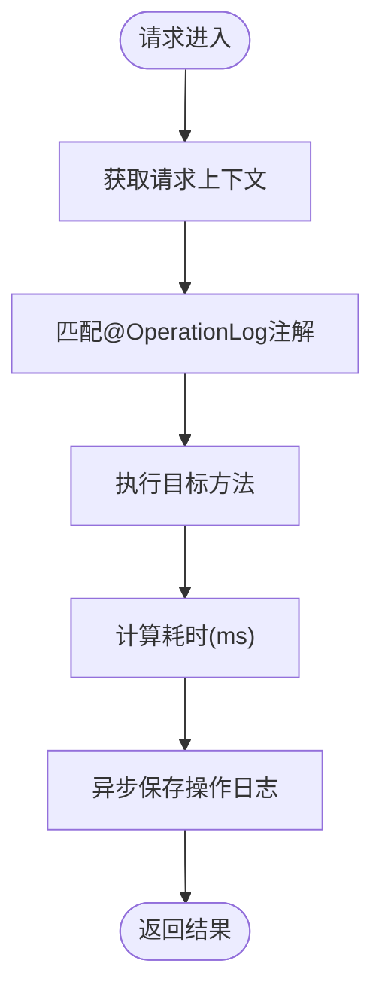
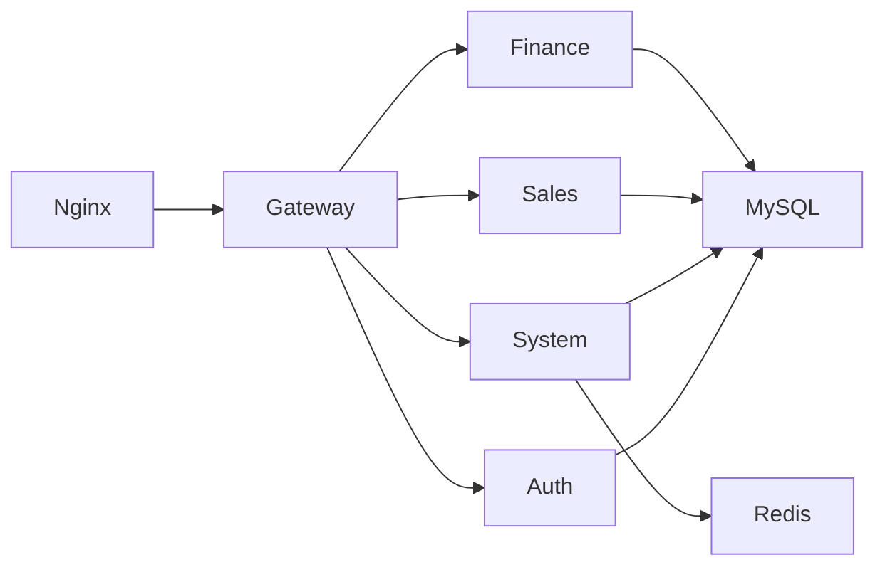

# 基础设施监控

<cite>
**本文档引用的文件**
- [docker-compose.yml](file://docker-compose.yml)
- [docker-compose-simple.yml](file://docker-compose-simple.yml)
- [nginx.conf](file://nginx.conf)
- [RuoyiMonitorController.java](file://system/src/main/java/com/dafuweng/system/controller/RuoyiMonitorController.java)
- [OperationLogAspect.java](file://system/src/main/java/com/dafuweng/system/config/OperationLogAspect.java)
- [OperationLog.java](file://system/src/main/java/com/dafuweng/system/config/OperationLog.java)
- [application-docker.yml (auth)](file://auth/src/main/resources/application-docker.yml)
- [application-docker.yml (system)](file://system/src/main/resources/application-docker.yml)
- [application-docker.yml (sales)](file://sales/src/main/resources/application-docker.yml)
- [application-docker.yml (finance)](file://finance/src/main/resources/application-docker.yml)
- [application-docker.yml (gateway)](file://gateway/src/main/resources/application-docker.yml)
</cite>

## 目录
1. [简介](#简介)
2. [项目结构](#项目结构)
3. [核心组件](#核心组件)
4. [架构总览](#架构总览)
5. [详细组件分析](#详细组件分析)
6. [依赖关系分析](#依赖关系分析)
7. [性能考量](#性能考量)
8. [故障排查指南](#故障排查指南)
9. [结论](#结论)
10. [附录](#附录)

## 简介
本文件面向NeoCC项目的基础设施监控，聚焦以下目标：
- Nacos服务注册中心的监控配置（健康检查与故障恢复）
- MySQL数据库的监控策略（连接数、慢查询、性能指标）
- Redis缓存的监控方案（内存、命中率、持久化）
- Nginx反向代理的监控（请求量、响应时间、错误率）
- 容器资源监控（CPU、内存、磁盘IO）
- 监控数据可视化与告警规则建议

说明：当前仓库中未包含Prometheus/Grafana等监控栈配置与具体告警规则定义，本文在“监控数据可视化与告警规则配置”部分提供通用实践建议。

## 项目结构
NeoCC采用Docker Compose编排，包含Nacos、MySQL、Redis、各微服务与Nginx前端。核心监控点分布于：
- 容器健康检查：MySQL具备健康探针
- 微服务侧：系统服务提供统一监控接口，网关负责路由与可观测性基础
- 反向代理：Nginx提供访问日志与代理超时配置

图表来源
- [docker-compose.yml:3-182](file://docker-compose.yml#L3-L182)
- [docker-compose-simple.yml:3-146](file://docker-compose-simple.yml#L3-L146)

章节来源
- [docker-compose.yml:1-182](file://docker-compose.yml#L1-L182)
- [docker-compose-simple.yml:1-146](file://docker-compose-simple.yml#L1-L146)

## 核心组件
- Nacos服务注册中心：提供服务发现与配置管理能力，当前以单机模式运行，未启用鉴权与持久化配置库（默认使用嵌入式数据库）
- MySQL数据库：提供4个业务库，具备健康探针，便于容器编排层进行存活/就绪判断
- Redis缓存：为system服务提供缓存能力，支持读写分离与高可用（当前为单实例）
- 网关服务：基于Spring Cloud Gateway进行路由转发，承载跨域与请求头透传
- Nginx反向代理：提供静态资源与API代理，开启Gzip压缩与访问日志

章节来源
- [docker-compose.yml:4-56](file://docker-compose.yml#L4-L56)
- [docker-compose-simple.yml:4-33](file://docker-compose-simple.yml#L4-L33)
- [application-docker.yml (gateway):1-147](file://gateway/src/main/resources/application-docker.yml#L1-L147)
- [nginx.conf:1-76](file://nginx.conf#L1-L76)

## 架构总览
下图展示监控视角下的关键交互路径与数据流：

图表来源
- [nginx.conf:45-67](file://nginx.conf#L45-L67)
- [application-docker.yml (gateway):14-142](file://gateway/src/main/resources/application-docker.yml#L14-L142)

## 详细组件分析

### Nacos服务注册中心监控
- 健康检查
  - 当前未在Compose中为Nacos配置健康探针；可结合容器健康检查或外部探针实现
  - 建议：增加HTTP探针检测Nacos健康端点，失败时触发重启或告警
- 故障恢复
  - 单机模式无高可用；建议在生产环境切换为集群模式并启用鉴权
  - 结合Kubernetes/Compose的重启策略与健康检查，实现快速自愈

章节来源
- [docker-compose.yml:5-25](file://docker-compose.yml#L5-L25)

### MySQL数据库监控
- 连接数监控
  - 可通过系统指标采集器获取连接数、最大连接数、活跃连接数
  - 建议：设置阈值告警，避免连接池耗尽
- 慢查询分析
  - 启用慢查询日志与分析工具（如EXPLAIN、Performance Schema）
  - 建议：对高频慢SQL建立告警与优化清单
- 性能指标收集
  - 采集QPS、TPS、缓冲池命中率、锁等待、表扫描等关键指标
  - 建议：结合数据库内置监控视图与第三方工具进行可视化

章节来源
- [docker-compose.yml:28-45](file://docker-compose.yml#L28-L45)
- [docker-compose-simple.yml:4-22](file://docker-compose-simple.yml#L4-L22)

### Redis缓存监控
- 内存使用率
  - 采集used_memory、used_memory_rss、内存峰值与碎片率
  - 建议：设置内存阈值告警，必要时触发清理或扩容
- 命中率
  - 采集keyspace_hits/keyspace_misses计算命中率
  - 建议：命中率持续偏低时优化缓存策略或预热
- 持久化状态
  - 监控RDB/AOF状态、lastsave、bgsave状态
  - 建议：持久化异常时立即告警并检查磁盘空间与IO

章节来源
- [docker-compose.yml:47-56](file://docker-compose.yml#L47-L56)
- [docker-compose-simple.yml:24-33](file://docker-compose-simple.yml#L24-L33)

### Nginx反向代理监控
- 请求量统计
  - 使用access日志与日志格式字段统计UV/PV、接口调用量
- 响应时间分析
  - 通过日志中的请求耗时字段进行分位统计（P50/P95/P99）
- 错误率监控
  - 统计4xx/5xx占比，结合上游服务状态进行关联分析
- 其他
  - Gzip压缩效果、静态资源命中率、上游超时与重试

章节来源
- [nginx.conf:9-14](file://nginx.conf#L9-L14)
- [nginx.conf:45-67](file://nginx.conf#L45-L67)

### 容器资源监控
- CPU
  - 采集容器CPU使用率、配额与负载
- 内存
  - 采集RSS、缓存、限制与OOM事件
- 磁盘IO
  - 采集读写速率、队列长度与I/O等待
- 建议
  - 对关键服务设置资源使用阈值告警，避免资源争用影响稳定性

章节来源
- [docker-compose.yml:3-182](file://docker-compose.yml#L3-L182)
- [docker-compose-simple.yml:1-146](file://docker-compose-simple.yml#L1-L146)

### 微服务侧监控接口
系统服务提供统一监控接口，便于前端RuoYi监控模块对接：
- 在线用户、定时任务、调度日志、登录日志、操作日志、缓存监控、服务器信息等接口
- 当前返回占位数据，建议后续接入真实指标与缓存统计

图表来源
- [RuoyiMonitorController.java:1-237](file://system/src/main/java/com/dafuweng/system/controller/RuoyiMonitorController.java#L1-L237)

章节来源
- [RuoyiMonitorController.java:1-237](file://system/src/main/java/com/dafuweng/system/controller/RuoyiMonitorController.java#L1-L237)

### 操作日志与审计
- 通过AOP切面自动记录操作日志，包含模块、动作、耗时、请求参数等
- 建议：将操作日志写入专用审计库，并提供查询与导出接口

图表来源
- [OperationLogAspect.java:35-60](file://system/src/main/java/com/dafuweng/system/config/OperationLogAspect.java#L35-L60)

章节来源
- [OperationLogAspect.java:1-87](file://system/src/main/java/com/dafuweng/system/config/OperationLogAspect.java#L1-L87)
- [OperationLog.java:1-11](file://system/src/main/java/com/dafuweng/system/config/OperationLog.java#L1-L11)

## 依赖关系分析
- 服务间依赖
  - 网关依赖各业务服务；业务服务依赖MySQL与Redis（部分服务）
  - Nacos用于服务发现（当前配置中各服务未启用Nacos发现）
- 健康检查依赖
  - MySQL具备健康探针；其他组件依赖容器编排层进行健康判定

图表来源
- [docker-compose.yml:58-159](file://docker-compose.yml#L58-L159)
- [docker-compose-simple.yml:35-123](file://docker-compose-simple.yml#L35-L123)

章节来源
- [docker-compose.yml:58-159](file://docker-compose.yml#L58-L159)
- [docker-compose-simple.yml:35-123](file://docker-compose-simple.yml#L35-L123)

## 性能考量
- 网关超时配置
  - Nginx代理设置了较长的连接/发送/读取超时，有助于提升长连接稳定性
- Gzip压缩
  - 开启Gzip可降低带宽占用，但会增加CPU开销，需根据实际场景平衡
- 数据库连接池
  - 建议结合慢查询与连接数监控，动态调整连接池大小与超时参数

章节来源
- [nginx.conf:52-54](file://nginx.conf#L52-L54)
- [application-docker.yml (gateway):1-147](file://gateway/src/main/resources/application-docker.yml#L1-L147)

## 故障排查指南
- Nacos不可用
  - 检查容器健康状态与端口映射；确认数据库连接参数
- MySQL异常
  - 查看健康探针输出与容器日志；核对数据库密码与网络连通性
- Redis不可达
  - 检查容器状态、端口映射与持久化目录挂载
- 网关路由失败
  - 检查路由配置与上游服务可达性；关注Nginx代理超时设置
- 前端无法访问
  - 检查Nginx配置与静态资源挂载；确认网关端口暴露

章节来源
- [docker-compose.yml:1-182](file://docker-compose.yml#L1-L182)
- [docker-compose-simple.yml:1-146](file://docker-compose-simple.yml#L1-L146)
- [nginx.conf:1-76](file://nginx.conf#L1-L76)

## 结论
- 当前仓库提供了基础设施编排与基础监控接口骨架，建议补充：
  - Nacos健康探针与集群化部署
  - MySQL慢查询与性能指标采集
  - Redis内存与持久化监控
  - Nginx访问日志与错误率统计
  - 容器资源与服务级指标采集
- 监控数据可视化与告警规则建议见“附录”。

## 附录

### 监控数据可视化与告警规则配置（建议）
- 可视化平台
  - Prometheus + Grafana：采集容器与应用指标，构建仪表板
  - ELK/EFK：集中化日志采集与检索
- 告警规则示例（通用模板）
  - Nacos不可用：容器停止或健康探针失败
  - MySQL连接数过高：超过阈值持续一段时间
  - Redis内存使用率过高：超过阈值或碎片率异常
  - Nginx错误率升高：5xx占比超过阈值
  - 服务响应时间退化：P95/P99超时阈值
  - 容器CPU/内存/磁盘IO异常：超过阈值或持续升高

[本节为通用实践建议，无需特定文件引用]