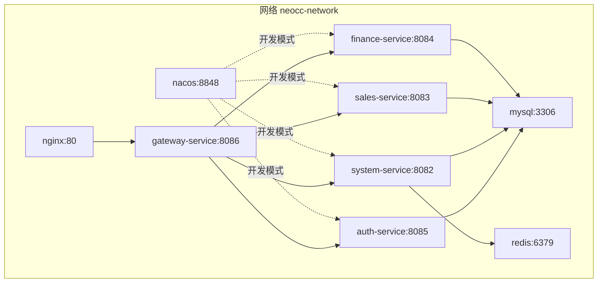
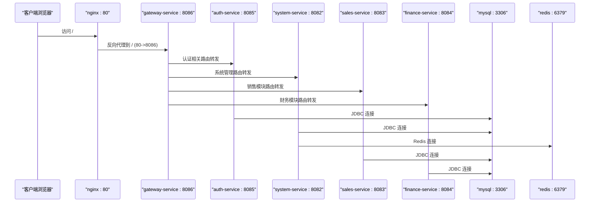
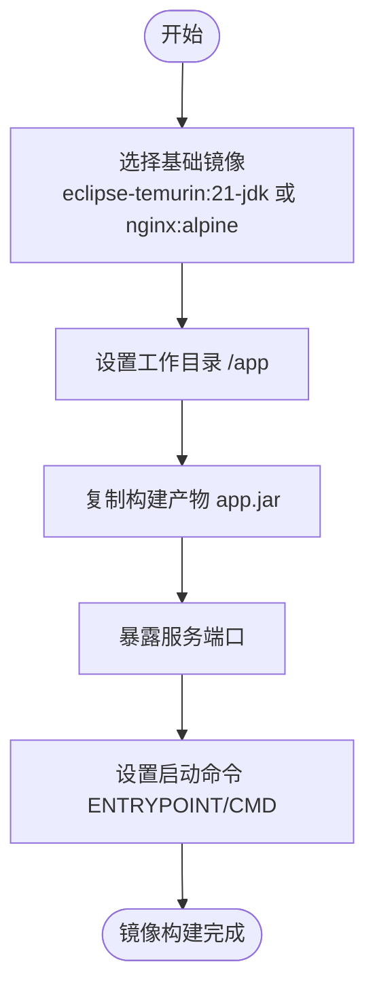
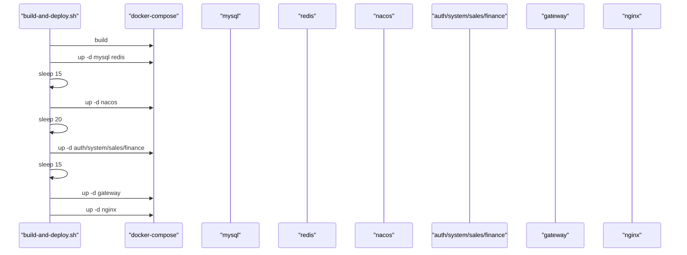
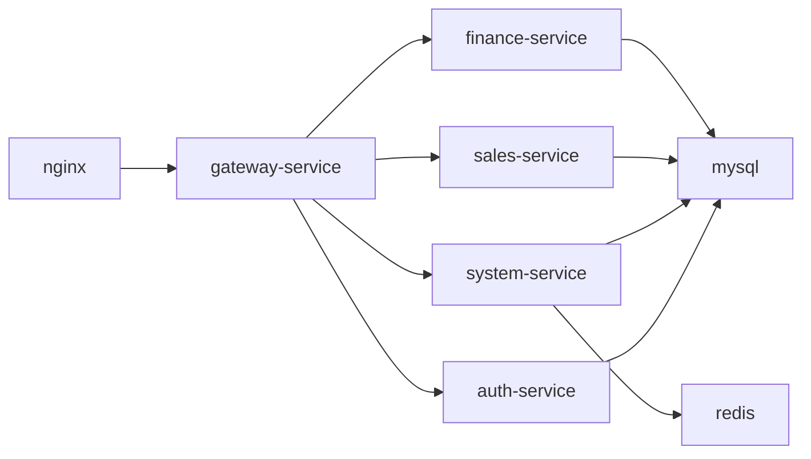

# 容器化部署

<cite>
**本文引用的文件**
- [docker-compose.yml](file://docker-compose.yml)
- [docker-compose-simple.yml](file://docker-compose-simple.yml)
- [.dockerignore](file://.dockerignore)
- [build-and-deploy.sh](file://build-and-deploy.sh)
- [quick-start.sh](file://quick-start.sh)
- [auth/Dockerfile](file://auth/Dockerfile)
- [system/Dockerfile](file://system/Dockerfile)
- [sales/Dockerfile](file://sales/Dockerfile)
- [finance/Dockerfile](file://finance/Dockerfile)
- [gateway/Dockerfile](file://gateway/Dockerfile)
- [ruoyi-ui/Dockerfile](file://ruoyi-ui/Dockerfile)
- [auth/src/main/resources/application-docker.yml](file://auth/src/main/resources/application-docker.yml)
- [system/src/main/resources/application-docker.yml](file://system/src/main/resources/application-docker.yml)
- [sales/src/main/resources/application-docker.yml](file://sales/src/main/resources/application-docker.yml)
- [finance/src/main/resources/application-docker.yml](file://finance/src/main/resources/application-docker.yml)
- [gateway/src/main/resources/application-docker.yml](file://gateway/src/main/resources/application-docker.yml)
- [gateway/src/main/resources/application-docker-simple.yml](file://gateway/src/main/resources/application-docker-simple.yml)
</cite>

## 目录
1. [简介](#简介)
2. [项目结构](#项目结构)
3. [核心组件](#核心组件)
4. [架构总览](#架构总览)
5. [详细组件分析](#详细组件分析)
6. [依赖关系分析](#依赖关系分析)
7. [性能与资源](#性能与资源)
8. [故障排查指南](#故障排查指南)
9. [结论](#结论)
10. [附录](#附录)

## 简介
本文件面向NeoCC项目的容器化部署，系统性说明Docker Compose编排配置、服务间依赖关系、网络与数据卷、各微服务Dockerfile构建流程、启动顺序与依赖等待机制，并提供生产与开发两种部署方案建议、资源限制与环境变量配置、日志策略以及镜像版本管理与更新策略。内容基于仓库中现有的Compose与Dockerfile配置进行归纳总结，帮助读者快速理解并安全地在本地或生产环境中部署该微服务架构。

## 项目结构
本项目采用多模块Spring Boot微服务架构，配合Nginx前端与Nacos注册中心（开发模式下），通过Docker Compose统一编排。核心服务包括：
- 认证服务（auth-service）
- 系统服务（system-service）
- 销售服务（sales-service）
- 财务服务（finance-service）
- 网关服务（gateway-service）
- 基础设施：MySQL、Redis、Nacos（开发模式）
- 前端：Nginx静态站点

图表来源
- [docker-compose.yml:3-182](file://docker-compose.yml#L3-L182)
- [docker-compose-simple.yml:3-146](file://docker-compose-simple.yml#L3-L146)

章节来源
- [docker-compose.yml:1-182](file://docker-compose.yml#L1-L182)
- [docker-compose-simple.yml:1-146](file://docker-compose-simple.yml#L1-L146)

## 核心组件
- Compose编排文件
  - 生产/完整版：docker-compose.yml，包含Nacos、MySQL、Redis、Nginx与全部后端服务。
  - 简化版：docker-compose-simple.yml，去除了Nacos，适合仅需后端+数据库+缓存的场景。
- Dockerfile构建
  - 所有后端服务均使用Temurin 21 JDK基础镜像，复制Maven构建产物为可执行jar，暴露对应端口，以java -jar方式启动。
  - 前端ruoyi-ui直接基于nginx:alpine，拷贝dist与nginx.conf，对外提供80端口。
- 配置文件
  - 各服务在Docker环境下使用application-docker.yml，包含数据库连接、MyBatis-Plus配置、日志级别等。
  - 网关提供两套路由规则：完整版与简化版，分别对应不同部署目标。
- 启动脚本
  - build-and-deploy.sh：分步构建镜像并按顺序启动基础设施、业务服务、网关与前端。
  - quick-start.sh：直接基于已构建镜像一键启动。

章节来源
- [auth/Dockerfile:1-13](file://auth/Dockerfile#L1-L13)
- [system/Dockerfile:1-13](file://system/Dockerfile#L1-L13)
- [sales/Dockerfile:1-13](file://sales/Dockerfile#L1-L13)
- [finance/Dockerfile:1-13](file://finance/Dockerfile#L1-L13)
- [gateway/Dockerfile:1-13](file://gateway/Dockerfile#L1-L13)
- [ruoyi-ui/Dockerfile:1-6](file://ruoyi-ui/Dockerfile#L1-L6)
- [auth/src/main/resources/application-docker.yml:1-32](file://auth/src/main/resources/application-docker.yml#L1-L32)
- [system/src/main/resources/application-docker.yml:1-38](file://system/src/main/resources/application-docker.yml#L1-L38)
- [sales/src/main/resources/application-docker.yml:1-32](file://sales/src/main/resources/application-docker.yml#L1-L32)
- [finance/src/main/resources/application-docker.yml:1-32](file://finance/src/main/resources/application-docker.yml#L1-L32)
- [gateway/src/main/resources/application-docker.yml:1-147](file://gateway/src/main/resources/application-docker.yml#L1-L147)
- [gateway/src/main/resources/application-docker-simple.yml:1-68](file://gateway/src/main/resources/application-docker-simple.yml#L1-L68)
- [build-and-deploy.sh:1-75](file://build-and-deploy.sh#L1-L75)
- [quick-start.sh:1-34](file://quick-start.sh#L1-L34)

## 架构总览
下图展示服务间的依赖与通信路径，强调网关作为统一入口、后端服务通过容器内主机名访问数据库与缓存，以及Nacos在开发模式下的服务发现作用。

图表来源
- [docker-compose.yml:161-173](file://docker-compose.yml#L161-L173)
- [gateway/src/main/resources/application-docker.yml:14-129](file://gateway/src/main/resources/application-docker.yml#L14-L129)
- [auth/src/main/resources/application-docker.yml:8-11](file://auth/src/main/resources/application-docker.yml#L8-L11)
- [system/src/main/resources/application-docker.yml:8-16](file://system/src/main/resources/application-docker.yml#L8-L16)
- [sales/src/main/resources/application-docker.yml:8-11](file://sales/src/main/resources/application-docker.yml#L8-L11)
- [finance/src/main/resources/application-docker.yml:8-11](file://finance/src/main/resources/application-docker.yml#L8-L11)

## 详细组件分析

### Compose编排与网络
- 网络
  - 使用自定义bridge网络neocc-network，确保服务间可通过容器名互访。
- 数据卷
  - MySQL与Redis使用命名卷持久化数据，避免容器重建丢失。
- 健康检查
  - MySQL配置了healthcheck，依赖容器内mysqladmin命令探测可用性。
- 服务依赖
  - 认证、系统、销售、财务服务依赖MySQL健康；系统服务额外依赖Redis；网关依赖四个后端服务；Nginx依赖网关。
  - 开发模式下，Nacos作为注册中心，其余服务通过其进行服务发现（application-docker.yml中已禁用Nacos注册）。

章节来源
- [docker-compose.yml:24-182](file://docker-compose.yml#L24-L182)
- [docker-compose-simple.yml:21-146](file://docker-compose-simple.yml#L21-L146)

### 微服务Dockerfile构建流程
- 公共特征
  - 基于eclipse-temurin:21-jdk镜像，工作目录/app。
  - 将Maven构建产物（target/*.jar）复制到app.jar。
  - 暴露端口并以java -jar启动。
- 差异点
  - 不同服务暴露不同端口，对应各自服务端口。
  - 前端ruoyi-ui/Dockerfile直接基于nginx:alpine，复制dist与nginx.conf，对外提供80端口。

图表来源
- [auth/Dockerfile:1-13](file://auth/Dockerfile#L1-L13)
- [system/Dockerfile:1-13](file://system/Dockerfile#L1-L13)
- [sales/Dockerfile:1-13](file://sales/Dockerfile#L1-L13)
- [finance/Dockerfile:1-13](file://finance/Dockerfile#L1-L13)
- [gateway/Dockerfile:1-13](file://gateway/Dockerfile#L1-L13)
- [ruoyi-ui/Dockerfile:1-6](file://ruoyi-ui/Dockerfile#L1-L6)

章节来源
- [auth/Dockerfile:1-13](file://auth/Dockerfile#L1-L13)
- [system/Dockerfile:1-13](file://system/Dockerfile#L1-L13)
- [sales/Dockerfile:1-13](file://sales/Dockerfile#L1-L13)
- [finance/Dockerfile:1-13](file://finance/Dockerfile#L1-L13)
- [gateway/Dockerfile:1-13](file://gateway/Dockerfile#L1-L13)
- [ruoyi-ui/Dockerfile:1-6](file://ruoyi-ui/Dockerfile#L1-L6)

### 环境变量与配置文件
- 通用环境变量
  - SPRING_PROFILES_ACTIVE=docker（或docker-simple）
  - SERVER_PORT=服务端口
  - NACOS_SERVER_ADDR=neocc-nacos:8848（开发模式）
  - REDIS_HOST=neocc-redis（系统服务）
- 数据库连接
  - 各服务通过JDBC连接到neocc-mysql，使用root/123456，数据库名按模块区分。
- 日志
  - application-docker.yml中将com.dafuweng包日志级别设为DEBUG，便于问题定位。
- 网关路由
  - 完整版路由覆盖认证、系统、销售、财务模块的API路径，并对部分路由启用StripPrefix过滤器。
  - 简化版路由精简，保留必要转发规则。

章节来源
- [docker-compose.yml:64-150](file://docker-compose.yml#L64-L150)
- [docker-compose-simple.yml:41-114](file://docker-compose-simple.yml#L41-L114)
- [auth/src/main/resources/application-docker.yml:8-11](file://auth/src/main/resources/application-docker.yml#L8-L11)
- [system/src/main/resources/application-docker.yml:8-16](file://system/src/main/resources/application-docker.yml#L8-L16)
- [sales/src/main/resources/application-docker.yml:8-11](file://sales/src/main/resources/application-docker.yml#L8-L11)
- [finance/src/main/resources/application-docker.yml:8-11](file://finance/src/main/resources/application-docker.yml#L8-L11)
- [gateway/src/main/resources/application-docker.yml:14-147](file://gateway/src/main/resources/application-docker.yml#L14-L147)
- [gateway/src/main/resources/application-docker-simple.yml:11-68](file://gateway/src/main/resources/application-docker-simple.yml#L11-L68)

### 启动顺序与依赖等待机制
- 分步启动脚本
  - build-and-deploy.sh按步骤启动：基础设施（MySQL、Redis）→ Nacos → 业务服务 → 网关 → 前端Nginx。
  - 在每个阶段之间插入固定时长的sleep，用于等待服务就绪。
- Compose内置等待
  - depends_on结合condition实现“健康检查通过”或“服务启动”两类等待。
  - MySQL通过healthcheck保证数据库可用后再启动业务服务。
  - 网关在四个后端服务全部启动后才启动，确保路由可用。
- 快速启动
  - quick-start.sh直接启动所有服务，适用于已有镜像且环境已准备完毕的情况。

图表来源
- [build-and-deploy.sh:21-53](file://build-and-deploy.sh#L21-L53)
- [docker-compose.yml:21-159](file://docker-compose.yml#L21-L159)

章节来源
- [build-and-deploy.sh:1-75](file://build-and-deploy.sh#L1-L75)
- [docker-compose.yml:21-159](file://docker-compose.yml#L21-L159)
- [docker-compose-simple.yml:46-135](file://docker-compose-simple.yml#L46-L135)

### 健康检查与可用性
- MySQL健康检查
  - 使用mysqladmin ping检测，失败重试次数与间隔已配置，确保业务服务等待数据库稳定。
- Nacos健康检查
  - 未在Compose中显式配置健康检查，但通过固定sleep等待其启动完成。
- 建议
  - 可在生产环境为Nacos添加健康检查，或在应用侧增加启动前探测（如HTTP端点）。

章节来源
- [docker-compose.yml:39-43](file://docker-compose.yml#L39-L43)
- [docker-compose.yml:21-23](file://docker-compose.yml#L21-L23)

## 依赖关系分析
- 服务间耦合
  - 网关是唯一外部入口，其他服务内部不互相依赖，仅依赖共享基础设施（MySQL、Redis、Nacos）。
- 外部依赖
  - 数据库：MySQL（每模块独立schema）
  - 缓存：Redis（系统服务使用）
  - 注册中心：Nacos（开发模式）
- 网络拓扑
  - 所有服务位于同一bridge网络，容器名即主机名，便于服务发现与通信。

图表来源
- [docker-compose.yml:161-173](file://docker-compose.yml#L161-L173)
- [docker-compose-simple.yml:125-137](file://docker-compose-simple.yml#L125-L137)

章节来源
- [docker-compose.yml:3-182](file://docker-compose.yml#L3-L182)
- [docker-compose-simple.yml:3-146](file://docker-compose-simple.yml#L3-L146)

## 性能与资源
- JVM参数与内存
  - 当前Dockerfile未设置JVM参数，建议在生产环境通过JAVA_TOOL_OPTIONS或-D参数传入堆大小、GC策略等，以提升稳定性与性能。
- 并发与线程
  - Spring Boot默认Web栈在容器中表现良好，建议结合实际QPS调整线程池与连接池参数。
- 资源限制
  - 建议在docker-compose中为各服务设置memory限制与CPU配额，防止资源争抢。
- I/O与存储
  - MySQL与Redis使用命名卷持久化，建议定期备份与监控磁盘空间。
- 网络
  - 使用bridge网络隔离，建议在生产环境使用overlay网络与负载均衡。

[本节为通用建议，无需特定文件引用]

## 故障排查指南
- 服务无法启动
  - 查看对应服务日志：docker-compose logs -f <服务名>
  - 关注数据库连接信息与端口占用情况。
- 数据库未就绪
  - 确认MySQL健康检查通过；若使用脚本启动，确认sleep时间足够。
- 网关路由异常
  - 检查application-docker.yml中的路由配置是否正确映射至后端服务。
- 前端无法访问
  - 确认Nginx已启动且映射80端口；检查ruoyi-ui/dist是否正确挂载。
- Nacos不可用（开发模式）
  - 确认Nacos容器健康；检查NACOS_SERVER_ADDR与端口映射。

章节来源
- [build-and-deploy.sh:73-74](file://build-and-deploy.sh#L73-L74)
- [docker-compose.yml:18-23](file://docker-compose.yml#L18-L23)
- [gateway/src/main/resources/application-docker.yml:14-147](file://gateway/src/main/resources/application-docker.yml#L14-L147)

## 结论
本项目提供了清晰的容器化部署方案：通过Docker Compose统一编排，利用Nacos（开发模式）、MySQL与Redis构成基础设施，后端服务以多阶段构建思路（复制jar、暴露端口、java -jar启动）实现轻量运行时。启动脚本实现了可控的分步部署与等待策略，满足从开发到生产的过渡需求。建议在生产环境中补充JVM参数、资源限制、健康检查与日志采集策略，并考虑引入更完善的注册与配置中心方案。

[本节为总结，无需特定文件引用]

## 附录

### A. 生产环境与开发环境部署方案对比
- 开发环境（完整版）
  - 特征：包含Nacos、MySQL、Redis、Nginx与全部后端服务。
  - 适用：本地联调、功能集成测试。
- 生产环境（简化版）
  - 特征：去除Nacos，仅保留MySQL、Redis、Nginx与后端服务。
  - 适用：无注册中心或使用外部注册中心的生产部署。
- 切换要点
  - 修改SPRING_PROFILES_ACTIVE为docker或docker-simple。
  - 网关路由根据部署目标选择application-docker.yml或application-docker-simple.yml。

章节来源
- [docker-compose.yml:1-182](file://docker-compose.yml#L1-L182)
- [docker-compose-simple.yml:1-146](file://docker-compose-simple.yml#L1-L146)
- [gateway/src/main/resources/application-docker.yml:1-147](file://gateway/src/main/resources/application-docker.yml#L1-L147)
- [gateway/src/main/resources/application-docker-simple.yml:1-68](file://gateway/src/main/resources/application-docker-simple.yml#L1-L68)

### B. 环境变量与配置清单
- 通用
  - SPRING_PROFILES_ACTIVE=docker|docker-simple
  - SERVER_PORT=对应端口
  - NACOS_SERVER_ADDR=neocc-nacos:8848（开发模式）
  - REDIS_HOST=neocc-redis（系统服务）
- 数据库
  - JDBC URL指向neocc-mysql，用户名root，密码123456。
- 日志
  - com.dafuweng包DEBUG级别，便于问题定位。

章节来源
- [docker-compose.yml:64-150](file://docker-compose.yml#L64-L150)
- [docker-compose-simple.yml:41-114](file://docker-compose-simple.yml#L41-L114)
- [auth/src/main/resources/application-docker.yml:8-11](file://auth/src/main/resources/application-docker.yml#L8-L11)
- [system/src/main/resources/application-docker.yml:8-16](file://system/src/main/resources/application-docker.yml#L8-L16)
- [sales/src/main/resources/application-docker.yml:8-11](file://sales/src/main/resources/application-docker.yml#L8-L11)
- [finance/src/main/resources/application-docker.yml:8-11](file://finance/src/main/resources/application-docker.yml#L8-L11)
- [gateway/src/main/resources/application-docker.yml:144-147](file://gateway/src/main/resources/application-docker.yml#L144-L147)

### C. 镜像版本管理与更新策略
- 基础镜像
  - 当前使用eclipse-temurin:21-jdk与nginx:alpine，建议锁定具体版本号（如21.0.x-jdk与1.x-alpine）以保证可重复性。
- 构建产物
  - Dockerfile复制target/*.jar，建议在CI中生成带版本号的jar并在镜像标签中体现版本。
- 更新策略
  - 小版本更新：先在测试环境验证，再滚动更新。
  - 大版本升级：灰度发布，逐步替换实例，保留回滚镜像标签。

[本节为通用建议，无需特定文件引用]

### D. .dockerignore与构建优化
- 排除项
  - Maven构建目录target/（保留jar）、IDE与日志、Node模块、测试目录、文档等，减少构建上下文体积。
- 影响
  - 缩短构建时间，降低镜像体积，提高缓存命中率。

章节来源
- [.dockerignore:1-44](file://.dockerignore#L1-L44)