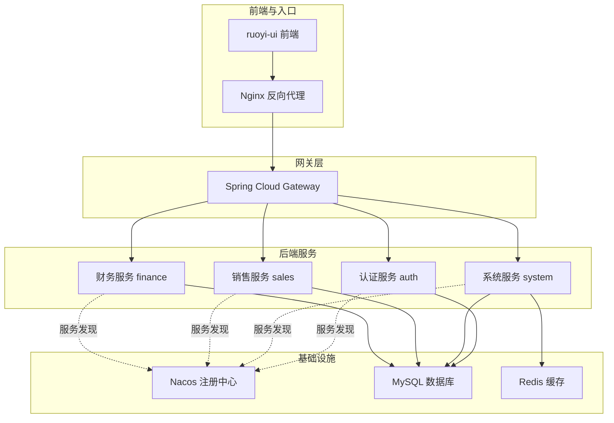
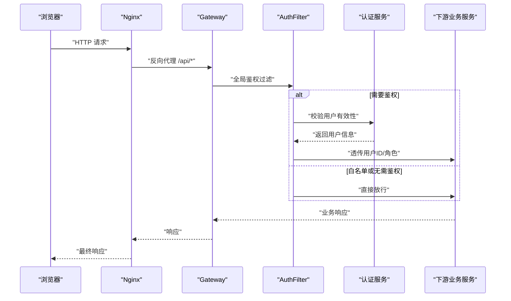
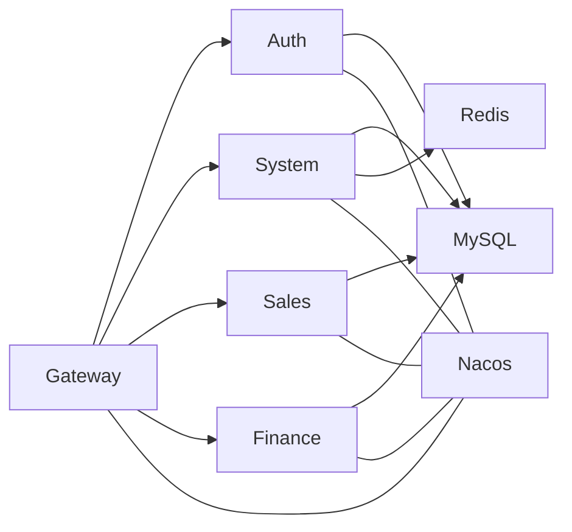

# 性能优化

<cite>
**本文引用的文件**
- [pom.xml](file://pom.xml)
- [docker-compose.yml](file://docker-compose.yml)
- [nginx.conf](file://nginx.conf)
- [application.yml（认证服务）](file://auth/src/main/resources/application.yml)
- [application-docker.yml（认证服务）](file://auth/src/main/resources/application-docker.yml)
- [application.yml（销售服务）](file://sales/src/main/resources/application.yml)
- [application-docker.yml（销售服务）](file://sales/src/main/resources/application-docker.yml)
- [application.yml（财务服务）](file://finance/src/main/resources/application.yml)
- [application-docker.yml（财务服务）](file://finance/src/main/resources/application-docker.yml)
- [application.yml（系统服务）](file://system/src/main/resources/application.yml)
- [application-docker.yml（系统服务）](file://system/src/main/resources/application-docker.yml)
- [application.yml（网关）](file://gateway/src/main/resources/application.yml)
- [MybatisPlusConfig.java](file://common/src/main/java/com/dafuweng/common/config/MybatisPlusConfig.java)
- [SecurityConfig.java（认证安全）](file://auth/src/main/java/com/dafuweng/auth/config/SecurityConfig.java)
- [PasswordEncoderConfig.java（密码编码器）](file://auth/src/main/java/com/dafuweng/auth/config/PasswordEncoderConfig.java)
- [AuthFilter.java（网关鉴权过滤器）](file://gateway/src/main/java/com/dafuweng/gateway/filter/AuthFilter.java)
</cite>

## 目录
1. [简介](#简介)
2. [项目结构](#项目结构)
3. [核心组件](#核心组件)
4. [架构总览](#架构总览)
5. [详细组件分析](#详细组件分析)
6. [依赖分析](#依赖分析)
7. [性能考虑](#性能考虑)
8. [故障排查指南](#故障排查指南)
9. [结论](#结论)
10. [附录](#附录)

## 简介
本文件面向NeoCC项目的微服务架构，系统性梳理并提出性能优化策略，覆盖数据库、缓存、JVM、Nginx、Docker容器与负载测试等维度。文档以仓库现有配置与代码为依据，结合实际可落地的优化建议，帮助在生产环境中获得更稳定、更低延迟、更高吞吐的服务表现。

## 项目结构
NeoCC采用多模块Maven聚合工程，包含通用模块与六个微服务模块：auth、system、sales、finance、gateway，以及前端ruoyi-ui与Nginx反向代理。Docker Compose编排了Nacos、MySQL、Redis、各微服务、网关与Nginx，形成完整的开发/测试运行环境。

图表来源
- [docker-compose.yml:1-182](file://docker-compose.yml#L1-L182)
- [application.yml（网关）:1-165](file://gateway/src/main/resources/application.yml#L1-L165)

章节来源
- [pom.xml:1-22](file://pom.xml#L1-L22)
- [docker-compose.yml:1-182](file://docker-compose.yml#L1-L182)

## 核心组件
- 微服务模块：auth、system、sales、finance、gateway，分别负责认证授权、系统管理、销售、财务与统一网关。
- 通用配置：MyBatis-Plus全局配置（分页插件）、安全配置（无状态会话、JWT过滤链）、密码编码器（BCrypt）。
- 网关过滤器：AuthFilter进行鉴权与用户信息透传，减少下游重复校验成本。
- 基础设施：Nacos服务注册与发现、MySQL数据库、Redis缓存、Nginx反向代理与静态资源服务。

章节来源
- [MybatisPlusConfig.java:1-29](file://common/src/main/java/com/dafuweng/common/config/MybatisPlusConfig.java#L1-L29)
- [SecurityConfig.java（认证安全）:1-54](file://auth/src/main/java/com/dafuweng/auth/config/SecurityConfig.java#L1-L54)
- [PasswordEncoderConfig.java（密码编码器）:1-15](file://auth/src/main/java/com/dafuweng/auth/config/PasswordEncoderConfig.java#L1-L15)
- [AuthFilter.java（网关鉴权过滤器）:1-141](file://gateway/src/main/java/com/dafuweng/gateway/filter/AuthFilter.java#L1-L141)

## 架构总览
下图展示从浏览器到后端服务的典型请求路径，以及关键性能触点（鉴权、数据库、缓存、网关转发）：

图表来源
- [AuthFilter.java（网关鉴权过滤器）:55-134](file://gateway/src/main/java/com/dafuweng/gateway/filter/AuthFilter.java#L55-L134)
- [application.yml（网关）:1-165](file://gateway/src/main/resources/application.yml#L1-L165)

## 详细组件分析

### 数据库性能优化
- 连接池与驱动
  - 使用MySQL Connector/J驱动，建议在各服务的生产配置中引入连接池（如HikariCP）参数调优，包括最大连接数、空闲超时、连接生命周期、获取超时等，避免连接泄漏与抖动。
  - 在容器化部署中，确保数据库连接URL指向Docker网络内的主机名（已通过compose完成），避免DNS解析开销。
- SQL与映射
  - MyBatis-Plus已启用分页插件，建议对高频分页查询增加合适的索引，并避免SELECT *，仅取必要字段。
  - 对常用条件查询（如用户登录、角色查询）建立复合索引，减少回表与全表扫描。
- 事务与锁
  - 控制单事务时间，避免长事务持有行锁；批量写入使用批处理与合理事务边界。
- 日志与慢查询
  - 生产环境关闭StdOut日志输出，使用结构化日志采集与慢SQL监控工具，定位热点SQL。

章节来源
- [MybatisPlusConfig.java:17-27](file://common/src/main/java/com/dafuweng/common/config/MybatisPlusConfig.java#L17-L27)
- [application.yml（认证服务）:7-11](file://auth/src/main/resources/application.yml#L7-L11)
- [application.yml（销售服务）:7-11](file://sales/src/main/resources/application.yml#L7-L11)
- [application.yml（财务服务）:7-11](file://finance/src/main/resources/application.yml#L7-L11)
- [application.yml（系统服务）:7-11](file://system/src/main/resources/application.yml#L7-L11)

### 缓存策略优化（Redis）
- 命中率提升
  - 对高频只读数据（如字典、基础配置、用户基本信息）设置短TTL，结合本地缓存（如Caffeine）降低跨网络访问。
  - 使用多级缓存：本地缓存（弱一致性）+ Redis（强一致），热点数据双写保障。
- 失效策略
  - 采用“写扩散”与“惰性淘汰”结合：写操作同时更新Redis与数据库，读取失败再从数据库回填。
  - 对于列表/集合类数据，使用有序集合或哈希结构，支持原子性更新与范围查询。
- 客户端与连接
  - 在系统服务中已配置Redis客户端参数（主机、端口、超时），建议在容器化场景通过环境变量注入，避免硬编码。
  - 使用连接池与合理的超时设置，避免阻塞与堆积。

章节来源
- [application.yml（系统服务）:12-17](file://system/src/main/resources/application.yml#L12-L17)
- [application-docker.yml（系统服务）:12-17](file://system/src/main/resources/application-docker.yml#L12-L17)

### JVM性能调优（堆内存、GC与参数）
- 堆内存配置
  - 建议根据峰值QPS与对象分配速率设定初始堆与最大堆，预留足够晋升区域，避免频繁Full GC。
- 垃圾回收器选择
  - 对低延迟要求高的网关与认证服务，优先ZGC/G1；对高吞吐量的批量任务（如报表生成）可考虑G1或Shenandoah。
- GC调优参数
  - 设置新生代比例、晋升阈值、大对象阈值；开启自适应尺寸策略；结合GC日志分析停顿曲线与原因。
- 监控与诊断
  - 启用JFR/Flight Recorder与GC日志，配合Prometheus+Grafana观测堆使用率、GC次数与停顿时间。

（本节为通用指导，未直接分析具体源码文件）

### Nginx性能优化
- worker与连接
  - 当前worker_connections为1024，建议按CPU核数与并发连接数评估，逐步提升至8k~64k区间，结合系统ulimit与内核参数。
- 超时与代理
  - 已设置proxy_connect/send/read_timeout为60s，建议根据业务接口耗时动态调整，避免长轮询导致连接占用。
- 压缩与缓存
  - 已启用gzip压缩，建议限定压缩类型与最小长度，减少CPU消耗。
  - 前端静态资源已设置no-store/no-cache，避免缓存旧版本JS/CSS；可对HTML设置短期缓存，对静态资源采用强缓存策略并带内容指纹。
- 日志与限流
  - 合理配置access_log级别与缓冲，避免磁盘IO成为瓶颈；必要时开启limit_req或limit_conn保护后端。

章节来源
- [nginx.conf:1-76](file://nginx.conf#L1-L76)

### Docker容器性能优化
- 资源限制
  - 为各服务容器设置CPU与内存限制，避免“饿死”其他服务；对数据库与缓存适当放宽资源上限。
- 网络优化
  - 使用自定义bridge网络（已提供），确保容器间DNS解析高效；避免跨主机网络带来的额外延迟。
- 存储I/O
  - 将MySQL与Redis数据目录挂载到高性能持久卷；开启MySQL二进制日志与慢查询日志持久化，便于性能分析。
- 健康检查
  - 已为MySQL配置健康检查，建议为各服务添加liveness/readiness探针，缩短故障恢复时间。

章节来源
- [docker-compose.yml:1-182](file://docker-compose.yml#L1-L182)

### 负载测试与性能基准
- 测试目标
  - 明确P95/P99延迟、吞吐量、错误率与资源使用率目标；区分登录、查询、写入等不同场景。
- 工具与脚本
  - 使用JMeter/K6/Loader.io等工具构造并发场景；对网关与各微服务分别压测，定位瓶颈。
- 指标采集
  - 收集CPU、内存、GC、网络、磁盘IO、数据库连接数、Redis命中率、Nginx连接状态等指标。
- 回归基线
  - 建立版本基线，每次变更后进行回归测试，确保性能不退化。

（本节为通用指导，未直接分析具体源码文件）

## 依赖分析
- 组件耦合
  - 网关依赖认证服务进行用户校验，下游服务依赖数据库与缓存；系统服务同时依赖Redis与MySQL。
- 外部依赖
  - Nacos用于服务注册与发现；MySQL提供持久化；Redis提供缓存；Nginx提供静态资源与反向代理。
- 潜在风险
  - 认证服务单点与网络抖动可能影响全链路；数据库慢查询与连接池耗尽是主要瓶颈；Redis高延迟导致缓存穿透。

图表来源
- [application.yml（网关）:1-165](file://gateway/src/main/resources/application.yml#L1-L165)
- [docker-compose.yml:1-182](file://docker-compose.yml#L1-L182)

章节来源
- [application.yml（网关）:1-165](file://gateway/src/main/resources/application.yml#L1-L165)
- [docker-compose.yml:1-182](file://docker-compose.yml#L1-L182)

## 性能考虑
- 数据库
  - 索引：围绕登录、分页、过滤条件建立复合索引；定期分析执行计划，剔除冗余索引。
  - 查询：避免N+1查询，使用批量加载与关联查询；对大结果集分页查询使用覆盖索引。
  - 连接池：设置合理的最大连接数、空闲超时与获取超时；监控连接池等待队列长度。
- 缓存
  - 命中率：热点数据预热与短TTL；多级缓存与失效策略；异步更新与旁路更新。
  - 容量：根据业务峰值估算缓存容量，避免频繁逐出。
- 网关与服务
  - 鉴权：尽量在网关层完成轻量校验，透传必要信息；避免重复远程校验。
  - 超时：合理设置超时与重试策略，避免级联故障。
- 前端与Nginx
  - 静态资源：强缓存+指纹；Gzip压缩；CDN加速。
  - 并发：worker数与连接数匹配业务峰值；限制上传大小与并发下载。
- 容器
  - 资源：CPU/Memory限额与HPA；持久卷与IO调度；健康检查与重启策略。

（本节为通用指导，未直接分析具体源码文件）

## 故障排查指南
- 认证与鉴权
  - 若出现大量401错误，检查网关AuthFilter是否正确透传用户ID与角色头；确认认证服务可用性与数据库连通性。
- 数据库
  - 观察慢查询日志与连接数峰值；检查索引使用情况与事务锁等待；必要时进行分区或读写分离。
- 缓存
  - 关注缓存命中率下降与Key过期策略；排查缓存雪崩与击穿；核对TTL与更新顺序。
- 网关与Nginx
  - 监控上游服务响应时间与错误率；检查代理超时与队列积压；优化静态资源缓存策略。
- 容器
  - 查看容器资源使用与OOM事件；核对卷IO与网络带宽；检查健康检查失败原因。

章节来源
- [AuthFilter.java（网关鉴权过滤器）:55-134](file://gateway/src/main/java/com/dafuweng/gateway/filter/AuthFilter.java#L55-L134)
- [application.yml（网关）:1-165](file://gateway/src/main/resources/application.yml#L1-L165)

## 结论
本优化文档基于NeoCC现有架构与配置，提出了数据库、缓存、JVM、Nginx与容器层面的系统性优化建议，并配套了负载测试与故障排查方法。建议在灰度环境中逐步实施，持续监控关键指标，确保性能与稳定性平衡。

## 附录
- 配置文件要点速查
  - 数据库连接：各服务已在application.yml中配置MySQL连接参数，容器化时使用Docker网络主机名。
  - Redis连接：系统服务已配置Redis参数，可通过环境变量注入主机地址。
  - 网关路由：已为各模块配置路由规则，注意StripPrefix与负载均衡策略。
  - Nginx：已启用Gzip与代理超时，建议进一步细化静态资源缓存策略。

章节来源
- [application.yml（认证服务）:7-11](file://auth/src/main/resources/application.yml#L7-L11)
- [application.yml（销售服务）:7-11](file://sales/src/main/resources/application.yml#L7-L11)
- [application.yml（财务服务）:7-11](file://finance/src/main/resources/application.yml#L7-L11)
- [application.yml（系统服务）:12-17](file://system/src/main/resources/application.yml#L12-L17)
- [application.yml（网关）:1-165](file://gateway/src/main/resources/application.yml#L1-L165)
- [nginx.conf:1-76](file://nginx.conf#L1-L76)