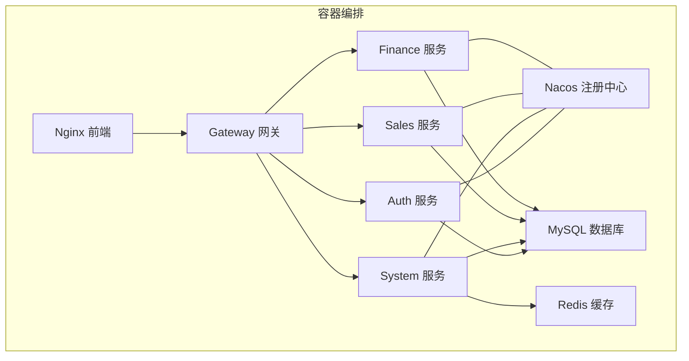
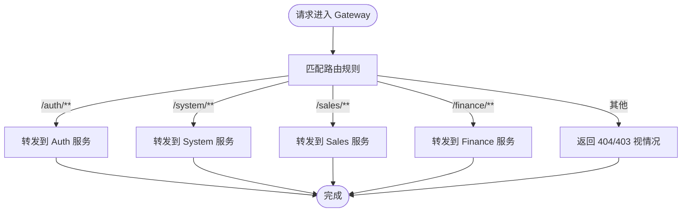
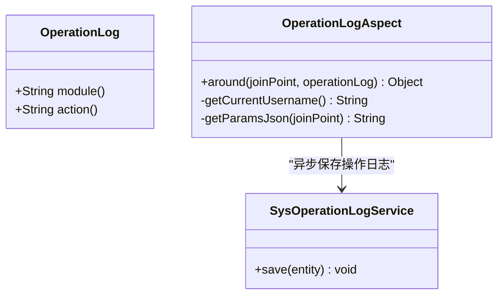
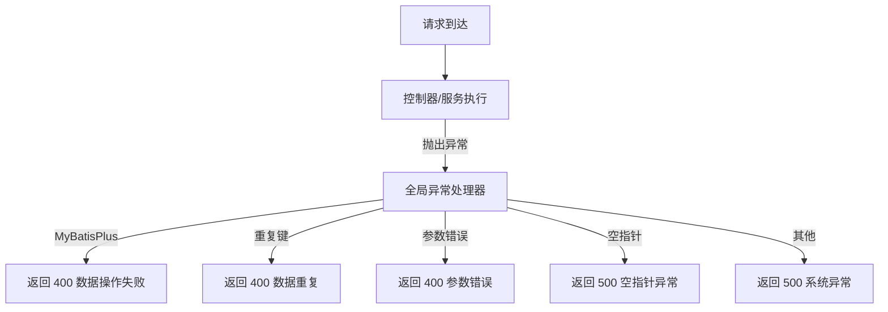
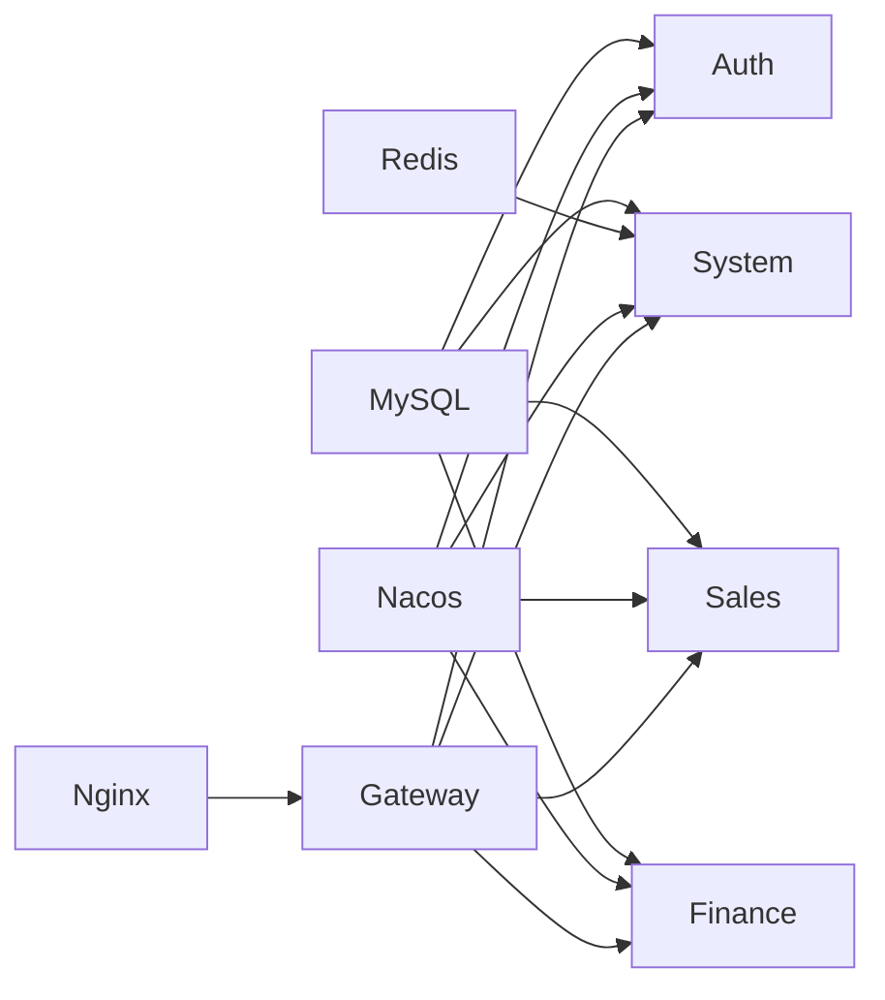

# 故障排查与运维

<cite>
**本文引用的文件**
- [pom.xml](file://pom.xml)
- [docker-compose.yml](file://docker-compose.yml)
- [docker-compose-simple.yml](file://docker-compose-simple.yml)
- [build-and-deploy.sh](file://build-and-deploy.sh)
- [quick-start.sh](file://quick-start.sh)
- [init-db.sql](file://scripts/init-db.sql)
- [nginx.conf](file://nginx.conf)
- [auth 应用配置](file://auth/src/main/resources/application.yml)
- [system 应用配置](file://system/src/main/resources/application.yml)
- [sales 应用配置](file://sales/src/main/resources/application.yml)
- [finance 应用配置](file://finance/src/main/resources/application.yml)
- [gateway 应用配置](file://gateway/src/main/resources/application.yml)
- [全局异常处理器](file://common/src/main/java/com/dafuweng/common/exception/GlobalExceptionHandler.java)
- [系统操作日志注解](file://system/src/main/java/com/dafuweng/system/config/OperationLog.java)
- [系统操作日志切面](file://system/src/main/java/com/dafuweng/system/config/OperationLogAspect.java)
</cite>

## 目录
1. [简介](#简介)
2. [项目结构](#项目结构)
3. [核心组件](#核心组件)
4. [架构总览](#架构总览)
5. [详细组件分析](#详细组件分析)
6. [依赖分析](#依赖分析)
7. [性能考虑](#性能考虑)
8. [故障排查指南](#故障排查指南)
9. [应急响应预案](#应急响应预案)
10. [运维工具与操作](#运维工具与操作)
11. [备份与恢复策略](#备份与恢复策略)
12. [运维自动化与批量操作](#运维自动化与批量操作)
13. [结论](#结论)

## 简介
本文件面向NeoCC项目的运维与故障排查场景，覆盖服务启动失败、数据库连接异常、网络通信问题等常见故障的诊断流程与解决方法；提供应用日志、系统日志、容器日志的收集与分析技巧；给出应急响应预案（服务降级、熔断与故障隔离）；说明Docker与Nginx等运维工具的使用；并制定数据库与配置文件的备份恢复策略及自动化脚本实践。

## 项目结构
NeoCC采用多模块Maven聚合工程，包含认证(auth)、系统(system)、销售(sales)、财务(finance)、网关(gateway)与公共(common)模块，并通过Docker Compose编排Nacos、MySQL、Redis与各微服务，前端通过Nginx对外提供静态资源与API代理。



图表来源
- [docker-compose.yml:1-182](file://docker-compose.yml#L1-L182)
- [gateway 应用配置:18-51](file://gateway/src/main/resources/application.yml#L18-L51)

章节来源
- [pom.xml:12-19](file://pom.xml#L12-L19)
- [docker-compose.yml:1-182](file://docker-compose.yml#L1-L182)

## 核心组件
- 认证服务(Auth): 提供登录、用户/角色/权限管理等能力，依赖MySQL与Nacos。
- 系统服务(System): 提供部门、字典、参数、区域与操作日志等基础能力，依赖MySQL与Redis。
- 销售服务(Sales): 提供客户、合同、业绩、工作日志等销售相关能力，依赖MySQL。
- 财务服务(Finance): 提供银行、佣金、贷款审核、服务费等财务相关能力，依赖MySQL。
- 网关服务(Gateway): 统一路由与跨域配置，将请求转发至对应后端服务。
- Nginx: 对外提供静态资源与API代理，支持开发/生产两套代理路径。
- Nacos: 服务注册与发现，简化服务间依赖。
- MySQL: 各服务的数据存储。
- Redis: System服务的缓存支撑。

章节来源
- [auth 应用配置:1-35](file://auth/src/main/resources/application.yml#L1-L35)
- [system 应用配置:1-41](file://system/src/main/resources/application.yml#L1-L41)
- [sales 应用配置:1-35](file://sales/src/main/resources/application.yml#L1-L35)
- [finance 应用配置:1-32](file://finance/src/main/resources/application.yml#L1-L32)
- [gateway 应用配置:1-165](file://gateway/src/main/resources/application.yml#L1-L165)
- [nginx.conf:1-76](file://nginx.conf#L1-L76)

## 架构总览
下图展示从浏览器到后端服务的典型链路，以及关键依赖关系与健康检查点。

```mermaid
sequenceDiagram
participant Browser as "浏览器"
participant Nginx as "Nginx"
participant Gateway as "Gateway"
participant Auth as "Auth 服务"
participant System as "System 服务"
participant Sales as "Sales 服务"
participant Finance as "Finance 服务"
Browser->>Nginx : 访问 / 或 /dev-api/*
Nginx->>Gateway : 反向代理到 : 8086
Gateway->>Auth : 认证相关路由(/auth/**)
Gateway->>System : 系统相关路由(/system/**)
Gateway->>Sales : 销售相关路由(/sales/**)
Gateway->>Finance : 财务相关路由(/finance/**)
Note over Auth,System,Sales,Finance : 各服务依赖 MySQL/Redis/Nacos
```

图表来源
- [gateway 应用配置:18-148](file://gateway/src/main/resources/application.yml#L18-L148)
- [nginx.conf:45-67](file://nginx.conf#L45-L67)

## 详细组件分析

### 网关(Gateway)组件
- 路由规则：按路径前缀将请求分发到不同后端服务；对部分根路径进行直连适配。
- 跨域配置：允许跨域请求，便于前后端联调。
- 健壮性：依赖Nacos进行服务发现，结合容器编排的depends_on顺序启动。



图表来源
- [gateway 应用配置:18-148](file://gateway/src/main/resources/application.yml#L18-L148)

章节来源
- [gateway 应用配置:1-165](file://gateway/src/main/resources/application.yml#L1-L165)

### 系统(System)组件
- 操作日志：通过注解与AOP切面记录模块、动作、耗时、参数等信息，异步落库，避免阻塞主流程。
- 缓存：集成Redis，提升读取性能。
- 数据库：独立数据库，逻辑清晰，便于隔离与备份。



图表来源
- [系统操作日志注解:1-11](file://system/src/main/java/com/dafuweng/system/config/OperationLog.java#L1-L11)
- [系统操作日志切面:1-87](file://system/src/main/java/com/dafuweng/system/config/OperationLogAspect.java#L1-L87)

章节来源
- [系统操作日志注解:1-11](file://system/src/main/java/com/dafuweng/system/config/OperationLog.java#L1-L11)
- [系统操作日志切面:1-87](file://system/src/main/java/com/dafuweng/system/config/OperationLogAspect.java#L1-L87)
- [system 应用配置:1-41](file://system/src/main/resources/application.yml#L1-L41)

### 公共异常处理
- 全局异常处理器统一捕获常见异常，返回标准化结果，便于前端与监控系统识别。



图表来源
- [全局异常处理器:1-37](file://common/src/main/java/com/dafuweng/common/exception/GlobalExceptionHandler.java#L1-L37)

章节来源
- [全局异常处理器:1-37](file://common/src/main/java/com/dafuweng/common/exception/GlobalExceptionHandler.java#L1-L37)

## 依赖分析
- 容器依赖：各业务服务依赖MySQL与Nacos；System额外依赖Redis；Nginx依赖Gateway。
- 启动顺序：compose中通过depends_on控制，先基础设施，再业务服务，最后网关与前端。
- 网络：统一桥接网络，服务间通过服务名与端口通信。



图表来源
- [docker-compose.yml:27-173](file://docker-compose.yml#L27-L173)

章节来源
- [docker-compose.yml:1-182](file://docker-compose.yml#L1-L182)

## 性能考虑
- Nginx压缩与缓存策略：启用gzip与严格缓存控制，降低带宽与提高首屏速度。
- 网关超时设置：代理连接/发送/读取超时均设为60秒，避免线程长时间占用。
- 异步操作日志：System模块操作日志异步写入，降低接口延迟抖动。
- 数据库与缓存：System模块读多写少场景建议配合Redis热点数据缓存。

章节来源
- [nginx.conf:16-21](file://nginx.conf#L16-L21)
- [nginx.conf:52-66](file://nginx.conf#L52-L66)
- [系统操作日志切面:47-57](file://system/src/main/java/com/dafuweng/system/config/OperationLogAspect.java#L47-L57)
- [system 应用配置:12-17](file://system/src/main/resources/application.yml#L12-L17)

## 故障排查指南

### 一、服务启动失败
- 现象
  - 容器启动后立即退出或反复重启
  - 端口占用导致无法绑定
  - 依赖未就绪（MySQL未健康、Nacos不可达）
- 诊断步骤
  - 查看容器状态与日志
    - docker-compose ps
    - docker-compose logs -f [服务名]
  - 检查端口占用
    - netstat -tulpn | grep :端口号
  - 校验依赖健康
    - docker-compose ps 查看 mysql/redis/nacos 状态
    - compose 中 healthcheck 已内置
- 解决方案
  - 修复端口冲突或释放端口
  - 等待基础设施健康后再启动业务服务
  - 使用 build-and-deploy.sh 的分阶段启动策略

章节来源
- [build-and-deploy.sh:25-53](file://build-and-deploy.sh#L25-L53)
- [docker-compose.yml:39-43](file://docker-compose.yml#L39-L43)
- [docker-compose-simple.yml:16-20](file://docker-compose-simple.yml#L16-L20)

### 二、数据库连接异常
- 现象
  - 连接超时、拒绝连接、凭证错误
  - 初始化脚本未执行导致库不存在
- 诊断步骤
  - 进入MySQL容器验证数据库存在与用户权限
  - 检查应用配置中的数据库URL、用户名、密码
  - 确认容器网络与主机映射端口
- 解决方案
  - 使用 init-db.sql 初始化数据库与授权
  - 确保MySQL健康检查通过后再启动业务服务
  - 如使用Nacos模式，确认命名空间与服务发现配置一致

章节来源
- [init-db.sql:1-22](file://scripts/init-db.sql#L1-L22)
- [auth 应用配置:7-11](file://auth/src/main/resources/application.yml#L7-L11)
- [system 应用配置:7-11](file://system/src/main/resources/application.yml#L7-L11)
- [sales 应用配置:7-11](file://sales/src/main/resources/application.yml#L7-L11)
- [finance 应用配置:7-11](file://finance/src/main/resources/application.yml#L7-L11)

### 三、网络通信问题
- 现象
  - Nginx无法代理到Gateway
  - Gateway无法路由到具体服务
  - CORS跨域失败
- 诊断步骤
  - 检查Nginx代理配置与目标服务可达性
  - 检查Gateway路由规则与服务名是否正确
  - 查看CORS配置是否允许来源与方法
- 解决方案
  - 确认容器网络与服务名一致
  - 按需调整路由id与URI
  - 校验CORS允许的Origin/Methods/Headers

章节来源
- [nginx.conf:45-67](file://nginx.conf#L45-L67)
- [gateway 应用配置:18-148](file://gateway/src/main/resources/application.yml#L18-L148)

### 四、日志分析方法
- 应用日志
  - Spring Boot默认输出到标准输出，Compose统一收集
  - 可通过 docker-compose logs -f [服务名] 实时查看
- 系统日志
  - Linux系统日志可辅助定位宿主机层面的问题（端口、磁盘、内存）
- 容器日志
  - docker inspect [容器名] 查看挂载、环境变量、健康检查状态
- 建议
  - 结合业务异常处理器返回码与消息，快速定位错误类型
  - System模块操作日志可用于回溯用户行为与耗时

章节来源
- [build-and-deploy.sh:73-74](file://build-and-deploy.sh#L73-L74)
- [全局异常处理器:1-37](file://common/src/main/java/com/dafuweng/common/exception/GlobalExceptionHandler.java#L1-L37)
- [系统操作日志切面:1-87](file://system/src/main/java/com/dafuweng/system/config/OperationLogAspect.java#L1-L87)

## 应急响应预案

### 服务降级
- 网关层
  - 对下游不稳定的服务，配置短路后的降级URI或直接返回占位内容
- 业务层
  - 对非核心功能（如操作日志）可临时关闭或降级为本地缓存

### 熔断机制
- 建议在网关或服务侧引入限流/熔断组件（如Sentinel），在异常比例过高时快速失败，保护系统

### 故障隔离
- 通过独立数据库与命名空间隔离不同模块
- 使用Nacos进行服务治理，必要时隔离命名空间或禁用部分服务注册

## 运维工具与操作

### Docker 常用命令
- 启停与状态
  - docker-compose up -d
  - docker-compose down
  - docker-compose ps
- 日志
  - docker-compose logs -f [服务名]
- 进入容器
  - docker exec -it [容器名] sh

### Nginx 管理
- 代理配置校验
  - nginx -t
- 重载配置
  - nginx -s reload

### 快速启动与部署脚本
- build-and-deploy.sh：分阶段构建与启动，适合首次部署
- quick-start.sh：基于已构建镜像的快速启动

章节来源
- [build-and-deploy.sh:1-75](file://build-and-deploy.sh#L1-L75)
- [quick-start.sh:1-34](file://quick-start.sh#L1-L34)
- [nginx.conf:1-76](file://nginx.conf#L1-L76)

## 备份与恢复策略

### 数据库备份
- 备份策略
  - 使用mysqldump定期导出各业务库（auth/system/sales/finance）
  - 将备份文件持久化到外部卷或对象存储
- 恢复流程
  - 停止业务容器
  - 导入SQL文件（可先清空或保留结构）
  - 启动业务容器并验证数据一致性

### 配置文件备份
- 备份范围
  - docker-compose.yml、application.yml、nginx.conf、init-db.sql
- 存储位置
  - 版本控制或专用备份目录

### 数据恢复流程
- 评估影响范围（受影响模块与数据）
- 停机窗口内执行恢复
- 逐模块验证接口可用性与数据正确性
- 恢复后持续观察日志与指标

## 运维自动化与批量操作

### 自动化脚本
- build-and-deploy.sh
  - 分阶段构建镜像、启动基础设施、启动业务服务、启动网关与前端
  - 输出访问地址与常用命令提示
- quick-start.sh
  - 快速启动所有服务并显示状态

### 批量操作建议
- 使用docker-compose命令对多个服务进行批量启停
- 通过脚本组合实现“一键部署+健康检查+告警通知”

章节来源
- [build-and-deploy.sh:1-75](file://build-and-deploy.sh#L1-L75)
- [quick-start.sh:1-34](file://quick-start.sh#L1-L34)

## 结论
本运维文档围绕NeoCC的容器化架构与微服务特性，提供了从启动、连接、网络到日志、应急与自动化的全链路运维指南。建议在生产环境中进一步完善监控告警、熔断降级与灰度发布流程，持续优化数据库与缓存策略，并严格执行备份与演练制度，确保系统稳定与业务连续性。