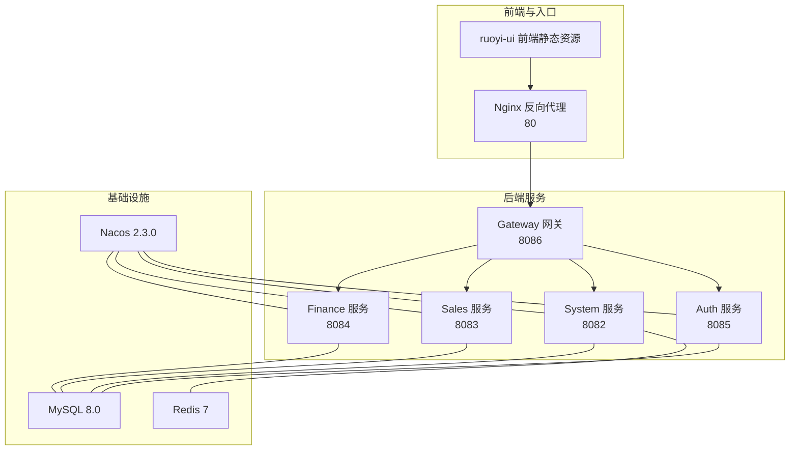
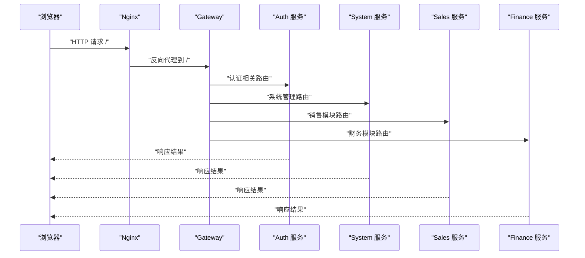
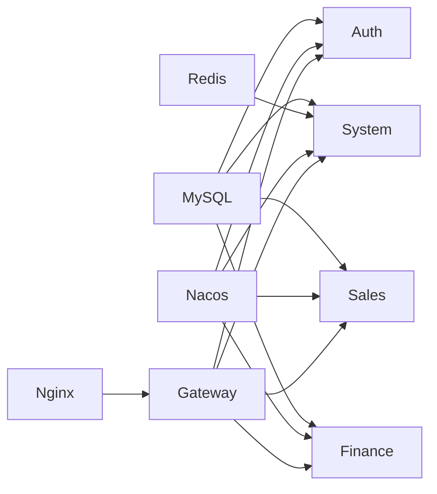

# 部署运维

<cite>
**本文引用的文件**
- [docker-compose.yml](file://docker-compose.yml)
- [docker-compose-simple.yml](file://docker-compose-simple.yml)
- [build-and-deploy.sh](file://build-and-deploy.sh)
- [quick-start.sh](file://quick-start.sh)
- [nginx.conf](file://nginx.conf)
- [init-db.sql](file://scripts/init-db.sql)
- [auth/Dockerfile](file://auth/Dockerfile)
- [system/Dockerfile](file://system/Dockerfile)
- [sales/Dockerfile](file://sales/Dockerfile)
- [finance/Dockerfile](file://finance/Dockerfile)
- [gateway/Dockerfile](file://gateway/Dockerfile)
- [auth/src/main/resources/application-docker.yml](file://auth/src/main/resources/application-docker.yml)
- [system/src/main/resources/application-docker.yml](file://system/src/main/resources/application-docker.yml)
- [gateway/src/main/resources/application-docker.yml](file://gateway/src/main/resources/application-docker.yml)
</cite>

## 目录
1. [简介](#简介)
2. [项目结构](#项目结构)
3. [核心组件](#核心组件)
4. [架构总览](#架构总览)
5. [详细组件分析](#详细组件分析)
6. [依赖关系分析](#依赖关系分析)
7. [性能与容量规划](#性能与容量规划)
8. [监控与告警](#监控与告警)
9. [日志管理](#日志管理)
10. [CI/CD 流水线](#cicd-流水线)
11. [Nginx 反向代理与负载均衡](#nginx-反向代理与负载均衡)
12. [故障排查与应急响应](#故障排查与应急响应)
13. [生产部署最佳实践与安全加固](#生产部署最佳实践与安全加固)
14. [结论](#结论)

## 简介
本文件面向NeoCC项目的部署与运维团队，提供从容器化部署、镜像构建、容器编排到CI/CD、反向代理、监控告警、日志管理、性能调优、容量规划、故障排查与应急响应的完整指南。文档基于仓库中现有的Docker Compose编排、Shell脚本、Nginx配置与各微服务Dockerfile及Spring Boot配置进行梳理与扩展，帮助读者快速、稳定地在生产环境中落地系统。

## 项目结构
NeoCC采用多模块微服务架构，包含认证(auth)、系统(system)、销售(sales)、财务(finance)、网关(gateway)以及前端ruoyi-ui，并通过Nacos作为服务注册与配置中心、MySQL与Redis作为数据与缓存基础设施。项目提供了两套Compose编排：一套包含Nacos的服务治理编排，另一套为简化版（无Nacos）。

图表来源
- [docker-compose.yml:1-182](file://docker-compose.yml#L1-L182)
- [docker-compose-simple.yml:1-146](file://docker-compose-simple.yml#L1-L146)

章节来源
- [docker-compose.yml:1-182](file://docker-compose.yml#L1-L182)
- [docker-compose-simple.yml:1-146](file://docker-compose-simple.yml#L1-L146)

## 核心组件
- Nacos：服务注册与配置中心，支持服务发现与动态配置下发（在完整编排中启用）。
- MySQL：持久化存储，包含多个业务库与初始化脚本。
- Redis：缓存与会话存储。
- Auth/Sales/Finance/System：独立的微服务，分别提供认证、销售、财务与系统管理能力。
- Gateway：统一API网关，负责路由转发与跨域配置。
- Nginx：前端静态资源托管与后端API反向代理。

章节来源
- [docker-compose.yml:4-173](file://docker-compose.yml#L4-L173)
- [docker-compose-simple.yml:4-137](file://docker-compose-simple.yml#L4-L137)

## 架构总览
下图展示从浏览器到后端服务的典型请求链路，以及网关的路由规则如何将请求分发至对应微服务。

图表来源
- [nginx.conf:22-74](file://nginx.conf#L22-L74)
- [gateway/src/main/resources/application-docker.yml:14-142](file://gateway/src/main/resources/application-docker.yml#L14-L142)

## 详细组件分析

### 容器编排与启动顺序
- 完整编排（含Nacos）：先启动MySQL与Redis，再启动Nacos，随后启动各业务服务，最后启动Gateway与Nginx。
- 简化编排（无Nacos）：直接启动MySQL、Redis与各业务服务，Gateway与Nginx按需启动。
- 健康检查：MySQL配置了健康检查命令，确保数据库可用后再启动上层服务。
- 端口映射：各服务暴露端口与宿主机映射，便于本地调试与联调。

章节来源
- [docker-compose.yml:28-173](file://docker-compose.yml#L28-L173)
- [docker-compose-simple.yml:5-137](file://docker-compose-simple.yml#L5-L137)

### Dockerfile 规范
- 统一基础镜像：均使用Eclipse Temurin 21 JDK镜像。
- 工作目录与打包：复制Maven构建产物到容器内，暴露服务端口，使用java -jar启动。
- 版本与可维护性：建议在Dockerfile中固定JRE版本或使用distroless镜像以减小体积。

章节来源
- [auth/Dockerfile:1-13](file://auth/Dockerfile#L1-L13)
- [system/Dockerfile:1-13](file://system/Dockerfile#L1-L13)
- [sales/Dockerfile:1-13](file://sales/Dockerfile#L1-L13)
- [finance/Dockerfile:1-13](file://finance/Dockerfile#L1-L13)
- [gateway/Dockerfile:1-13](file://gateway/Dockerfile#L1-L13)

### Spring Boot Docker 配置要点
- 数据源：各服务连接neocc-mysql容器内的目标库；密码与字符集等参数一致。
- Redis：System服务读取REDIS_HOST环境变量，默认指向neocc-redis。
- 日志级别：设置为DEBUG以便问题定位。
- 网关路由：Gateway集中管理多模块路由规则，包含根路径认证接口与各模块API前缀。

章节来源
- [auth/src/main/resources/application-docker.yml:1-32](file://auth/src/main/resources/application-docker.yml#L1-L32)
- [system/src/main/resources/application-docker.yml:1-38](file://system/src/main/resources/application-docker.yml#L1-L38)
- [gateway/src/main/resources/application-docker.yml:1-147](file://gateway/src/main/resources/application-docker.yml#L1-L147)

### 初始化数据库脚本
- 创建Nacos与各业务库。
- 授权root用户远程访问，便于容器间连通。

章节来源
- [init-db.sql:1-22](file://scripts/init-db.sql#L1-L22)

### 启动脚本与部署流程
- build-and-deploy.sh：执行Maven打包、构建镜像、按阶段启动基础设施与业务服务、最后启动Nginx，并输出访问信息。
- quick-start.sh：在已有构建产物前提下，一键启动全部服务并打印状态。

章节来源
- [build-and-deploy.sh:1-75](file://build-and-deploy.sh#L1-L75)
- [quick-start.sh:1-34](file://quick-start.sh#L1-L34)

## 依赖关系分析
- 服务依赖：Gateway依赖四个业务服务；Nginx依赖Gateway；业务服务依赖MySQL与Redis；Nacos在完整编排中被用于服务发现。
- 网络隔离：所有服务位于同一bridge网络，容器间通过服务名通信。
- 存储卷：MySQL与Redis使用命名卷持久化数据。

图表来源
- [docker-compose.yml:58-173](file://docker-compose.yml#L58-L173)
- [docker-compose-simple.yml:35-137](file://docker-compose-simple.yml#L35-L137)

章节来源
- [docker-compose.yml:1-182](file://docker-compose.yml#L1-L182)
- [docker-compose-simple.yml:1-146](file://docker-compose-simple.yml#L1-L146)

## 性能与容量规划
- JVM与容器资源
  - 建议为每个JVM容器设置合理的JVM堆大小与GC策略，避免频繁Full GC。
  - 在容器层面限制CPU与内存，结合Prometheus+Grafana观测CPU/内存/线程数峰值。
- 数据库
  - MySQL使用8.0，建议开启慢查询日志与连接池监控；根据QPS评估实例规格与索引优化。
- 缓存
  - Redis作为热点数据缓存，建议开启持久化与主从复制，配合哨兵或集群提升可用性。
- 网关与Nginx
  - Nginx已启用gzip压缩与静态资源缓存控制策略，建议结合限流与超时配置降低后端压力。
- 并发与弹性
  - 微服务拆分合理，建议引入熔断与重试机制，结合限流与排队策略保障稳定性。

## 监控与告警
- 应用监控
  - Spring Boot Actuator：暴露健康检查、指标端点，结合Prometheus抓取。
  - Micrometer：自定义指标采集，如业务指标、异常计数、耗时分布。
- 数据库监控
  - MySQL：使用Percona Monitoring and Management(PMM)或自带慢查询日志分析。
- 基础设施监控
  - Prometheus + Grafana：采集容器与主机指标，设置告警规则（CPU、内存、磁盘、连接数、QPS）。
- 告警通道
  - 邮件、钉钉、企业微信等，分级处理不同严重程度事件。

## 日志管理
- 日志采集
  - 使用Filebeat/Fluent Bit收集容器标准输出与Nginx访问日志，发送至ELK/EFK或 Loki。
- 日志存储
  - Elasticsearch/Loki长期归档，按天/周轮转，保留周期策略明确。
- 日志分析
  - 结合Kibana/Grafana进行可视化检索与趋势分析，建立常见错误与异常的告警规则。

## CI/CD 流水线
- 构建阶段
  - Maven Clean Package，跳过测试（或在流水线中单独触发测试任务）。
  - Docker Build生成镜像，打上版本标签（如Git Commit ID或SemVer）。
- 测试阶段
  - 单元测试与集成测试在流水线中执行，失败即阻断发布。
- 部署阶段
  - 使用docker-compose或Kubernetes部署，支持蓝绿/金丝雀发布。
  - 发布后进行健康检查与端到端验证。
- 回滚策略
  - 保留最近N个版本镜像，支持一键回滚。

## Nginx 反向代理与负载均衡
- 反向代理
  - 将前端静态资源与后端API代理至Gateway，支持开发与生产两条路径前缀。
- 负载均衡
  - 在生产环境可将Gateway与后端服务横向扩展，使用Nginx upstream实现多实例负载均衡。
- 连接与超时
  - 已设置proxy_connect/send/read_timeout，可根据业务延迟调整。
- 缓存控制
  - 对JS/CSS强制不缓存，对HTML按需缓存，减少版本更新带来的问题。

章节来源
- [nginx.conf:22-74](file://nginx.conf#L22-L74)

## 故障排查与应急响应
- 常见问题定位
  - 查看容器日志：docker-compose logs -f 服务名。
  - 健康检查：确认MySQL健康检查通过后再启动上层服务。
  - 网络连通：使用docker exec进入容器验证服务名解析与端口可达。
- 应急响应
  - 快速降级：关闭非关键路由或临时屏蔽高风险接口。
  - 限流与熔断：在Gateway与服务侧增加限流与熔断策略。
  - 回滚：使用上一个稳定版本镜像快速回滚。
- 事后复盘
  - 输出变更记录、影响范围与修复过程，沉淀SOP。

章节来源
- [build-and-deploy.sh:73-74](file://build-and-deploy.sh#L73-L74)
- [docker-compose.yml:39-43](file://docker-compose.yml#L39-L43)

## 生产部署最佳实践与安全加固
- 环境分离
  - 开发/测试/预发/生产严格隔离，最小化共享资源。
- 密码与密钥
  - 使用Secret管理敏感信息，避免硬编码在配置文件中。
- 网络安全
  - 仅开放必要端口，使用防火墙与安全组限制入站流量。
  - Gateway与Nginx前置，后端服务尽量不对外暴露端口。
- 镜像与运行时
  - 使用只读根文件系统、drop不必要的Linux capabilities。
  - 定期更新基础镜像，修补漏洞。
- 备份与恢复
  - 定期备份MySQL与Redis数据，演练恢复流程。
- 审计与合规
  - 启用操作审计与访问日志，满足合规要求。

## 结论
本文基于现有仓库配置，给出了NeoCC项目的容器化部署、编排、网关路由、Nginx代理、启动脚本与数据库初始化的完整说明，并补充了CI/CD、监控告警、日志管理、性能调优、容量规划、故障排查与安全加固建议。建议在生产环境中进一步完善密钥管理、网络隔离、镜像安全扫描与自动化巡检，持续迭代发布流程与应急预案。