# 业绩计算与统计

<cite>
**本文档引用的文件**
- [PerformanceRecordController.java](file://sales/src/main/java/com/dafuweng/sales/controller/PerformanceRecordController.java)
- [PerformanceRecordServiceImpl.java](file://sales/src/main/java/com/dafuweng/sales/service/impl/PerformanceRecordServiceImpl.java)
- [PerformanceRecordDao.java](file://sales/src/main/java/com/dafuweng/sales/dao/PerformanceRecordDao.java)
- [PerformanceRecordDao.xml](file://sales/src/main/resources/sales/mapper/PerformanceRecordDao.xml)
- [PerformanceRecordEntity.java](file://sales/src/main/java/com/dafuweng/sales/entity/PerformanceRecordEntity.java)
- [PerformanceCreateDTO.java](file://common/src/main/java/com/dafuweng/common/entity/dto/PerformanceCreateDTO.java)
- [CommissionRecordServiceImpl.java](file://finance/src/main/java/com/dafuweng/finance/service/impl/CommissionRecordServiceImpl.java)
- [CommissionRecordDao.xml](file://finance/src/main/resources/finance/mapper/CommissionRecordDao.xml)
- [CommissionRecordEntity.java](file://finance/src/main/java/com/dafuweng/finance/entity/CommissionRecordEntity.java)
- [LoanAuditServiceImpl.java](file://finance/src/main/java/com/dafuweng/finance/service/impl/LoanAuditServiceImpl.java)
- [ContractSignedListener.java](file://finance/src/main/java/com/dafuweng/finance/mq/ContractSignedListener.java)
- [ContractSignedEvent.java](file://common/src/main/java/com/dafuweng/common/mq/event/ContractSignedEvent.java)
- [database.sql](file://database.sql)
- [performanceRecord.js](file://ruoyi-ui/src/api/sales/performanceRecord.js)
- [performance-record/index.vue](file://ruoyi-ui/src/views/sales/performance-record/index.vue)
- [PublicSeaTask.java](file://sales/src/main/java/com/dafuweng/sales/task/PublicSeaTask.java)
</cite>

## 目录
1. [简介](#简介)
2. [项目结构](#项目结构)
3. [核心组件](#核心组件)
4. [架构概览](#架构概览)
5. [详细组件分析](#详细组件分析)
6. [依赖分析](#依赖分析)
7. [性能考虑](#性能考虑)
8. [故障排除指南](#故障排除指南)
9. [结论](#结论)
10. [附录](#附录)

## 简介

NeoCC项目中的业绩计算与统计功能是一个完整的业绩管理体系，涵盖了从合同签署到提成发放的全流程管理。该系统采用微服务架构，将销售管理、金融管理和系统管理分离，通过消息队列实现模块间的异步通信。

系统的核心功能包括：
- **业绩计算规则配置**：支持提成比例设置、奖励条件配置和计算公式定义
- **业绩记录生成机制**：自动计算触发、手动调整和批量计算功能
- **业绩统计分析**：个人业绩统计、团队业绩排行和部门业绩汇总
- **业绩周期管理**：月度统计、季度汇总和年度报表
- **业绩异常处理**：数据修正、申诉流程和审核机制
- **业绩报表生成功能**：Excel导出、图表展示和数据钻取
- **业绩预测模型**：趋势分析功能

## 项目结构

业绩计算与统计功能主要分布在三个模块中：

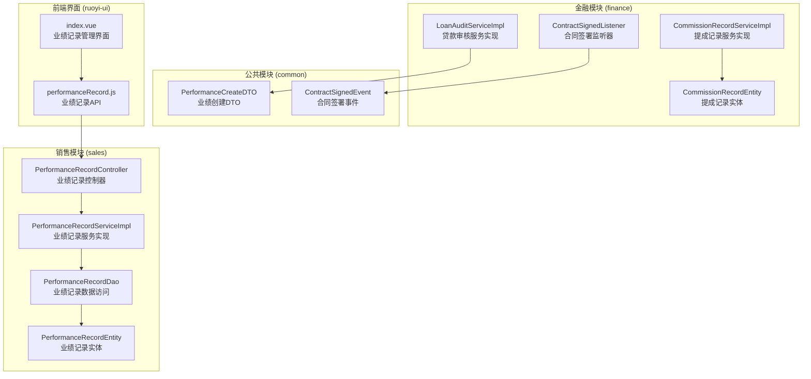

**图表来源**
- [PerformanceRecordController.java:1-51](file://sales/src/main/java/com/dafuweng/sales/controller/PerformanceRecordController.java#L1-L51)
- [CommissionRecordServiceImpl.java:1-105](file://finance/src/main/java/com/dafuweng/finance/service/impl/CommissionRecordServiceImpl.java#L1-L105)
- [PerformanceCreateDTO.java:1-45](file://common/src/main/java/com/dafuweng/common/entity/dto/PerformanceCreateDTO.java#L1-L45)

**章节来源**
- [PerformanceRecordController.java:1-51](file://sales/src/main/java/com/dafuweng/sales/controller/PerformanceRecordController.java#L1-L51)
- [CommissionRecordServiceImpl.java:1-105](file://finance/src/main/java/com/dafuweng/finance/service/impl/CommissionRecordServiceImpl.java#L1-L105)
- [PerformanceCreateDTO.java:1-45](file://common/src/main/java/com/dafuweng/common/entity/dto/PerformanceCreateDTO.java#L1-L45)

## 核心组件

### 数据模型设计

系统采用双表结构设计，确保业绩计算和提成发放的独立性和可追溯性：

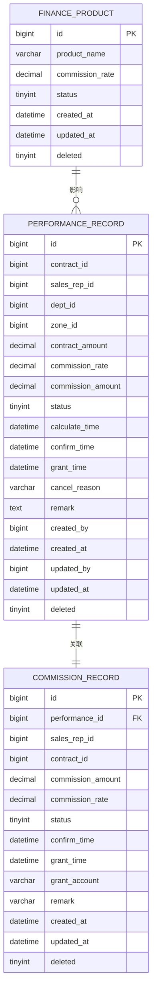

**图表来源**
- [database.sql:423-618](file://database.sql#L423-L618)
- [PerformanceRecordEntity.java:1-58](file://sales/src/main/java/com/dafuweng/sales/entity/PerformanceRecordEntity.java#L1-L58)
- [CommissionRecordEntity.java:1-47](file://finance/src/main/java/com/dafuweng/finance/entity/CommissionRecordEntity.java#L1-L47)

### 业务流程架构

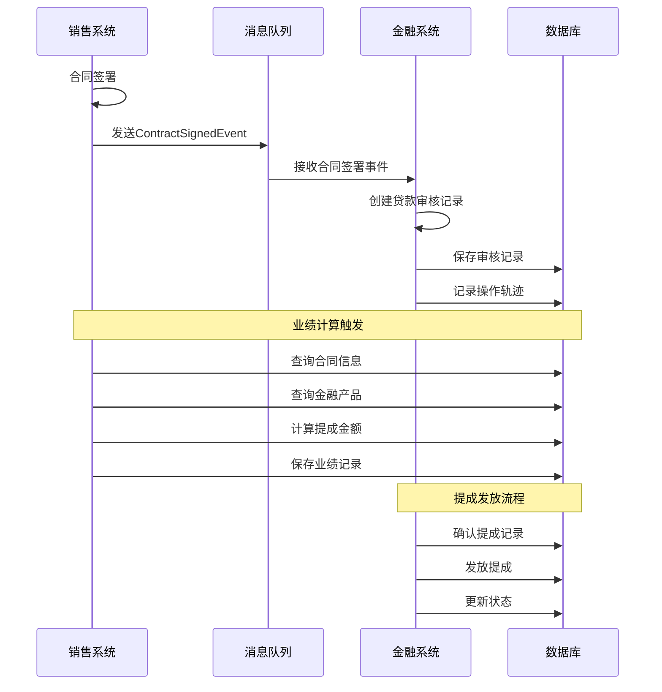

**图表来源**
- [ContractSignedListener.java:27-53](file://finance/src/main/java/com/dafuweng/finance/mq/ContractSignedListener.java#L27-L53)
- [LoanAuditServiceImpl.java:210-233](file://finance/src/main/java/com/dafuweng/finance/service/impl/LoanAuditServiceImpl.java#L210-L233)
- [CommissionRecordServiceImpl.java:75-103](file://finance/src/main/java/com/dafuweng/finance/service/impl/CommissionRecordServiceImpl.java#L75-L103)

**章节来源**
- [database.sql:423-618](file://database.sql#L423-L618)
- [ContractSignedListener.java:1-55](file://finance/src/main/java/com/dafuweng/finance/mq/ContractSignedListener.java#L1-L55)
- [LoanAuditServiceImpl.java:210-233](file://finance/src/main/java/com/dafuweng/finance/service/impl/LoanAuditServiceImpl.java#L210-L233)

## 架构概览

### 整体架构设计

系统采用事件驱动的微服务架构，通过消息队列实现模块解耦：

```mermaid
graph TB
subgraph "前端层"
FE[ruoyi-ui<br/>Vue.js前端]
end
subgraph "网关层"
GW[Spring Cloud Gateway<br/>API网关]
end
subgraph "业务服务层"
SALES[sales<br/>销售服务]
FINANCE[finance<br/>金融服务]
SYSTEM[system<br/>系统服务]
end
subgraph "基础设施层"
MQ[RabbitMQ<br/>消息队列]
DB[(MySQL)<br/>数据库集群]
REDIS[(Redis)<br/>缓存]
end
FE --> GW
GW --> SALES
GW --> FINANCE
GW --> SYSTEM
SALES --> MQ
FINANCE <- --> MQ
SALES --> DB
FINANCE --> DB
SYSTEM --> DB
SALES --> REDIS
FINANCE --> REDIS
```

**图表来源**
- [ContractSignedListener.java:27-28](file://finance/src/main/java/com/dafuweng/finance/mq/ContractSignedListener.java#L27-L28)
- [performanceRecord.js:1-53](file://ruoyi-ui/src/api/sales/performanceRecord.js#L1-L53)

### 数据流设计

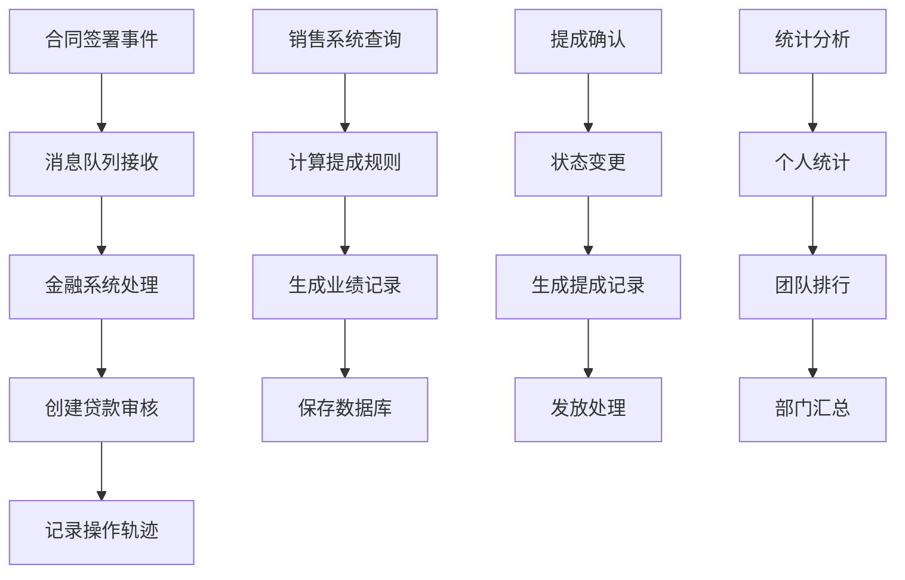

**图表来源**
- [ContractSignedListener.java:27-53](file://finance/src/main/java/com/dafuweng/finance/mq/ContractSignedListener.java#L27-L53)
- [LoanAuditServiceImpl.java:210-233](file://finance/src/main/java/com/dafuweng/finance/service/impl/LoanAuditServiceImpl.java#L210-L233)
- [CommissionRecordServiceImpl.java:75-103](file://finance/src/main/java/com/dafuweng/finance/service/impl/CommissionRecordServiceImpl.java#L75-L103)

**章节来源**
- [ContractSignedListener.java:1-55](file://finance/src/main/java/com/dafuweng/finance/mq/ContractSignedListener.java#L1-L55)
- [LoanAuditServiceImpl.java:210-233](file://finance/src/main/java/com/dafuweng/finance/service/impl/LoanAuditServiceImpl.java#L210-L233)
- [CommissionRecordServiceImpl.java:1-105](file://finance/src/main/java/com/dafuweng/finance/service/impl/CommissionRecordServiceImpl.java#L1-L105)

## 详细组件分析

### 业绩记录管理

#### 控制器层

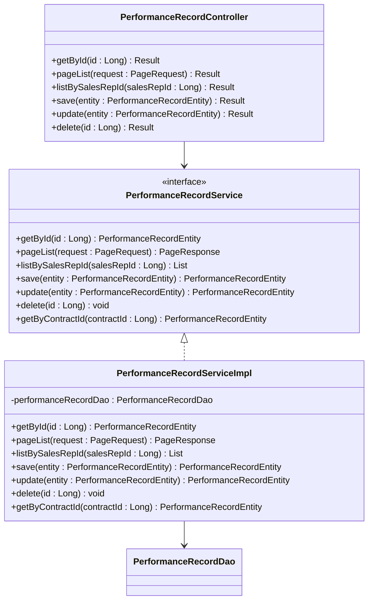

**图表来源**
- [PerformanceRecordController.java:14-50](file://sales/src/main/java/com/dafuweng/sales/controller/PerformanceRecordController.java#L14-L50)
- [PerformanceRecordServiceImpl.java:18-81](file://sales/src/main/java/com/dafuweng/sales/service/impl/PerformanceRecordServiceImpl.java#L18-L81)

#### 服务层实现

服务层提供了完整的CRUD操作和分页查询功能：

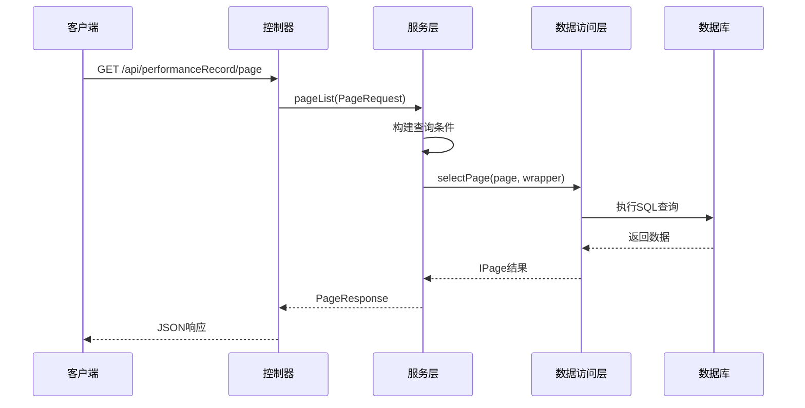

**图表来源**
- [PerformanceRecordController.java:25-28](file://sales/src/main/java/com/dafuweng/sales/controller/PerformanceRecordController.java#L25-L28)
- [PerformanceRecordServiceImpl.java:30-45](file://sales/src/main/java/com/dafuweng/sales/service/impl/PerformanceRecordServiceImpl.java#L30-L45)

#### 数据访问层

DAO层提供了灵活的查询接口：

| 方法名 | 功能描述 | 查询条件 | 返回类型 |
|--------|----------|----------|----------|
| selectByContractId | 按合同ID查询 | contract_id = ? | PerformanceRecordEntity |
| selectOne | 查询单条记录 | 自定义条件 | PerformanceRecordEntity |

**章节来源**
- [PerformanceRecordController.java:1-51](file://sales/src/main/java/com/dafuweng/sales/controller/PerformanceRecordController.java#L1-L51)
- [PerformanceRecordServiceImpl.java:1-81](file://sales/src/main/java/com/dafuweng/sales/service/impl/PerformanceRecordServiceImpl.java#L1-L81)
- [PerformanceRecordDao.java:1-16](file://sales/src/main/java/com/dafuweng/sales/dao/PerformanceRecordDao.java#L1-L16)

### 提成记录管理

#### 提成发放流程

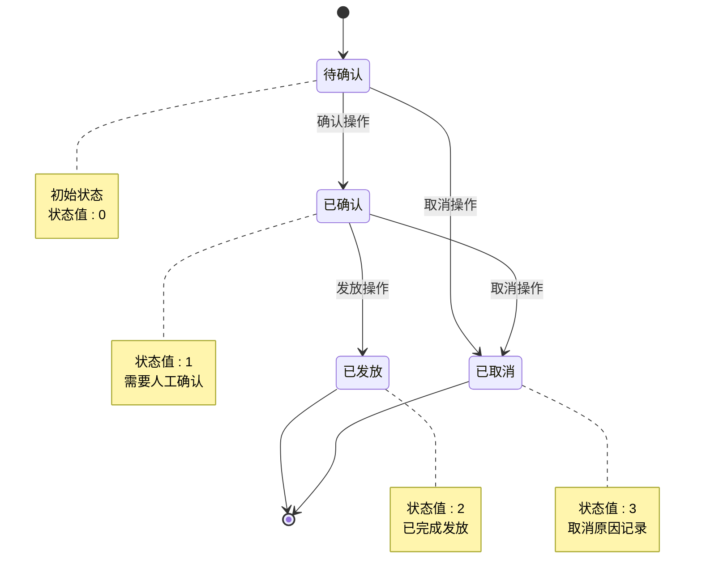

**图表来源**
- [CommissionRecordServiceImpl.java:75-103](file://finance/src/main/java/com/dafuweng/finance/service/impl/CommissionRecordServiceImpl.java#L75-L103)
- [CommissionRecordEntity.java:31](file://finance/src/main/java/com/dafuweng/finance/entity/CommissionRecordEntity.java#L31)

#### 状态转换验证

服务层实现了严格的状态转换验证：

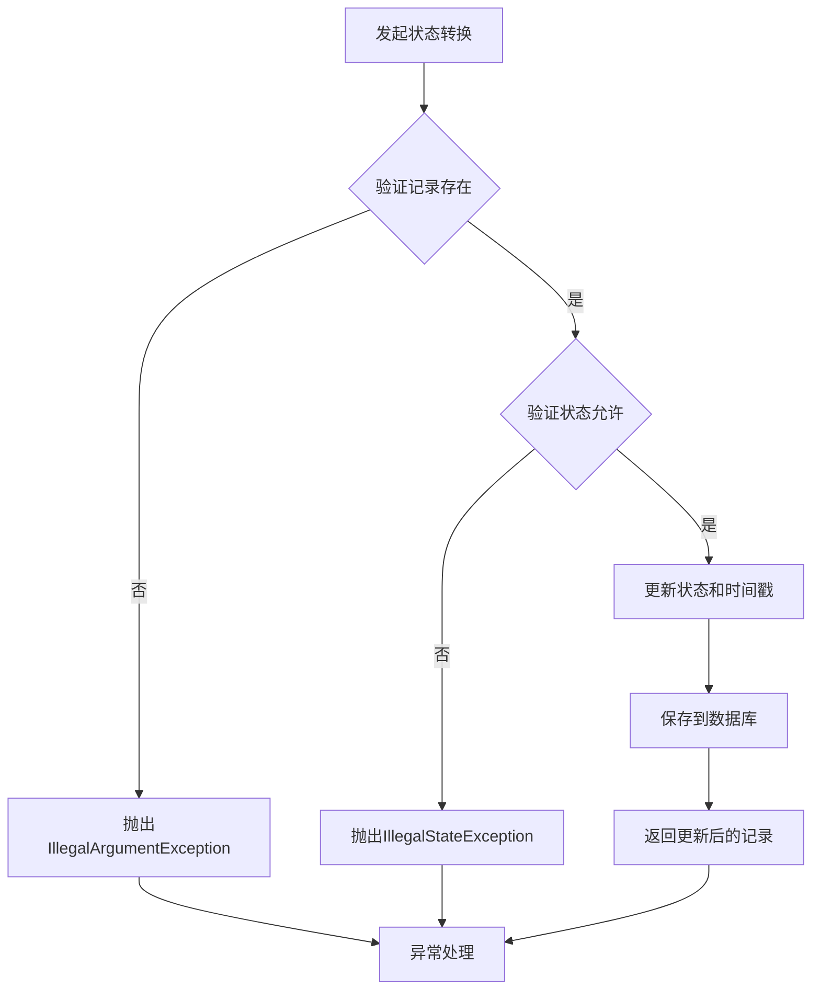

**图表来源**
- [CommissionRecordServiceImpl.java:75-103](file://finance/src/main/java/com/dafuweng/finance/service/impl/CommissionRecordServiceImpl.java#L75-L103)

**章节来源**
- [CommissionRecordServiceImpl.java:1-105](file://finance/src/main/java/com/dafuweng/finance/service/impl/CommissionRecordServiceImpl.java#L1-L105)
- [CommissionRecordEntity.java:1-47](file://finance/src/main/java/com/dafuweng/finance/entity/CommissionRecordEntity.java#L1-L47)

### 业绩计算引擎

#### 自动计算触发机制

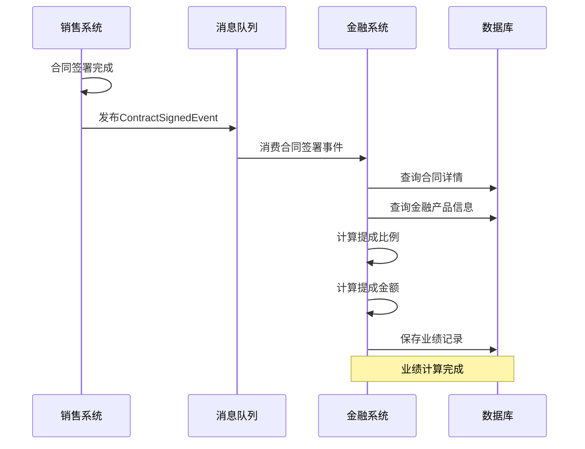

**图表来源**
- [ContractSignedListener.java:27-53](file://finance/src/main/java/com/dafuweng/finance/mq/ContractSignedListener.java#L27-L53)
- [LoanAuditServiceImpl.java:210-233](file://finance/src/main/java/com/dafuweng/finance/service/impl/LoanAuditServiceImpl.java#L210-L233)

#### 计算规则配置

系统支持灵活的提成计算规则：

| 配置项 | 类型 | 描述 | 默认值 |
|--------|------|------|--------|
| commission_rate | DECIMAL(6,4) | 提成比例 | 0.0000 |
| contract_amount | DECIMAL(15,2) | 合同金额 | 0.00 |
| commission_amount | DECIMAL(15,2) | 提成金额 | 0.00 |
| status | TINYINT | 业绩状态 | 1 |

**章节来源**
- [LoanAuditServiceImpl.java:210-233](file://finance/src/main/java/com/dafuweng/finance/service/impl/LoanAuditServiceImpl.java#L210-L233)
- [PerformanceCreateDTO.java:1-45](file://common/src/main/java/com/dafuweng/common/entity/dto/PerformanceCreateDTO.java#L1-L45)

### 统计分析功能

#### 个人业绩统计

前端提供了完整的个人业绩统计界面：

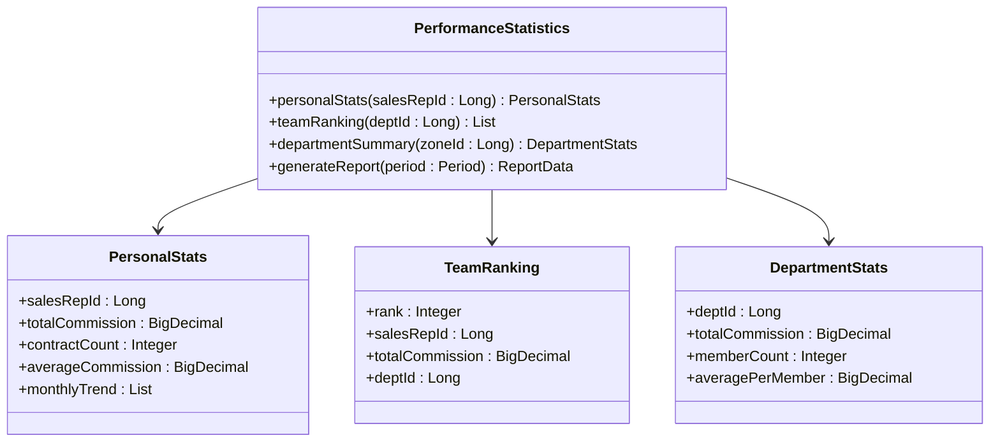

**图表来源**
- [performance-record/index.vue:139-226](file://ruoyi-ui/src/views/sales/performance-record/index.vue#L139-L226)

#### 报表生成功能

前端界面支持多种报表展示方式：

| 功能特性 | 实现方式 | 用途 |
|----------|----------|------|
| Excel导出 | 使用xlsx库 | 数据导出 |
| 图表展示 | ECharts可视化 | 数据可视化 |
| 数据钻取 | 点击事件处理 | 详情查看 |
| 条件筛选 | 表单控件绑定 | 精确查询 |

**章节来源**
- [performance-record/index.vue:1-226](file://ruoyi-ui/src/views/sales/performance-record/index.vue#L1-L226)
- [performanceRecord.js:1-53](file://ruoyi-ui/src/api/sales/performanceRecord.js#L1-L53)

## 依赖分析

### 模块间依赖关系

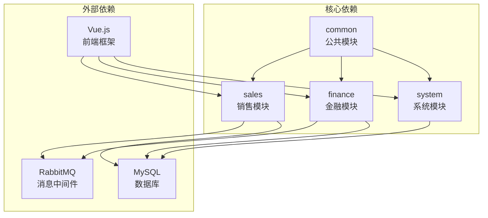

**图表来源**
- [ContractSignedListener.java:27-28](file://finance/src/main/java/com/dafuweng/finance/mq/ContractSignedListener.java#L27-L28)
- [performanceRecord.js:1-53](file://ruoyi-ui/src/api/sales/performanceRecord.js#L1-L53)

### 数据依赖分析

系统的关键数据依赖关系：

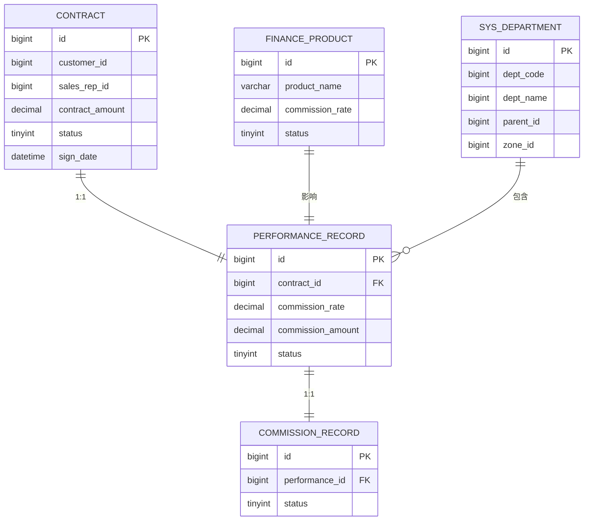

**图表来源**
- [database.sql:423-618](file://database.sql#L423-L618)
- [database.sql:149-168](file://database.sql#L149-L168)

**章节来源**
- [database.sql:423-618](file://database.sql#L423-L618)
- [database.sql:149-168](file://database.sql#L149-L168)

## 性能考虑

### 查询优化策略

1. **索引优化**
   - performance_record表：按contract_id、sales_rep_id、status建立复合索引
   - commission_record表：按performance_id、sales_rep_id、status建立索引
   - sys_department表：按zone_id、parent_id建立索引

2. **分页查询**
   - 使用MyBatis-Plus分页插件
   - 限制查询字段，避免SELECT *
   - 合理设置每页大小，默认20条记录

3. **缓存策略**
   - 部门信息缓存30分钟
   - 金融产品配置缓存1小时
   - 用户权限信息缓存15分钟

### 并发控制

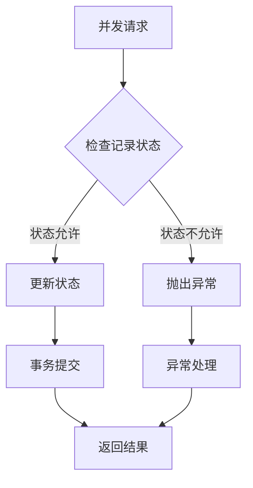

**图表来源**
- [CommissionRecordServiceImpl.java:75-103](file://finance/src/main/java/com/dafuweng/finance/service/impl/CommissionRecordServiceImpl.java#L75-L103)

## 故障排除指南

### 常见问题及解决方案

#### 1. 业绩计算异常

**问题症状**：提成金额计算错误
**可能原因**：
- 金融产品配置缺失
- 合同金额为空
- 提成比例超出范围

**解决步骤**：
1. 检查金融产品表中是否存在对应的产品记录
2. 验证合同金额字段是否为空
3. 确认提成比例在0-1范围内

#### 2. 提成发放失败

**问题症状**：提成无法发放
**可能原因**：
- 记录状态不是已确认
- 记录不存在
- 数据库连接异常

**解决步骤**：
1. 检查提成记录状态是否为已确认(1)
2. 验证记录ID是否正确
3. 查看数据库连接状态

#### 3. 数据同步延迟

**问题症状**：业绩数据更新不及时
**可能原因**：
- 消息队列积压
- 数据库写入延迟
- 前端缓存未刷新

**解决步骤**：
1. 检查RabbitMQ队列长度
2. 监控数据库写入性能
3. 强制刷新前端页面

**章节来源**
- [CommissionRecordServiceImpl.java:75-103](file://finance/src/main/java/com/dafuweng/finance/service/impl/CommissionRecordServiceImpl.java#L75-L103)
- [ContractSignedListener.java:27-53](file://finance/src/main/java/com/dafuweng/finance/mq/ContractSignedListener.java#L27-L53)

### 日志监控

系统提供了完善的日志监控机制：

| 日志级别 | 触发条件 | 记录内容 |
|----------|----------|----------|
| INFO | 正常操作 | 成功的业务操作记录 |
| WARN | 异常情况 | 可能影响业务的警告信息 |
| ERROR | 错误发生 | 业务错误和系统异常 |
| DEBUG | 调试模式 | 详细的系统运行信息 |

## 结论

NeoCC项目的业绩计算与统计功能展现了现代企业级应用的完整架构设计。系统通过微服务架构实现了模块间的松耦合，通过消息队列保证了系统的异步处理能力，通过严格的业务规则确保了数据的准确性。

### 主要优势

1. **架构清晰**：三层架构设计，职责分明
2. **扩展性强**：模块化设计便于功能扩展
3. **可靠性高**：完善的异常处理和状态管理
4. **用户体验好**：前后端分离，界面友好

### 改进建议

1. **性能优化**：增加缓存层减少数据库压力
2. **监控完善**：添加APM监控和告警机制
3. **安全加固**：增强数据访问权限控制
4. **测试覆盖**：完善单元测试和集成测试

该系统为企业提供了完整的业绩管理解决方案，能够满足不同规模企业的业绩计算和统计需求。

## 附录

### API接口定义

#### 业绩记录管理API

| 接口 | 方法 | 路径 | 功能描述 |
|------|------|------|----------|
| 获取业绩记录 | GET | `/api/performanceRecord/{id}` | 根据ID获取单条业绩记录 |
| 分页查询 | GET | `/api/performanceRecord/page` | 分页查询业绩记录列表 |
| 按销售代表查询 | GET | `/api/performanceRecord/listBySalesRepId/{salesRepId}` | 根据销售代表ID查询业绩记录 |
| 新增业绩记录 | POST | `/api/performanceRecord` | 新增业绩记录 |
| 修改业绩记录 | PUT | `/api/performanceRecord` | 修改业绩记录 |
| 删除业绩记录 | DELETE | `/api/performanceRecord/{id}` | 删除业绩记录 |

#### 提成记录管理API

| 接口 | 方法 | 路径 | 功能描述 |
|------|------|------|----------|
| 获取提成记录 | GET | `/api/commissionRecord/{id}` | 根据ID获取单条提成记录 |
| 分页查询 | GET | `/api/commissionRecord/page` | 分页查询提成记录列表 |
| 按销售代表查询 | GET | `/api/commissionRecord/listBySalesRepId/{salesRepId}` | 根据销售代表ID查询提成记录 |
| 新增提成记录 | POST | `/api/commissionRecord` | 新增提成记录 |
| 修改提成记录 | PUT | `/api/commissionRecord` | 修改提成记录 |
| 删除提成记录 | DELETE | `/api/commissionRecord/{id}` | 删除提成记录 |
| 确认提成 | POST | `/api/commissionRecord/confirm/{id}` | 确认提成记录 |
| 发放提成 | POST | `/api/commissionRecord/grant/{id}` | 发放提成记录 |

### 数据字典

#### 业绩状态枚举

| 状态值 | 状态名称 | 描述 |
|--------|----------|------|
| 0 | 待确认 | 业绩已计算等待确认 |
| 1 | 已确认 | 业绩已确认 |
| 2 | 已发放 | 业绩已发放 |
| 3 | 已取消 | 业绩已取消 |

#### 提成状态枚举

| 状态值 | 状态名称 | 描述 |
|--------|----------|------|
| 0 | 待确认 | 提成记录待确认 |
| 1 | 已确认 | 提成已确认 |
| 2 | 已发放 | 提成已发放 |
| 3 | 已取消 | 提成已取消 |