# 合同生命周期管理

<cite>
**本文档引用的文件**
- [ContractController.java](file://sales/src/main/java/com/dafuweng/sales/controller/ContractController.java)
- [ContractService.java](file://sales/src/main/java/com/dafuweng/sales/service/ContractService.java)
- [ContractServiceImpl.java](file://sales/src/main/java/com/dafuweng/sales/service/impl/ContractServiceImpl.java)
- [ContractDao.java](file://sales/src/main/java/com/dafuweng/sales/dao/ContractDao.java)
- [ContractEntity.java](file://sales/src/main/java/com/dafuweng/sales/entity/ContractEntity.java)
- [ContractAttachmentController.java](file://sales/src/main/java/com/dafuweng/sales/controller/ContractAttachmentController.java)
- [ContractAttachmentEntity.java](file://sales/src/main/java/com/dafuweng/sales/entity/ContractAttachmentEntity.java)
- [ContractSignService.java](file://sales/src/main/java/com/dafuweng/sales/service/ContractSignService.java)
- [ContractSignServiceImpl.java](file://sales/src/main/java/com/dafuweng/sales/service/impl/ContractSignServiceImpl.java)
- [InternalSalesController.java](file://sales/src/main/java/com/dafuweng/sales/controller/InternalSalesController.java)
- [ContractVO.java](file://common/src/main/java/com/dafuweng/common/entity/vo/ContractVO.java)
- [ContractSignedEvent.java](file://common/src/main/java/com/dafuweng/common/entity/event/ContractSignedEvent.java)
- [MqConfig.java](file://common/src/main/java/com/dafuweng/common/mq/MqConfig.java)
- [ContractSignedListener.java](file://finance/src/main/java/com/dafuweng/finance/mq/ContractSignedListener.java)
- [LoanAuditServiceImpl.java](file://finance/src/main/java/com/dafuweng/finance/service/impl/LoanAuditServiceImpl.java)
- [database.sql](file://database.sql)
- [Interfaces.md](file://frontEnd/front/Interfaces.md)
</cite>

## 目录
1. [简介](#简介)
2. [项目结构](#项目结构)
3. [核心组件](#核心组件)
4. [架构概览](#架构概览)
5. [详细组件分析](#详细组件分析)
6. [依赖关系分析](#依赖关系分析)
7. [性能考虑](#性能考虑)
8. [故障排除指南](#故障排除指南)
9. [结论](#结论)

## 简介

合同生命周期管理系统是一个完整的金融合同管理解决方案，涵盖了从合同创建到执行完成的全生命周期管理。该系统采用微服务架构设计，通过销售服务(Sales)和金融服务(Finance)的协同工作，实现了合同的完整业务流程管理。

系统主要功能包括：
- 合同创建与信息录入
- 产品选择与金额计算
- 合同模板应用
- 多级审批机制
- 电子签名集成
- 合同附件管理
- 合同状态流转
- 到期提醒与续签管理
- 统计分析功能

## 项目结构

基于仓库结构，合同生命周期管理功能主要分布在以下模块中：

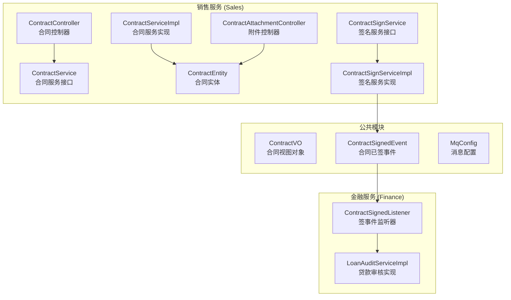

**图表来源**
- [ContractController.java:1-75](file://sales/src/main/java/com/dafuweng/sales/controller/ContractController.java#L1-L75)
- [ContractServiceImpl.java:1-85](file://sales/src/main/java/com/dafuweng/sales/service/impl/ContractServiceImpl.java#L1-L85)
- [ContractSignServiceImpl.java:1-56](file://sales/src/main/java/com/dafuweng/sales/service/impl/ContractSignServiceImpl.java#L1-L56)

**章节来源**
- [ContractController.java:1-75](file://sales/src/main/java/com/dafuweng/sales/controller/ContractController.java#L1-L75)
- [ContractServiceImpl.java:1-85](file://sales/src/main/java/com/dafuweng/sales/service/impl/ContractServiceImpl.java#L1-L85)

## 核心组件

### 合同实体模型

合同实体是整个系统的核心数据模型，包含了合同的所有关键信息：

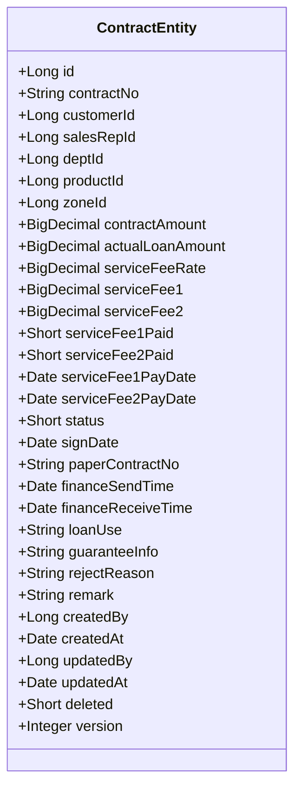

**图表来源**
- [ContractEntity.java:1-91](file://sales/src/main/java/com/dafuweng/sales/entity/ContractEntity.java#L1-L91)

### 合同服务层

合同服务层提供了完整的合同管理功能，包括CRUD操作、分页查询和状态管理：

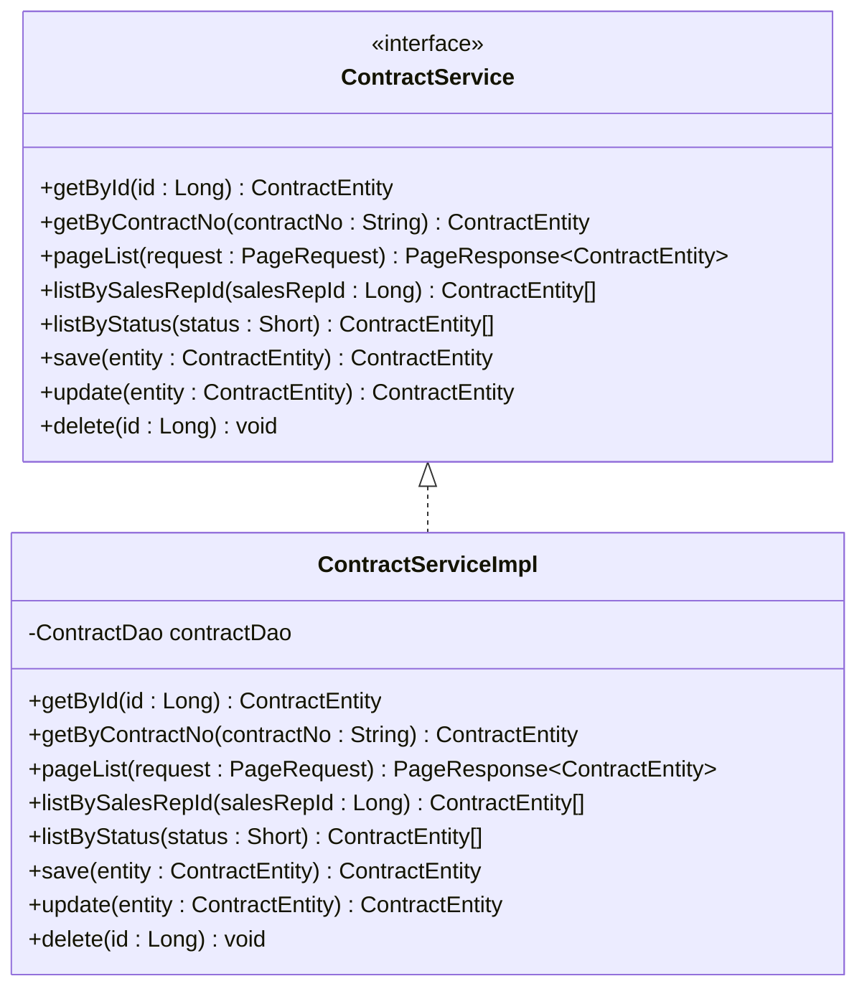

**图表来源**
- [ContractService.java:1-37](file://sales/src/main/java/com/dafuweng/sales/service/ContractService.java#L1-L37)
- [ContractServiceImpl.java:1-85](file://sales/src/main/java/com/dafuweng/sales/service/impl/ContractServiceImpl.java#L1-L85)

**章节来源**
- [ContractEntity.java:1-91](file://sales/src/main/java/com/dafuweng/sales/entity/ContractEntity.java#L1-L91)
- [ContractService.java:1-37](file://sales/src/main/java/com/dafuweng/sales/service/ContractService.java#L1-L37)
- [ContractServiceImpl.java:1-85](file://sales/src/main/java/com/dafuweng/sales/service/impl/ContractServiceImpl.java#L1-L85)

## 架构概览

系统采用事件驱动的微服务架构，通过消息队列实现服务间的解耦：

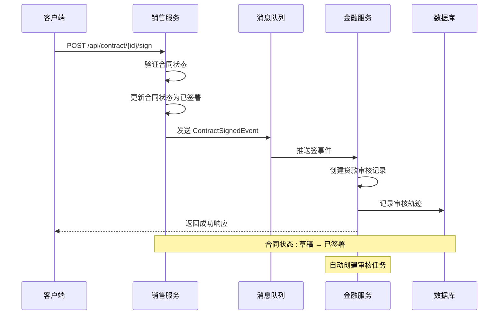

**图表来源**
- [ContractSignServiceImpl.java:24-54](file://sales/src/main/java/com/dafuweng/sales/service/impl/ContractSignServiceImpl.java#L24-L54)
- [ContractSignedListener.java:35-53](file://finance/src/main/java/com/dafuweng/finance/mq/ContractSignedListener.java#L35-L53)

**章节来源**
- [ContractSignServiceImpl.java:1-56](file://sales/src/main/java/com/dafuweng/sales/service/impl/ContractSignServiceImpl.java#L1-L56)
- [ContractSignedListener.java:1-60](file://finance/src/main/java/com/dafuweng/finance/mq/ContractSignedListener.java#L1-L60)

## 详细组件分析

### 合同创建与管理

#### API 接口定义

系统提供了完整的合同管理API接口：

| 方法 | 端点 | 功能描述 |
|------|------|----------|
| GET | /api/contract/{id} | 根据ID获取合同详情 |
| GET | /api/contract/getByContractNo/{contractNo} | 根据合同编号查询 |
| GET | /api/contract/page | 分页查询合同列表 |
| GET | /api/contract/listBySalesRepId/{salesRepId} | 按销售人员查询 |
| GET | /api/contract/listByStatus | 按状态查询 |
| POST | /api/contract | 创建新合同 |
| PUT | /api/contract | 更新合同信息 |
| DELETE | /api/contract/{id} | 删除合同 |

#### 合同创建流程

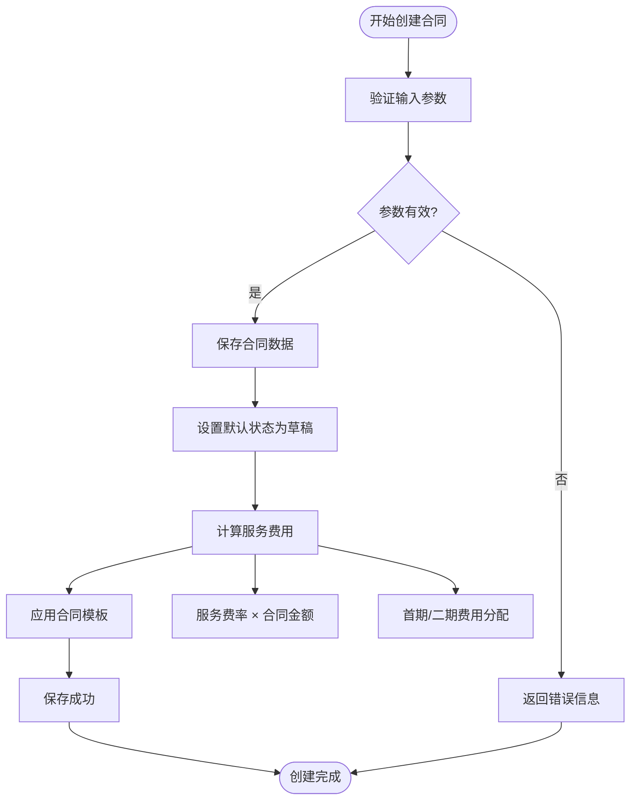

**图表来源**
- [ContractController.java:49-57](file://sales/src/main/java/com/dafuweng/sales/controller/ContractController.java#L49-L57)
- [ContractServiceImpl.java:66-71](file://sales/src/main/java/com/dafuweng/sales/service/impl/ContractServiceImpl.java#L66-L71)

**章节来源**
- [ContractController.java:1-75](file://sales/src/main/java/com/dafuweng/sales/controller/ContractController.java#L1-L75)
- [ContractServiceImpl.java:1-85](file://sales/src/main/java/com/dafuweng/sales/service/impl/ContractServiceImpl.java#L1-L85)

### 合同审批机制

#### 审批状态流转

系统支持多级审批流程，每个状态都有明确的业务含义：

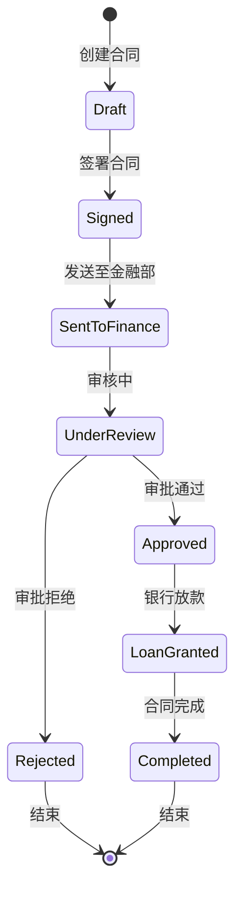

**图表来源**
- [database.sql:258-262](file://database.sql#L258-L262)

#### 审批权限控制

审批权限通过角色和部门进行控制，确保只有具备相应权限的用户才能进行审批操作。

**章节来源**
- [database.sql:258-262](file://database.sql#L258-L262)

### 合同签署功能

#### 电子签名集成

合同签署功能通过事件驱动的方式实现：

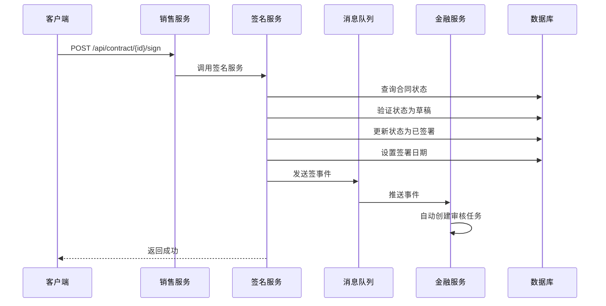

**图表来源**
- [ContractSignServiceImpl.java:24-54](file://sales/src/main/java/com/dafuweng/sales/service/impl/ContractSignServiceImpl.java#L24-L54)
- [ContractSignedListener.java:35-53](file://finance/src/main/java/com/dafuweng/finance/mq/ContractSignedListener.java#L35-L53)

#### 签署状态管理

签署过程包含严格的状态验证和异常处理机制，确保业务数据的完整性。

**章节来源**
- [ContractSignServiceImpl.java:1-56](file://sales/src/main/java/com/dafuweng/sales/service/impl/ContractSignServiceImpl.java#L1-L56)

### 合同附件管理

#### 附件类型与存储

系统支持多种类型的合同附件，并提供完整的附件管理功能：

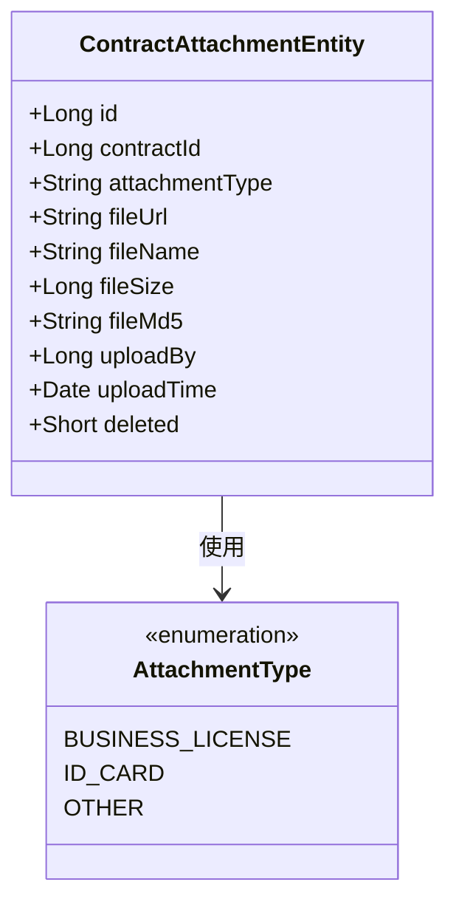

**图表来源**
- [ContractAttachmentEntity.java:1-39](file://sales/src/main/java/com/dafuweng/sales/entity/ContractAttachmentEntity.java#L1-L39)

#### 附件API接口

| 方法 | 端点 | 功能描述 |
|------|------|----------|
| GET | /api/contractAttachment/{id} | 获取附件详情 |
| GET | /api/contractAttachment/page | 分页查询附件 |
| GET | /api/contractAttachment/listByContractId/{contractId} | 按合同查询附件列表 |
| POST | /api/contractAttachment | 创建附件 |
| PUT | /api/contractAttachment | 更新附件信息 |
| DELETE | /api/contractAttachment/{id} | 删除附件 |

**章节来源**
- [ContractAttachmentController.java:1-51](file://sales/src/main/java/com/dafuweng/sales/controller/ContractAttachmentController.java#L1-L51)
- [ContractAttachmentEntity.java:1-39](file://sales/src/main/java/com/dafuweng/sales/entity/ContractAttachmentEntity.java#L1-L39)

### 合同变更管理

#### 变更申请流程

系统支持合同变更申请和审批流程，确保合同修改的合规性：

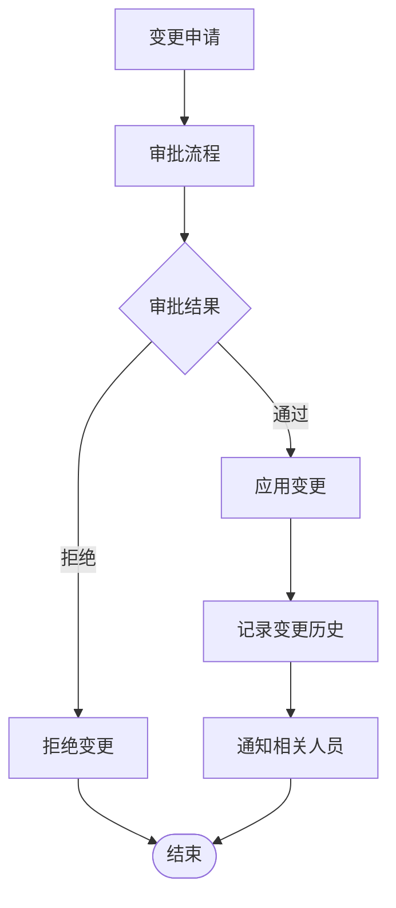

#### 变更历史记录

每次合同变更都会生成详细的历史记录，包括变更内容、操作人、时间等信息。

### 合同状态流转机制

#### 状态定义

系统定义了完整的合同状态体系：

| 状态码 | 状态值 | 中文名称 | 描述 |
|--------|--------|----------|------|
| 1 | DRAFT | 草稿 | 合同创建但未签署 |
| 2 | SIGNED | 已签署 | 合同已签署 |
| 3 | SENT_TO_FINANCE | 已发送金融部 | 合同已发送至金融部 |
| 4 | UNDER_REVIEW | 审核中 | 金融部正在审核 |
| 5 | APPROVED | 已通过 | 审核通过 |
| 6 | REJECTED | 已拒绝 | 审核拒绝 |
| 7 | LOAN_GRANTED | 已放款 | 银行已放款 |
| 8 | COMPLETED | 已完成 | 合同执行完成 |

#### 状态转换规则

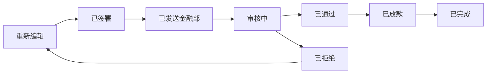

**图表来源**
- [database.sql:258-262](file://database.sql#L258-L262)

**章节来源**
- [database.sql:258-262](file://database.sql#L258-L262)

### 合同到期提醒与续签管理

#### 到期提醒机制

系统提供智能的到期提醒功能，通过定时任务检测即将到期的合同：

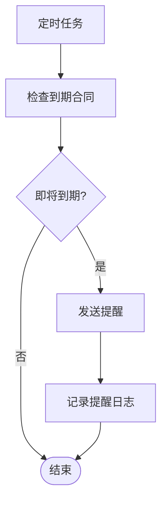

#### 续签管理

系统支持合同续签申请和管理，包括续签条件评估、续签审批等流程。

### 合同统计分析

#### 统计指标

系统提供多维度的合同统计分析功能：

- 合同数量统计
- 合同金额分布
- 各阶段转化率
- 销售人员绩效分析
- 产品类别分析

#### 数据可视化

通过仪表板展示关键指标，支持实时数据更新和导出功能。

## 依赖关系分析

### 组件依赖图

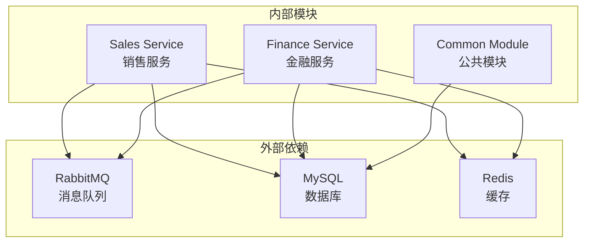

### 数据流依赖

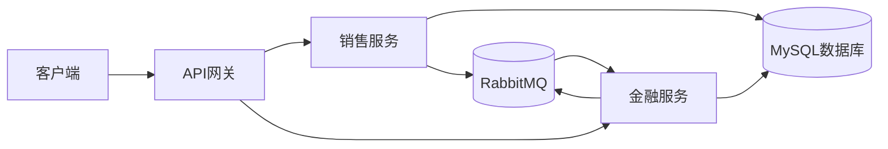

**图表来源**
- [ContractSignServiceImpl.java:49-53](file://sales/src/main/java/com/dafuweng/sales/service/impl/ContractSignServiceImpl.java#L49-L53)

**章节来源**
- [ContractSignServiceImpl.java:1-56](file://sales/src/main/java/com/dafuweng/sales/service/impl/ContractSignServiceImpl.java#L1-L56)

## 性能考虑

### 数据库优化

- 合理使用索引：在常用查询字段上建立索引
- 分页查询：大数据量时使用分页避免全表扫描
- 连接池配置：优化数据库连接池参数
- 缓存策略：对热点数据进行缓存

### 消息队列优化

- 异步处理：通过消息队列实现异步处理
- 幂等性设计：确保消息重复消费的安全性
- 死信队列：处理异常消息的重试机制

### 缓存策略

- Redis缓存：缓存频繁访问的数据
- 多级缓存：本地缓存+分布式缓存
- 缓存失效：合理的缓存过期策略

## 故障排除指南

### 常见问题及解决方案

#### 合同状态异常

**问题**：合同状态无法正常流转
**解决方案**：
1. 检查状态转换规则
2. 验证业务逻辑完整性
3. 查看状态转换日志

#### 签名失败

**问题**：合同签署操作失败
**解决方案**：
1. 检查合同状态是否为草稿
2. 验证用户权限
3. 查看消息队列状态

#### 附件上传失败

**问题**：附件上传过程中出现错误
**解决方案**：
1. 检查文件大小限制
2. 验证文件类型
3. 查看存储空间

### 日志分析

系统提供详细的日志记录，包括：
- 请求日志：记录所有API请求
- 业务日志：记录关键业务操作
- 错误日志：记录异常和错误信息
- 性能日志：记录性能指标

**章节来源**
- [ContractSignServiceImpl.java:28-33](file://sales/src/main/java/com/dafuweng/sales/service/impl/ContractSignServiceImpl.java#L28-L33)

## 结论

合同生命周期管理系统通过模块化的设计和事件驱动的架构，实现了完整的合同管理功能。系统具有以下特点：

1. **完整的生命周期管理**：从创建到执行完成的全流程覆盖
2. **灵活的扩展性**：模块化设计便于功能扩展
3. **高可用性**：通过消息队列实现服务解耦
4. **完善的权限控制**：多层次的权限管理和审计功能
5. **强大的统计分析**：提供丰富的数据分析功能

该系统为企业提供了标准化的合同管理解决方案，能够有效提升合同管理效率和合规性水平。