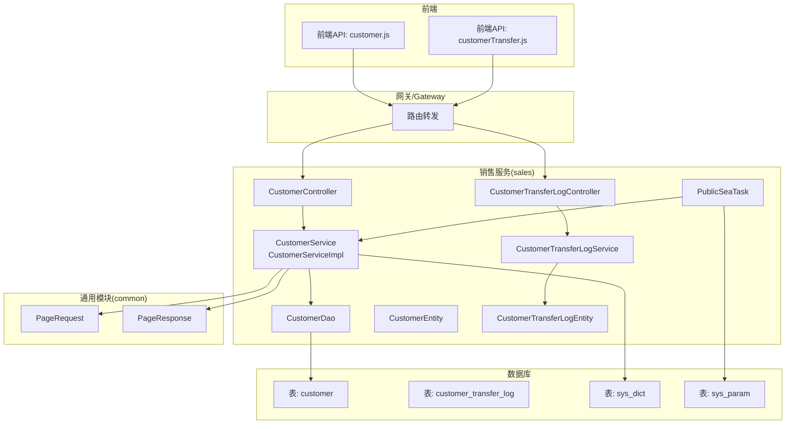
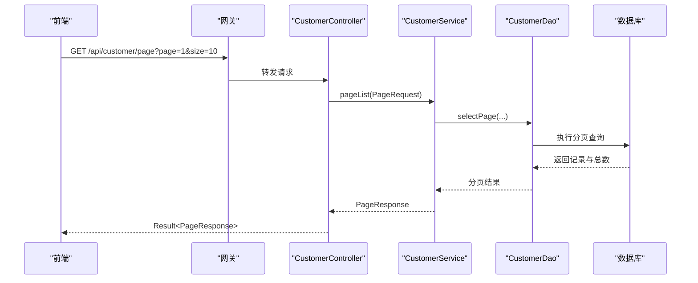
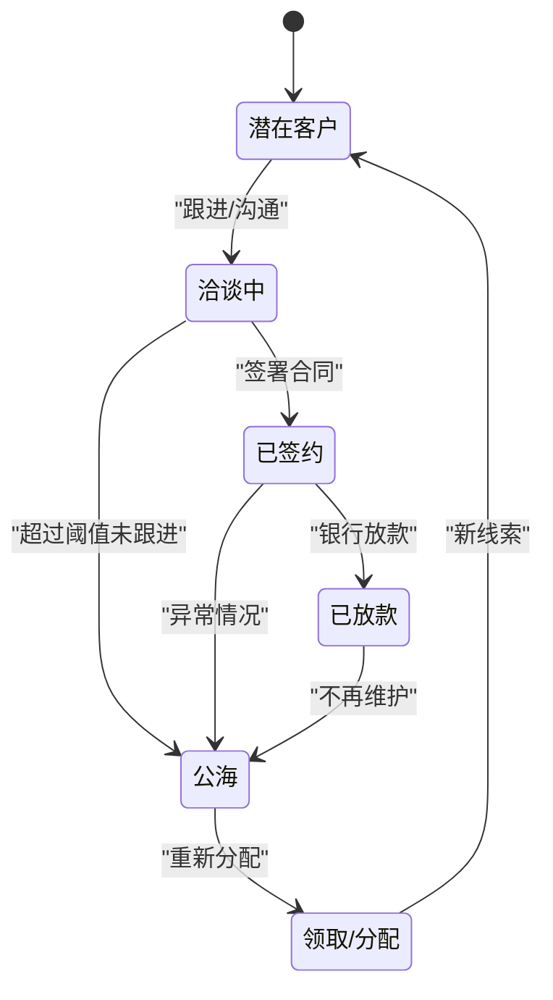
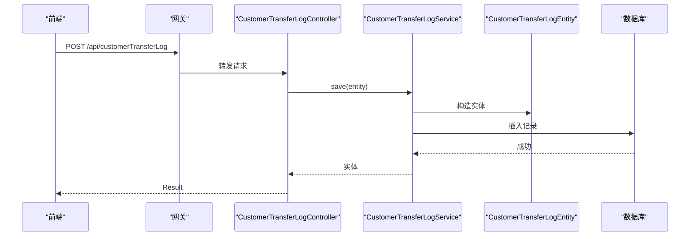
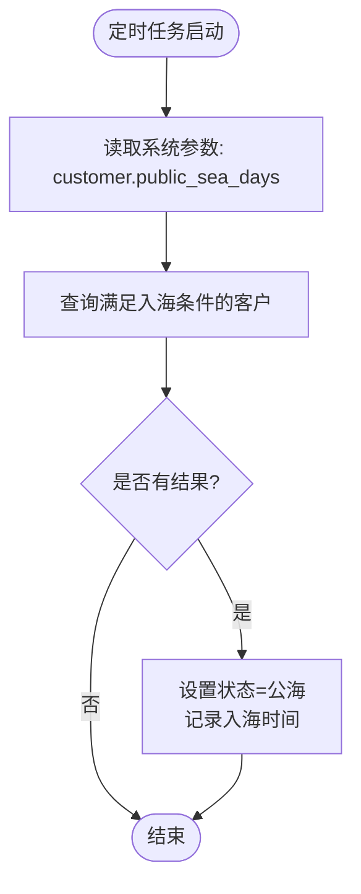
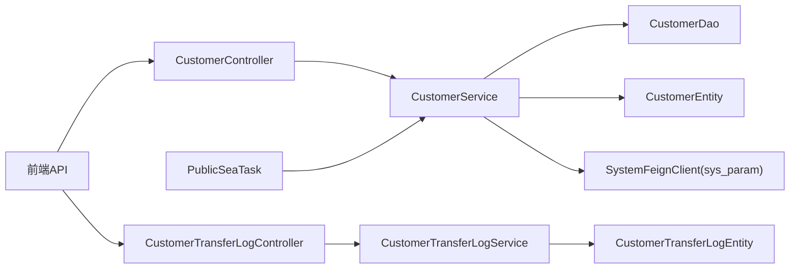

# 客户关系管理

<cite>
**本文引用的文件**
- [CustomerController.java](file://sales/src/main/java/com/dafuweng/sales/controller/CustomerController.java)
- [CustomerServiceImpl.java](file://sales/src/main/java/com/dafuweng/sales/service/impl/CustomerServiceImpl.java)
- [CustomerService.java](file://sales/src/main/java/com/dafuweng/sales/service/CustomerService.java)
- [CustomerDao.java](file://sales/src/main/java/com/dafuweng/sales/dao/CustomerDao.java)
- [CustomerEntity.java](file://sales/src/main/java/com/dafuweng/sales/entity/CustomerEntity.java)
- [CustomerTransferLogController.java](file://sales/src/main/java/com/dafuweng/sales/controller/CustomerTransferLogController.java)
- [CustomerTransferLogService.java](file://sales/src/main/java/com/dafuweng/sales/service/CustomerTransferLogService.java)
- [CustomerTransferLogEntity.java](file://sales/src/main/java/com/dafuweng/sales/entity/CustomerTransferLogEntity.java)
- [PublicSeaTask.java](file://sales/src/main/java/com/dafuweng/sales/task/PublicSeaTask.java)
- [PageRequest.java](file://common/src/main/java/com/dafuweng/common/entity/PageRequest.java)
- [PageResponse.java](file://common/src/main/java/com/dafuweng/common/entity/PageResponse.java)
- [customer.js](file://ruoyi-ui/src/api/sales/customer.js)
- [customerTransfer.js](file://ruoyi-ui/src/api/sales/customerTransfer.js)
- [database.sql](file://database.sql)
</cite>

## 目录
1. [简介](#简介)
2. [项目结构](#项目结构)
3. [核心组件](#核心组件)
4. [架构总览](#架构总览)
5. [详细组件分析](#详细组件分析)
6. [依赖分析](#依赖分析)
7. [性能考虑](#性能考虑)
8. [故障排查指南](#故障排查指南)
9. [结论](#结论)
10. [附录](#附录)

## 简介
本文件为“客户关系管理”功能的完整API与数据模型文档，覆盖客户信息维护、联系信息维护、客户分类标签与等级体系、客户查询接口、客户状态管理机制、客户转移功能、导入导出与批量操作、以及数据权限控制机制。文档基于实际代码与数据库脚本进行梳理，确保接口定义、字段含义、业务规则与实现一致。

## 项目结构
- 后端采用多模块架构，客户相关能力集中在 sales 模块，通用分页与结果封装在 common 模块，前端通过 ruoyi-ui 提供调用。
- 客户主数据与转移记录分别对应数据库中的 customer 与 customer_transfer_log 表，状态与等级通过 sys_dict 字典表配置。

图表来源
- [CustomerController.java:1-56](file://sales/src/main/java/com/dafuweng/sales/controller/CustomerController.java#L1-L56)
- [CustomerServiceImpl.java:1-81](file://sales/src/main/java/com/dafuweng/sales/service/impl/CustomerServiceImpl.java#L1-L81)
- [CustomerDao.java:1-19](file://sales/src/main/java/com/dafuweng/sales/dao/CustomerDao.java#L1-L19)
- [CustomerEntity.java:1-77](file://sales/src/main/java/com/dafuweng/sales/entity/CustomerEntity.java#L1-L77)
- [CustomerTransferLogController.java:1-51](file://sales/src/main/java/com/dafuweng/sales/controller/CustomerTransferLogController.java#L1-L51)
- [CustomerTransferLogService.java:1-33](file://sales/src/main/java/com/dafuweng/sales/service/CustomerTransferLogService.java#L1-L33)
- [CustomerTransferLogEntity.java:1-37](file://sales/src/main/java/com/dafuweng/sales/entity/CustomerTransferLogEntity.java#L1-L37)
- [PublicSeaTask.java:1-50](file://sales/src/main/java/com/dafuweng/sales/task/PublicSeaTask.java#L1-L50)
- [PageRequest.java:1-22](file://common/src/main/java/com/dafuweng/common/entity/PageRequest.java#L1-L22)
- [PageResponse.java:1-22](file://common/src/main/java/com/dafuweng/common/entity/PageResponse.java#L1-L22)
- [database.sql:281-320](file://database.sql#L281-L320)
- [database.sql:452-467](file://database.sql#L452-L467)
- [database.sql:238-272](file://database.sql#L238-L272)
- [database.sql:190-197](file://database.sql#L190-L197)

章节来源
- [CustomerController.java:1-56](file://sales/src/main/java/com/dafuweng/sales/controller/CustomerController.java#L1-L56)
- [CustomerServiceImpl.java:1-81](file://sales/src/main/java/com/dafuweng/sales/service/impl/CustomerServiceImpl.java#L1-L81)
- [CustomerDao.java:1-19](file://sales/src/main/java/com/dafuweng/sales/dao/CustomerDao.java#L1-L19)
- [CustomerEntity.java:1-77](file://sales/src/main/java/com/dafuweng/sales/entity/CustomerEntity.java#L1-L77)
- [CustomerTransferLogController.java:1-51](file://sales/src/main/java/com/dafuweng/sales/controller/CustomerTransferLogController.java#L1-L51)
- [CustomerTransferLogService.java:1-33](file://sales/src/main/java/com/dafuweng/sales/service/CustomerTransferLogService.java#L1-L33)
- [CustomerTransferLogEntity.java:1-37](file://sales/src/main/java/com/dafuweng/sales/entity/CustomerTransferLogEntity.java#L1-L37)
- [PublicSeaTask.java:1-50](file://sales/src/main/java/com/dafuweng/sales/task/PublicSeaTask.java#L1-L50)
- [PageRequest.java:1-22](file://common/src/main/java/com/dafuweng/common/entity/PageRequest.java#L1-L22)
- [PageResponse.java:1-22](file://common/src/main/java/com/dafuweng/common/entity/PageResponse.java#L1-L22)
- [database.sql:281-320](file://database.sql#L281-L320)
- [database.sql:452-467](file://database.sql#L452-L467)
- [database.sql:238-272](file://database.sql#L238-L272)
- [database.sql:190-197](file://database.sql#L190-L197)

## 核心组件
- 客户控制器：提供按ID查询、分页查询、按销售代表查询、按状态查询、新增、更新、删除等REST接口。
- 客户服务层：封装分页、查询、保存、更新、删除等业务逻辑；包含公海客户扫描能力。
- 客户DAO：提供按销售代表、按状态、公海扫描等SQL查询。
- 客户实体：映射 customer 表字段，含客户类型、意向等级、状态、公海相关字段、批注等。
- 客户转移控制器：提供转移记录的增删改查与按客户ID查询。
- 转移记录服务与实体：映射 customer_transfer_log 表，记录客户在不同销售之间的转移历史。
- 公海任务：定时扫描符合条件的客户，将其状态置为“公海”。

章节来源
- [CustomerController.java:1-56](file://sales/src/main/java/com/dafuweng/sales/controller/CustomerController.java#L1-L56)
- [CustomerServiceImpl.java:1-81](file://sales/src/main/java/com/dafuweng/sales/service/impl/CustomerServiceImpl.java#L1-L81)
- [CustomerDao.java:1-19](file://sales/src/main/java/com/dafuweng/sales/dao/CustomerDao.java#L1-L19)
- [CustomerEntity.java:1-77](file://sales/src/main/java/com/dafuweng/sales/entity/CustomerEntity.java#L1-L77)
- [CustomerTransferLogController.java:1-51](file://sales/src/main/java/com/dafuweng/sales/controller/CustomerTransferLogController.java#L1-L51)
- [CustomerTransferLogService.java:1-33](file://sales/src/main/java/com/dafuweng/sales/service/CustomerTransferLogService.java#L1-L33)
- [CustomerTransferLogEntity.java:1-37](file://sales/src/main/java/com/dafuweng/sales/entity/CustomerTransferLogEntity.java#L1-L37)
- [PublicSeaTask.java:1-50](file://sales/src/main/java/com/dafuweng/sales/task/PublicSeaTask.java#L1-L50)

## 架构总览
- 前端通过 customer.js 与 customerTransfer.js 调用后端接口。
- 接口经网关路由到 sales 模块的控制器。
- 控制器调用服务层，服务层使用DAO访问数据库。
- 公海客户扫描由定时任务触发，读取系统参数动态配置扫描阈值。

图表来源
- [customer.js:3-10](file://ruoyi-ui/src/api/sales/customer.js#L3-L10)
- [CustomerController.java:25-28](file://sales/src/main/java/com/dafuweng/sales/controller/CustomerController.java#L25-L28)
- [CustomerServiceImpl.java:30-45](file://sales/src/main/java/com/dafuweng/sales/service/impl/CustomerServiceImpl.java#L30-L45)
- [PageRequest.java:1-22](file://common/src/main/java/com/dafuweng/common/entity/PageRequest.java#L1-L22)
- [PageResponse.java:1-22](file://common/src/main/java/com/dafuweng/common/entity/PageResponse.java#L1-L22)

## 详细组件分析

### 客户信息维护与查询接口
- 按ID查询：GET /api/customer/{id}
- 分页查询：GET /api/customer/page（支持 page、size、sortField、sortOrder）
- 按销售代表查询：GET /api/customer/listBySalesRepId/{salesRepId}
- 按状态查询：GET /api/customer/listByStatus?status={status}
- 新增客户：POST /api/customer
- 更新客户：PUT /api/customer
- 删除客户：DELETE /api/customer/{id}

前端调用示例（路径）
- [customer.js:4-18](file://ruoyi-ui/src/api/sales/customer.js#L4-L18)
- [customer.js:20-35](file://ruoyi-ui/src/api/sales/customer.js#L20-L35)
- [customer.js:37-52](file://ruoyi-ui/src/api/sales/customer.js#L37-L52)

章节来源
- [CustomerController.java:20-54](file://sales/src/main/java/com/dafuweng/sales/controller/CustomerController.java#L20-L54)
- [customer.js:1-53](file://ruoyi-ui/src/api/sales/customer.js#L1-L53)
- [PageRequest.java:1-22](file://common/src/main/java/com/dafuweng/common/entity/PageRequest.java#L1-L22)
- [PageResponse.java:1-22](file://common/src/main/java/com/dafuweng/common/entity/PageResponse.java#L1-L22)

### 客户状态管理机制
- 状态枚举（来自字典表）：潜在客户、洽谈中、已签约、已放款、公海。
- 状态流转：
  - 正常跟进：潜在/洽谈中 → 已签约/已放款
  - 自动入公海：超过设定天数未跟进且非已签约/已放款/公海，则定时任务置为公海
- 关键字段：status、publicSeaTime、publicSeaReason、nextFollowUpDate、lastContactDate

图表来源
- [database.sql:242-246](file://database.sql#L242-L246)
- [PublicSeaTask.java:23-37](file://sales/src/main/java/com/dafuweng/sales/task/PublicSeaTask.java#L23-L37)
- [CustomerEntity.java:45-53](file://sales/src/main/java/com/dafuweng/sales/entity/CustomerEntity.java#L45-L53)

章节来源
- [database.sql:238-272](file://database.sql#L238-L272)
- [PublicSeaTask.java:1-50](file://sales/src/main/java/com/dafuweng/sales/task/PublicSeaTask.java#L1-L50)
- [CustomerEntity.java:1-77](file://sales/src/main/java/com/dafuweng/sales/entity/CustomerEntity.java#L1-L77)

### 客户分类标签与等级体系
- 客户类型：个人客户、企业客户（customer_type）
- 意向等级：A级(高)、B级(中)、C级(低)、D级(无)（intention_level）
- 客户来源：电话、面谈、转介绍等（source）

章节来源
- [database.sql:240-250](file://database.sql#L240-L250)
- [CustomerEntity.java:35-62](file://sales/src/main/java/com/dafuweng/sales/entity/CustomerEntity.java#L35-L62)

### 客户转移功能
- 接口：
  - 按ID查询：GET /api/customerTransferLog/{id}
  - 分页查询：GET /api/customerTransferLog/page
  - 按客户ID查询：GET /api/customerTransferLog/listByCustomerId/{customerId}
  - 新增：POST /api/customerTransferLog
  - 更新：PUT /api/customerTransferLog
  - 删除：DELETE /api/customerTransferLog/{id}
- 转移类型：部门经理转移、公海领取、上级指派等（operate_type）
- 记录字段：fromRepId、toRepId、operateType、reason、operatedBy、operatedAt

图表来源
- [customerTransfer.js:28-35](file://ruoyi-ui/src/api/sales/customerTransfer.js#L28-L35)
- [CustomerTransferLogController.java:35-38](file://sales/src/main/java/com/dafuweng/sales/controller/CustomerTransferLogController.java#L35-L38)
- [CustomerTransferLogService.java:25-26](file://sales/src/main/java/com/dafuweng/sales/service/CustomerTransferLogService.java#L25-L26)
- [CustomerTransferLogEntity.java:1-37](file://sales/src/main/java/com/dafuweng/sales/entity/CustomerTransferLogEntity.java#L1-L37)

章节来源
- [CustomerTransferLogController.java:1-51](file://sales/src/main/java/com/dafuweng/sales/controller/CustomerTransferLogController.java#L1-L51)
- [CustomerTransferLogService.java:1-33](file://sales/src/main/java/com/dafuweng/sales/service/CustomerTransferLogService.java#L1-L33)
- [CustomerTransferLogEntity.java:1-37](file://sales/src/main/java/com/dafuweng/sales/entity/CustomerTransferLogEntity.java#L1-L37)
- [customerTransfer.js:1-53](file://ruoyi-ui/src/api/sales/customerTransfer.js#L1-L53)

### 公海客户扫描与自动入海
- 触发时机：每天凌晨2点
- 规则：status 不等于 已签约/已放款/公海，且 next_follow_up_date < now，且 created_at < now - publicSeaDays
- 阈值来源：系统参数 customer.public_sea_days，默认30天

图表来源
- [PublicSeaTask.java:23-37](file://sales/src/main/java/com/dafuweng/sales/task/PublicSeaTask.java#L23-L37)
- [database.sql:190-197](file://database.sql#L190-L197)
- [CustomerServiceImpl.java:58-60](file://sales/src/main/java/com/dafuweng/sales/service/impl/CustomerServiceImpl.java#L58-L60)

章节来源
- [PublicSeaTask.java:1-50](file://sales/src/main/java/com/dafuweng/sales/task/PublicSeaTask.java#L1-L50)
- [database.sql:627-646](file://database.sql#L627-L646)

### 数据模型与业务规则
- 客户表（customer）关键字段与索引
  - 字段：id、name、phone、idCard、companyName、companyLegalPerson、companyRegCapital、customerType、salesRepId、deptId、zoneId、intentionLevel、status、lastContactDate、nextFollowUpDate、publicSeaTime、publicSeaReason、annotation、source、loanIntentionAmount、loanIntentionProduct、createdBy、createdAt、updatedBy、updatedAt、deleted、version
  - 约束：name+phone+deleted 联合唯一，避免重复录入
  - 索引：salesRepId、deptId、zoneId、status、intentionLevel、publicSeaTime、deleted、lastContactDate
- 转移记录表（customer_transfer_log）关键字段
  - 字段：id、customerId、fromRepId、toRepId、operateType、reason、operatedBy、operatedAt、deleted
  - 索引：customerId、fromRepId、toRepId、operatedAt
- 字典表（sys_dict）关键枚举
  - customer_type：个人客户、企业客户
  - customer_status：潜在客户、洽谈中、已签约、已放款、公海
  - intention_level：A/B/C/D级
  - contact_type：电话、面谈、转介绍
- 系统参数（sys_param）
  - customer.public_sea_days：公海阈值天数

章节来源
- [database.sql:281-320](file://database.sql#L281-L320)
- [database.sql:452-467](file://database.sql#L452-L467)
- [database.sql:238-272](file://database.sql#L238-L272)
- [database.sql:190-197](file://database.sql#L190-L197)

### 导入导出、批量操作与数据权限
- 导入导出
  - 仓库未提供专门的导入导出接口或实现，建议在前端页面或独立工具中扩展Excel导入/导出功能，结合现有分页查询与保存接口进行批量处理。
- 批量操作
  - 可通过分页查询获取ID列表，再调用批量保存/更新接口（如后续扩展）。
- 数据权限
  - 通用模块包含数据范围切片与上下文工具，可在服务层根据当前用户的数据范围过滤查询结果（例如仅返回本人、本部门、本战区或全部的数据）。

章节来源
- [common/src/main/java/com/dafuweng/common/config/DataScopeAspect.java](file://common/src/main/java/com/dafuweng/common/config/DataScopeAspect.java)
- [common/src/main/java/com/dafuweng/common/config/DataScopeContext.java](file://common/src/main/java/com/dafuweng/common/config/DataScopeContext.java)

## 依赖分析
- 控制器依赖服务层；服务层依赖DAO与实体；DAO映射数据库表。
- 定时任务依赖系统参数服务以获取公海阈值。
- 前端通过API封装调用后端控制器。

图表来源
- [CustomerController.java:1-56](file://sales/src/main/java/com/dafuweng/sales/controller/CustomerController.java#L1-L56)
- [CustomerTransferLogController.java:1-51](file://sales/src/main/java/com/dafuweng/sales/controller/CustomerTransferLogController.java#L1-L51)
- [CustomerServiceImpl.java:1-81](file://sales/src/main/java/com/dafuweng/sales/service/impl/CustomerServiceImpl.java#L1-L81)
- [CustomerTransferLogService.java:1-33](file://sales/src/main/java/com/dafuweng/sales/service/CustomerTransferLogService.java#L1-L33)
- [PublicSeaTask.java:1-50](file://sales/src/main/java/com/dafuweng/sales/task/PublicSeaTask.java#L1-L50)

章节来源
- [CustomerController.java:1-56](file://sales/src/main/java/com/dafuweng/sales/controller/CustomerController.java#L1-L56)
- [CustomerTransferLogController.java:1-51](file://sales/src/main/java/com/dafuweng/sales/controller/CustomerTransferLogController.java#L1-L51)
- [CustomerServiceImpl.java:1-81](file://sales/src/main/java/com/dafuweng/sales/service/impl/CustomerServiceImpl.java#L1-L81)
- [CustomerTransferLogService.java:1-33](file://sales/src/main/java/com/dafuweng/sales/service/CustomerTransferLogService.java#L1-L33)
- [PublicSeaTask.java:1-50](file://sales/src/main/java/com/dafuweng/sales/task/PublicSeaTask.java#L1-L50)

## 性能考虑
- 分页查询：使用 PageRequest 与 PageResponse，建议前端传入合理的 page/size，避免过大页大小导致内存压力。
- 索引优化：customer 表已建立多处索引，建议在高频查询字段（如 salesRepId、status、publicSeaTime）上保持合理使用。
- 定时任务：公海扫描为每日一次，建议监控任务执行耗时与数据库负载，必要时拆分批次或增加限流。

## 故障排查指南
- 公海扫描不生效
  - 检查系统参数 customer.public_sea_days 是否正确配置
  - 确认定时任务是否启用与执行日志
- 客户重复录入
  - 检查 name+phone+deleted 联合唯一约束是否被违反
- 查询结果为空
  - 检查分页参数与排序字段是否正确传递
  - 确认数据权限是否限制了可见范围

章节来源
- [PublicSeaTask.java:39-49](file://sales/src/main/java/com/dafuweng/sales/task/PublicSeaTask.java#L39-L49)
- [database.sql:310-311](file://database.sql#L310-L311)
- [PageRequest.java:1-22](file://common/src/main/java/com/dafuweng/common/entity/PageRequest.java#L1-L22)

## 结论
本方案提供了完善的客户信息维护、查询、状态管理与转移记录能力，并通过定时任务实现公海客户的自动化管理。结合字典与系统参数，系统具备良好的可配置性与扩展性。建议后续补充导入导出与批量操作接口，并完善数据权限的统一拦截与校验。

## 附录
- 前端调用路径参考
  - [customer.js:1-53](file://ruoyi-ui/src/api/sales/customer.js#L1-L53)
  - [customerTransfer.js:1-53](file://ruoyi-ui/src/api/sales/customerTransfer.js#L1-L53)