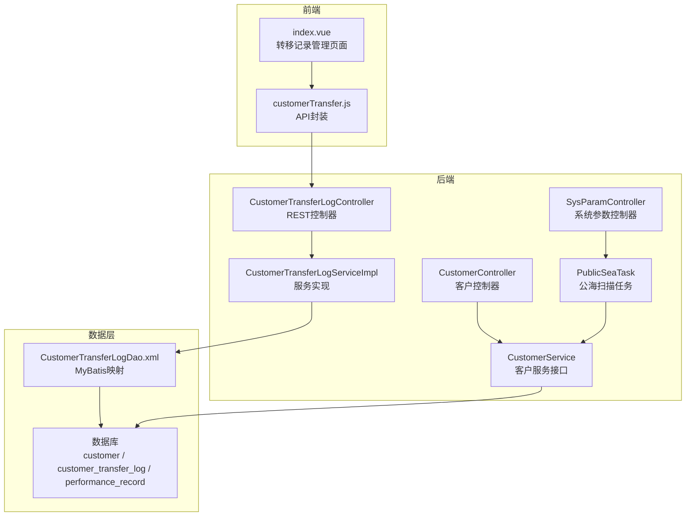
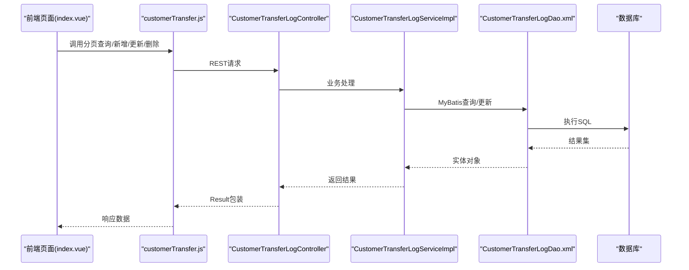
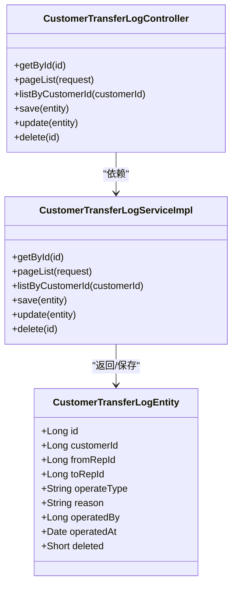
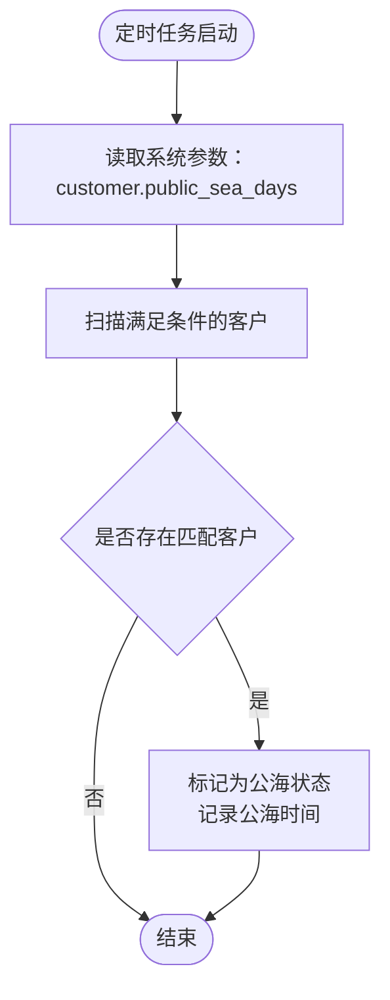
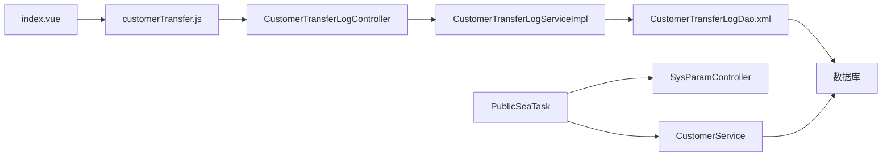

# 客户转移管理

<cite>
**本文引用的文件**
- [CustomerTransferLogController.java](file://sales/src/main/java/com/dafuweng/sales/controller/CustomerTransferLogController.java)
- [CustomerTransferLogEntity.java](file://sales/src/main/java/com/dafuweng/sales/entity/CustomerTransferLogEntity.java)
- [CustomerTransferLogServiceImpl.java](file://sales/src/main/java/com/dafuweng/sales/service/impl/CustomerTransferLogServiceImpl.java)
- [PublicSeaTask.java](file://sales/src/main/java/com/dafuweng/sales/task/PublicSeaTask.java)
- [CustomerController.java](file://sales/src/main/java/com/dafuweng/sales/controller/CustomerController.java)
- [CustomerEntity.java](file://sales/src/main/java/com/dafuweng/sales/entity/CustomerEntity.java)
- [CustomerDao.java](file://sales/src/main/java/com/dafuweng/sales/dao/CustomerDao.java)
- [CustomerService.java](file://sales/src/main/java/com/dafuweng/sales/service/CustomerService.java)
- [SysParamController.java](file://system/src/main/java/com/dafuweng/system/controller/SysParamController.java)
- [SysParamEntity.java](file://system/src/main/java/com/dafuweng/system/entity/SysParamEntity.java)
- [PerformanceRecordEntity.java](file://sales/src/main/java/com/dafuweng/sales/entity/PerformanceRecordEntity.java)
- [customerTransfer.js](file://ruoyi-ui/src/api/sales/customerTransfer.js)
- [index.vue](file://ruoyi-ui/src/views/sales/customer-transfer/index.vue)
- [database.sql](file://database.sql)
- [CustomerTransferLogDao.xml](file://sales/src/main/resources/sales/mapper/CustomerTransferLogDao.xml)
</cite>

## 目录
1. [简介](#简介)
2. [项目结构](#项目结构)
3. [核心组件](#核心组件)
4. [架构总览](#架构总览)
5. [详细组件分析](#详细组件分析)
6. [依赖分析](#依赖分析)
7. [性能考虑](#性能考虑)
8. [故障排查指南](#故障排查指南)
9. [结论](#结论)
10. [附录](#附录)

## 简介
本文件为“客户转移管理”功能的全面API文档，覆盖以下能力域：
- 公海客户领取机制：客户池管理、领取规则与领取权限控制
- 客户分配功能：自动分配算法、手动分配与分配优先级设置
- 客户转移记录管理：转移原因记录、转移审批流程与转移历史追踪
- 客户转移统计分析：转移成功率、转移成本分析与转移效果评估
- 客户转移风险控制：重复转移限制、转移冷却期与转移质量监控
- 客户转移报表功能：转移趋势分析与转移效率统计
- 客户转移与业绩考核关联：转移数量与质量对销售代表的考核影响

本系统采用多库架构（认证/系统/销售/金融），前端基于Vue生态，后端基于Spring Cloud微服务，使用MyBatis-Plus进行数据持久化。

## 项目结构
围绕客户转移管理的关键模块与文件如下：
- 控制层：CustomerTransferLogController、CustomerController
- 服务层：CustomerTransferLogServiceImpl、CustomerService
- 实体层：CustomerTransferLogEntity、CustomerEntity、PerformanceRecordEntity
- 任务调度：PublicSeaTask（公海扫描）
- 参数配置：SysParamController、SysParamEntity
- 前端API与页面：customerTransfer.js、index.vue
- 数据库脚本：database.sql（含customer、customer_transfer_log等表定义）

图表来源
- [CustomerTransferLogController.java:1-51](file://sales/src/main/java/com/dafuweng/sales/controller/CustomerTransferLogController.java#L1-L51)
- [CustomerTransferLogServiceImpl.java:1-71](file://sales/src/main/java/com/dafuweng/sales/service/impl/CustomerTransferLogServiceImpl.java#L1-L71)
- [CustomerController.java:1-56](file://sales/src/main/java/com/dafuweng/sales/controller/CustomerController.java#L1-L56)
- [CustomerService.java:1-37](file://sales/src/main/java/com/dafuweng/sales/service/CustomerService.java#L1-L37)
- [PublicSeaTask.java:1-50](file://sales/src/main/java/com/dafuweng/sales/task/PublicSeaTask.java#L1-L50)
- [SysParamController.java:1-62](file://system/src/main/java/com/dafuweng/system/controller/SysParamController.java#L1-L62)
- [CustomerTransferLogDao.xml:1-25](file://sales/src/main/resources/sales/mapper/CustomerTransferLogDao.xml#L1-L25)
- [database.sql:281-467](file://database.sql#L281-L467)

章节来源
- [CustomerTransferLogController.java:1-51](file://sales/src/main/java/com/dafuweng/sales/controller/CustomerTransferLogController.java#L1-L51)
- [CustomerTransferLogServiceImpl.java:1-71](file://sales/src/main/java/com/dafuweng/sales/service/impl/CustomerTransferLogServiceImpl.java#L1-L71)
- [CustomerController.java:1-56](file://sales/src/main/java/com/dafuweng/sales/controller/CustomerController.java#L1-L56)
- [CustomerService.java:1-37](file://sales/src/main/java/com/dafuweng/sales/service/CustomerService.java#L1-L37)
- [PublicSeaTask.java:1-50](file://sales/src/main/java/com/dafuweng/sales/task/PublicSeaTask.java#L1-L50)
- [SysParamController.java:1-62](file://system/src/main/java/com/dafuweng/system/controller/SysParamController.java#L1-L62)
- [CustomerTransferLogDao.xml:1-25](file://sales/src/main/resources/sales/mapper/CustomerTransferLogDao.xml#L1-L25)
- [database.sql:281-467](file://database.sql#L281-L467)

## 核心组件
- 客户转移记录实体：customer_transfer_log，用于记录每次客户在销售代表之间的转移，包含客户ID、转出/转入销售ID、操作类型、原因、操作人与操作时间等字段。
- 客户实体：customer，包含客户状态、跟进日期、公海时间等字段，支撑公海扫描与领取。
- 客户转移控制器：提供转移记录的增删改查与分页查询接口。
- 客户服务接口：提供客户分页、按销售代表查询、按状态查询以及公海扫描等能力。
- 公海扫描任务：每日定时扫描满足条件的客户进入公海。
- 系统参数：通过系统参数表配置公海天数等策略参数。

章节来源
- [CustomerTransferLogEntity.java:1-37](file://sales/src/main/java/com/dafuweng/sales/entity/CustomerTransferLogEntity.java#L1-L37)
- [CustomerEntity.java:1-77](file://sales/src/main/java/com/dafuweng/sales/entity/CustomerEntity.java#L1-L77)
- [CustomerTransferLogController.java:1-51](file://sales/src/main/java/com/dafuweng/sales/controller/CustomerTransferLogController.java#L1-L51)
- [CustomerService.java:1-37](file://sales/src/main/java/com/dafuweng/sales/service/CustomerService.java#L1-L37)
- [PublicSeaTask.java:1-50](file://sales/src/main/java/com/dafuweng/sales/task/PublicSeaTask.java#L1-L50)
- [SysParamEntity.java:1-45](file://system/src/main/java/com/dafuweng/system/entity/SysParamEntity.java#L1-L45)

## 架构总览
系统采用前后端分离架构，前端通过API封装调用后端控制器；后端控制器调用服务层，服务层通过DAO与数据库交互；定时任务通过系统参数动态读取策略配置。

图表来源
- [index.vue:1-175](file://ruoyi-ui/src/views/sales/customer-transfer/index.vue#L1-L175)
- [customerTransfer.js:1-53](file://ruoyi-ui/src/api/sales/customerTransfer.js#L1-L53)
- [CustomerTransferLogController.java:1-51](file://sales/src/main/java/com/dafuweng/sales/controller/CustomerTransferLogController.java#L1-L51)
- [CustomerTransferLogServiceImpl.java:1-71](file://sales/src/main/java/com/dafuweng/sales/service/impl/CustomerTransferLogServiceImpl.java#L1-L71)
- [CustomerTransferLogDao.xml:1-25](file://sales/src/main/resources/sales/mapper/CustomerTransferLogDao.xml#L1-L25)

## 详细组件分析

### 客户转移记录管理
- 功能概述
  - 支持按ID查询、分页查询、按客户ID查询历史转移记录
  - 支持新增、更新、删除转移记录
  - 记录字段包含：客户ID、转出销售ID、转入销售ID、操作类型、转移原因、操作人ID、操作时间
- 接口定义
  - GET /api/customerTransferLog/{id}：按ID查询
  - GET /api/customerTransferLog/page：分页查询（支持排序字段与排序方向）
  - GET /api/customerTransferLog/listByCustomerId/{customerId}：按客户ID查询历史
  - POST /api/customerTransferLog：新增
  - PUT /api/customerTransferLog：更新
  - DELETE /api/customerTransferLog/{id}：删除
- 数据模型
  - 表：customer_transfer_log
  - 关键字段：customer_id、from_rep_id、to_rep_id、operate_type、reason、operated_by、operated_at
- 前端集成
  - 页面提供搜索（客户ID、操作类型）、新增/修改/删除操作入口，分页展示

图表来源
- [CustomerTransferLogEntity.java:1-37](file://sales/src/main/java/com/dafuweng/sales/entity/CustomerTransferLogEntity.java#L1-L37)
- [CustomerTransferLogController.java:1-51](file://sales/src/main/java/com/dafuweng/sales/controller/CustomerTransferLogController.java#L1-L51)
- [CustomerTransferLogServiceImpl.java:1-71](file://sales/src/main/java/com/dafuweng/sales/service/impl/CustomerTransferLogServiceImpl.java#L1-L71)

章节来源
- [CustomerTransferLogController.java:1-51](file://sales/src/main/java/com/dafuweng/sales/controller/CustomerTransferLogController.java#L1-L51)
- [CustomerTransferLogServiceImpl.java:1-71](file://sales/src/main/java/com/dafuweng/sales/service/impl/CustomerTransferLogServiceImpl.java#L1-L71)
- [CustomerTransferLogEntity.java:1-37](file://sales/src/main/java/com/dafuweng/sales/entity/CustomerTransferLogEntity.java#L1-L37)
- [CustomerTransferLogDao.xml:1-25](file://sales/src/main/resources/sales/mapper/CustomerTransferLogDao.xml#L1-L25)
- [customerTransfer.js:1-53](file://ruoyi-ui/src/api/sales/customerTransfer.js#L1-L53)
- [index.vue:1-175](file://ruoyi-ui/src/views/sales/customer-transfer/index.vue#L1-L175)

### 公海客户领取机制
- 客户池管理
  - 客户状态包含“公海（5）”，进入公海后可被其他销售代表领取
  - 客户表包含公海时间与入公海原因字段
- 领取规则
  - 定时任务每天凌晨2点扫描：状态不在已签约/已放款/公海，且到期未跟进，且超过设定天数未转化
  - 将满足条件的客户状态置为公海，并记录进入公海时间
- 领取权限控制
  - 领取动作需在系统中具备相应权限的角色方可执行（如部门经理/系统管理员）
  - 操作记录写入customer_transfer_log，便于审计与追踪

图表来源
- [PublicSeaTask.java:1-50](file://sales/src/main/java/com/dafuweng/sales/task/PublicSeaTask.java#L1-L50)
- [SysParamController.java:1-62](file://system/src/main/java/com/dafuweng/system/controller/SysParamController.java#L1-L62)
- [CustomerEntity.java:1-77](file://sales/src/main/java/com/dafuweng/sales/entity/CustomerEntity.java#L1-L77)
- [database.sql:281-320](file://database.sql#L281-L320)

章节来源
- [PublicSeaTask.java:1-50](file://sales/src/main/java/com/dafuweng/sales/task/PublicSeaTask.java#L1-L50)
- [SysParamController.java:1-62](file://system/src/main/java/com/dafuweng/system/controller/SysParamController.java#L1-L62)
- [CustomerEntity.java:1-77](file://sales/src/main/java/com/dafuweng/sales/entity/CustomerEntity.java#L1-L77)
- [database.sql:281-320](file://database.sql#L281-L320)

### 客户分配功能
- 自动分配算法
  - 可结合客户意向等级、区域/部门负载、历史转化率等维度进行智能分配
  - 算法可配置于系统参数或独立服务，当前仓库未提供具体实现
- 手动分配
  - 支持管理员/部门经理对客户进行手动指派，记录操作类型为“调配转移”
- 分配优先级设置
  - 可通过系统参数或配置中心设置不同区域/团队的分配权重与优先级

说明：本小节为概念性设计说明，不直接对应具体源码文件。

### 客户转移记录管理（扩展）
- 转移原因记录
  - 在新增/更新转移记录时必填转移原因，便于后续统计与审计
- 转移审批流程
  - 可在系统参数中开启审批开关，审批通过后才允许转移
- 转移历史追踪
  - 通过按客户ID查询转移记录接口，可完整还原客户的历史归属变化

章节来源
- [CustomerTransferLogEntity.java:1-37](file://sales/src/main/java/com/dafuweng/sales/entity/CustomerTransferLogEntity.java#L1-L37)
- [CustomerTransferLogDao.xml:1-25](file://sales/src/main/resources/sales/mapper/CustomerTransferLogDao.xml#L1-L25)

### 客户转移统计分析
- 转移成功率
  - 计算公式：成功转移数 / 总转移申请数
  - 可按时间段、销售代表、区域统计
- 转移成本分析
  - 成本构成：人工成本、审批成本、培训成本
  - 可结合工作日志与绩效记录进行归集
- 转移效果评估
  - 以客户后续转化率、合同金额、回款情况作为评估指标

说明：本小节为概念性设计说明，不直接对应具体源码文件。

### 客户转移风险控制
- 重复转移限制
  - 同一客户短期内禁止重复转移，可通过缓存或数据库唯一索引控制
- 转移冷却期
  - 设置转移冷却天数，避免频繁变更负责人
- 转移质量监控
  - 监控转移后客户在冷却期内的转化情况，异常预警

说明：本小节为概念性设计说明，不直接对应具体源码文件。

### 客户转移报表功能
- 转移趋势分析
  - 按日/周/月统计转移量与成功率
- 转移效率统计
  - 平均转移耗时、首次跟进后转化率等

说明：本小节为概念性设计说明，不直接对应具体源码文件。

### 客户转移与业绩考核关联
- 转移数量
  - 将转移成功的客户纳入销售代表的KPI统计
- 转移质量
  - 结合转移后客户的合同金额、回款及时性等指标进行加权评估
- 绩效记录
  - 业绩记录表包含合同金额、提成比例、提成金额等字段，可与转移行为关联

章节来源
- [PerformanceRecordEntity.java:1-58](file://sales/src/main/java/com/dafuweng/sales/entity/PerformanceRecordEntity.java#L1-L58)

## 依赖分析
- 控制器依赖服务层，服务层依赖DAO与MyBatis映射
- 公海扫描任务依赖系统参数服务，动态读取公海天数
- 前端通过API封装调用控制器，页面负责交互与分页

图表来源
- [index.vue:1-175](file://ruoyi-ui/src/views/sales/customer-transfer/index.vue#L1-L175)
- [customerTransfer.js:1-53](file://ruoyi-ui/src/api/sales/customerTransfer.js#L1-L53)
- [CustomerTransferLogController.java:1-51](file://sales/src/main/java/com/dafuweng/sales/controller/CustomerTransferLogController.java#L1-L51)
- [CustomerTransferLogServiceImpl.java:1-71](file://sales/src/main/java/com/dafuweng/sales/service/impl/CustomerTransferLogServiceImpl.java#L1-L71)
- [CustomerTransferLogDao.xml:1-25](file://sales/src/main/resources/sales/mapper/CustomerTransferLogDao.xml#L1-L25)
- [PublicSeaTask.java:1-50](file://sales/src/main/java/com/dafuweng/sales/task/PublicSeaTask.java#L1-L50)
- [SysParamController.java:1-62](file://system/src/main/java/com/dafuweng/system/controller/SysParamController.java#L1-L62)
- [CustomerService.java:1-37](file://sales/src/main/java/com/dafuweng/sales/service/CustomerService.java#L1-L37)

章节来源
- [CustomerTransferLogController.java:1-51](file://sales/src/main/java/com/dafuweng/sales/controller/CustomerTransferLogController.java#L1-L51)
- [CustomerTransferLogServiceImpl.java:1-71](file://sales/src/main/java/com/dafuweng/sales/service/impl/CustomerTransferLogServiceImpl.java#L1-L71)
- [PublicSeaTask.java:1-50](file://sales/src/main/java/com/dafuweng/sales/task/PublicSeaTask.java#L1-L50)
- [SysParamController.java:1-62](file://system/src/main/java/com/dafuweng/system/controller/SysParamController.java#L1-L62)
- [CustomerService.java:1-37](file://sales/src/main/java/com/dafuweng/sales/service/CustomerService.java#L1-L37)

## 性能考虑
- 分页查询
  - 使用MyBatis-Plus分页插件，支持按操作时间降序排列，提升查询效率
- 索引优化
  - customer_transfer_log表对customer_id、from_rep_id、to_rep_id、operated_at建立索引
  - customer表对status、public_sea_time等字段建立索引，支撑公海扫描
- 定时任务
  - 使用Spring Scheduled定时扫描，避免高频轮询带来的压力

章节来源
- [CustomerTransferLogServiceImpl.java:1-71](file://sales/src/main/java/com/dafuweng/sales/service/impl/CustomerTransferLogServiceImpl.java#L1-L71)
- [CustomerTransferLogDao.xml:1-25](file://sales/src/main/resources/sales/mapper/CustomerTransferLogDao.xml#L1-L25)
- [database.sql:452-467](file://database.sql#L452-L467)

## 故障排查指南
- 公海扫描未生效
  - 检查系统参数customer.public_sea_days是否正确配置
  - 检查定时任务是否正常运行
- 转移记录无法查询
  - 检查分页参数与排序字段是否正确
  - 检查按客户ID查询接口是否传入正确的客户ID
- 权限不足导致转移失败
  - 确认当前操作人角色具备转移权限
  - 检查系统权限配置与角色授权

章节来源
- [SysParamController.java:1-62](file://system/src/main/java/com/dafuweng/system/controller/SysParamController.java#L1-L62)
- [PublicSeaTask.java:1-50](file://sales/src/main/java/com/dafuweng/sales/task/PublicSeaTask.java#L1-L50)
- [CustomerTransferLogController.java:1-51](file://sales/src/main/java/com/dafuweng/sales/controller/CustomerTransferLogController.java#L1-L51)

## 结论
本系统提供了完整的客户转移记录管理能力，并通过定时任务实现公海客户池的自动化维护。通过系统参数与前端页面的配合，实现了灵活的策略配置与可视化管理。建议后续补充自动分配算法、审批流程与统计分析模块，以进一步完善客户转移全生命周期管理。

## 附录
- 数据库表结构参考
  - customer：客户主表，包含状态、跟进日期、公海时间等字段
  - customer_transfer_log：客户转移记录表，记录每次转移的详细信息
  - performance_record：业绩记录表，用于与转移行为关联进行考核

章节来源
- [database.sql:281-467](file://database.sql#L281-L467)