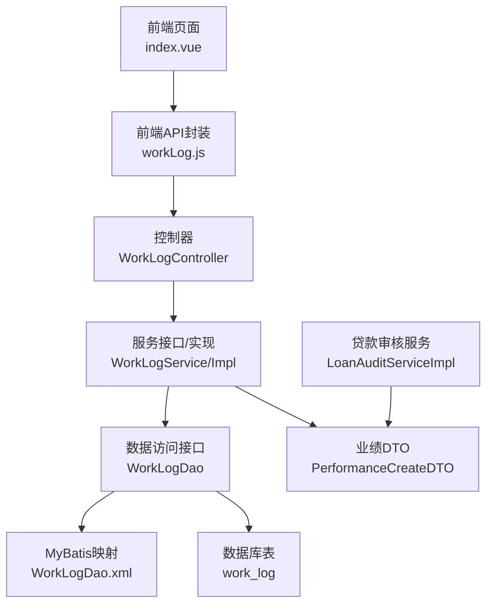
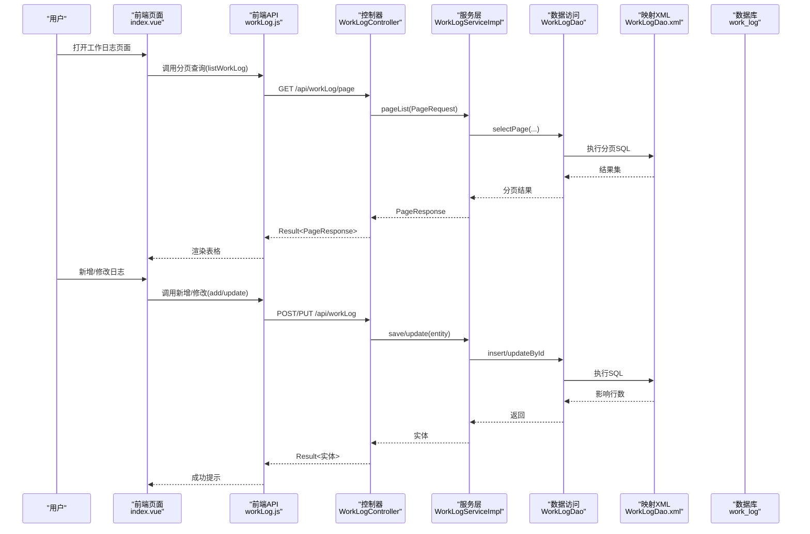
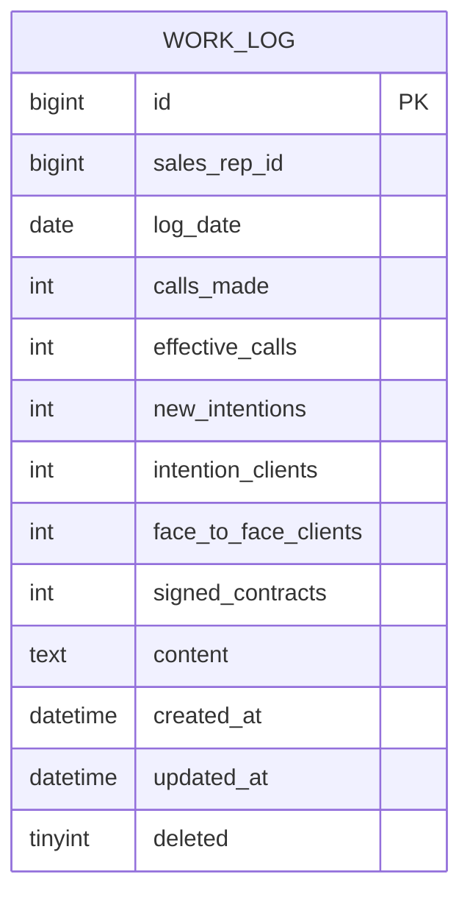
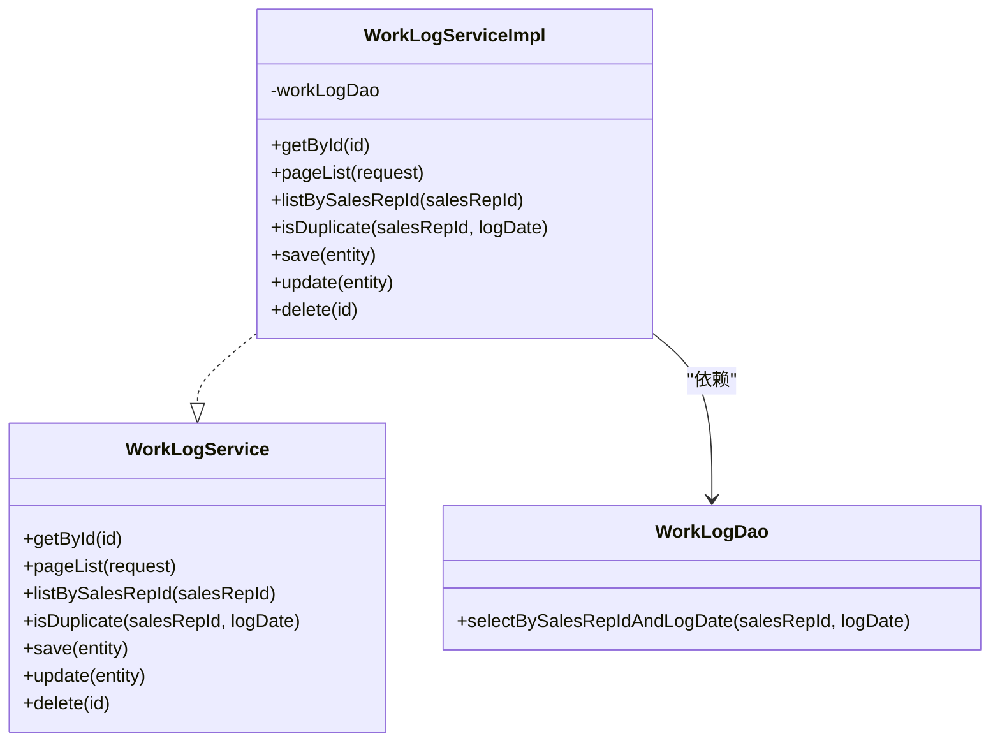
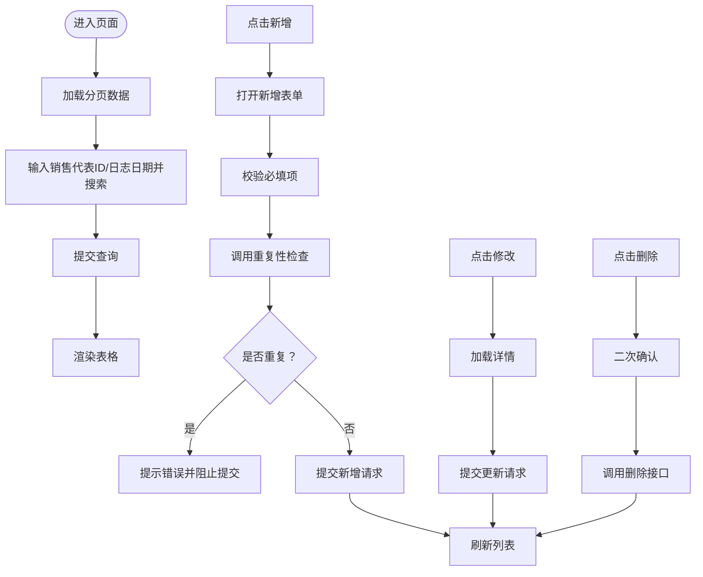
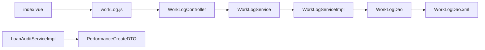

# 工作日志管理

<cite>
**本文引用的文件**
- [WorkLogController.java](file://sales/src/main/java/com/dafuweng/sales/controller/WorkLogController.java)
- [WorkLogService.java](file://sales/src/main/java/com/dafuweng/sales/service/WorkLogService.java)
- [WorkLogServiceImpl.java](file://sales/src/main/java/com/dafuweng/sales/service/impl/WorkLogServiceImpl.java)
- [WorkLogDao.java](file://sales/src/main/java/com/dafuweng/sales/dao/WorkLogDao.java)
- [WorkLogDao.xml](file://sales/src/main/resources/sales/mapper/WorkLogDao.xml)
- [WorkLogEntity.java](file://sales/src/main/java/com/dafuweng/sales/entity/WorkLogEntity.java)
- [workLog.js](file://ruoyi-ui/src/api/sales/workLog.js)
- [index.vue](file://ruoyi-ui/src/views/sales/work-log/index.vue)
- [PageRequest.java](file://common/src/main/java/com/dafuweng/common/entity/PageRequest.java)
- [PageResponse.java](file://common/src/main/java/com/dafuweng/common/entity/PageResponse.java)
- [database.sql](file://database.sql)
- [PerformanceCreateDTO.java](file://common/src/main/java/com/dafuweng/common/entity/dto/PerformanceCreateDTO.java)
- [LoanAuditServiceImpl.java](file://finance/src/main/java/com/dafuweng/finance/service/impl/LoanAuditServiceImpl.java)
</cite>

## 目录
1. [简介](#简介)
2. [项目结构](#项目结构)
3. [核心组件](#核心组件)
4. [架构总览](#架构总览)
5. [详细组件分析](#详细组件分析)
6. [依赖关系分析](#依赖关系分析)
7. [性能考虑](#性能考虑)
8. [故障排查指南](#故障排查指南)
9. [结论](#结论)
10. [附录](#附录)

## 简介
本文件为“工作日志管理”功能的全面API文档，覆盖以下能力：
- 工作日志创建：支持按销售代表与日志日期唯一性校验、基础工作量指标录入与备注记录
- 工作日志查询：支持分页查询、按销售代表ID查询、按日期范围查询（前端具备搜索参数）、重复性检查
- 工作日志编辑与删除：支持更新与逻辑删除
- 统计分析：基于现有字段可进行工作量统计与效率评估（如有效通话率、转化率等）
- 模板管理与提醒机制：当前仓库未实现模板与提醒功能，建议在后续版本扩展
- 与业绩系统关联：当前未直接关联工作日志与业绩计算，但可通过业务流程在贷款审核完成后生成业绩记录

## 项目结构
工作日志功能涉及后端控制器、服务层、数据访问层与前端页面及API封装，整体采用分层架构。

图表来源
- [WorkLogController.java:13-55](file://sales/src/main/java/com/dafuweng/sales/controller/WorkLogController.java#L13-L55)
- [WorkLogService.java:17-35](file://sales/src/main/java/com/dafuweng/sales/service/WorkLogService.java#L17-L35)
- [WorkLogServiceImpl.java:18-78](file://sales/src/main/java/com/dafuweng/sales/service/impl/WorkLogServiceImpl.java#L18-L78)
- [WorkLogDao.java:8-12](file://sales/src/main/java/com/dafuweng/sales/dao/WorkLogDao.java#L8-L12)
- [WorkLogDao.xml:3-29](file://sales/src/main/resources/sales/mapper/WorkLogDao.xml#L3-L29)
- [WorkLogEntity.java:11-44](file://sales/src/main/java/com/dafuweng/sales/entity/WorkLogEntity.java#L11-L44)
- [workLog.js:1-61](file://ruoyi-ui/src/api/sales/workLog.js#L1-L61)
- [index.vue:1-210](file://ruoyi-ui/src/views/sales/work-log/index.vue#L1-L210)
- [database.sql:403-421](file://database.sql#L403-L421)
- [PerformanceCreateDTO.java:8-45](file://common/src/main/java/com/dafuweng/common/entity/dto/PerformanceCreateDTO.java#L8-L45)
- [LoanAuditServiceImpl.java:210-233](file://finance/src/main/java/com/dafuweng/finance/service/impl/LoanAuditServiceImpl.java#L210-L233)

章节来源
- [WorkLogController.java:13-55](file://sales/src/main/java/com/dafuweng/sales/controller/WorkLogController.java#L13-L55)
- [workLog.js:1-61](file://ruoyi-ui/src/api/sales/workLog.js#L1-L61)
- [index.vue:1-210](file://ruoyi-ui/src/views/sales/work-log/index.vue#L1-L210)
- [WorkLogService.java:17-35](file://sales/src/main/java/com/dafuweng/sales/service/WorkLogService.java#L17-L35)
- [WorkLogServiceImpl.java:18-78](file://sales/src/main/java/com/dafuweng/sales/service/impl/WorkLogServiceImpl.java#L18-L78)
- [WorkLogDao.java:8-12](file://sales/src/main/java/com/dafuweng/sales/dao/WorkLogDao.java#L8-L12)
- [WorkLogDao.xml:3-29](file://sales/src/main/resources/sales/mapper/WorkLogDao.xml#L3-L29)
- [WorkLogEntity.java:11-44](file://sales/src/main/java/com/dafuweng/sales/entity/WorkLogEntity.java#L11-L44)
- [database.sql:403-421](file://database.sql#L403-L421)

## 核心组件
- 控制器层：提供REST接口，处理请求与响应包装
- 服务层：定义业务方法，包含分页、按销售代表查询、去重检查、保存/更新/删除
- 数据访问层：MyBatis映射SQL，提供按销售代表+日期的唯一性查询
- 实体模型：定义工作日志字段，含主键、销售代表ID、日志日期、各类工作量指标与备注
- 前端封装：统一API调用；页面提供搜索、表格展示、新增/修改/删除交互，并在新增前做重复性检查

章节来源
- [WorkLogController.java:13-55](file://sales/src/main/java/com/dafuweng/sales/controller/WorkLogController.java#L13-L55)
- [WorkLogService.java:17-35](file://sales/src/main/java/com/dafuweng/sales/service/WorkLogService.java#L17-L35)
- [WorkLogServiceImpl.java:18-78](file://sales/src/main/java/com/dafuweng/sales/service/impl/WorkLogServiceImpl.java#L18-L78)
- [WorkLogDao.java:8-12](file://sales/src/main/java/com/dafuweng/sales/dao/WorkLogDao.java#L8-L12)
- [WorkLogDao.xml:3-29](file://sales/src/main/resources/sales/mapper/WorkLogDao.xml#L3-L29)
- [WorkLogEntity.java:11-44](file://sales/src/main/java/com/dafuweng/sales/entity/WorkLogEntity.java#L11-L44)
- [workLog.js:1-61](file://ruoyi-ui/src/api/sales/workLog.js#L1-L61)
- [index.vue:1-210](file://ruoyi-ui/src/views/sales/work-log/index.vue#L1-L210)

## 架构总览
后端采用Spring MVC + MyBatis Plus分层架构，前端通过Axios封装HTTP请求，调用后端统一的REST接口。

图表来源
- [WorkLogController.java:20-54](file://sales/src/main/java/com/dafuweng/sales/controller/WorkLogController.java#L20-L54)
- [WorkLogServiceImpl.java:24-77](file://sales/src/main/java/com/dafuweng/sales/service/impl/WorkLogServiceImpl.java#L24-L77)
- [WorkLogDao.xml:3-29](file://sales/src/main/resources/sales/mapper/WorkLogDao.xml#L3-L29)
- [workLog.js:3-61](file://ruoyi-ui/src/api/sales/workLog.js#L3-L61)

## 详细组件分析

### 数据模型与表结构
工作日志实体包含关键指标字段，便于后续统计分析与效率评估。

图表来源
- [WorkLogEntity.java:11-44](file://sales/src/main/java/com/dafuweng/sales/entity/WorkLogEntity.java#L11-L44)
- [database.sql:403-421](file://database.sql#L403-L421)

章节来源
- [WorkLogEntity.java:11-44](file://sales/src/main/java/com/dafuweng/sales/entity/WorkLogEntity.java#L11-L44)
- [database.sql:403-421](file://database.sql#L403-L421)

### 控制器与API定义
- 获取详情：GET /api/workLog/{id}
- 分页查询：GET /api/workLog/page（支持排序字段与方向）
- 按销售代表查询：GET /api/workLog/listBySalesRepId/{salesRepId}
- 重复性检查：GET /api/workLog/checkDuplicate?salesRepId=&logDate=
- 新增：POST /api/workLog
- 更新：PUT /api/workLog
- 删除：DELETE /api/workLog/{id}

章节来源
- [WorkLogController.java:20-54](file://sales/src/main/java/com/dafuweng/sales/controller/WorkLogController.java#L20-L54)
- [workLog.js:3-61](file://ruoyi-ui/src/api/sales/workLog.js#L3-L61)

### 服务层与数据访问
- 分页查询：根据sortField与sortOrder动态排序，默认按创建时间降序
- 按销售代表查询：基于Lambda条件构造器
- 去重检查：按销售代表ID与日志日期查询，且deleted=0
- 事务性保存/更新/删除：使用@Transactional保证一致性

图表来源
- [WorkLogService.java:17-35](file://sales/src/main/java/com/dafuweng/sales/service/WorkLogService.java#L17-L35)
- [WorkLogServiceImpl.java:18-78](file://sales/src/main/java/com/dafuweng/sales/service/impl/WorkLogServiceImpl.java#L18-L78)
- [WorkLogDao.java:8-12](file://sales/src/main/java/com/dafuweng/sales/dao/WorkLogDao.java#L8-L12)

章节来源
- [WorkLogService.java:17-35](file://sales/src/main/java/com/dafuweng/sales/service/WorkLogService.java#L17-L35)
- [WorkLogServiceImpl.java:18-78](file://sales/src/main/java/com/dafuweng/sales/service/impl/WorkLogServiceImpl.java#L18-L78)
- [WorkLogDao.java:8-12](file://sales/src/main/java/com/dafuweng/sales/dao/WorkLogDao.java#L8-L12)
- [WorkLogDao.xml:21-27](file://sales/src/main/resources/sales/mapper/WorkLogDao.xml#L21-L27)

### 前端交互与流程
- 搜索：支持按销售代表ID与日志日期筛选
- 表格：展示关键指标字段，右侧提供修改与删除操作
- 新增：表单校验必填项，提交前调用重复性检查接口，避免同一天重复记录
- 修改：加载详情并提交更新
- 删除：二次确认后调用删除接口

图表来源
- [index.vue:134-206](file://ruoyi-ui/src/views/sales/work-log/index.vue#L134-L206)
- [workLog.js:3-61](file://ruoyi-ui/src/api/sales/workLog.js#L3-L61)

章节来源
- [index.vue:1-210](file://ruoyi-ui/src/views/sales/work-log/index.vue#L1-L210)
- [workLog.js:1-61](file://ruoyi-ui/src/api/sales/workLog.js#L1-L61)

### 权限控制与数据保护
- 当前控制器未集成鉴权与角色校验，建议在网关或控制器层增加基于角色的访问控制（RBAC），限制对非本人或越权数据的操作
- 数据保护：采用逻辑删除字段deleted，删除接口执行软删除，保留审计痕迹

章节来源
- [WorkLogController.java:13-55](file://sales/src/main/java/com/dafuweng/sales/controller/WorkLogController.java#L13-L55)
- [WorkLogEntity.java:42-43](file://sales/src/main/java/com/dafuweng/sales/entity/WorkLogEntity.java#L42-L43)
- [WorkLogDao.xml:21-27](file://sales/src/main/resources/sales/mapper/WorkLogDao.xml#L21-L27)

### 统计分析与效率评估
- 工作量统计：基于calls_made、effective_calls、new_intentions、intention_clients、face_to_face_clients、signed_contracts等字段
- 效率评估：可计算有效通话率、意向转化率、面谈转化率、签约转化率等指标
- 时间统计：当前实体未包含显式时长字段，可在后续扩展time_spent或start_time/end_time字段以支持时长统计

章节来源
- [WorkLogEntity.java:24-34](file://sales/src/main/java/com/dafuweng/sales/entity/WorkLogEntity.java#L24-L34)
- [database.sql:407-413](file://database.sql#L407-L413)

### 模板管理与快速录入
- 当前未实现工作内容模板与快速录入功能，建议在后续版本扩展模板库与快捷按钮，提升录入效率

### 提醒机制
- 当前未实现未记录提醒与超时提醒功能，建议引入定时任务或消息队列，在关键节点推送提醒

## 依赖关系分析
- 控制器依赖服务接口
- 服务实现依赖数据访问接口
- 数据访问接口通过XML映射SQL
- 前端通过API封装调用控制器
- 与业绩系统：贷款审核完成后可生成业绩记录，但工作日志与业绩计算未直接关联

图表来源
- [WorkLogController.java:13-55](file://sales/src/main/java/com/dafuweng/sales/controller/WorkLogController.java#L13-L55)
- [WorkLogService.java:17-35](file://sales/src/main/java/com/dafuweng/sales/service/WorkLogService.java#L17-L35)
- [WorkLogServiceImpl.java:18-78](file://sales/src/main/java/com/dafuweng/sales/service/impl/WorkLogServiceImpl.java#L18-L78)
- [WorkLogDao.java:8-12](file://sales/src/main/java/com/dafuweng/sales/dao/WorkLogDao.java#L8-L12)
- [WorkLogDao.xml:3-29](file://sales/src/main/resources/sales/mapper/WorkLogDao.xml#L3-L29)
- [index.vue:1-210](file://ruoyi-ui/src/views/sales/work-log/index.vue#L1-L210)
- [workLog.js:1-61](file://ruoyi-ui/src/api/sales/workLog.js#L1-L61)
- [LoanAuditServiceImpl.java:210-233](file://finance/src/main/java/com/dafuweng/finance/service/impl/LoanAuditServiceImpl.java#L210-L233)
- [PerformanceCreateDTO.java:8-45](file://common/src/main/java/com/dafuweng/common/entity/dto/PerformanceCreateDTO.java#L8-L45)

章节来源
- [WorkLogController.java:13-55](file://sales/src/main/java/com/dafuweng/sales/controller/WorkLogController.java#L13-L55)
- [WorkLogServiceImpl.java:18-78](file://sales/src/main/java/com/dafuweng/sales/service/impl/WorkLogServiceImpl.java#L18-L78)
- [WorkLogDao.xml:3-29](file://sales/src/main/resources/sales/mapper/WorkLogDao.xml#L3-L29)
- [index.vue:1-210](file://ruoyi-ui/src/views/sales/work-log/index.vue#L1-L210)
- [workLog.js:1-61](file://ruoyi-ui/src/api/sales/workLog.js#L1-L61)
- [LoanAuditServiceImpl.java:210-233](file://finance/src/main/java/com/dafuweng/finance/service/impl/LoanAuditServiceImpl.java#L210-L233)
- [PerformanceCreateDTO.java:8-45](file://common/src/main/java/com/dafuweng/common/entity/dto/PerformanceCreateDTO.java#L8-L45)

## 性能考虑
- 分页查询：使用MyBatis Plus Page与LambdaQueryWrapper，支持按字段排序；建议在高频查询字段上建立索引
- 唯一性约束：数据库层面已设置销售代表+日志日期唯一索引，避免重复插入
- 排序策略：默认按创建时间倒序，兼顾最新日志优先展示
- 建议优化点：在销售代表ID与日志日期字段上建立复合索引，提升查询与去重检查性能

章节来源
- [WorkLogServiceImpl.java:29-45](file://sales/src/main/java/com/dafuweng/sales/service/impl/WorkLogServiceImpl.java#L29-L45)
- [WorkLogDao.xml:21-27](file://sales/src/main/resources/sales/mapper/WorkLogDao.xml#L21-L27)
- [database.sql:418-421](file://database.sql#L418-L421)

## 故障排查指南
- 重复新增失败：前端在新增前会调用重复性检查接口，若返回重复则提示错误；请检查salesRepId与logDate参数是否正确
- 删除异常：删除接口执行软删除，若未生效，请检查deleted字段与查询条件
- 分页排序无效：确认PageRequest中的sortField与sortOrder参数是否传入，或默认按创建时间排序
- 数据库索引缺失：若查询缓慢，检查销售代表ID与日志日期索引是否存在

章节来源
- [index.vue:173-198](file://ruoyi-ui/src/views/sales/work-log/index.vue#L173-L198)
- [workLog.js:28-35](file://ruoyi-ui/src/api/sales/workLog.js#L28-L35)
- [WorkLogServiceImpl.java:29-45](file://sales/src/main/java/com/dafuweng/sales/service/impl/WorkLogServiceImpl.java#L29-L45)
- [WorkLogDao.xml:21-27](file://sales/src/main/resources/sales/mapper/WorkLogDao.xml#L21-L27)
- [database.sql:418-421](file://database.sql#L418-L421)

## 结论
工作日志管理功能已实现基础的增删改查与重复性校验，具备良好的扩展性。建议后续完善：
- 权限控制与数据保护
- 工作内容模板与快速录入
- 未记录与超时提醒机制
- 工作时长统计字段与效率评估指标
- 工作日志与业绩系统的直接关联

## 附录

### API一览表
- 获取详情：GET /api/workLog/{id}
- 分页查询：GET /api/workLog/page（支持排序）
- 按销售代表查询：GET /api/workLog/listBySalesRepId/{salesRepId}
- 重复性检查：GET /api/workLog/checkDuplicate?salesRepId=&logDate=
- 新增：POST /api/workLog
- 更新：PUT /api/workLog
- 删除：DELETE /api/workLog/{id}

章节来源
- [WorkLogController.java:20-54](file://sales/src/main/java/com/dafuweng/sales/controller/WorkLogController.java#L20-L54)
- [workLog.js:3-61](file://ruoyi-ui/src/api/sales/workLog.js#L3-L61)

### 数据模型字段说明
- 主键：id
- 销售代表ID：sales_rep_id
- 日志日期：log_date
- 拨打电话数：calls_made
- 有效通话：effective_calls
- 新增意向客户数：new_intentions
- 跟进意向客户数：intention_clients
- 面谈客户数：face_to_face_clients
- 签约合同数：signed_contracts
- 工作内容备注：content
- 创建/更新时间：created_at / updated_at
- 逻辑删除：deleted

章节来源
- [WorkLogEntity.java:17-43](file://sales/src/main/java/com/dafuweng/sales/entity/WorkLogEntity.java#L17-L43)
- [database.sql:403-421](file://database.sql#L403-L421)

### 与业绩系统的关联
- 贷款审核完成后可生成业绩记录，包含合同金额、提成比例与提成金额等字段
- 工作日志与业绩计算当前未直接关联，可在业务流程中补充关联逻辑

章节来源
- [PerformanceCreateDTO.java:13-44](file://common/src/main/java/com/dafuweng/common/entity/dto/PerformanceCreateDTO.java#L13-L44)
- [LoanAuditServiceImpl.java:210-233](file://finance/src/main/java/com/dafuweng/finance/service/impl/LoanAuditServiceImpl.java#L210-L233)