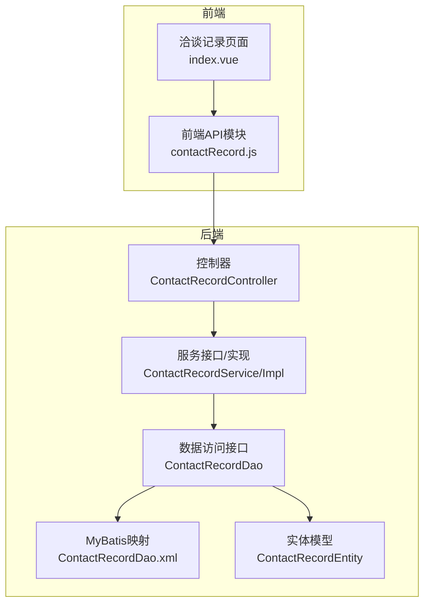
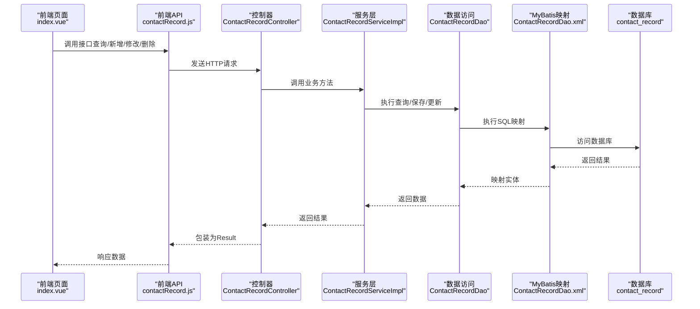
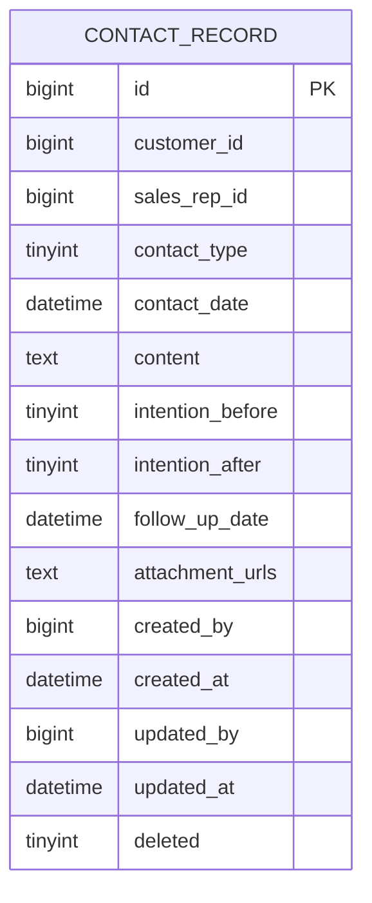
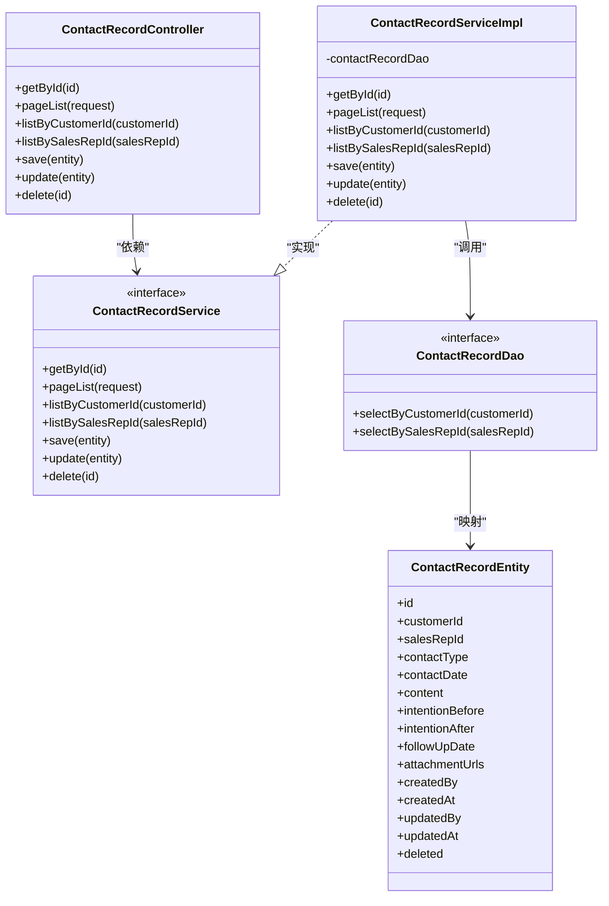
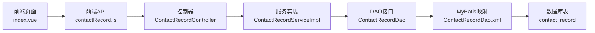
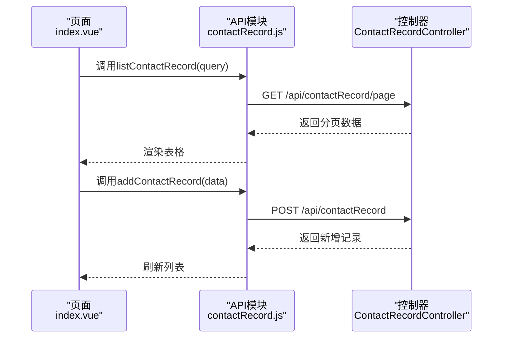

# 洽谈记录管理

<cite>
**本文引用的文件**
- [ContactRecordController.java](file://sales/src/main/java/com/dafuweng/sales/controller/ContactRecordController.java)
- [ContactRecordService.java](file://sales/src/main/java/com/dafuweng/sales/service/ContactRecordService.java)
- [ContactRecordServiceImpl.java](file://sales/src/main/java/com/dafuweng/sales/service/impl/ContactRecordServiceImpl.java)
- [ContactRecordDao.java](file://sales/src/main/java/com/dafuweng/sales/dao/ContactRecordDao.java)
- [ContactRecordDao.xml](file://sales/src/main/resources/sales/mapper/ContactRecordDao.xml)
- [ContactRecordEntity.java](file://sales/src/main/java/com/dafuweng/sales/entity/ContactRecordEntity.java)
- [contactRecord.js](file://ruoyi-ui/src/api/sales/contactRecord.js)
- [index.vue](file://ruoyi-ui/src/views/sales/contact-record/index.vue)
- [database.sql](file://database.sql)
- [SysDictDao.xml](file://system/src/main/resources/system/mapper/SysDictDao.xml)
- [SysDictEntity.java](file://system/src/main/java/com/dafuweng/system/entity/SysDictEntity.java)
</cite>

## 目录
1. [简介](#简介)
2. [项目结构](#项目结构)
3. [核心组件](#核心组件)
4. [架构总览](#架构总览)
5. [详细组件分析](#详细组件分析)
6. [依赖关系分析](#依赖关系分析)
7. [性能考虑](#性能考虑)
8. [故障排除指南](#故障排除指南)
9. [结论](#结论)
10. [附录](#附录)

## 简介
本文件为洽谈记录管理功能的详细API文档，覆盖以下能力：
- 洽谈记录创建：联系方式选择、沟通内容记录、联系结果标记
- 洽谈记录查询：按客户查询、按销售代表查询、分页查询
- 洽谈记录分类管理：电话沟通、面谈拜访、转介绍等类型
- 洽谈计划管理：预约安排、跟进提醒、计划完成状态跟踪（基于下次跟进日期字段）
- 洽谈数据分析：联系频率统计、转化率分析（基于前后意向等级）、客户活跃度评估（基于最近联系时间）
- 导出功能：当前后端未实现导出接口，前端提供导出交互入口
- 客户状态关联：联系效果对客户等级的影响（当前未实现自动更新）

## 项目结构
洽谈记录管理位于销售域（sales）微服务中，采用标准的分层架构：
- 控制器层：对外暴露REST API
- 服务层：业务逻辑封装与事务控制
- 数据访问层：MyBatis映射数据库表
- 实体层：ORM映射contact_record表
- 前端：Vue页面与API调用

图表来源
- [ContactRecordController.java:13-55](file://sales/src/main/java/com/dafuweng/sales/controller/ContactRecordController.java#L13-L55)
- [ContactRecordService.java:17-35](file://sales/src/main/java/com/dafuweng/sales/service/ContactRecordService.java#L17-L35)
- [ContactRecordServiceImpl.java:18-76](file://sales/src/main/java/com/dafuweng/sales/service/impl/ContactRecordServiceImpl.java#L18-L76)
- [ContactRecordDao.java:10-16](file://sales/src/main/java/com/dafuweng/sales/dao/ContactRecordDao.java#L10-L16)
- [ContactRecordDao.xml:3-41](file://sales/src/main/resources/sales/mapper/ContactRecordDao.xml#L3-L41)
- [ContactRecordEntity.java:12-50](file://sales/src/main/java/com/dafuweng/sales/entity/ContactRecordEntity.java#L12-L50)

章节来源
- [ContactRecordController.java:13-55](file://sales/src/main/java/com/dafuweng/sales/controller/ContactRecordController.java#L13-L55)
- [ContactRecordService.java:17-35](file://sales/src/main/java/com/dafuweng/sales/service/ContactRecordService.java#L17-L35)
- [ContactRecordServiceImpl.java:18-76](file://sales/src/main/java/com/dafuweng/sales/service/impl/ContactRecordServiceImpl.java#L18-L76)
- [ContactRecordDao.java:10-16](file://sales/src/main/java/com/dafuweng/sales/dao/ContactRecordDao.java#L10-L16)
- [ContactRecordDao.xml:3-41](file://sales/src/main/resources/sales/mapper/ContactRecordDao.xml#L3-L41)
- [ContactRecordEntity.java:12-50](file://sales/src/main/java/com/dafuweng/sales/entity/ContactRecordEntity.java#L12-L50)

## 核心组件
- 控制器：提供REST接口，处理CRUD与查询
- 服务接口与实现：封装业务逻辑、分页排序、事务控制
- DAO与XML：SQL查询与结果映射
- 实体：ORM映射contact_record表字段
- 前端API与页面：调用后端接口并展示数据

章节来源
- [ContactRecordController.java:13-55](file://sales/src/main/java/com/dafuweng/sales/controller/ContactRecordController.java#L13-L55)
- [ContactRecordService.java:17-35](file://sales/src/main/java/com/dafuweng/sales/service/ContactRecordService.java#L17-L35)
- [ContactRecordServiceImpl.java:18-76](file://sales/src/main/java/com/dafuweng/sales/service/impl/ContactRecordServiceImpl.java#L18-L76)
- [ContactRecordDao.java:10-16](file://sales/src/main/java/com/dafuweng/sales/dao/ContactRecordDao.java#L10-L16)
- [ContactRecordDao.xml:3-41](file://sales/src/main/resources/sales/mapper/ContactRecordDao.xml#L3-L41)
- [ContactRecordEntity.java:12-50](file://sales/src/main/java/com/dafuweng/sales/entity/ContactRecordEntity.java#L12-L50)

## 架构总览
后端采用分层架构，前端通过API模块调用后端控制器。

图表来源
- [contactRecord.js:1-61](file://ruoyi-ui/src/api/sales/contactRecord.js#L1-L61)
- [index.vue:102-178](file://ruoyi-ui/src/views/sales/contact-record/index.vue#L102-L178)
- [ContactRecordController.java:13-55](file://sales/src/main/java/com/dafuweng/sales/controller/ContactRecordController.java#L13-L55)
- [ContactRecordServiceImpl.java:18-76](file://sales/src/main/java/com/dafuweng/sales/service/impl/ContactRecordServiceImpl.java#L18-L76)
- [ContactRecordDao.java:10-16](file://sales/src/main/java/com/dafuweng/sales/dao/ContactRecordDao.java#L10-L16)
- [ContactRecordDao.xml:3-41](file://sales/src/main/resources/sales/mapper/ContactRecordDao.xml#L3-L41)

## 详细组件分析

### API定义与使用说明

#### 获取单条洽谈记录
- 方法：GET
- 路径：/api/contactRecord/{id}
- 请求参数：路径变量id（Long）
- 响应：Result<ContactRecordEntity>

章节来源
- [ContactRecordController.java:20-23](file://sales/src/main/java/com/dafuweng/sales/controller/ContactRecordController.java#L20-L23)

#### 分页查询洽谈记录
- 方法：GET
- 路径：/api/contactRecord/page
- 查询参数：PageRequest（支持分页、排序字段、排序方向）
- 响应：Result<PageResponse<ContactRecordEntity>>

章节来源
- [ContactRecordController.java:25-28](file://sales/src/main/java/com/dafuweng/sales/controller/ContactRecordController.java#L25-L28)
- [ContactRecordServiceImpl.java:30-45](file://sales/src/main/java/com/dafuweng/sales/service/impl/ContactRecordServiceImpl.java#L30-L45)

#### 按客户ID查询洽谈记录
- 方法：GET
- 路径：/api/contactRecord/listByCustomerId/{customerId}
- 请求参数：路径变量customerId（Long）
- 响应：Result<List<ContactRecordEntity>>
- 排序：按联系时间降序

章节来源
- [ContactRecordController.java:30-33](file://sales/src/main/java/com/dafuweng/sales/controller/ContactRecordController.java#L30-L33)
- [ContactRecordDao.xml:23-30](file://sales/src/main/resources/sales/mapper/ContactRecordDao.xml#L23-L30)

#### 按销售代表ID查询洽谈记录
- 方法：GET
- 路径：/api/contactRecord/listBySalesRepId/{salesRepId}
- 请求参数：路径变量salesRepId（Long）
- 响应：Result<List<ContactRecordEntity>>
- 排序：按联系时间降序

章节来源
- [ContactRecordController.java:35-38](file://sales/src/main/java/com/dafuweng/sales/controller/ContactRecordController.java#L35-L38)
- [ContactRecordDao.xml:32-39](file://sales/src/main/resources/sales/mapper/ContactRecordDao.xml#L32-L39)

#### 新增洽谈记录
- 方法：POST
- 路径：/api/contactRecord
- 请求体：ContactRecordEntity
- 响应：Result<ContactRecordEntity>

章节来源
- [ContactRecordController.java:40-43](file://sales/src/main/java/com/dafuweng/sales/controller/ContactRecordController.java#L40-L43)
- [ContactRecordServiceImpl.java:58-62](file://sales/src/main/java/com/dafuweng/sales/service/impl/ContactRecordServiceImpl.java#L58-L62)

#### 更新洽谈记录
- 方法：PUT
- 路径：/api/contactRecord
- 请求体：ContactRecordEntity
- 响应：Result<ContactRecordEntity>

章节来源
- [ContactRecordController.java:45-48](file://sales/src/main/java/com/dafuweng/sales/controller/ContactRecordController.java#L45-L48)
- [ContactRecordServiceImpl.java:64-69](file://sales/src/main/java/com/dafuweng/sales/service/impl/ContactRecordServiceImpl.java#L64-L69)

#### 删除洽谈记录
- 方法：DELETE
- 路径：/api/contactRecord/{id}
- 请求参数：路径变量id（Long）
- 响应：Result<Void>

章节来源
- [ContactRecordController.java:50-54](file://sales/src/main/java/com/dafuweng/sales/controller/ContactRecordController.java#L50-L54)
- [ContactRecordServiceImpl.java:72-76](file://sales/src/main/java/com/dafuweng/sales/service/impl/ContactRecordServiceImpl.java#L72-L76)

### 数据模型与字段说明

图表来源
- [database.sql:322-343](file://database.sql#L322-L343)
- [ContactRecordEntity.java:18-50](file://sales/src/main/java/com/dafuweng/sales/entity/ContactRecordEntity.java#L18-L50)

字段说明（部分关键字段）：
- 客户ID：customer_id
- 销售代表ID：sales_rep_id
- 联系类型：contact_type（1-电话 2-面谈 3-转介绍）
- 联系时间：contact_date
- 洽谈内容：content
- 联系前意向等级：intention_before
- 联系后意向等级：intention_after
- 下次跟进日期：follow_up_date
- 附件URLs：attachment_urls（JSON数组）
- 创建人/时间：created_by, created_at
- 修改人/时间：updated_by, updated_at
- 逻辑删除：deleted

章节来源
- [database.sql:322-343](file://database.sql#L322-L343)
- [ContactRecordEntity.java:18-50](file://sales/src/main/java/com/dafuweng/sales/entity/ContactRecordEntity.java#L18-L50)

### 前端交互与页面

前端页面提供：
- 搜索框：按客户ID、联系类型筛选
- 表格：展示ID、客户ID、销售代表ID、联系方式、联系日期、内容、前后意向等级、下次跟进
- 新增/修改对话框：填写客户ID、联系方式、联系日期、内容、前后意向等级、下次跟进
- 分页组件：支持页码与每页数量调整

章节来源
- [contactRecord.js:1-61](file://ruoyi-ui/src/api/sales/contactRecord.js#L1-L61)
- [index.vue:1-178](file://ruoyi-ui/src/views/sales/contact-record/index.vue#L1-L178)

### 类关系图（代码级）

图表来源
- [ContactRecordController.java:13-55](file://sales/src/main/java/com/dafuweng/sales/controller/ContactRecordController.java#L13-L55)
- [ContactRecordService.java:17-35](file://sales/src/main/java/com/dafuweng/sales/service/ContactRecordService.java#L17-L35)
- [ContactRecordServiceImpl.java:18-76](file://sales/src/main/java/com/dafuweng/sales/service/impl/ContactRecordServiceImpl.java#L18-L76)
- [ContactRecordDao.java:10-16](file://sales/src/main/java/com/dafuweng/sales/dao/ContactRecordDao.java#L10-L16)
- [ContactRecordEntity.java:12-50](file://sales/src/main/java/com/dafuweng/sales/entity/ContactRecordEntity.java#L12-L50)

## 依赖关系分析

图表来源
- [contactRecord.js:1-61](file://ruoyi-ui/src/api/sales/contactRecord.js#L1-L61)
- [index.vue:102-178](file://ruoyi-ui/src/views/sales/contact-record/index.vue#L102-L178)
- [ContactRecordController.java:13-55](file://sales/src/main/java/com/dafuweng/sales/controller/ContactRecordController.java#L13-L55)
- [ContactRecordServiceImpl.java:18-76](file://sales/src/main/java/com/dafuweng/sales/service/impl/ContactRecordServiceImpl.java#L18-L76)
- [ContactRecordDao.java:10-16](file://sales/src/main/java/com/dafuweng/sales/dao/ContactRecordDao.java#L10-L16)
- [ContactRecordDao.xml:3-41](file://sales/src/main/resources/sales/mapper/ContactRecordDao.xml#L3-L41)
- [database.sql:322-343](file://database.sql#L322-L343)

## 性能考虑
- 分页与排序：后端已支持分页与排序字段/方向参数；建议在高频查询场景下结合索引优化（contact_date、customer_id、sales_rep_id）
- SQL执行：按客户/销售代表查询已提供专用SQL，避免全表扫描
- 前端缓存：建议在前端对常用查询结果进行轻量缓存，减少重复请求
- 字典数据：联系类型与意向等级来自系统字典表，建议前端缓存字典以减少请求

## 故障排除指南
- 404 Not Found：检查URL路径是否正确（如/{id}是否传入）
- 500 Internal Server Error：检查请求体格式（JSON）与必填字段（如客户ID、联系类型、内容）
- 查询无结果：确认筛选条件（客户ID、销售代表ID、联系类型）是否匹配
- 排序无效：确认PageRequest中的sortField与sortOrder是否符合后端约定

章节来源
- [ContactRecordController.java:20-54](file://sales/src/main/java/com/dafuweng/sales/controller/ContactRecordController.java#L20-L54)
- [ContactRecordServiceImpl.java:30-45](file://sales/src/main/java/com/dafuweng/sales/service/impl/ContactRecordServiceImpl.java#L30-L45)

## 结论
洽谈记录管理功能已完整实现基础CRUD与查询能力，并提供按客户与销售代表的专项查询。后续可扩展：
- 导出功能：新增Excel/PDF导出接口与任务调度
- 数据分析：增加联系频率、转化率、活跃度统计接口
- 自动化：根据前后意向等级自动更新客户状态
- 计划管理：完善预约与提醒机制（基于follow_up_date）

## 附录

### 字典与枚举
- 联系类型（contact_type）：1-电话 2-面谈 3-转介绍
- 意向等级（intention_before/after）：1-A 2-B 3-C 4-D

章节来源
- [database.sql:238-272](file://database.sql#L238-L272)
- [SysDictDao.xml:19-25](file://system/src/main/resources/system/mapper/SysDictDao.xml#L19-L25)
- [SysDictEntity.java:17-40](file://system/src/main/java/com/dafuweng/system/entity/SysDictEntity.java#L17-L40)

### 前端API调用流程

图表来源
- [index.vue:129-178](file://ruoyi-ui/src/views/sales/contact-record/index.vue#L129-L178)
- [contactRecord.js:1-61](file://ruoyi-ui/src/api/sales/contactRecord.js#L1-L61)
- [ContactRecordController.java:25-48](file://sales/src/main/java/com/dafuweng/sales/controller/ContactRecordController.java#L25-L48)