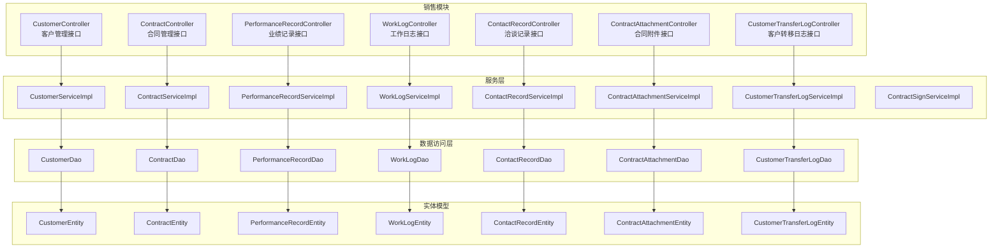
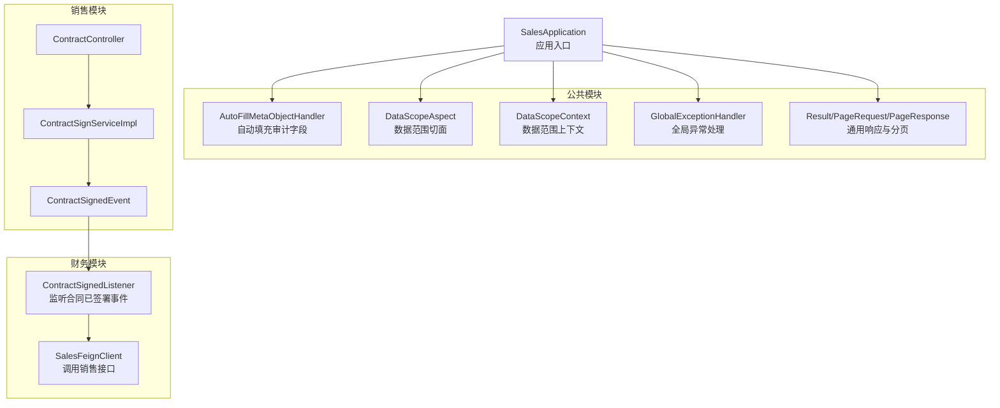
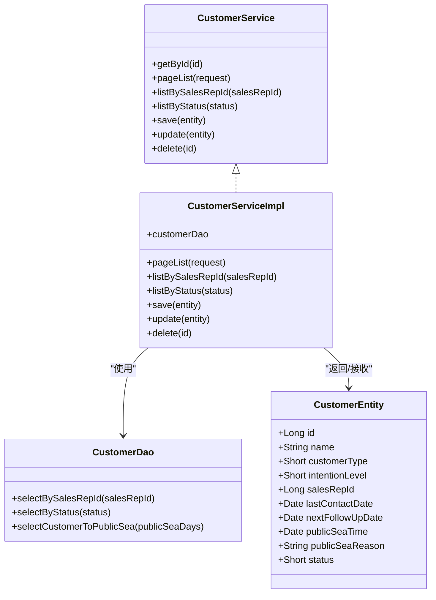
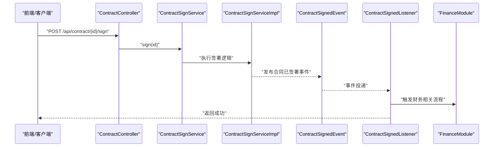
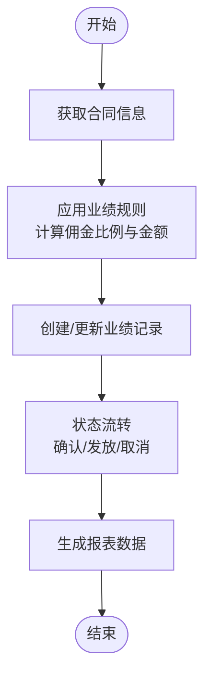
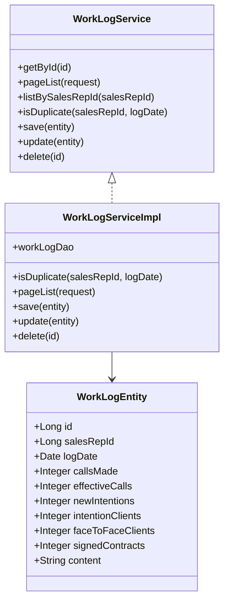
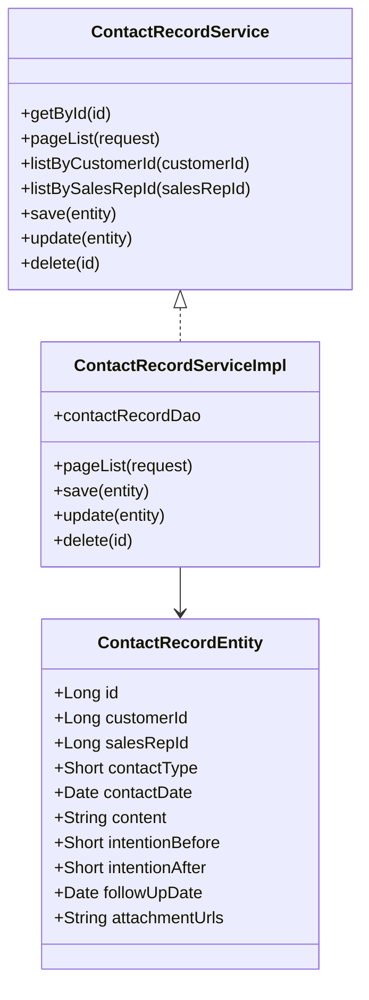
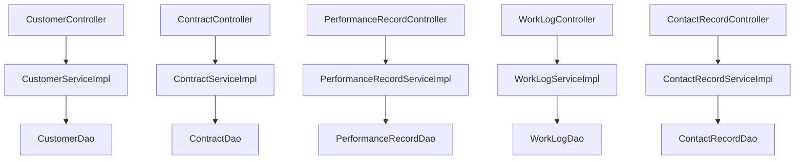

# 销售管理模块

<cite>
**本文引用的文件**
- [SalesApplication.java](file://sales/src/main/java/com/dafuweng/sales/SalesApplication.java)
- [CustomerController.java](file://sales/src/main/java/com/dafuweng/sales/controller/CustomerController.java)
- [ContractController.java](file://sales/src/main/java/com/dafuweng/sales/controller/ContractController.java)
- [PerformanceRecordController.java](file://sales/src/main/java/com/dafuweng/sales/controller/PerformanceRecordController.java)
- [WorkLogController.java](file://sales/src/main/java/com/dafuweng/sales/controller/WorkLogController.java)
- [ContactRecordController.java](file://sales/src/main/java/com/dafuweng/sales/controller/ContactRecordController.java)
- [CustomerEntity.java](file://sales/src/main/java/com/dafuweng/sales/entity/CustomerEntity.java)
- [ContractEntity.java](file://sales/src/main/java/com/dafuweng/sales/entity/ContractEntity.java)
- [PerformanceRecordEntity.java](file://sales/src/main/java/com/dafuweng/sales/entity/PerformanceRecordEntity.java)
- [WorkLogEntity.java](file://sales/src/main/java/com/dafuweng/sales/entity/WorkLogEntity.java)
- [ContactRecordEntity.java](file://sales/src/main/java/com/dafuweng/sales/entity/ContactRecordEntity.java)
- [CustomerService.java](file://sales/src/main/java/com/dafuweng/sales/service/CustomerService.java)
- [CustomerServiceImpl.java](file://sales/src/main/java/com/dafuweng/sales/service/impl/CustomerServiceImpl.java)
- [ContractServiceImpl.java](file://sales/src/main/java/com/dafuweng/sales/service/impl/ContractServiceImpl.java)
- [PerformanceRecordServiceImpl.java](file://sales/src/main/java/com/dafuweng/sales/service/impl/PerformanceRecordServiceImpl.java)
- [WorkLogServiceImpl.java](file://sales/src/main/java/com/dafuweng/sales/service/impl/WorkLogServiceImpl.java)
- [ContactRecordServiceImpl.java](file://sales/src/main/java/com/dafuweng/sales/service/impl/ContactRecordServiceImpl.java)
- [CustomerDao.java](file://sales/src/main/java/com/dafuweng/sales/dao/CustomerDao.java)
- [ContractAttachmentController.java](file://sales/src/main/java/com/dafuweng/sales/controller/ContractAttachmentController.java)
- [ContractAttachmentEntity.java](file://sales/src/main/java/com/dafuweng/sales/entity/ContractAttachmentEntity.java)
- [ContractAttachmentService.java](file://sales/src/main/java/com/dafuweng/sales/service/ContractAttachmentService.java)
- [ContractAttachmentServiceImpl.java](file://sales/src/main/java/com/dafuweng/sales/service/impl/ContractAttachmentServiceImpl.java)
- [ContractAttachmentDao.java](file://sales/src/main/java/com/dafuweng/sales/dao/ContractAttachmentDao.java)
- [CustomerTransferLogController.java](file://sales/src/main/java/com/dafuweng/sales/controller/CustomerTransferLogController.java)
- [CustomerTransferLogEntity.java](file://sales/src/main/java/com/dafuweng/sales/entity/CustomerTransferLogEntity.java)
- [CustomerTransferLogService.java](file://sales/src/main/java/com/dafuweng/sales/service/CustomerTransferLogService.java)
- [CustomerTransferLogServiceImpl.java](file://sales/src/main/java/com/dafuweng/sales/service/impl/CustomerTransferLogServiceImpl.java)
- [CustomerTransferLogDao.java](file://sales/src/main/java/com/dafuweng/sales/dao/CustomerTransferLogDao.java)
- [ContractSignService.java](file://sales/src/main/java/com/dafuweng/sales/service/ContractSignService.java)
- [ContractSignServiceImpl.java](file://sales/src/main/java/com/dafuweng/sales/service/impl/ContractSignServiceImpl.java)
- [ContractSignListener.java](file://finance/src/main/java/com/dafuweng/finance/mq/ContractSignedListener.java)
- [ContractSignedEvent.java](file://common/src/main/java/com/dafuweng/common/mq/event/ContractSignedEvent.java)
- [SalesFeignClient.java](file://finance/src/main/java/com/dafuweng/finance/feign/SalesFeignClient.java)
- [AutoFillMetaObjectHandler.java](file://common/src/main/java/com/dafuweng/common/config/AutoFillMetaObjectHandler.java)
- [DataScopeAspect.java](file://common/src/main/java/com/dafuweng/common/config/DataScopeAspect.java)
- [DataScopeContext.java](file://common/src/main/java/com/dafuweng/common/config/DataScopeContext.java)
- [GlobalExceptionHandler.java](file://common/src/main/java/com/dafuweng/common/exception/GlobalExceptionHandler.java)
- [Result.java](file://common/src/main/java/com/dafuweng/common/entity/Result.java)
- [PageRequest.java](file://common/src/main/java/com/dafuweng/common/entity/PageRequest.java)
- [PageResponse.java](file://common/src/main/java/com/dafuweng/common/entity/PageResponse.java)
- [PerformanceCreateDTO.java](file://common/src/main/java/com/dafuweng/common/entity/dto/PerformanceCreateDTO.java)
- [ContractVO.java](file://common/src/main/java/com/dafuweng/common/entity/vo/ContractVO.java)
- [PublicSeaTask.java](file://sales/src/main/java/com/dafuweng/sales/task/PublicSeaTask.java)
</cite>

## 目录
1. [简介](#简介)
2. [项目结构](#项目结构)
3. [核心组件](#核心组件)
4. [架构总览](#架构总览)
5. [详细组件分析](#详细组件分析)
6. [依赖分析](#依赖分析)
7. [性能考虑](#性能考虑)
8. [故障排查指南](#故障排查指南)
9. [结论](#结论)
10. [附录](#附录)

## 简介
本文件为销售管理模块的全面功能文档，覆盖以下核心能力：
- 客户关系管理：客户信息维护、客户分类与等级、客户转移机制
- 合同生命周期管理：合同创建、审批流程、签署状态跟踪、合同变更管理
- 业绩计算与统计：业绩规则配置、计算引擎实现、报表生成
- 工作日志管理：工作内容记录、时间统计、绩效评估
- 洽谈记录管理：沟通历史、跟进计划、客户互动追踪
- 数据权限控制与业务规则验证机制
- 完整业务流程说明与API接口文档

## 项目结构
销售管理模块采用标准的微服务分层架构，包含控制器层、服务层、数据访问层与实体模型，并通过公共模块提供通用能力（如分页、结果封装、异常处理、数据权限等）。

**图表来源**
- [SalesApplication.java:1-17](file://sales/src/main/java/com/dafuweng/sales/SalesApplication.java#L1-L17)
- [CustomerController.java:1-56](file://sales/src/main/java/com/dafuweng/sales/controller/CustomerController.java#L1-L56)
- [ContractController.java:1-75](file://sales/src/main/java/com/dafuweng/sales/controller/ContractController.java#L1-L75)
- [PerformanceRecordController.java:1-51](file://sales/src/main/java/com/dafuweng/sales/controller/PerformanceRecordController.java#L1-L51)
- [WorkLogController.java:1-56](file://sales/src/main/java/com/dafuweng/sales/controller/WorkLogController.java#L1-L56)
- [ContactRecordController.java:1-56](file://sales/src/main/java/com/dafuweng/sales/controller/ContactRecordController.java#L1-L56)

**章节来源**
- [SalesApplication.java:1-17](file://sales/src/main/java/com/dafuweng/sales/SalesApplication.java#L1-L17)
- [CustomerController.java:1-56](file://sales/src/main/java/com/dafuweng/sales/controller/CustomerController.java#L1-L56)
- [ContractController.java:1-75](file://sales/src/main/java/com/dafuweng/sales/controller/ContractController.java#L1-L75)
- [PerformanceRecordController.java:1-51](file://sales/src/main/java/com/dafuweng/sales/controller/PerformanceRecordController.java#L1-L51)
- [WorkLogController.java:1-56](file://sales/src/main/java/com/dafuweng/sales/controller/WorkLogController.java#L1-L56)
- [ContactRecordController.java:1-56](file://sales/src/main/java/com/dafuweng/sales/controller/ContactRecordController.java#L1-L56)

## 核心组件
- 客户管理：提供客户信息的增删改查、分页查询、按销售代表与状态筛选、公海客户识别等能力
- 合同管理：支持合同创建、查询、分页、状态筛选、签署操作，并与财务模块进行事件联动
- 业绩记录：记录合同对应的业绩、佣金比例与金额、状态流转与时间戳
- 工作日志：记录每日工作量指标（通话数、有效通话、意向客户数等）、内容摘要与重复校验
- 洽谈记录：记录每次沟通类型、时间、内容、前后意向等级、跟进日期与附件
- 合同附件：管理合同相关附件的上传与关联
- 客户转移日志：记录客户在销售代表之间的转移轨迹
- 公海任务：定时任务将超过阈值未跟进的客户转入公海池

**章节来源**
- [CustomerService.java:1-37](file://sales/src/main/java/com/dafuweng/sales/service/CustomerService.java#L1-L37)
- [CustomerServiceImpl.java:1-81](file://sales/src/main/java/com/dafuweng/sales/service/impl/CustomerServiceImpl.java#L1-L81)
- [ContractServiceImpl.java:1-85](file://sales/src/main/java/com/dafuweng/sales/service/impl/ContractServiceImpl.java#L1-L85)
- [PerformanceRecordServiceImpl.java:1-81](file://sales/src/main/java/com/dafuweng/sales/service/impl/PerformanceRecordServiceImpl.java#L1-L81)
- [WorkLogServiceImpl.java:1-78](file://sales/src/main/java/com/dafuweng/sales/service/impl/WorkLogServiceImpl.java#L1-L78)
- [ContactRecordServiceImpl.java:1-76](file://sales/src/main/java/com/dafuweng/sales/service/impl/ContactRecordServiceImpl.java#L1-L76)
- [PublicSeaTask.java](file://sales/src/main/java/com/dafuweng/sales/task/PublicSeaTask.java)

## 架构总览
销售模块通过Spring Boot启动，启用MyBatis Mapper扫描与OpenFeign客户端，配合公共模块提供统一的数据填充、数据范围控制与异常处理。合同签署后通过消息事件通知财务模块，形成跨模块协作。

**图表来源**
- [SalesApplication.java:1-17](file://sales/src/main/java/com/dafuweng/sales/SalesApplication.java#L1-L17)
- [AutoFillMetaObjectHandler.java](file://common/src/main/java/com/dafuweng/common/config/AutoFillMetaObjectHandler.java)
- [DataScopeAspect.java](file://common/src/main/java/com/dafuweng/common/config/DataScopeAspect.java)
- [DataScopeContext.java](file://common/src/main/java/com/dafuweng/common/config/DataScopeContext.java)
- [GlobalExceptionHandler.java](file://common/src/main/java/com/dafuweng/common/exception/GlobalExceptionHandler.java)
- [Result.java](file://common/src/main/java/com/dafuweng/common/entity/Result.java)
- [PageRequest.java](file://common/src/main/java/com/dafuweng/common/entity/PageRequest.java)
- [PageResponse.java](file://common/src/main/java/com/dafuweng/common/entity/PageResponse.java)
- [ContractController.java:65-74](file://sales/src/main/java/com/dafuweng/sales/controller/ContractController.java#L65-L74)
- [ContractSignServiceImpl.java](file://sales/src/main/java/com/dafuweng/sales/service/impl/ContractSignServiceImpl.java)
- [ContractSignedEvent.java](file://common/src/main/java/com/dafuweng/common/mq/event/ContractSignedEvent.java)
- [ContractSignedListener.java](file://finance/src/main/java/com/dafuweng/finance/mq/ContractSignedListener.java)
- [SalesFeignClient.java](file://finance/src/main/java/com/dafuweng/finance/feign/SalesFeignClient.java)

## 详细组件分析

### 客户关系管理
- 功能要点
  - 客户信息维护：支持新增、更新、删除、分页查询、按销售代表与状态筛选
  - 客户分类与等级：提供客户类型、意向等级字段，便于分级管理
  - 客户转移机制：通过客户转移日志记录客户从一个销售代表转移到另一个的过程
  - 公海机制：根据最后联系时间与阈值天数，将客户转入公海池，支持定时任务触发

**图表来源**
- [CustomerEntity.java:1-77](file://sales/src/main/java/com/dafuweng/sales/entity/CustomerEntity.java#L1-L77)
- [CustomerService.java:1-37](file://sales/src/main/java/com/dafuweng/sales/service/CustomerService.java#L1-L37)
- [CustomerServiceImpl.java:1-81](file://sales/src/main/java/com/dafuweng/sales/service/impl/CustomerServiceImpl.java#L1-L81)
- [CustomerDao.java:1-19](file://sales/src/main/java/com/dafuweng/sales/dao/CustomerDao.java#L1-L19)

**章节来源**
- [CustomerController.java:1-56](file://sales/src/main/java/com/dafuweng/sales/controller/CustomerController.java#L1-L56)
- [CustomerEntity.java:1-77](file://sales/src/main/java/com/dafuweng/sales/entity/CustomerEntity.java#L1-L77)
- [CustomerService.java:1-37](file://sales/src/main/java/com/dafuweng/sales/service/CustomerService.java#L1-L37)
- [CustomerServiceImpl.java:1-81](file://sales/src/main/java/com/dafuweng/sales/service/impl/CustomerServiceImpl.java#L1-L81)
- [CustomerDao.java:1-19](file://sales/src/main/java/com/dafuweng/sales/dao/CustomerDao.java#L1-L19)

### 合同生命周期管理
- 功能要点
  - 合同创建与查询：支持按ID、合同编号、分页、销售代表、状态查询
  - 签署流程：提供签署接口，触发签署服务，发布“合同已签署”事件
  - 财务联动：监听签署事件，向财务模块推送后续流程所需数据
  - 变更管理：通过状态字段与备注字段记录变更过程

**图表来源**
- [ContractController.java:65-74](file://sales/src/main/java/com/dafuweng/sales/controller/ContractController.java#L65-L74)
- [ContractSignService.java](file://sales/src/main/java/com/dafuweng/sales/service/ContractSignService.java)
- [ContractSignServiceImpl.java](file://sales/src/main/java/com/dafuweng/sales/service/impl/ContractSignServiceImpl.java)
- [ContractSignedEvent.java](file://common/src/main/java/com/dafuweng/common/mq/event/ContractSignedEvent.java)
- [ContractSignedListener.java](file://finance/src/main/java/com/dafuweng/finance/mq/ContractSignedListener.java)

**章节来源**
- [ContractController.java:1-75](file://sales/src/main/java/com/dafuweng/sales/controller/ContractController.java#L1-L75)
- [ContractEntity.java:1-91](file://sales/src/main/java/com/dafuweng/sales/entity/ContractEntity.java#L1-L91)
- [ContractSignService.java](file://sales/src/main/java/com/dafuweng/sales/service/ContractSignService.java)
- [ContractSignServiceImpl.java](file://sales/src/main/java/com/dafuweng/sales/service/impl/ContractSignServiceImpl.java)
- [ContractSignedEvent.java](file://common/src/main/java/com/dafuweng/common/mq/event/ContractSignedEvent.java)
- [ContractSignedListener.java](file://finance/src/main/java/com/dafuweng/finance/mq/ContractSignedListener.java)

### 业绩计算与统计
- 功能要点
  - 业绩记录：基于合同生成业绩记录，记录合同金额、佣金比例、佣金金额、状态与时间线
  - 计算引擎：通过服务层聚合合同与产品信息，结合规则计算佣金
  - 报表生成：提供分页查询与按销售代表筛选，支撑业绩报表展示

**图表来源**
- [PerformanceRecordController.java:1-51](file://sales/src/main/java/com/dafuweng/sales/controller/PerformanceRecordController.java#L1-L51)
- [PerformanceRecordEntity.java:1-58](file://sales/src/main/java/com/dafuweng/sales/entity/PerformanceRecordEntity.java#L1-L58)
- [PerformanceRecordServiceImpl.java:1-81](file://sales/src/main/java/com/dafuweng/sales/service/impl/PerformanceRecordServiceImpl.java#L1-L81)

**章节来源**
- [PerformanceRecordController.java:1-51](file://sales/src/main/java/com/dafuweng/sales/controller/PerformanceRecordController.java#L1-L51)
- [PerformanceRecordEntity.java:1-58](file://sales/src/main/java/com/dafuweng/sales/entity/PerformanceRecordEntity.java#L1-L58)
- [PerformanceRecordServiceImpl.java:1-81](file://sales/src/main/java/com/dafuweng/sales/service/impl/PerformanceRecordServiceImpl.java#L1-L81)

### 工作日志管理
- 功能要点
  - 日志记录：每日工作量指标（通话数、有效通话、新意向、意向客户数、面谈客户数、已签合同）
  - 内容摘要：支持工作内容文本记录
  - 去重校验：同一销售代表同一天仅允许一条日志，避免重复提交
  - 统计与评估：作为绩效评估的基础数据

**图表来源**
- [WorkLogEntity.java:1-45](file://sales/src/main/java/com/dafuweng/sales/entity/WorkLogEntity.java#L1-L45)
- [WorkLogController.java:1-56](file://sales/src/main/java/com/dafuweng/sales/controller/WorkLogController.java#L1-L56)
- [WorkLogServiceImpl.java:1-78](file://sales/src/main/java/com/dafuweng/sales/service/impl/WorkLogServiceImpl.java#L1-L78)

**章节来源**
- [WorkLogController.java:1-56](file://sales/src/main/java/com/dafuweng/sales/controller/WorkLogController.java#L1-L56)
- [WorkLogEntity.java:1-45](file://sales/src/main/java/com/dafuweng/sales/entity/WorkLogEntity.java#L1-L45)
- [WorkLogServiceImpl.java:1-78](file://sales/src/main/java/com/dafuweng/sales/service/impl/WorkLogServiceImpl.java#L1-L78)

### 洽谈记录管理
- 功能要点
  - 沟通历史：记录每次沟通的类型、时间、内容、前后意向等级
  - 跟进计划：设置下次跟进日期，支持按客户与销售代表查询
  - 附件管理：支持附件URL存储，便于归档沟通材料

**图表来源**
- [ContactRecordEntity.java:1-51](file://sales/src/main/java/com/dafuweng/sales/entity/ContactRecordEntity.java#L1-L51)
- [ContactRecordController.java:1-56](file://sales/src/main/java/com/dafuweng/sales/controller/ContactRecordController.java#L1-L56)
- [ContactRecordServiceImpl.java:1-76](file://sales/src/main/java/com/dafuweng/sales/service/impl/ContactRecordServiceImpl.java#L1-L76)

**章节来源**
- [ContactRecordController.java:1-56](file://sales/src/main/java/com/dafuweng/sales/controller/ContactRecordController.java#L1-L56)
- [ContactRecordEntity.java:1-51](file://sales/src/main/java/com/dafuweng/sales/entity/ContactRecordEntity.java#L1-L51)
- [ContactRecordServiceImpl.java:1-76](file://sales/src/main/java/com/dafuweng/sales/service/impl/ContactRecordServiceImpl.java#L1-L76)

### 合同附件与客户转移日志
- 合同附件：支持合同相关附件的上传与关联，便于归档与查阅
- 客户转移日志：记录客户从一个销售代表转移到另一个的完整过程，包含转移原因、时间与责任人

**章节来源**
- [ContractAttachmentController.java](file://sales/src/main/java/com/dafuweng/sales/controller/ContractAttachmentController.java)
- [ContractAttachmentEntity.java](file://sales/src/main/java/com/dafuweng/sales/entity/ContractAttachmentEntity.java)
- [ContractAttachmentService.java](file://sales/src/main/java/com/dafuweng/sales/service/ContractAttachmentService.java)
- [ContractAttachmentServiceImpl.java](file://sales/src/main/java/com/dafuweng/sales/service/impl/ContractAttachmentServiceImpl.java)
- [CustomerTransferLogController.java](file://sales/src/main/java/com/dafuweng/sales/controller/CustomerTransferLogController.java)
- [CustomerTransferLogEntity.java](file://sales/src/main/java/com/dafuweng/sales/entity/CustomerTransferLogEntity.java)
- [CustomerTransferLogService.java](file://sales/src/main/java/com/dafuweng/sales/service/CustomerTransferLogService.java)
- [CustomerTransferLogServiceImpl.java](file://sales/src/main/java/com/dafuweng/sales/service/impl/CustomerTransferLogServiceImpl.java)

## 依赖分析
- 组件耦合
  - 控制器层仅负责参数接收与结果封装，业务逻辑集中在服务层，DAO层负责数据持久化
  - 服务层之间低耦合，通过接口定义契约，便于替换与扩展
- 外部依赖
  - OpenFeign用于跨模块调用（如财务模块）
  - 消息事件用于异步解耦（合同签署事件）
  - MyBatis Plus提供ORM与分页能力
- 数据权限
  - 通过数据范围切面与上下文控制用户可见数据范围，确保多级组织下的数据隔离

**图表来源**
- [CustomerController.java:1-56](file://sales/src/main/java/com/dafuweng/sales/controller/CustomerController.java#L1-L56)
- [ContractController.java:1-75](file://sales/src/main/java/com/dafuweng/sales/controller/ContractController.java#L1-L75)
- [PerformanceRecordController.java:1-51](file://sales/src/main/java/com/dafuweng/sales/controller/PerformanceRecordController.java#L1-L51)
- [WorkLogController.java:1-56](file://sales/src/main/java/com/dafuweng/sales/controller/WorkLogController.java#L1-L56)
- [ContactRecordController.java:1-56](file://sales/src/main/java/com/dafuweng/sales/controller/ContactRecordController.java#L1-L56)

**章节来源**
- [DataScopeAspect.java](file://common/src/main/java/com/dafuweng/common/config/DataScopeAspect.java)
- [DataScopeContext.java](file://common/src/main/java/com/dafuweng/common/config/DataScopeContext.java)

## 性能考虑
- 分页查询：所有列表接口均采用分页查询，避免一次性加载大量数据
- 条件过滤：按销售代表、状态、客户ID等维度进行条件过滤，减少无效数据传输
- 缓存策略：建议对高频查询（如字典、产品信息）引入缓存，降低数据库压力
- 异步处理：合同签署事件采用消息队列异步通知财务模块，提升用户体验与系统吞吐
- 批量操作：对于批量导入导出场景，建议采用流式处理与分批提交，避免内存溢出

## 故障排查指南
- 常见问题
  - 重复提交工作日志：检查去重逻辑，确保同一销售代表同一天仅允许一条日志
  - 数据越权：检查数据范围切面是否正确注入当前用户的数据范围
  - 合同签署失败：检查事件发布与监听是否正常，确认财务模块是否可用
- 排查步骤
  - 查看全局异常处理器输出，定位具体错误类型与堆栈
  - 检查DAO层SQL执行情况，关注慢查询与索引缺失
  - 核对OpenFeign调用链路，确认目标模块健康状态
- 建议
  - 对关键接口增加限流与熔断保护
  - 对重要操作增加审计日志，便于追溯

**章节来源**
- [GlobalExceptionHandler.java](file://common/src/main/java/com/dafuweng/common/exception/GlobalExceptionHandler.java)
- [DataScopeAspect.java](file://common/src/main/java/com/dafuweng/common/config/DataScopeAspect.java)

## 结论
销售管理模块以清晰的分层架构实现了客户关系、合同生命周期、业绩统计、工作日志与洽谈记录的全链路管理。通过数据权限控制与业务规则验证，保障了数据安全与一致性；借助消息事件与Feign客户端，实现了与财务模块的高效协同。建议在后续迭代中完善缓存策略、监控告警与自动化测试，持续提升系统的稳定性与可维护性。

## 附录

### API接口文档

- 客户管理
  - GET /api/customer/{id}：按ID查询客户
  - GET /api/customer/page：分页查询客户
  - GET /api/customer/listBySalesRepId/{salesRepId}：按销售代表查询客户
  - GET /api/customer/listByStatus：按状态查询客户
  - POST /api/customer：新增客户
  - PUT /api/customer：更新客户
  - DELETE /api/customer/{id}：删除客户

- 合同管理
  - GET /api/contract/{id}：按ID查询合同
  - GET /api/contract/getByContractNo/{contractNo}：按合同编号查询
  - GET /api/contract/page：分页查询合同
  - GET /api/contract/listBySalesRepId/{salesRepId}：按销售代表查询合同
  - GET /api/contract/listByStatus：按状态查询合同
  - POST /api/contract：新增合同
  - PUT /api/contract：更新合同
  - DELETE /api/contract/{id}：删除合同
  - POST /api/contract/{id}/sign：签署合同并发布事件

- 业绩记录
  - GET /api/performanceRecord/{id}：按ID查询业绩记录
  - GET /api/performanceRecord/page：分页查询业绩记录
  - GET /api/performanceRecord/listBySalesRepId/{salesRepId}：按销售代表查询业绩记录
  - POST /api/performanceRecord：新增业绩记录
  - PUT /api/performanceRecord：更新业绩记录
  - DELETE /api/performanceRecord/{id}：删除业绩记录

- 工作日志
  - GET /api/workLog/{id}：按ID查询工作日志
  - GET /api/workLog/page：分页查询工作日志
  - GET /api/workLog/listBySalesRepId/{salesRepId}：按销售代表查询工作日志
  - GET /api/workLog/checkDuplicate：检查重复日志
  - POST /api/workLog：新增工作日志
  - PUT /api/workLog：更新工作日志
  - DELETE /api/workLog/{id}：删除工作日志

- 洽谈记录
  - GET /api/contactRecord/{id}：按ID查询洽谈记录
  - GET /api/contactRecord/page：分页查询洽谈记录
  - GET /api/contactRecord/listByCustomerId/{customerId}：按客户查询洽谈记录
  - GET /api/contactRecord/listBySalesRepId/{salesRepId}：按销售代表查询洽谈记录
  - POST /api/contactRecord：新增洽谈记录
  - PUT /api/contactRecord：更新洽谈记录
  - DELETE /api/contactRecord/{id}：删除洽谈记录

- 合同附件
  - 支持合同附件的上传与关联，接口路径遵循REST风格

- 客户转移日志
  - 支持查询客户转移日志，便于审计与追踪

**章节来源**
- [CustomerController.java:1-56](file://sales/src/main/java/com/dafuweng/sales/controller/CustomerController.java#L1-L56)
- [ContractController.java:1-75](file://sales/src/main/java/com/dafuweng/sales/controller/ContractController.java#L1-L75)
- [PerformanceRecordController.java:1-51](file://sales/src/main/java/com/dafuweng/sales/controller/PerformanceRecordController.java#L1-L51)
- [WorkLogController.java:1-56](file://sales/src/main/java/com/dafuweng/sales/controller/WorkLogController.java#L1-L56)
- [ContactRecordController.java:1-56](file://sales/src/main/java/com/dafuweng/sales/controller/ContactRecordController.java#L1-L56)
- [ContractAttachmentController.java](file://sales/src/main/java/com/dafuweng/sales/controller/ContractAttachmentController.java)
- [CustomerTransferLogController.java](file://sales/src/main/java/com/dafuweng/sales/controller/CustomerTransferLogController.java)