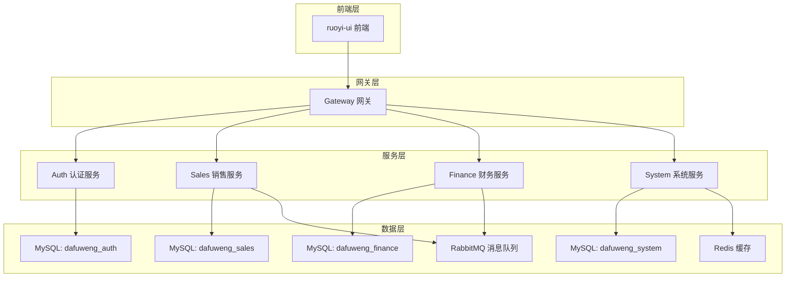
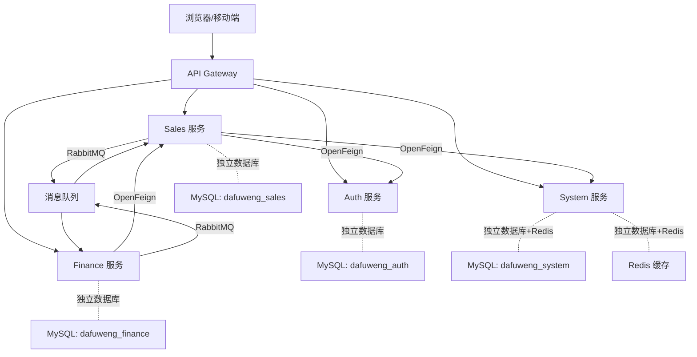
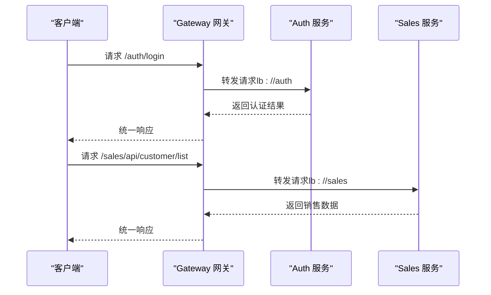
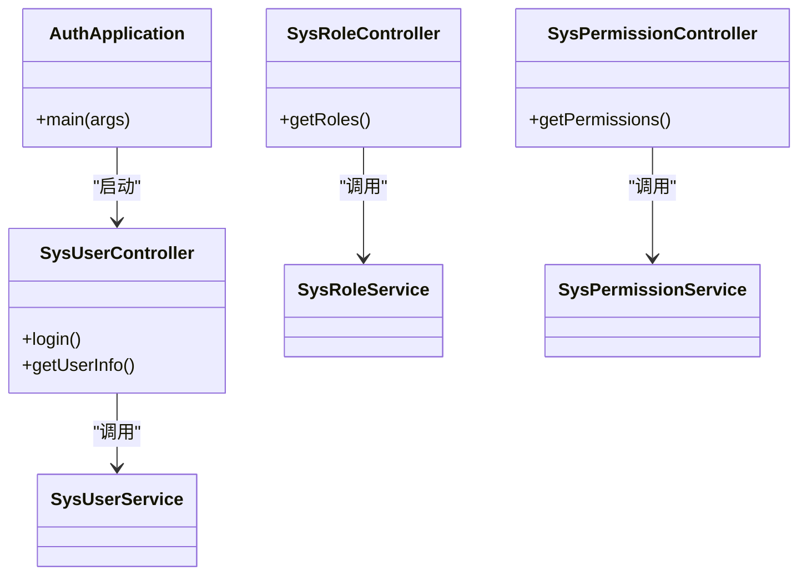
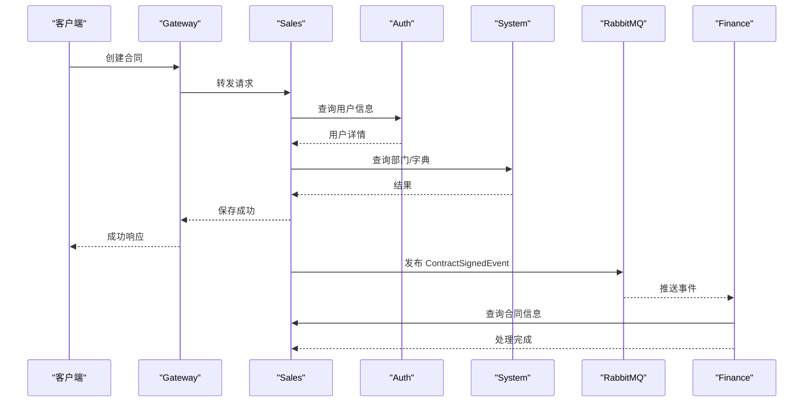
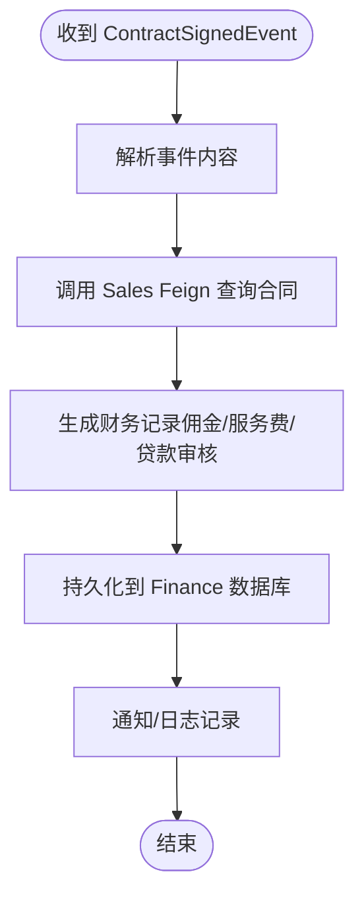
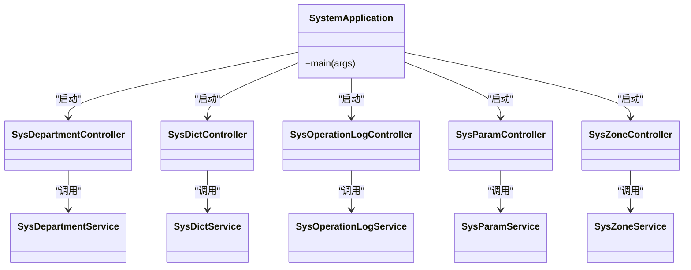
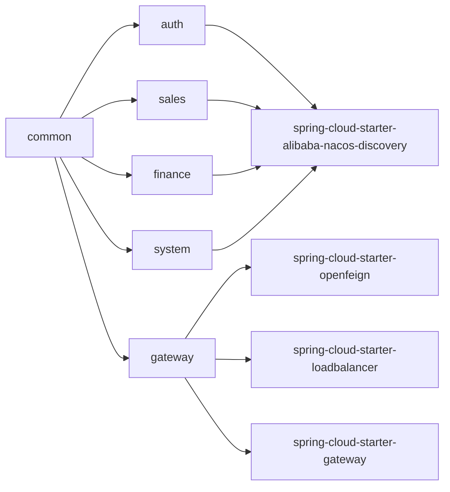
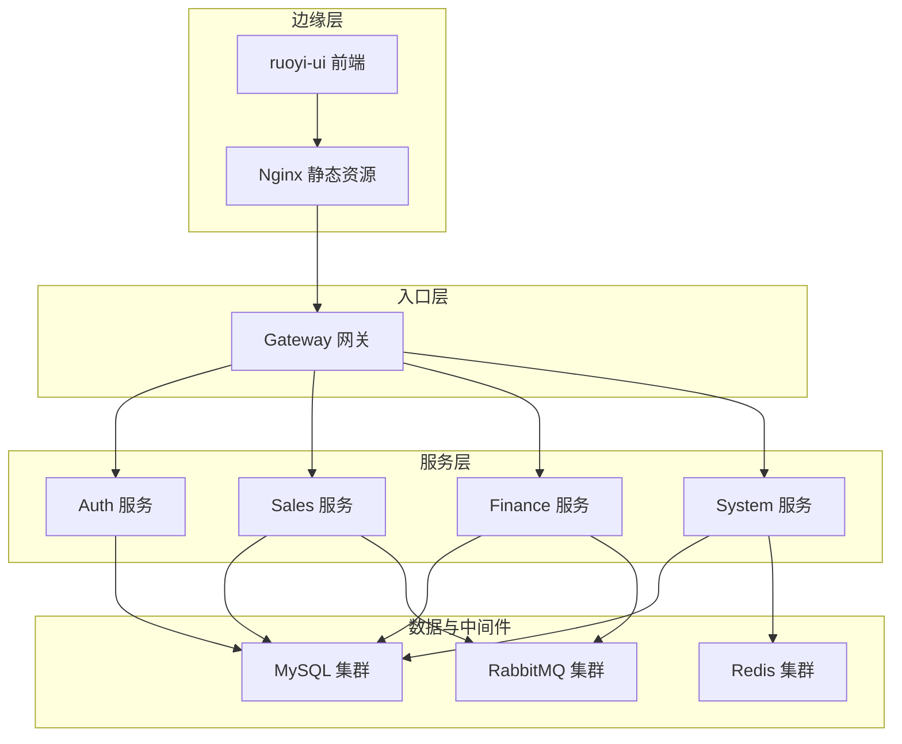

# 技术架构总览

<cite>
**本文引用的文件**
- [pom.xml](file://pom.xml)
- [gateway/pom.xml](file://gateway/pom.xml)
- [sales/pom.xml](file://sales/pom.xml)
- [finance/pom.xml](file://finance/pom.xml)
- [system/pom.xml](file://system/pom.xml)
- [auth/pom.xml](file://auth/pom.xml)
- [common/pom.xml](file://common/pom.xml)
- [gateway/src/main/resources/application.yml](file://gateway/src/main/resources/application.yml)
- [auth/src/main/resources/application.yml](file://auth/src/main/resources/application.yml)
- [sales/src/main/resources/application.yml](file://sales/src/main/resources/application.yml)
- [finance/src/main/resources/application.yml](file://finance/src/main/resources/application.yml)
- [system/src/main/resources/application.yml](file://system/src/main/resources/application.yml)
- [gateway/src/main/java/com/dafuweng/GatewayApplication.java](file://gateway/src/main/java/com/dafuweng/GatewayApplication.java)
- [auth/src/main/java/com/dafuweng/AuthApplication.java](file://auth/src/main/java/com/dafuweng/AuthApplication.java)
- [common/src/main/java/com/dafuweng/common/config/MybatisPlusConfig.java](file://common/src/main/java/com/dafuweng/common/config/MybatisPlusConfig.java)
- [sales/src/main/java/com/dafuweng/sales/feign/AuthFeignClient.java](file://sales/src/main/java/com/dafuweng/sales/feign/AuthFeignClient.java)
- [sales/src/main/java/com/dafuweng/sales/feign/SystemFeignClient.java](file://sales/src/main/java/com/dafuweng/sales/feign/SystemFeignClient.java)
- [sales/src/main/java/com/dafuweng/sales/feign/SalesFeignClient.java](file://sales/src/main/java/com/dafuweng/sales/feign/SalesFeignClient.java)
- [finance/src/main/java/com/dafuweng/finance/feign/SalesFeignClient.java](file://finance/src/main/java/com/dafuweng/finance/feign/SalesFeignClient.java)
- [gateway/src/main/java/com/dafuweng/gateway/feign/AuthFeignClient.java](file://gateway/src/main/java/com/dafuweng/gateway/feign/AuthFeignClient.java)
- [common/src/main/java/com/dafuweng/common/mq/MqConfig.java](file://common/src/main/java/com/dafuweng/common/mq/MqConfig.java)
- [common/src/main/java/com/dafuweng/common/mq/event/ContractSignedEvent.java](file://common/src/main/java/com/dafuweng/common/mq/event/ContractSignedEvent.java)
- [common/src/main/java/com/dafuweng/common/mq/event/LoanApprovedEvent.java](file://common/src/main/java/com/dafuweng/common/mq/event/LoanApprovedEvent.java)
- [sales/src/main/java/com/dafuweng/sales/mq/ContractSignedListener.java](file://sales/src/main/java/com/dafuweng/sales/mq/ContractSignedListener.java)
- [ruoyi-ui/package.json](file://ruoyi-ui/package.json)
- [ruoyi-ui/vite.config.js](file://ruoyi-ui/vite.config.js)
- [ruoyi-ui/nginx.conf](file://ruoyi-ui/nginx.conf)
- [docker-compose.yml](file://docker-compose.yml)
- [docker-compose-simple.yml](file://docker-compose-simple.yml)
</cite>

## 目录
1. [引言](#引言)
2. [项目结构](#项目结构)
3. [核心组件](#核心组件)
4. [架构总览](#架构总览)
5. [详细组件分析](#详细组件分析)
6. [依赖关系分析](#依赖关系分析)
7. [性能与可扩展性](#性能与可扩展性)
8. [部署拓扑与数据流](#部署拓扑与数据流)
9. [故障排查指南](#故障排查指南)
10. [结论](#结论)

## 引言
本文件面向NeoCC项目的架构设计与实现，围绕基于Spring Cloud的微服务架构进行系统化梳理。文档从分层架构、微服务拆分策略、服务间通信机制（OpenFeign远程调用、RabbitMQ消息队列）、关键技术选型、可扩展性与高可用性、性能考量，以及部署拓扑与数据流等方面进行全面阐述，帮助开发者快速理解并高效参与开发。

## 项目结构
NeoCC采用多模块Maven聚合工程组织，包含统一的公共模块与六个独立微服务模块，配合网关层与前端界面，形成完整的前后端分离与微服务治理架构。

- 顶层聚合工程：定义模块聚合关系与基础属性
- 微服务模块：
  - auth：认证与权限服务
  - sales：销售业务服务
  - finance：财务业务服务
  - system：系统管理服务
  - gateway：API网关
  - common：公共能力与共享依赖
- 前端模块：ruoyi-ui（Vue3 + Vite）

图表来源
- [pom.xml:12-19](file://pom.xml#L12-L19)
- [gateway/src/main/resources/application.yml:17-51](file://gateway/src/main/resources/application.yml#L17-L51)
- [auth/src/main/resources/application.yml:7-11](file://auth/src/main/resources/application.yml#L7-L11)
- [sales/src/main/resources/application.yml:7-11](file://sales/src/main/resources/application.yml#L7-L11)
- [finance/src/main/resources/application.yml:7-11](file://finance/src/main/resources/application.yml#L7-L11)
- [system/src/main/resources/application.yml:7-17](file://system/src/main/resources/application.yml#L7-L17)

章节来源
- [pom.xml:12-19](file://pom.xml#L12-L19)
- [ruoyi-ui/package.json:1-50](file://ruoyi-ui/package.json#L1-L50)

## 核心组件
- 网关层（Gateway）
  - 使用Spring Cloud Gateway路由转发，结合Nacos注册发现与OpenFeign客户端，统一接入与鉴权过滤。
  - 关键配置：路由规则、CORS跨域、服务名映射与StripPrefix前缀剥离。
- 认证与权限服务（Auth）
  - 提供用户、角色、权限管理接口；集成Spring Security与MyBatis-Plus；数据库按模块独立。
- 销售服务（Sales）
  - 负责客户、合同、业绩、工作日志等销售全链路；通过OpenFeign调用Auth与System；通过RabbitMQ发布/订阅事件。
- 财务服务（Finance）
  - 负责银行账户、产品、贷款审核、佣金与服务费记录；通过OpenFeign调用Sales；通过RabbitMQ消费事件。
- 系统服务（System）
  - 提供部门、区域、参数、字典、操作日志等基础能力；集成Redis缓存；通过AOP实现数据范围控制。
- 公共模块（Common）
  - 提供MyBatis-Plus全局配置（分页、自动填充）、全局异常处理、AOP切面、RabbitMQ通用配置与领域事件模型。
- 前端（ruoyi-ui）
  - Vue3 + Vite构建，Element Plus UI，Nginx静态资源服务，路由与状态管理解耦。

章节来源
- [gateway/src/main/java/com/dafuweng/GatewayApplication.java:8-15](file://gateway/src/main/java/com/dafuweng/GatewayApplication.java#L8-L15)
- [auth/src/main/java/com/dafuweng/AuthApplication.java:8-15](file://auth/src/main/java/com/dafuweng/AuthApplication.java#L8-L15)
- [common/src/main/java/com/dafuweng/common/config/MybatisPlusConfig.java:14-28](file://common/src/main/java/com/dafuweng/common/config/MybatisPlusConfig.java#L14-L28)

## 架构总览
NeoCC采用“前端层-网关层-服务层-数据层”的分层架构，服务间通过OpenFeign声明式调用与RabbitMQ异步消息解耦，实现高内聚低耦合与横向扩展。

图表来源
- [gateway/src/main/resources/application.yml:17-135](file://gateway/src/main/resources/application.yml#L17-L135)
- [sales/src/main/java/com/dafuweng/sales/feign/AuthFeignClient.java:1-200](file://sales/src/main/java/com/dafuweng/sales/feign/AuthFeignClient.java)
- [sales/src/main/java/com/dafuweng/sales/feign/SystemFeignClient.java:1-200](file://sales/src/main/java/com/dafuweng/sales/feign/SystemFeignClient.java)
- [sales/src/main/java/com/dafuweng/sales/feign/SalesFeignClient.java:1-200](file://sales/src/main/java/com/dafuweng/sales/feign/SalesFeignClient.java)
- [finance/src/main/java/com/dafuweng/finance/feign/SalesFeignClient.java:1-200](file://finance/src/main/java/com/dafuweng/finance/feign/SalesFeignClient.java)
- [common/src/main/java/com/dafuweng/common/mq/MqConfig.java:1-200](file://common/src/main/java/com/dafuweng/common/mq/MqConfig.java)
- [common/src/main/java/com/dafuweng/common/mq/event/ContractSignedEvent.java:1-200](file://common/src/main/java/com/dafuweng/common/mq/event/ContractSignedEvent.java)
- [common/src/main/java/com/dafuweng/common/mq/event/LoanApprovedEvent.java:1-200](file://common/src/main/java/com/dafuweng/common/mq/event/LoanApprovedEvent.java)

## 详细组件分析

### 网关层（Gateway）
- 路由策略
  - 将/auth/**、/sales/**、/finance/**、/system/**等路径分别路由到对应服务实例或容器地址。
  - 对RuoYi前端适配的根路径接口进行定向路由，便于旧前端兼容。
  - 支持StripPrefix=1剥离一级前缀，简化后端路由映射。
- 安全与跨域
  - 全局CORS允许任意来源与方法，便于本地联调与跨域访问。
- 服务发现与调用
  - 通过lb://服务名启用负载均衡；结合Nacos注册中心实现服务自动发现。
- OpenFeign集成
  - 在网关中启用Feign客户端，用于对下游服务的声明式调用。

图表来源
- [gateway/src/main/resources/application.yml:24-82](file://gateway/src/main/resources/application.yml#L24-L82)
- [gateway/src/main/java/com/dafuweng/GatewayApplication.java:8-15](file://gateway/src/main/java/com/dafuweng/GatewayApplication.java#L8-L15)

章节来源
- [gateway/src/main/resources/application.yml:17-149](file://gateway/src/main/resources/application.yml#L17-L149)
- [gateway/pom.xml:67-96](file://gateway/pom.xml#L67-L96)

### 认证与权限服务（Auth）
- 数据源与ORM
  - 使用MyBatis-Plus，逻辑删除字段配置，驼峰映射开启，mapper扫描路径配置。
- 安全框架
  - 集成Spring Security，结合JWT过滤器实现无状态认证。
- 服务发现
  - 通过Nacos注册中心对外提供用户、角色、权限管理接口。

图表来源
- [auth/src/main/java/com/dafuweng/AuthApplication.java:8-15](file://auth/src/main/java/com/dafuweng/AuthApplication.java#L8-L15)
- [auth/src/main/resources/application.yml:7-31](file://auth/src/main/resources/application.yml#L7-L31)

章节来源
- [auth/src/main/java/com/dafuweng/AuthApplication.java:8-15](file://auth/src/main/java/com/dafuweng/AuthApplication.java#L8-L15)
- [auth/src/main/resources/application.yml:7-35](file://auth/src/main/resources/application.yml#L7-L35)

### 销售服务（Sales）
- 业务职责
  - 客户、合同、联系记录、业绩记录、工作日志、公海任务等销售全链路。
- 远程调用
  - 通过OpenFeign调用Auth（用户信息）与System（部门/区域/字典等）。
- 消息机制
  - 发布合同已签署事件至RabbitMQ，供Finance订阅处理。
- 数据库与ORM
  - 独立数据库，MyBatis-Plus配置同公共模块。

图表来源
- [sales/src/main/java/com/dafuweng/sales/feign/AuthFeignClient.java:1-200](file://sales/src/main/java/com/dafuweng/sales/feign/AuthFeignClient.java)
- [sales/src/main/java/com/dafuweng/sales/feign/SystemFeignClient.java:1-200](file://sales/src/main/java/com/dafuweng/sales/feign/SystemFeignClient.java)
- [common/src/main/java/com/dafuweng/common/mq/event/ContractSignedEvent.java:1-200](file://common/src/main/java/com/dafuweng/common/mq/event/ContractSignedEvent.java)
- [sales/src/main/java/com/dafuweng/sales/mq/ContractSignedListener.java:1-200](file://sales/src/main/java/com/dafuweng/sales/mq/ContractSignedListener.java)

章节来源
- [sales/src/main/java/com/dafuweng/sales/feign/AuthFeignClient.java:1-200](file://sales/src/main/java/com/dafuweng/sales/feign/AuthFeignClient.java)
- [sales/src/main/java/com/dafuweng/sales/feign/SystemFeignClient.java:1-200](file://sales/src/main/java/com/dafuweng/sales/feign/SystemFeignClient.java)
- [sales/src/main/resources/application.yml:7-31](file://sales/src/main/resources/application.yml#L7-L31)

### 财务服务（Finance）
- 业务职责
  - 银行账户、金融产品、贷款审核、佣金与服务费记录。
- 远程调用
  - 通过OpenFeign调用Sales查询合同相关信息。
- 消息机制
  - 订阅RabbitMQ中的合同事件，触发财务流程处理。
- 数据库与ORM
  - 独立数据库，MyBatis-Plus配置同公共模块。

图表来源
- [finance/src/main/java/com/dafuweng/finance/feign/SalesFeignClient.java:1-200](file://finance/src/main/java/com/dafuweng/finance/feign/SalesFeignClient.java)
- [common/src/main/java/com/dafuweng/common/mq/event/ContractSignedEvent.java:1-200](file://common/src/main/java/com/dafuweng/common/mq/event/ContractSignedEvent.java)

章节来源
- [finance/src/main/java/com/dafuweng/finance/feign/SalesFeignClient.java:1-200](file://finance/src/main/java/com/dafuweng/finance/feign/SalesFeignClient.java)
- [finance/src/main/resources/application.yml:7-28](file://finance/src/main/resources/application.yml#L7-L28)

### 系统服务（System）
- 业务职责
  - 部门、区域、参数、字典、操作日志等基础能力。
- 缓存与AOP
  - 集成Redis缓存；通过AOP实现数据范围控制与审计日志。
- 数据库与ORM
  - 独立数据库，MyBatis-Plus配置同公共模块。

图表来源
- [system/src/main/resources/application.yml:12-17](file://system/src/main/resources/application.yml#L12-L17)
- [system/src/main/resources/application.yml:26-36](file://system/src/main/resources/application.yml#L26-L36)

章节来源
- [system/src/main/resources/application.yml:12-41](file://system/src/main/resources/application.yml#L12-L41)

### 公共模块（Common）
- MyBatis-Plus全局配置
  - 分页插件与自动填充处理器，统一在各模块生效。
- 消息与事件
  - RabbitMQ通用配置与领域事件模型（如合同已签署、贷款已审批）。
- 全局异常处理与AOP切面
  - 统一异常处理与数据范围控制切面，保障横切关注点一致。

章节来源
- [common/pom.xml:12-64](file://common/pom.xml#L12-L64)
- [common/src/main/java/com/dafuweng/common/config/MybatisPlusConfig.java:14-28](file://common/src/main/java/com/dafuweng/common/config/MybatisPlusConfig.java#L14-L28)
- [common/src/main/java/com/dafuweng/common/mq/MqConfig.java:1-200](file://common/src/main/java/com/dafuweng/common/mq/MqConfig.java)
- [common/src/main/java/com/dafuweng/common/mq/event/ContractSignedEvent.java:1-200](file://common/src/main/java/com/dafuweng/common/mq/event/ContractSignedEvent.java)
- [common/src/main/java/com/dafuweng/common/mq/event/LoanApprovedEvent.java:1-200](file://common/src/main/java/com/dafuweng/common/mq/event/LoanApprovedEvent.java)

## 依赖关系分析
- 模块依赖
  - 所有服务模块均依赖common模块，复用ORM、消息、AOP等公共能力。
  - 网关模块依赖common，同时引入Gateway与OpenFeign依赖。
- 第三方依赖
  - Spring Boot 3.2.5 + Spring Cloud 2023.0.3 + Spring Cloud Alibaba 2023.0.3.2。
  - MyBatis-Plus 3.5.7、MySQL Connector/J 8.3.0、Redis、RabbitMQ。
- 服务发现与负载均衡
  - Nacos注册中心；OpenFeign + LoadBalancer实现声明式调用与软负载。

图表来源
- [pom.xml:12-19](file://pom.xml#L12-L19)
- [sales/pom.xml:113-136](file://sales/pom.xml#L113-L136)
- [finance/pom.xml:103-132](file://finance/pom.xml#L103-L132)
- [system/pom.xml:113-142](file://system/pom.xml#L113-L142)
- [auth/pom.xml:103-116](file://auth/pom.xml#L103-L116)
- [gateway/pom.xml:67-77](file://gateway/pom.xml#L67-L77)

章节来源
- [sales/pom.xml:27-63](file://sales/pom.xml#L27-L63)
- [finance/pom.xml:24-60](file://finance/pom.xml#L24-L60)
- [system/pom.xml:27-64](file://system/pom.xml#L27-L64)
- [auth/pom.xml:24-60](file://auth/pom.xml#L24-L60)
- [gateway/pom.xml:25-44](file://gateway/pom.xml#L25-L44)

## 性能与可扩展性
- 性能特性
  - MyBatis-Plus分页插件与自动填充减少重复代码，提升CRUD效率。
  - 网关层统一CORS与路由，降低客户端与后端耦合度。
- 可扩展性
  - 服务按业务域拆分，职责清晰；新增功能以模块化方式接入。
  - OpenFeign声明式调用与Nacos注册中心，便于横向扩容与灰度发布。
- 高可用性
  - 服务实例通过Nacos注册与负载均衡，具备基本容错能力。
  - 建议后续引入Sentinel限流与熔断、Zipkin链路追踪等增强。

## 部署拓扑与数据流
- 部署拓扑
  - 前端ruoyi-ui通过Nginx对外提供静态资源服务。
  - 网关gateway暴露统一入口，后端auth/sales/finance/system通过容器或进程运行。
  - 各服务独立MySQL数据库，System服务额外依赖Redis。
  - RabbitMQ作为消息中间件，支撑异步解耦。
- 数据流
  - 前端请求经网关路由到对应服务；服务间通过OpenFeign调用；事件通过RabbitMQ传播。

图表来源
- [ruoyi-ui/nginx.conf:1-200](file://ruoyi-ui/nginx.conf)
- [gateway/src/main/resources/application.yml:1-165](file://gateway/src/main/resources/application.yml#L1-L165)
- [docker-compose.yml:1-200](file://docker-compose.yml)
- [docker-compose-simple.yml:1-200](file://docker-compose-simple.yml)

章节来源
- [ruoyi-ui/package.json:1-50](file://ruoyi-ui/package.json#L1-L50)
- [ruoyi-ui/vite.config.js:1-200](file://ruoyi-ui/vite.config.js#L1-L200)
- [ruoyi-ui/nginx.conf:1-200](file://ruoyi-ui/nginx.conf)

## 故障排查指南
- 网关路由问题
  - 检查application.yml中的路由id、uri与predicates是否匹配；确认StripPrefix配置是否正确。
- 服务发现失败
  - 核对Nacos地址、命名空间与用户名密码；确认服务是否正常注册。
- OpenFeign调用异常
  - 检查Feign客户端接口与fallback配置；确认服务名与负载均衡是否生效。
- RabbitMQ消息丢失或堆积
  - 校验交换机/队列绑定；确认消费者监听器是否正确声明；检查消息确认与重试策略。
- 数据库连接与事务
  - 校验数据源URL、账号密码；确认MyBatis-Plus逻辑删除与驼峰映射配置。
- 前端静态资源无法加载
  - 检查Vite构建产物与Nginx路径配置；确认CORS与缓存策略。

章节来源
- [gateway/src/main/resources/application.yml:17-149](file://gateway/src/main/resources/application.yml#L17-L149)
- [sales/src/main/resources/application.yml:7-31](file://sales/src/main/resources/application.yml#L7-L31)
- [finance/src/main/resources/application.yml:7-28](file://finance/src/main/resources/application.yml#L7-L28)
- [system/src/main/resources/application.yml:12-41](file://system/src/main/resources/application.yml#L12-L41)
- [common/src/main/java/com/dafuweng/common/mq/MqConfig.java:1-200](file://common/src/main/java/com/dafuweng/common/mq/MqConfig.java)

## 结论
NeoCC以Spring Cloud为核心，结合Nacos、OpenFeign与RabbitMQ，构建了清晰的微服务架构：前端层、网关层、服务层与数据层职责分明，服务间通过声明式调用与消息队列实现松耦合。公共模块统一了ORM、AOP与消息配置，提升了开发效率与一致性。建议在生产环境中进一步完善限流熔断、链路追踪与监控体系，持续优化服务治理与可观测性。