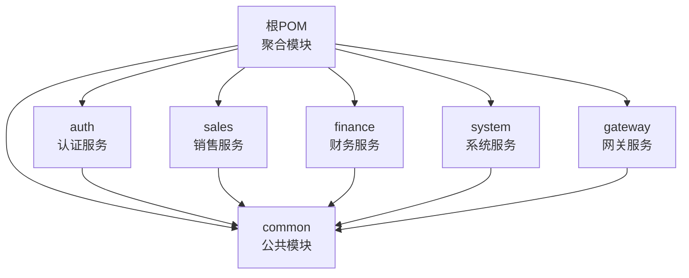
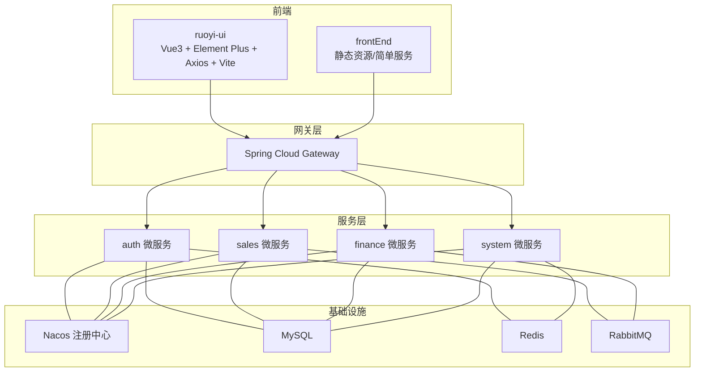
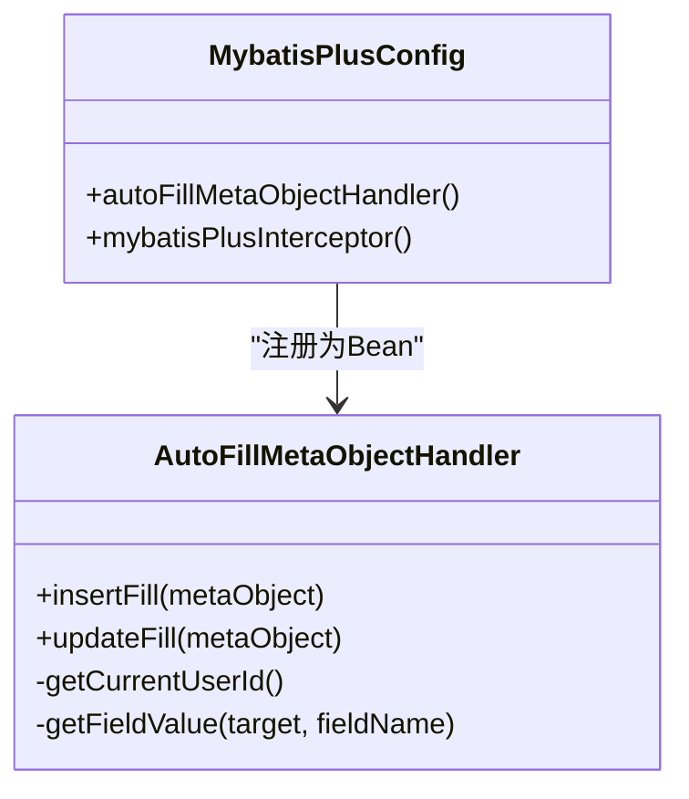
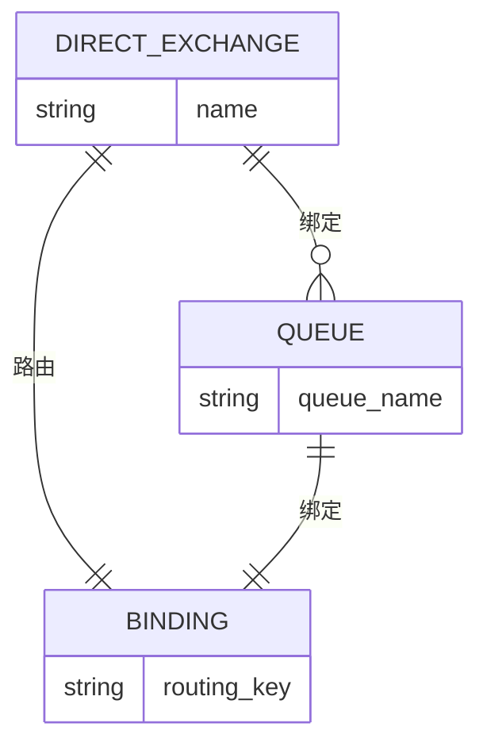
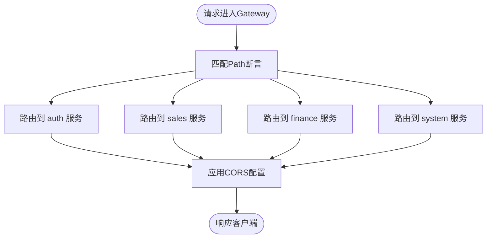
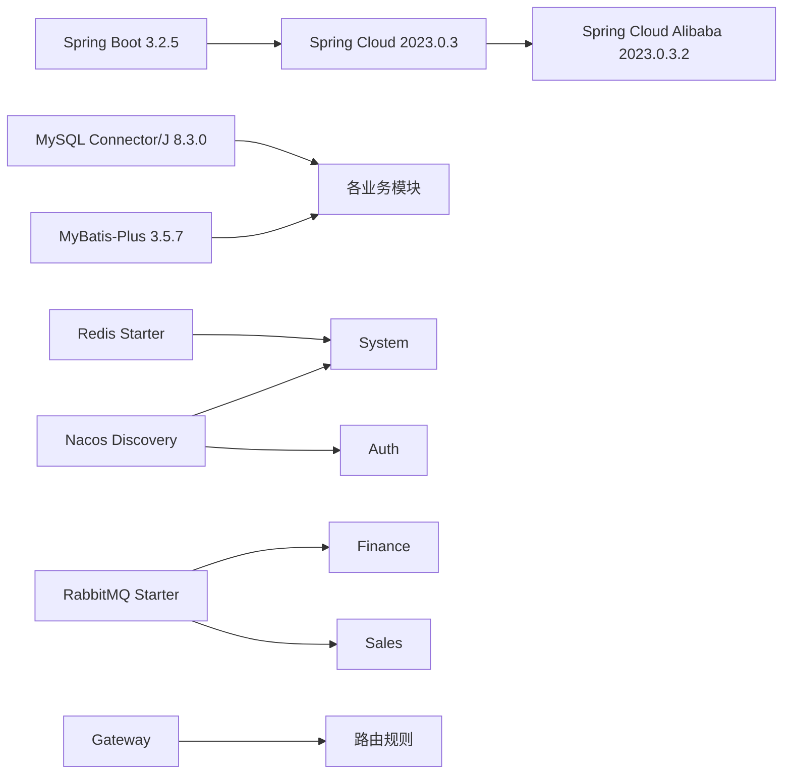

# 技术栈说明

<cite>
**本文引用的文件**
- [pom.xml](file://pom.xml)
- [auth/pom.xml](file://auth/pom.xml)
- [sales/pom.xml](file://sales/pom.xml)
- [finance/pom.xml](file://finance/pom.xml)
- [system/pom.xml](file://system/pom.xml)
- [gateway/pom.xml](file://gateway/pom.xml)
- [auth/src/main/resources/application.yml](file://auth/src/main/resources/application.yml)
- [sales/src/main/resources/application.yml](file://sales/src/main/resources/application.yml)
- [finance/src/main/resources/application.yml](file://finance/src/main/resources/application.yml)
- [system/src/main/resources/application.yml](file://system/src/main/resources/application.yml)
- [gateway/src/main/resources/application.yml](file://gateway/src/main/resources/application.yml)
- [common/src/main/java/com/dafuweng/common/config/MybatisPlusConfig.java](file://common/src/main/java/com/dafuweng/common/config/MybatisPlusConfig.java)
- [common/src/main/java/com/dafuweng/common/config/AutoFillMetaObjectHandler.java](file://common/src/main/java/com/dafuweng/common/config/AutoFillMetaObjectHandler.java)
- [common/src/main/java/com/dafuweng/common/mq/MqConfig.java](file://common/src/main/java/com/dafuweng/common/mq/MqConfig.java)
- [ruoyi-ui/package.json](file://ruoyi-ui/package.json)
- [frontEnd/package.json](file://frontEnd/package.json)
</cite>

## 目录
1. [简介](#简介)
2. [项目结构](#项目结构)
3. [核心组件](#核心组件)
4. [架构总览](#架构总览)
5. [详细组件分析](#详细组件分析)
6. [依赖分析](#依赖分析)
7. [性能考虑](#性能考虑)
8. [故障排查指南](#故障排查指南)
9. [结论](#结论)
10. [附录](#附录)

## 简介
本文件面向NeoCC项目的开发者与维护者，系统性梳理并解释后端与前端技术栈选型、版本兼容性与最佳实践。后端采用Spring Boot 3.2+ + Spring Cloud Alibaba 2023生态，结合MyBatis-Plus、MySQL、Redis、RabbitMQ与Nacos实现微服务治理；前端采用Vue3 + Vite + Element Plus + Axios + Pinia（在ruoyi-ui中体现），并辅以Docker容器化部署与Git版本控制。文档同时给出技术栈版本对应关系与升级建议，帮助团队在保证稳定性的前提下有序演进。

## 项目结构
NeoCC是一个多模块Maven聚合工程，包含公共模块与多个业务微服务模块，以及网关与前端工程。后端各模块均基于Spring Boot 3.2.5与Spring Cloud 2023.0.3进行依赖管理与版本对齐，统一通过dependencyManagement集中声明MyBatis-Plus、MySQL驱动与Spring Cloud Alibaba版本，确保跨模块一致性。

图表来源
- [pom.xml:12-19](file://pom.xml#L12-L19)
- [auth/pom.xml:7-11](file://auth/pom.xml#L7-L11)
- [sales/pom.xml:7-12](file://sales/pom.xml#L7-L12)
- [finance/pom.xml:7-11](file://finance/pom.xml#L7-L11)
- [system/pom.xml:7-12](file://system/pom.xml#L7-L12)
- [gateway/pom.xml:8-12](file://gateway/pom.xml#L8-L12)

章节来源
- [pom.xml:12-19](file://pom.xml#L12-L19)

## 核心组件
- 后端框架与治理
  - Spring Boot 3.2.5：提供自动配置、Web嵌入式服务器与开发体验增强。
  - Spring Cloud 2023.0.3：提供服务发现、网关、负载均衡与OpenFeign能力。
  - Spring Cloud Alibaba 2023.0.3.2：集成Nacos注册发现、流量治理与配置中心能力。
- 数据访问与持久层
  - MyBatis-Plus 3.5.7：简化CRUD与逻辑删除、自动填充、分页插件等。
  - MySQL Connector/J 8.3.0：JDBC驱动，支持Spring Boot 3.x。
- 缓存与消息
  - Redis：通过spring-boot-starter-data-redis接入，用于会话、限流与缓存。
  - RabbitMQ：通过spring-boot-starter-amqp接入，用于模块间事件解耦。
- 服务编排与网关
  - Spring Cloud Gateway：路由转发、CORS与全局过滤。
- 前端技术栈
  - Vue3 3.5.26 + Vite 6.4.1：现代化构建与开发体验。
  - Element Plus 2.13.1 + Axios 1.13.2 + Pinia 3.0.4：UI组件、HTTP请求与状态管理。
- 开发工具链
  - Maven：多模块项目管理与依赖统一。
  - Docker：容器化打包与部署（见各模块Dockerfile与compose文件）。
  - Git：版本控制（仓库可见.gitignore与脚本）。

章节来源
- [auth/pom.xml:17-22](file://auth/pom.xml#L17-L22)
- [sales/pom.xml:19-25](file://sales/pom.xml#L19-L25)
- [finance/pom.xml:17-22](file://finance/pom.xml#L17-L22)
- [system/pom.xml:19-25](file://system/pom.xml#L19-L25)
- [ruoyi-ui/package.json:18-37](file://ruoyi-ui/package.json#L18-L37)

## 架构总览
NeoCC采用前后端分离与微服务架构。前端通过网关统一接入后端各微服务，服务间通过Nacos注册发现与OpenFeign进行通信，异步事件通过RabbitMQ解耦。Redis用于缓存与会话，MySQL承载业务数据。

图表来源
- [gateway/src/main/resources/application.yml:10-51](file://gateway/src/main/resources/application.yml#L10-L51)
- [auth/src/main/resources/application.yml:12-18](file://auth/src/main/resources/application.yml#L12-L18)
- [system/src/main/resources/application.yml:12-24](file://system/src/main/resources/application.yml#L12-L24)
- [sales/pom.xml:137-141](file://sales/pom.xml#L137-L141)
- [finance/pom.xml:127-131](file://finance/pom.xml#L127-L131)

## 详细组件分析

### 后端通用配置与MyBatis-Plus
- MyBatis-Plus全局配置
  - 自动填充：在插入/更新时自动填充创建时间、更新时间与操作人字段，避免重复样板代码。
  - 分页插件：统一启用MySQL分页插件，保障查询性能与一致性。
- 安全上下文自动填充
  - 通过SecurityContextHolder获取当前用户ID，利用反射访问用户实体字段，避免common模块对auth模块的直接依赖，提升模块解耦度。

图表来源
- [common/src/main/java/com/dafuweng/common/config/MybatisPlusConfig.java:14-28](file://common/src/main/java/com/dafuweng/common/config/MybatisPlusConfig.java#L14-L28)
- [common/src/main/java/com/dafuweng/common/config/AutoFillMetaObjectHandler.java:23-86](file://common/src/main/java/com/dafuweng/common/config/AutoFillMetaObjectHandler.java#L23-L86)

章节来源
- [common/src/main/java/com/dafuweng/common/config/MybatisPlusConfig.java:14-28](file://common/src/main/java/com/dafuweng/common/config/MybatisPlusConfig.java#L14-L28)
- [common/src/main/java/com/dafuweng/common/config/AutoFillMetaObjectHandler.java:23-86](file://common/src/main/java/com/dafuweng/common/config/AutoFillMetaObjectHandler.java#L23-L86)

### RabbitMQ事件与队列配置
- 事件模型
  - 定向交换机：sales.exchange
  - 队列：contract.signed.queue、loan.approved.queue
  - 路由键：contract.signed、loan.approved
- 作用
  - 销售模块发布“合同已签署”事件，财务模块订阅并处理放款审批流程。
  - 降低模块间耦合，提高系统扩展性与可靠性。

图表来源
- [common/src/main/java/com/dafuweng/common/mq/MqConfig.java:12-49](file://common/src/main/java/com/dafuweng/common/mq/MqConfig.java#L12-L49)

章节来源
- [common/src/main/java/com/dafuweng/common/mq/MqConfig.java:12-49](file://common/src/main/java/com/dafuweng/common/mq/MqConfig.java#L12-L49)

### 网关路由与跨域配置
- 路由规则
  - 将/auth/**、/sales/**、/finance/**、/system/**等路径分别转发至对应服务。
  - 对部分根路径（如登录、验证码等）直接代理到auth服务。
- 跨域策略
  - 允许任意来源、常用方法与头部，关闭凭据，设置预检缓存时长。

图表来源
- [gateway/src/main/resources/application.yml:17-148](file://gateway/src/main/resources/application.yml#L17-L148)

章节来源
- [gateway/src/main/resources/application.yml:17-148](file://gateway/src/main/resources/application.yml#L17-L148)

### 应用配置要点（以模块为单位）
- 认证服务（auth）
  - 数据源指向本地数据库，Nacos注册地址与命名空间配置。
  - MyBatis-Plus映射文件与驼峰配置、逻辑删除字段。
- 销售服务（sales）
  - 数据源指向Docker网络中的MySQL容器，禁用Nacos注册（独立运行时）。
  - 启用RabbitMQ与OpenFeign、负载均衡。
- 财务服务（finance）
  - 数据源指向Docker网络中的MySQL容器，禁用Nacos注册。
  - 启用RabbitMQ与OpenFeign、负载均衡。
- 系统服务（system）
  - 数据源指向本地数据库，配置Redis连接信息与Nacos注册。
  - 启用Redis与AOP。
- 网关服务（gateway）
  - Web应用类型为reactive，配置Nacos与路由表、CORS。

章节来源
- [auth/src/main/resources/application.yml:4-35](file://auth/src/main/resources/application.yml#L4-L35)
- [sales/src/main/resources/application.yml:4-35](file://sales/src/main/resources/application.yml#L4-L35)
- [finance/src/main/resources/application.yml:4-32](file://finance/src/main/resources/application.yml#L4-L32)
- [system/src/main/resources/application.yml:4-41](file://system/src/main/resources/application.yml#L4-L41)
- [gateway/src/main/resources/application.yml:4-165](file://gateway/src/main/resources/application.yml#L4-L165)

## 依赖分析
- 版本对齐与依赖管理
  - 所有模块统一继承Spring Boot 3.2.5父POM，确保Spring Framework、Web、事务等组件版本一致。
  - 通过dependencyManagement集中声明MyBatis-Plus、MySQL驱动与Spring Cloud Alibaba版本，避免子模块重复指定。
  - Spring Cloud与Spring Cloud Alibaba版本号保持一致，确保兼容性。
- 模块间依赖
  - 各业务模块依赖common公共模块，复用配置、异常处理、MQ配置与工具类。
  - 网关依赖common，统一跨域与通用配置。
- 外部依赖
  - Nacos：服务注册与发现（auth、system、gateway启用，sales/finance在独立运行时可禁用）。
  - RabbitMQ：模块间事件解耦（sales、finance启用）。
  - Redis：缓存与会话（system启用）。

图表来源
- [auth/pom.xml:24-60](file://auth/pom.xml#L24-L60)
- [sales/pom.xml:27-63](file://sales/pom.xml#L27-L63)
- [finance/pom.xml:24-60](file://finance/pom.xml#L24-L60)
- [system/pom.xml:27-63](file://system/pom.xml#L27-L63)
- [gateway/pom.xml:25-44](file://gateway/pom.xml#L25-L44)

章节来源
- [auth/pom.xml:24-60](file://auth/pom.xml#L24-L60)
- [sales/pom.xml:27-63](file://sales/pom.xml#L27-L63)
- [finance/pom.xml:24-60](file://finance/pom.xml#L24-L60)
- [system/pom.xml:27-63](file://system/pom.xml#L27-L63)
- [gateway/pom.xml:25-44](file://gateway/pom.xml#L25-L44)

## 性能考虑
- 数据访问层
  - 启用分页插件与逻辑删除，减少全表扫描与冗余数据。
  - 使用自动填充避免重复SQL写入，降低出错率与开销。
- 缓存与会话
  - Redis用于热点数据与会话缓存，建议配合TTL与淘汰策略，避免内存压力。
- 网关与路由
  - Gateway采用响应式Web，适合高并发I/O密集场景；合理配置路由与CORS，避免不必要的跨域预检。
- 消息队列
  - 使用定向交换机与明确路由键，避免广播风暴；消费者侧注意幂等与重试策略。
- 数据库连接
  - 控制连接池大小与超时时间，避免连接泄漏；对慢查询开启日志定位。

## 故障排查指南
- 启动失败（端口占用/依赖不可达）
  - 检查application.yml中的端口、数据库URL、Redis/Nacos地址是否正确。
  - 确认容器或本机服务已启动且网络可达。
- Nacos注册失败
  - 核对server-addr、用户名密码与namespace是否与实际一致。
  - 若模块禁用Nacos注册，请确认路由与直连地址配置正确。
- RabbitMQ事件未到达
  - 检查交换机、队列、路由键是否一致；确认生产者已发送事件，消费者已绑定相应路由键。
- MyBatis-Plus逻辑删除/自动填充异常
  - 确认实体字段名与自动填充字段一致；检查SecurityContext是否包含认证信息（无用户上下文时自动填充可能为空）。
- 网关跨域问题
  - 检查globalcors配置是否覆盖目标路径；确认浏览器是否收到CORS响应头。

章节来源
- [auth/src/main/resources/application.yml:12-18](file://auth/src/main/resources/application.yml#L12-L18)
- [system/src/main/resources/application.yml:12-24](file://system/src/main/resources/application.yml#L12-L24)
- [sales/src/main/resources/application.yml:14-15](file://sales/src/main/resources/application.yml#L14-L15)
- [finance/src/main/resources/application.yml:13-15](file://finance/src/main/resources/application.yml#L13-L15)
- [common/src/main/java/com/dafuweng/common/mq/MqConfig.java:14-19](file://common/src/main/java/com/dafuweng/common/mq/MqConfig.java#L14-L19)
- [common/src/main/java/com/dafuweng/common/config/AutoFillMetaObjectHandler.java:53-69](file://common/src/main/java/com/dafuweng/common/config/AutoFillMetaObjectHandler.java#L53-L69)
- [gateway/src/main/resources/application.yml:136-148](file://gateway/src/main/resources/application.yml#L136-L148)

## 结论
NeoCC的技术栈围绕Spring Boot 3.2+与Spring Cloud 2023生态展开，通过MyBatis-Plus提升数据访问效率，借助Nacos、RabbitMQ与Redis完善微服务治理与异步解耦，前端采用Vue3 + Element Plus + Vite构建现代化界面。版本管理通过dependencyManagement集中控制，确保跨模块一致性与可维护性。建议在后续迭代中持续关注Spring生态与前端工具链的长期支持周期，按需进行平滑升级。

## 附录

### 技术栈版本对应关系
- Spring Boot：3.2.5
- Spring Cloud：2023.0.3
- Spring Cloud Alibaba：2023.0.3.2
- MyBatis-Plus：3.5.7
- MySQL Connector/J：8.3.0
- RabbitMQ Starter：随Spring Boot自动装配
- Redis Starter：随Spring Boot自动装配
- Vue3：3.5.26
- Vite：6.4.1
- Element Plus：2.13.1
- Axios：1.13.2
- Pinia：3.0.4

章节来源
- [auth/pom.xml:17-22](file://auth/pom.xml#L17-L22)
- [sales/pom.xml:19-25](file://sales/pom.xml#L19-L25)
- [finance/pom.xml:17-22](file://finance/pom.xml#L17-L22)
- [system/pom.xml:19-25](file://system/pom.xml#L19-L25)
- [ruoyi-ui/package.json:18-37](file://ruoyi-ui/package.json#L18-L37)

### 升级建议
- Spring Boot与Spring Cloud
  - 建议在小版本内滚动升级，优先选择长期支持（LTS）版本组合，确保生态兼容性。
- MyBatis-Plus
  - 升级前验证自动填充与分页插件行为，确保逻辑删除字段与命名规范一致。
- 前端生态
  - Vue3与Vite版本升级需同步检查Element Plus与Axios的兼容性，优先在测试环境验证。
- 数据库与驱动
  - MySQL驱动升级需验证SQL语法与时区配置，确保连接参数与字符集设置正确。
- 消息与缓存
  - RabbitMQ与Redis升级需评估序列化格式与连接参数变更，做好灰度与回滚预案。