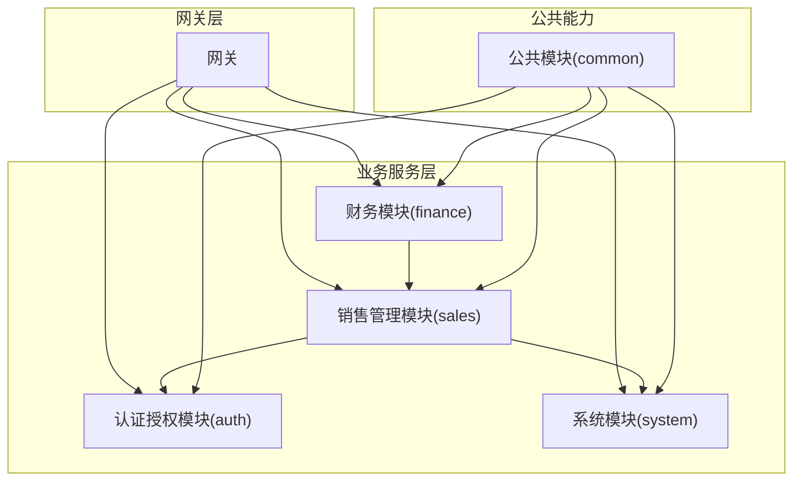
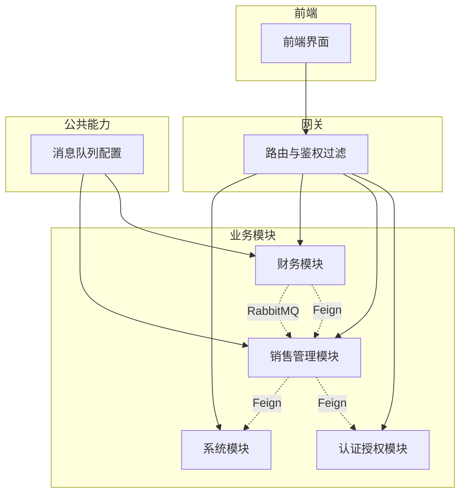
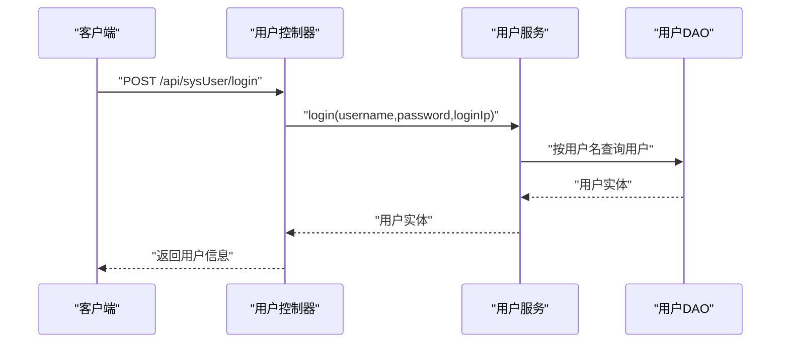
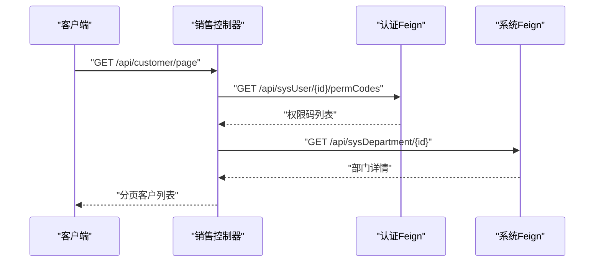
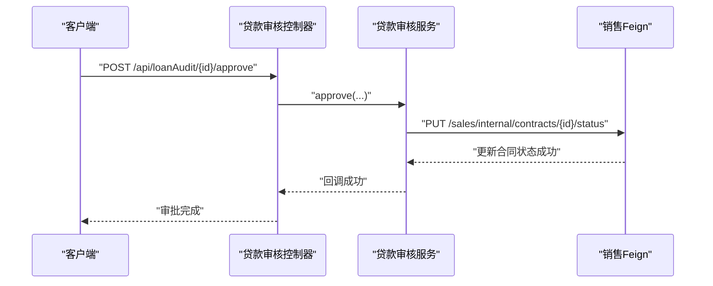
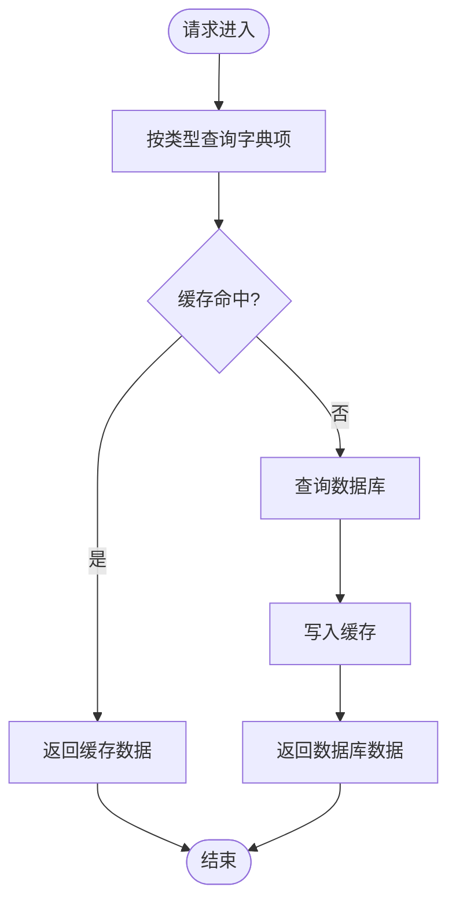
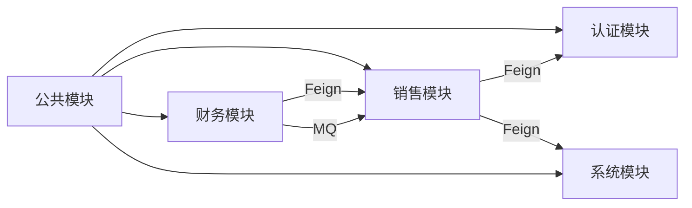

# 核心业务模块

<cite>
**本文引用的文件**
- [AuthApplication.java](file://auth/src/main/java/com/dafuweng/AuthApplication.java)
- [SysUserController.java](file://auth/src/main/java/com/dafuweng/auth/controller/SysUserController.java)
- [SalesApplication.java](file://sales/src/main/java/com/dafuweng/sales/SalesApplication.java)
- [CustomerController.java](file://sales/src/main/java/com/dafuweng/sales/controller/CustomerController.java)
- [FinanceApplication.java](file://finance/src/main/java/com/dafuweng/finance/FinanceApplication.java)
- [LoanAuditController.java](file://finance/src/main/java/com/dafuweng/finance/controller/LoanAuditController.java)
- [SystemApplication.java](file://system/src/main/java/com/dafuweng/system/SystemApplication.java)
- [SysDictController.java](file://system/src/main/java/com/dafuweng/system/controller/SysDictController.java)
- [AuthFeignClient.java](file://sales/src/main/java/com/dafuweng/sales/feign/AuthFeignClient.java)
- [SystemFeignClient.java](file://sales/src/main/java/com/dafuweng/sales/feign/SystemFeignClient.java)
- [SalesFeignClient.java](file://finance/src/main/java/com/dafuweng/finance/feign/SalesFeignClient.java)
- [MqConfig.java](file://common/src/main/java/com/dafuweng/common/mq/MqConfig.java)
</cite>

## 目录
1. [简介](#简介)
2. [项目结构](#项目结构)
3. [核心组件](#核心组件)
4. [架构总览](#架构总览)
5. [详细组件分析](#详细组件分析)
6. [依赖分析](#依赖分析)
7. [性能考虑](#性能考虑)
8. [故障排查指南](#故障排查指南)
9. [结论](#结论)

## 简介
本文件面向NeoCC项目的“核心业务模块”，系统性阐述四大模块的职责边界与协作方式：  
- 认证授权模块：负责用户身份验证、角色权限管理与安全访问控制  
- 销售管理模块：负责客户关系管理、合同生命周期管理与销售业绩管理  
- 财务模块：负责贷款审核、银行对接与服务费结算  
- 系统模块：负责组织架构与数据字典维护  

通过模块化设计，系统实现高内聚、低耦合，支持独立演进与弹性扩展；并通过Feign远程调用与消息队列实现跨模块可靠协作。

## 项目结构
NeoCC采用多模块分层架构，每个业务域独立为一个子工程，统一在公共模块中沉淀通用能力（如Result封装、分页模型、全局异常处理、消息队列配置等）。  
- 认证授权模块（auth）：提供用户、角色、权限的CRUD与登录登出能力  
- 销售管理模块（sales）：提供客户、合同、联系记录、工作日志与业绩记录管理，并通过Feign调用认证与系统模块  
- 财务模块（finance）：提供贷款审核、产品、银行、佣金与服务费记录管理，并通过Feign调用销售模块  
- 系统模块（system）：提供部门、区域、参数、字典与操作日志管理  
- 公共模块（common）：提供统一返回体、分页模型、全局异常处理以及消息队列交换与队列配置

**图表来源**
- [AuthApplication.java:1-16](file://auth/src/main/java/com/dafuweng/AuthApplication.java#L1-L16)
- [SalesApplication.java:1-17](file://sales/src/main/java/com/dafuweng/sales/SalesApplication.java#L1-L17)
- [FinanceApplication.java:1-20](file://finance/src/main/java/com/dafuweng/finance/FinanceApplication.java#L1-L20)
- [SystemApplication.java:1-16](file://system/src/main/java/com/dafuweng/system/SystemApplication.java#L1-L16)

**章节来源**
- [AuthApplication.java:1-16](file://auth/src/main/java/com/dafuweng/AuthApplication.java#L1-L16)
- [SalesApplication.java:1-17](file://sales/src/main/java/com/dafuweng/sales/SalesApplication.java#L1-L17)
- [FinanceApplication.java:1-20](file://finance/src/main/java/com/dafuweng/finance/FinanceApplication.java#L1-L20)
- [SystemApplication.java:1-16](file://system/src/main/java/com/dafuweng/system/SystemApplication.java#L1-L16)

## 核心组件
- 认证授权模块（auth）  
  - 职责：用户管理、角色管理、权限管理、登录登出、密码变更与解锁  
  - 关键入口：用户控制器提供REST接口，支撑前端登录与用户管理  
  - 安全过滤：内置JWT过滤器，结合Spring Security配置进行统一鉴权  
  - 依赖：MyBatis Mapper扫描、Spring Cloud注册发现  

- 销售管理模块（sales）  
  - 职责：客户管理、合同管理、联系记录、工作日志、销售业绩记录  
  - 关键入口：客户控制器提供客户CRUD与分页查询；合同控制器提供合同生命周期管理  
  - 外部依赖：通过Feign客户端调用认证模块与系统模块；定时任务读取系统参数  
  - 数据来源：MyBatis Mapper与数据库持久化  

- 财务模块（finance）  
  - 职责：贷款审核流程管理（接收、复核、提交银行、银行结果、审批/拒绝）、产品与银行管理、佣金与服务费记录  
  - 关键入口：贷款审核控制器提供完整流程接口  
  - 协作机制：通过消息队列与Feign与销售模块解耦联动  
  - 消息集成：基于RabbitMQ的Direct Exchange与队列绑定  

- 系统模块（system）  
  - 职责：部门与区域管理、参数配置、数据字典、操作日志  
  - 关键入口：字典控制器提供按类型查询与CRUD  
  - 缓存能力：启用缓存注解以提升字典与参数读取性能  

**章节来源**
- [SysUserController.java:1-98](file://auth/src/main/java/com/dafuweng/auth/controller/SysUserController.java#L1-L98)
- [CustomerController.java:1-56](file://sales/src/main/java/com/dafuweng/sales/controller/CustomerController.java#L1-L56)
- [LoanAuditController.java:1-143](file://finance/src/main/java/com/dafuweng/finance/controller/LoanAuditController.java#L1-L143)
- [SysDictController.java:1-51](file://system/src/main/java/com/dafuweng/system/controller/SysDictController.java#L1-L51)

## 架构总览
下图展示四大模块的职责划分与交互路径，包括HTTP调用（Feign）与消息传递（RabbitMQ）两种协作方式。

**图表来源**
- [AuthFeignClient.java:1-24](file://sales/src/main/java/com/dafuweng/sales/feign/AuthFeignClient.java#L1-L24)
- [SystemFeignClient.java:1-30](file://sales/src/main/java/com/dafuweng/sales/feign/SystemFeignClient.java#L1-L30)
- [SalesFeignClient.java:1-23](file://finance/src/main/java/com/dafuweng/finance/feign/SalesFeignClient.java#L1-L23)
- [MqConfig.java:1-50](file://common/src/main/java/com/dafuweng/common/mq/MqConfig.java#L1-L50)

## 详细组件分析

### 认证授权模块（auth）
- 功能定位：统一用户身份认证与权限控制，为其他模块提供鉴权与授权依据  
- 关键流程：登录校验、权限码查询、角色分配、密码变更与解锁  
- 接口要点：  
  - 登录/登出：接收用户名与密码，返回用户信息或执行登出  
  - 权限查询：按用户ID返回权限码集合，供业务前置鉴权  
  - 角色管理：支持为用户分配角色  
  - 用户管理：提供CRUD与分页查询  

**图表来源**
- [SysUserController.java:41-47](file://auth/src/main/java/com/dafuweng/auth/controller/SysUserController.java#L41-L47)

**章节来源**
- [SysUserController.java:1-98](file://auth/src/main/java/com/dafuweng/auth/controller/SysUserController.java#L1-L98)

### 销售管理模块（sales）
- 功能定位：客户关系与合同生命周期管理，支撑销售业绩统计与工作记录  
- 关键流程：  
  - 客户管理：新增、更新、删除、分页查询、按销售代表与状态筛选  
  - 合同管理：合同创建、附件管理、状态变更、服务费支付标记  
  - 业绩管理：根据合同与规则生成业绩记录  
  - 外部依赖：调用认证模块获取用户信息与权限码；调用系统模块获取部门/区域与系统参数  
- 外部接口：  
  - 认证Feign：获取用户信息、查询权限码  
  - 系统Feign：获取部门/区域详情、读取系统参数  

**图表来源**
- [CustomerController.java:25-28](file://sales/src/main/java/com/dafuweng/sales/controller/CustomerController.java#L25-L28)
- [AuthFeignClient.java:21-22](file://sales/src/main/java/com/dafuweng/sales/feign/AuthFeignClient.java#L21-L22)
- [SystemFeignClient.java:14-15](file://sales/src/main/java/com/dafuweng/sales/feign/SystemFeignClient.java#L14-L15)

**章节来源**
- [CustomerController.java:1-56](file://sales/src/main/java/com/dafuweng/sales/controller/CustomerController.java#L1-L56)
- [AuthFeignClient.java:1-24](file://sales/src/main/java/com/dafuweng/sales/feign/AuthFeignClient.java#L1-L24)
- [SystemFeignClient.java:1-30](file://sales/src/main/java/com/dafuweng/sales/feign/SystemFeignClient.java#L1-L30)

### 财务模块（finance）
- 功能定位：贷款审核全流程管理与费用结算，保障资金流与业务流协同  
- 关键流程：  
  - 贷款审核：接收、复核、提交银行、银行反馈、审批/拒绝  
  - 结算联动：与销售模块协作，基于合同与业绩生成佣金与服务费记录  
  - 消息驱动：监听合同签署事件，触发贷款审批流程  
- 外部接口：  
  - 销售Feign：创建业绩、更新合同状态、查询合同详情、标记服务费已支付  

**图表来源**
- [LoanAuditController.java:110-129](file://finance/src/main/java/com/dafuweng/finance/controller/LoanAuditController.java#L110-L129)
- [SalesFeignClient.java:14-15](file://finance/src/main/java/com/dafuweng/finance/feign/SalesFeignClient.java#L14-L15)

**章节来源**
- [LoanAuditController.java:1-143](file://finance/src/main/java/com/dafuweng/finance/controller/LoanAuditController.java#L1-L143)
- [SalesFeignClient.java:1-23](file://finance/src/main/java/com/dafuweng/finance/feign/SalesFeignClient.java#L1-L23)

### 系统模块（system）
- 功能定位：组织架构与数据字典维护，为销售与财务模块提供上下文数据  
- 关键流程：  
  - 字典管理：按类型查询字典项、CRUD维护  
  - 参数管理：按键读取参数值，供定时任务与业务逻辑使用  
  - 部门/区域：支撑销售业绩归属与区域结算  
- 性能优化：启用缓存注解，降低高频读取开销  

**图表来源**
- [SysDictController.java:30-33](file://system/src/main/java/com/dafuweng/system/controller/SysDictController.java#L30-L33)
- [SystemApplication.java:10](file://system/src/main/java/com/dafuweng/system/SystemApplication.java#L10)

**章节来源**
- [SysDictController.java:1-51](file://system/src/main/java/com/dafuweng/system/controller/SysDictController.java#L1-L51)
- [SystemApplication.java:1-16](file://system/src/main/java/com/dafuweng/system/SystemApplication.java#L1-L16)

## 依赖分析
- 模块内聚与边界  
  - 每个模块围绕单一业务域构建，控制器、服务、DAO与Feign客户端边界清晰  
  - 公共模块仅提供通用基础设施，避免业务侵入  
- 跨模块依赖  
  - 销售模块依赖认证与系统模块（Feign）  
  - 财务模块依赖销售模块（Feign）  
  - 所有模块共享公共消息队列配置  
- 依赖可视化  

**图表来源**
- [AuthFeignClient.java:1-24](file://sales/src/main/java/com/dafuweng/sales/feign/AuthFeignClient.java#L1-L24)
- [SystemFeignClient.java:1-30](file://sales/src/main/java/com/dafuweng/sales/feign/SystemFeignClient.java#L1-L30)
- [SalesFeignClient.java:1-23](file://finance/src/main/java/com/dafuweng/finance/feign/SalesFeignClient.java#L1-L23)
- [MqConfig.java:1-50](file://common/src/main/java/com/dafuweng/common/mq/MqConfig.java#L1-L50)

**章节来源**
- [AuthFeignClient.java:1-24](file://sales/src/main/java/com/dafuweng/sales/feign/AuthFeignClient.java#L1-L24)
- [SystemFeignClient.java:1-30](file://sales/src/main/java/com/dafuweng/sales/feign/SystemFeignClient.java#L1-L30)
- [SalesFeignClient.java:1-23](file://finance/src/main/java/com/dafuweng/finance/feign/SalesFeignClient.java#L1-L23)
- [MqConfig.java:1-50](file://common/src/main/java/com/dafuweng/common/mq/MqConfig.java#L1-L50)

## 性能考虑
- 缓存策略：系统模块启用缓存注解，建议对高频字典与参数查询使用本地缓存，减少数据库压力  
- 异步解耦：财务模块通过消息队列异步监听合同签署事件，避免长链路阻塞  
- 分页与批量：销售与财务模块广泛使用分页模型，建议在大数据量场景下配合索引与分页参数优化  
- 并发控制：贷款审核流程涉及金额与日期字段，建议在服务层增加幂等与并发控制措施（如版本号或唯一键约束）

## 故障排查指南
- 登录鉴权失败  
  - 检查认证模块是否正确返回用户信息与权限码  
  - 核对JWT过滤器是否正确解析与放行  
  - 参考：[SysUserController.java:41-47](file://auth/src/main/java/com/dafuweng/auth/controller/SysUserController.java#L41-L47)  
- 客户查询无权限  
  - 确认销售模块是否正确调用认证Feign获取权限码  
  - 参考：[AuthFeignClient.java:21-22](file://sales/src/main/java/com/dafuweng/sales/feign/AuthFeignClient.java#L21-L22)  
- 合同状态未更新  
  - 检查财务模块是否正确调用销售Feign更新合同状态  
  - 参考：[SalesFeignClient.java:14-15](file://finance/src/main/java/com/dafuweng/finance/feign/SalesFeignClient.java#L14-L15)  
- 贷款审批后业绩未生成  
  - 核对财务模块是否正确创建业绩记录  
  - 参考：[SalesFeignClient.java:11-12](file://finance/src/main/java/com/dafuweng/finance/feign/SalesFeignClient.java#L11-L12)  
- 消息未到达  
  - 检查消息交换、队列与路由键配置是否一致  
  - 参考：[MqConfig.java:14-48](file://common/src/main/java/com/dafuweng/common/mq/MqConfig.java#L14-L48)

**章节来源**
- [SysUserController.java:41-47](file://auth/src/main/java/com/dafuweng/auth/controller/SysUserController.java#L41-L47)
- [AuthFeignClient.java:21-22](file://sales/src/main/java/com/dafuweng/sales/feign/AuthFeignClient.java#L21-L22)
- [SalesFeignClient.java:11-15](file://finance/src/main/java/com/dafuweng/finance/feign/SalesFeignClient.java#L11-L15)
- [MqConfig.java:14-48](file://common/src/main/java/com/dafuweng/common/mq/MqConfig.java#L14-L48)

## 结论
NeoCC通过四大核心业务模块实现了清晰的职责划分与稳健的协作机制：  
- 认证授权模块提供统一的安全基座  
- 销售管理模块聚焦客户与合同生命周期  
- 财务模块承接贷款与结算流程  
- 系统模块提供组织与数据字典支撑  
模块化设计提升了可维护性与可扩展性，结合Feign与消息队列实现了松耦合与高可用的业务流转。