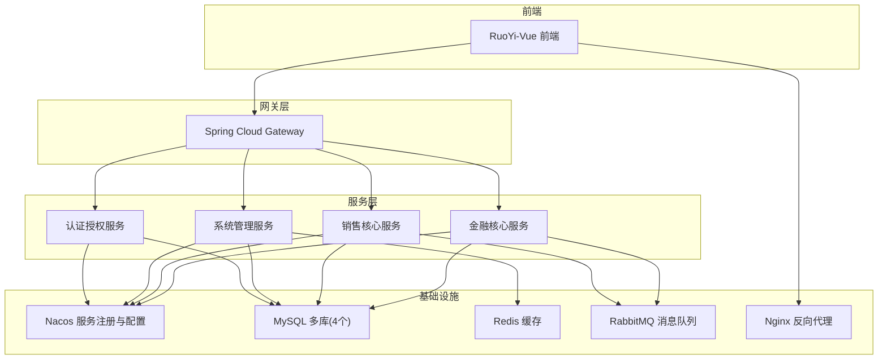
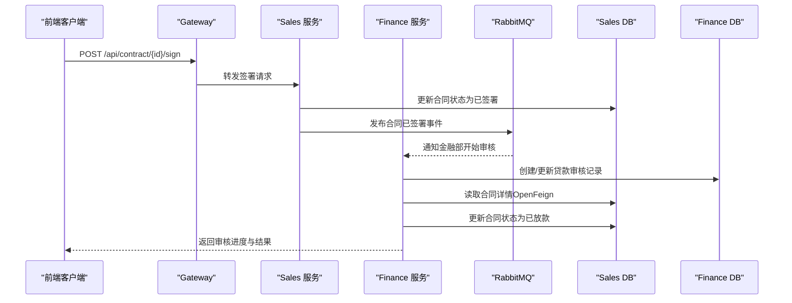
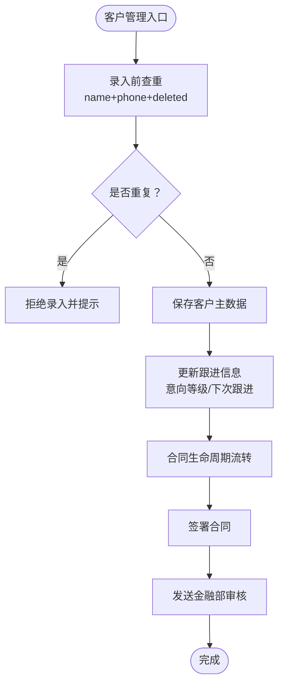
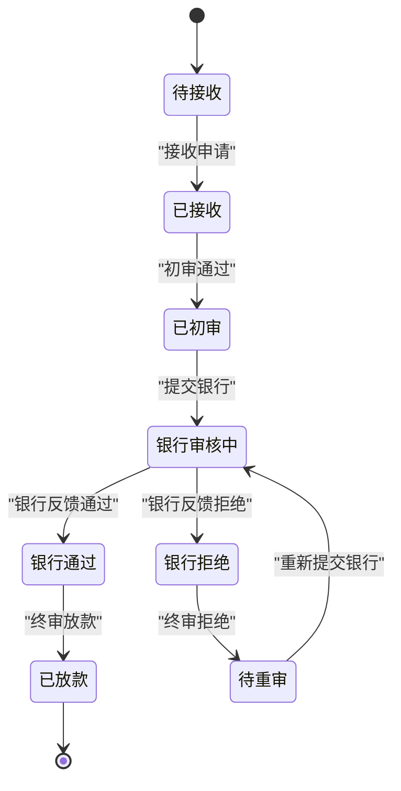
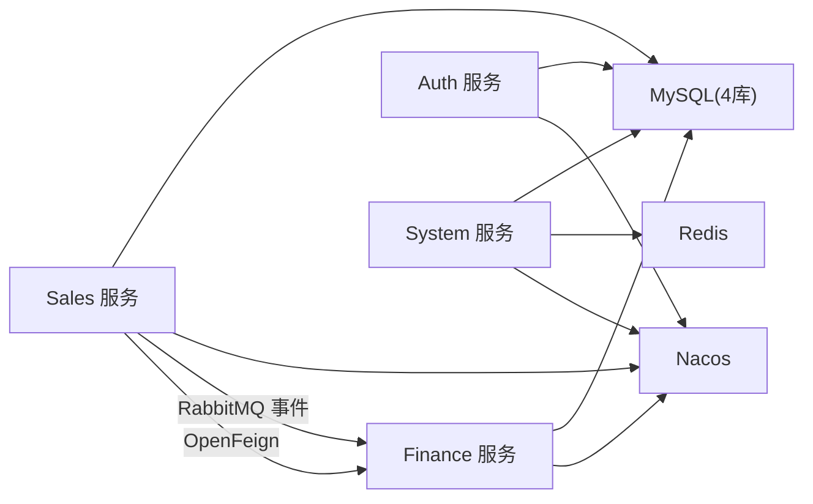

# 项目介绍

<cite>
**本文引用的文件**
- [pom.xml](file://pom.xml)
- [dataDesign.md](file://dataDesign.md)
- [implementDetails.md](file://implementDetails.md)
- [init-db.sql](file://scripts/init-db.sql)
- [docker-compose.yml](file://docker-compose.yml)
- [quick-start.sh](file://quick-start.sh)
- [envs.md](file://envs.md)
- [CustomerController.java](file://sales/src/main/java/com/dafuweng/sales/controller/CustomerController.java)
- [ContractController.java](file://sales/src/main/java/com/dafuweng/sales/controller/ContractController.java)
- [LoanAuditController.java](file://finance/src/main/java/com/dafuweng/finance/controller/LoanAuditController.java)
- [CommissionRecordController.java](file://finance/src/main/java/com/dafuweng/finance/controller/CommissionRecordController.java)
- [CustomerServiceImpl.java](file://sales/src/main/java/com/dafuweng/sales/service/impl/CustomerServiceImpl.java)
- [LoanAuditServiceImpl.java](file://finance/src/main/java/com/dafuweng/finance/service/impl/LoanAuditServiceImpl.java)
- [README.md](file://ruoyi-ui/README.md)
- [甲方要求.md](file://甲方要求.md)
</cite>

## 目录
1. [引言](#引言)
2. [项目结构](#项目结构)
3. [核心组件](#核心组件)
4. [架构总览](#架构总览)
5. [详细组件分析](#详细组件分析)
6. [依赖分析](#依赖分析)
7. [性能考虑](#性能考虑)
8. [故障排查指南](#故障排查指南)
9. [结论](#结论)
10. [附录](#附录)

## 引言
NeoCC金融管理系统是为大富翁金融服务公司打造的贷款业务管理平台，旨在通过数字化手段全面重构传统手工管理模式，提升贷款业务从“客户获取—合同签署—金融审核—银行放款—业绩结算”的全流程效率与透明度。系统以“销售核心”和“金融核心”两大业务域为主线，结合认证授权、系统管理与网关路由，形成高内聚、低耦合的微服务架构，满足公司对客户关系管理、合同生命周期管理、贷款审核流程优化、业绩计算自动化与风险控制增强的需求。

传统手工管理模式存在以下痛点：
- 信息孤岛严重：销售与金融之间缺乏实时协同，导致合同流转滞后、状态不一致。
- 人工成本高：大量重复性录入、核对与报表工作占用人力资源。
- 风险控制弱：缺乏可追溯的审核轨迹与统一的风控口径，争议处理困难。
- 数据口径不一致：财务与销售侧对合同金额、放款金额、提成计算等关键字段理解偏差较大。

通过NeoCC系统，公司将实现：
- 提升业务处理效率：合同签署、审核、放款、记账、提成发放等环节自动化与可视化。
- 降低人工成本：减少重复录入与手工核对，释放一线与后台人力。
- 增强风险控制能力：完整的审核轨迹与银行反馈记录，满足合规与审计要求。
- 提升客户体验：销售代表可移动端高效操作，客户跟进与合同管理更及时。

## 项目结构
项目采用多模块Maven聚合工程，按业务域拆分为认证授权、系统管理、销售核心、金融核心、网关与公共组件六大模块，配合Nacos服务注册与配置中心、MySQL多库、Redis缓存、RabbitMQ消息队列与Nginx反向代理，形成完整的容器化部署方案。

图表来源
- [docker-compose.yml:1-182](file://docker-compose.yml#L1-L182)
- [implementDetails.md:23-51](file://implementDetails.md#L23-L51)

章节来源
- [pom.xml:12-19](file://pom.xml#L12-L19)
- [docker-compose.yml:1-182](file://docker-compose.yml#L1-L182)
- [implementDetails.md:23-69](file://implementDetails.md#L23-L69)

## 核心组件
- 认证授权服务（auth-service）：提供用户登录、权限校验、角色与数据范围控制，支撑销售代表、金融专员、系统管理员等多角色协同。
- 系统管理服务（system-service）：负责组织架构（战区/部门）、系统参数、数据字典与操作日志管理，保障业务配置与审计合规。
- 销售核心服务（sales-service）：围绕“客户—洽谈—合同—业绩—公海”闭环，提供客户管理、合同生命周期管理、工作日志与业绩查询。
- 金融核心服务（finance-service）：以“贷款审核”为主线，覆盖接收申请、初审、提交银行、银行反馈、终审放款与服务费、提成管理。
- 网关服务（gateway-service）：统一入口、路由转发、鉴权与限流，屏蔽后端服务细节。
- 公共组件：统一响应结构、全局异常处理、自动填充元数据、OpenFeign配置与MQ事件定义。

章节来源
- [implementDetails.md:294-321](file://implementDetails.md#L294-L321)
- [implementDetails.md:623-738](file://implementDetails.md#L623-L738)
- [implementDetails.md:741-800](file://implementDetails.md#L741-L800)
- [implementDetails.md:241-323](file://implementDetails.md#L241-L323)

## 架构总览
系统采用前后端分离与微服务架构，前端基于RuoYi-Vue3，后端通过Spring Cloud Alibaba实现服务治理与通信。数据库按业务域垂直拆分，通过OpenFeign在应用层进行跨库查询，通过RabbitMQ实现跨服务异步事件通知，确保高内聚与低耦合。

图表来源
- [ContractController.java:65-74](file://sales/src/main/java/com/dafuweng/sales/controller/ContractController.java#L65-L74)
- [LoanAuditServiceImpl.java:203-242](file://finance/src/main/java/com/dafuweng/finance/service/impl/LoanAuditServiceImpl.java#L203-L242)
- [dataDesign.md:325-356](file://dataDesign.md#L325-L356)

章节来源
- [implementDetails.md:23-69](file://implementDetails.md#L23-L69)
- [dataDesign.md:325-356](file://dataDesign.md#L325-L356)

## 详细组件分析

### 客户关系管理（销售核心）
- 功能要点
  - 客户主数据管理：支持按销售代表、部门、战区、状态、意向等级等维度筛选与分页。
  - 公海客户管理：超期未跟进客户自动进入公海，支持领取与转移。
  - 洽谈记录与跟进：每次洽谈自动更新客户最近联系时间、意向等级与下次跟进时间。
  - 合同生命周期：草稿、已签署、已放款等状态流转，配合金融部审核与银行放款。
- 关键接口
  - 客户：GET/POST/PUT/DELETE，分页与按状态/销售代表查询。
  - 合同：GET/POST/PUT/DELETE，分页、按编号查询、签署与发送金融部。
- 业务价值
  - 防止数据孤岛，确保从客户到合同到业绩的完整链路可追溯。
  - 通过公海与转移机制，提升客户资源利用率与团队协作效率。

图表来源
- [CustomerController.java:1-56](file://sales/src/main/java/com/dafuweng/sales/controller/CustomerController.java#L1-L56)
- [ContractController.java:1-75](file://sales/src/main/java/com/dafuweng/sales/controller/ContractController.java#L1-L75)
- [CustomerServiceImpl.java:63-81](file://sales/src/main/java/com/dafuweng/sales/service/impl/CustomerServiceImpl.java#L63-L81)
- [dataDesign.md:160-239](file://dataDesign.md#L160-L239)

章节来源
- [CustomerController.java:14-55](file://sales/src/main/java/com/dafuweng/sales/controller/CustomerController.java#L14-L55)
- [ContractController.java:14-74](file://sales/src/main/java/com/dafuweng/sales/controller/ContractController.java#L14-L74)
- [CustomerServiceImpl.java:18-81](file://sales/src/main/java/com/dafuweng/sales/service/impl/CustomerServiceImpl.java#L18-L81)
- [dataDesign.md:160-239](file://dataDesign.md#L160-L239)

### 合同生命周期管理（销售核心）
- 功能要点
  - 合同状态机：草稿→已签署→金融审核→银行反馈→已放款。
  - 签署动作：销售代表完成签署后，触发异步事件通知金融部。
  - 与金融部协同：通过OpenFeign获取合同详情，更新合同状态。
- 业务价值
  - 明确合同状态流转，消除信息滞后与状态不一致。
  - 通过事件驱动实现跨库协作，降低耦合度。

章节来源
- [ContractController.java:65-74](file://sales/src/main/java/com/dafuweng/sales/controller/ContractController.java#L65-L74)
- [LoanAuditServiceImpl.java:203-242](file://finance/src/main/java/com/dafuweng/finance/service/impl/LoanAuditServiceImpl.java#L203-L242)
- [dataDesign.md:325-356](file://dataDesign.md#L325-L356)

### 贷款审核流程优化（金融核心）
- 功能要点
  - 审核状态机：接收申请→初审→提交银行→银行反馈→终审放款/拒绝。
  - 审核轨迹：每一步操作均记录在审计日志表，不可篡改。
  - 银行反馈：银行反馈后，金融部填写实际放款金额与利率，作为真实执行数据。
  - 业绩联动：放款完成后，自动触发销售侧业绩创建与提成计算。
- 业务价值
  - 审核过程可追溯、可审计，满足合规与争议仲裁需求。
  - 通过状态机与轨迹日志，显著降低人为失误与推诿成本。

图表来源
- [LoanAuditController.java:59-141](file://finance/src/main/java/com/dafuweng/finance/controller/LoanAuditController.java#L59-L141)
- [LoanAuditServiceImpl.java:111-258](file://finance/src/main/java/com/dafuweng/finance/service/impl/LoanAuditServiceImpl.java#L111-L258)
- [dataDesign.md:241-323](file://dataDesign.md#L241-L323)

章节来源
- [LoanAuditController.java:16-142](file://finance/src/main/java/com/dafuweng/finance/controller/LoanAuditController.java#L16-L142)
- [LoanAuditServiceImpl.java:28-260](file://finance/src/main/java/com/dafuweng/finance/service/impl/LoanAuditServiceImpl.java#L28-L260)
- [dataDesign.md:241-323](file://dataDesign.md#L241-L323)

### 业绩计算自动化（金融核心）
- 功能要点
  - 业绩创建：金融部放款后，通过OpenFeign调用销售侧创建业绩记录。
  - 提成计算：依据合同金额与金融产品提成比例，自动计算提成金额。
  - 提成发放：支持确认与发放操作，记录发放账户与备注。
- 业务价值
  - 消除手工计算误差，提升提成发放准确性与时效性。
  - 通过统一口径与自动计算，减少争议与对账成本。

章节来源
- [CommissionRecordController.java:14-63](file://finance/src/main/java/com/dafuweng/finance/controller/CommissionRecordController.java#L14-L63)
- [LoanAuditServiceImpl.java:203-242](file://finance/src/main/java/com/dafuweng/finance/service/impl/LoanAuditServiceImpl.java#L203-L242)
- [dataDesign.md:241-323](file://dataDesign.md#L241-L323)

### 系统管理与数据字典（系统管理）
- 功能要点
  - 战区与部门管理：两级树形结构，支持按战区分组展示。
  - 系统参数：全局KV参数，支持运行时热修改与缓存。
  - 数据字典：统一枚举值管理，支持按类型查询与缓存。
  - 操作日志：AOP自动记录所有写操作，支持过滤与清理。
- 业务价值
  - 为业务提供统一的配置与字典基础，支撑灵活运营与快速调整。

章节来源
- [implementDetails.md:623-738](file://implementDetails.md#L623-L738)
- [dataDesign.md:102-157](file://dataDesign.md#L102-L157)

### 认证授权与数据权限（认证授权）
- 功能要点
  - 登录安全：登录失败次数限制与临时锁定机制。
  - 角色与数据范围：支持超级管理员、销售总监、部门经理、销售代表、金融专员等角色与数据范围（本人/本部门/本战区/全局）。
  - 权限校验：基于角色与权限码的细粒度控制。
- 业务价值
  - 保障系统安全与数据隔离，满足合规要求。

章节来源
- [implementDetails.md:294-321](file://implementDetails.md#L294-L321)
- [dataDesign.md:49-100](file://dataDesign.md#L49-L100)

## 依赖分析
- 服务间依赖
  - 销售服务与金融服务通过OpenFeign进行跨库查询与状态同步。
  - 销售服务通过RabbitMQ向金融服务发布“合同已签署”事件，触发金融审核。
- 外部依赖
  - Nacos：服务注册与配置中心。
  - MySQL：按业务域拆分的4个库，分别承载认证授权、系统管理、销售核心、金融核心。
  - Redis：缓存与会话存储。
  - RabbitMQ：跨服务异步事件。
  - Nginx：静态资源与反向代理。

图表来源
- [dataDesign.md:325-356](file://dataDesign.md#L325-L356)
- [docker-compose.yml:1-182](file://docker-compose.yml#L1-L182)

章节来源
- [dataDesign.md:325-356](file://dataDesign.md#L325-L356)
- [docker-compose.yml:1-182](file://docker-compose.yml#L1-L182)

## 性能考虑
- 数据库设计
  - 逻辑删除与唯一索引冲突解决：通过deleted字段参与唯一索引，避免软删除后的重复录入问题。
  - 乐观锁：version字段自动递增，更新时校验版本一致性，降低并发冲突。
  - 索引设计：针对高频查询字段建立索引，禁止SELECT *，确保覆盖索引命中。
- 服务治理
  - 服务拆分：按业务域独立部署，故障隔离，独立演进。
  - 缓存策略：系统参数与数据字典缓存于Redis，首次查询落库，后续读取缓存，修改时失效。
- 事件驱动
  - 使用RabbitMQ实现跨库异步通知，避免长事务与阻塞，提升吞吐量。

章节来源
- [dataDesign.md:361-396](file://dataDesign.md#L361-L396)
- [implementDetails.md:680-681](file://implementDetails.md#L680-L681)

## 故障排查指南
- 启动与部署
  - 使用提供的启动脚本一键启动所有服务，检查容器健康状态与端口映射。
  - 初始化数据库脚本会创建4个业务库与Nacos配置库，确保MySQL初始化完成。
- 常见问题
  - 合同状态异常：检查销售服务是否正确发布“合同已签署”事件，金融服务是否正确接收并更新状态。
  - 审核状态不一致：核对金融服务的审核状态机与审计日志，定位具体步骤。
  - 登录失败频繁：检查认证服务的登录安全策略与锁定机制。
- 日志与监控
  - 系统管理服务提供操作日志查询，支持按模块、动作、时间范围过滤。
  - 建议接入监控与日志聚合（如Actuator与ELK/Loki）以完善可观测性。

章节来源
- [quick-start.sh:1-34](file://quick-start.sh#L1-L34)
- [init-db.sql:1-22](file://scripts/init-db.sql#L1-L22)
- [implementDetails.md:700-714](file://implementDetails.md#L700-L714)

## 结论
NeoCC金融管理系统通过清晰的业务域划分、严谨的数据库设计与完善的微服务架构，有效解决了传统手工管理模式下的信息孤岛、人工成本高与风险控制弱等问题。系统以销售与金融两条主线贯穿全业务流程，辅以认证授权、系统管理与网关路由，实现了从客户关系管理、合同生命周期管理到贷款审核、业绩计算与风险控制的全面数字化升级。当前系统已完成数据库与核心模块的实现与部署，具备良好的扩展性与稳定性，可为公司未来业务发展提供坚实的技术支撑。

## 附录
- 商业背景与市场需求
  - 业务背景：公司金融部负责贷款审核与发放，销售部负责客户获取与合同签署，双方协同效率直接影响放款时效与客户满意度。
  - 市场需求：移动化办公趋势下，销售代表需移动端高效操作；管理层需要实时数据与分析能力；合规与审计要求对流程透明度提出更高标准。
- 项目发展历程与版本状态
  - 数据库设计与实现：已完成23张表的设计与落地，覆盖认证授权、系统管理、销售核心、金融核心四大库。
  - 前后端对接：销售管理与财务管理模块已完成前后端对接，系统管理与认证授权模块处于部分完成状态。
  - 部署架构：采用Docker Compose编排，包含9个服务，支持Nacos服务注册与配置、MySQL 8.0、Redis 7、RabbitMQ与Nginx。
- 未来扩展计划
  - 服务发现统一：将服务间调用统一迁移到Nacos注册中心。
  - 认证强化：启用JWT Token验证，替换当前白名单放行机制。
  - 菜单动态化：从数据库读取权限配置生成前端路由菜单。
  - 监控完善：接入Spring Boot Actuator实现服务监控。
  - 日志集中：引入ELK或Loki实现日志聚合与检索。

章节来源
- [dataDesign.md:465-516](file://dataDesign.md#L465-L516)
- [implementDetails.md:23-69](file://implementDetails.md#L23-L69)
- [README.md:12-73](file://ruoyi-ui/README.md#L12-L73)
- [甲方要求.md:3-6](file://甲方要求.md#L3-L6)