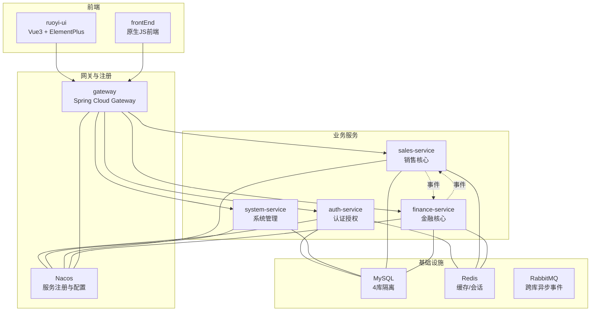
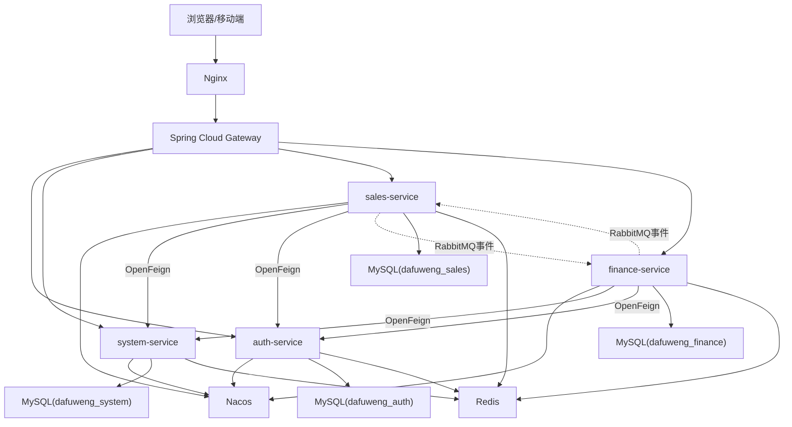
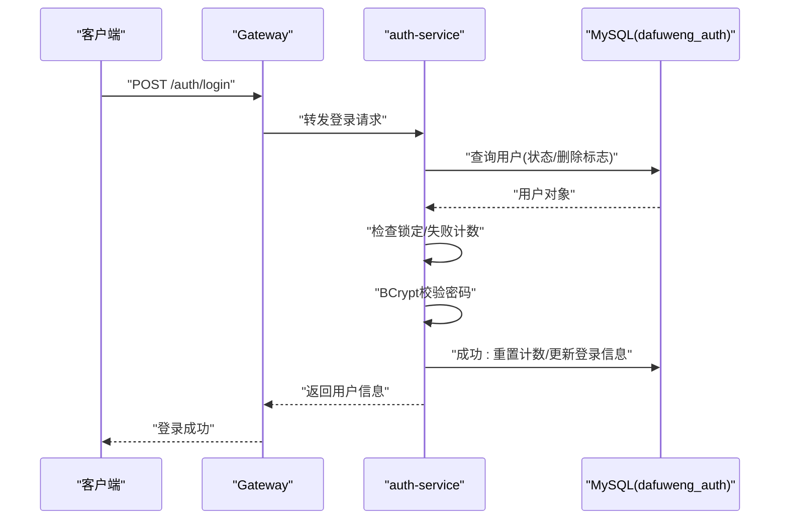
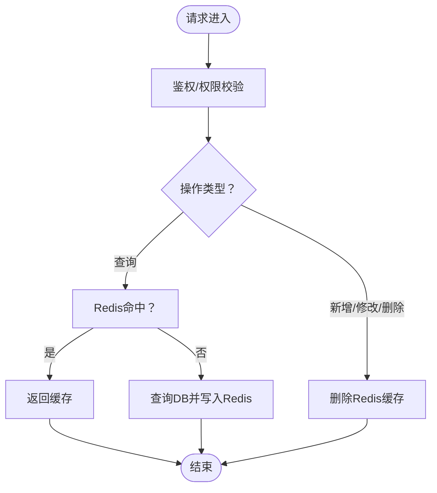
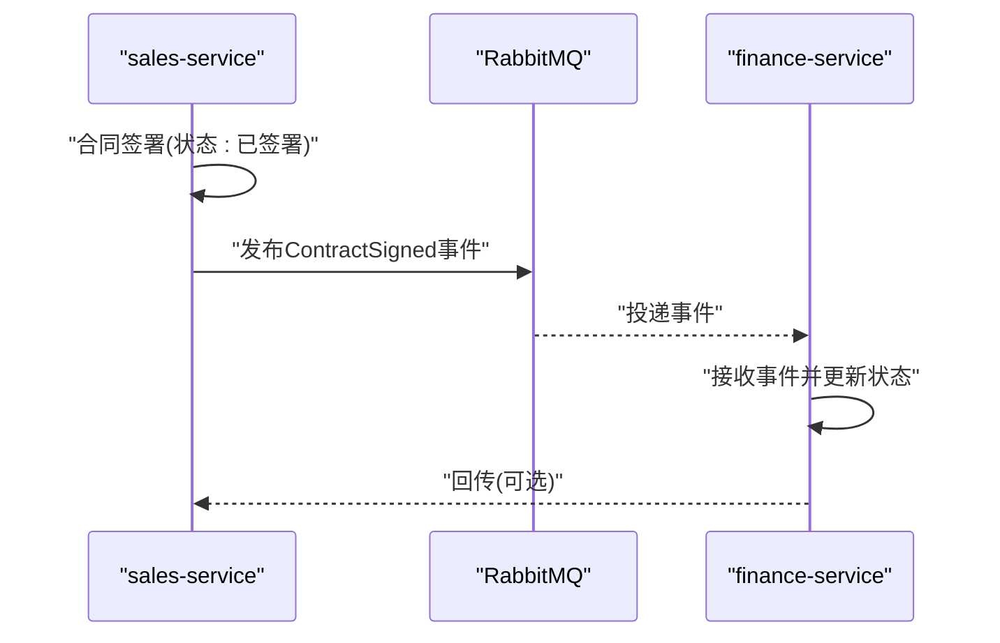
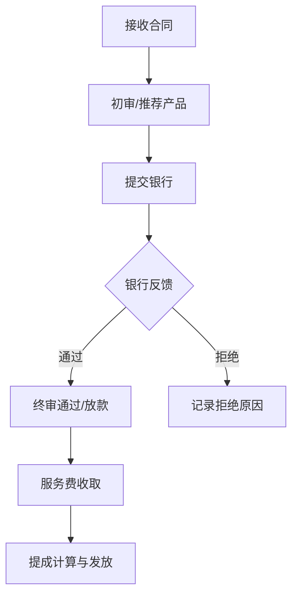
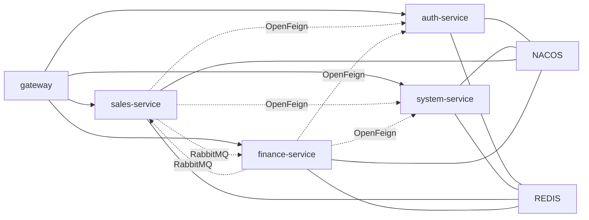

# 项目概述

<cite>
**本文引用的文件**
- [pom.xml](file://pom.xml)
- [dataDesign.md](file://dataDesign.md)
- [implementDetails.md](file://implementDetails.md)
- [database.sql](file://database.sql)
- [init-db.sql](file://init-db.sql)
- [docker-compose.yml](file://docker-compose.yml)
- [AuthApplication.java](file://auth/src/main/java/com/dafuweng/AuthApplication.java)
- [GatewayApplication.java](file://gateway/src/main/java/com/dafuweng/GatewayApplication.java)
- [ruoyi-ui/package.json](file://ruoyi-ui/package.json)
- [frontEnd/package.json](file://frontEnd/package.json)
- [ruoyi-ui/src/main.js](file://ruoyi-ui/src/main.js)
- [frontEnd/src/main.js](file://frontEnd/src/main.js)
</cite>

## 目录
1. [简介](#简介)
2. [项目结构](#项目结构)
3. [核心组件](#核心组件)
4. [架构总览](#架构总览)
5. [详细组件分析](#详细组件分析)
6. [依赖关系分析](#依赖关系分析)
7. [性能考量](#性能考量)
8. [故障排查指南](#故障排查指南)
9. [结论](#结论)
10. [附录](#附录)

## 简介
NeoCC金融管理系统是为大富翁金融服务公司打造的贷款业务管理平台，采用Spring Cloud微服务架构，围绕“销售—财务”两大核心业务闭环，提供从客户管理、合同签署、业绩计算到贷款审核、服务费与提成结算的全链路数字化支撑。系统以“前后端分离、模块自治、跨库协作、异步解耦”为核心设计理念，结合统一网关、服务注册与配置中心、缓存与消息队列等基础设施，实现高可用、可扩展、可审计的金融业务系统。

本项目的目标价值体现在：
- 提升贷款业务管理效率：通过标准化流程与自动化事件驱动，缩短合同流转周期，减少人工干预。
- 降低运营成本：统一数据字典与参数配置，支持热更新；跨库查询通过OpenFeign在应用层实现，避免数据库耦合。
- 增强风险控制能力：严格的审核轨迹（loan_audit_record）与审计日志（operation_log）确保每一步操作可追溯；登录安全与数据权限（data_scope）保障系统与数据安全。

## 项目结构
项目采用多模块Maven聚合工程，包含公共依赖模块与六大业务/基础模块：
- 公共模块：common（通用响应、异常、自动填充、Feign配置、MQ事件）
- 业务模块：sales（销售核心）、finance（金融核心）、system（系统管理）、auth（认证授权）
- 基础设施：gateway（网关）、Nacos（注册与配置）、Redis（缓存/会话）、RabbitMQ（异步事件）

图表来源
- [docker-compose.yml:1-182](file://docker-compose.yml#L1-L182)
- [implementDetails.md:23-51](file://implementDetails.md#L23-L51)

章节来源
- [pom.xml:12-19](file://pom.xml#L12-L19)
- [implementDetails.md:23-69](file://implementDetails.md#L23-L69)
- [docker-compose.yml:1-182](file://docker-compose.yml#L1-L182)

## 核心组件
- 认证授权模块（auth-service）
  - 职责：用户登录/登出、Token签发、Shiro权限校验、登录安全控制（失败计数与锁定）
  - 关键特性：data_scope数据权限（本人/本部门/本战区/全部），登录安全字段内置于用户表，避免额外表
- 系统管理模块（system-service）
  - 职责：战区/部门树形管理、系统参数KV、数据字典、操作日志审计
  - 关键特性：字典表统一枚举，支持运行时热修改；AOP自动写入操作日志
- 销售核心模块（sales-service）
  - 职责：客户管理、洽谈记录、合同管理、工作日志、业绩计算、公海与客户转移
  - 关键特性：客户唯一索引（name+phone+deleted）防重复；合同状态机；公海规则与转移审计
- 金融核心模块（finance-service）
  - 职责：银行与产品管理、贷款审核、审核轨迹、服务费与提成结算
  - 关键特性：loan_audit.contract_id唯一约束保证幂等；审核轨迹append-only；服务费与提成分离
- 网关模块（gateway）
  - 职责：统一入口、路由、鉴权、限流、跨域、全局拦截器
- 公共模块（common）
  - 职责：统一响应结构、全局异常、MyBatis Plus自动填充、Feign配置、MQ事件定义

章节来源
- [implementDetails.md:294-321](file://implementDetails.md#L294-L321)
- [implementDetails.md:623-738](file://implementDetails.md#L623-L738)
- [implementDetails.md:741-800](file://implementDetails.md#L741-L800)
- [implementDetails.md:294-321](file://implementDetails.md#L294-L321)

## 架构总览
系统采用“统一网关 + 多租户数据库 + 微服务 + 异步事件”的架构：
- 前端通过Nginx静态资源与反向代理，统一接入Gateway
- Gateway基于Nacos进行服务发现与配置管理，对各业务服务进行路由与鉴权
- 业务服务之间通过OpenFeign进行跨库实时查询，通过RabbitMQ进行异步事件解耦
- Redis用于缓存与会话，MySQL按业务域垂直拆分为4个库，实现故障隔离与独立演进

图表来源
- [implementDetails.md:23-51](file://implementDetails.md#L23-L51)
- [dataDesign.md:320-351](file://dataDesign.md#L320-L351)
- [docker-compose.yml:1-182](file://docker-compose.yml#L1-L182)

## 详细组件分析

### 认证授权模块（auth-service）
- 设计要点
  - 用户表内含登录安全字段（失败计数与锁定时间），避免额外安全表
  - data_scope字段配合MyBatis Plus拦截器实现数据权限动态拼接
  - Shiro Realm加载用户角色与权限，支持细粒度鉴权
- 关键流程
  - 登录：校验状态与锁定、BCrypt校验、成功重置计数并更新最近登录信息
  - 权限：基于角色集合与权限集合进行hasPermission判断

图表来源
- [implementDetails.md:314-322](file://implementDetails.md#L314-L322)
- [implementDetails.md:327-431](file://implementDetails.md#L327-L431)

章节来源
- [implementDetails.md:294-321](file://implementDetails.md#L294-L321)
- [implementDetails.md:323-431](file://implementDetails.md#L323-L431)

### 系统管理模块（system-service）
- 设计要点
  - 战区/部门树形结构（两级：战区>部门），支持按战区聚合
  - 系统参数KV与数据字典统一管理，支持Redis缓存与失效策略
  - 操作日志通过AOP自动写入，业务层无需感知
- 关键流程
  - 参数与字典：首次查询DB，后续缓存Redis；变更时删除缓存
  - 日志：环绕通知记录请求/响应、耗时、错误等

图表来源
- [implementDetails.md:664-714](file://implementDetails.md#L664-L714)

章节来源
- [implementDetails.md:623-738](file://implementDetails.md#L623-L738)

### 销售核心模块（sales-service）
- 设计要点
  - 客户唯一索引（name+phone+deleted）防重复录入
  - 合同状态机：草稿→已签署→首期支付→审核中→已通过/已拒绝→放款→完成
  - 公海规则：超过设定天数未跟进且无签约，自动入公海
  - 业绩计算：基于合同唯一性约束，避免重复计算
- 关键流程
  - 合同签署：状态流转并触发RabbitMQ事件通知finance-service
  - 业绩计算：计算完成后生成提成记录

图表来源
- [dataDesign.md:320-351](file://dataDesign.md#L320-L351)
- [implementDetails.md:789-800](file://implementDetails.md#L789-L800)

章节来源
- [implementDetails.md:741-800](file://implementDetails.md#L741-L800)
- [database.sql:281-467](file://database.sql#L281-L467)

### 金融核心模块（finance-service）
- 设计要点
  - 贷款审核唯一约束（contract_id），保证幂等
  - 审核轨迹（loan_audit_record）append-only，支持仲裁
  - 服务费与提成分离：service_fee_record与commission_record分别记录
- 关键流程
  - 银行对接：提交银行→银行反馈→放款日期与实际金额/利率更新
  - 结算：服务费收取与提成发放

图表来源
- [dataDesign.md:236-318](file://dataDesign.md#L236-L318)
- [database.sql:476-618](file://database.sql#L476-L618)

章节来源
- [implementDetails.md:294-321](file://implementDetails.md#L294-L321)
- [database.sql:476-618](file://database.sql#L476-L618)

### 网关与统一入口
- 设计要点
  - 基于Nacos的服务发现与配置中心，统一路由与鉴权
  - 支持限流、跨域、全局拦截器
- 前端入口
  - ruoyi-ui：基于Vue3 + ElementPlus的后台管理界面
  - frontEnd：原生JS前端，提供轻量入口与仪表盘

章节来源
- [implementDetails.md:23-69](file://implementDetails.md#L23-L69)
- [ruoyi-ui/package.json:1-54](file://ruoyi-ui/package.json#L1-L54)
- [frontEnd/package.json:1-13](file://frontEnd/package.json#L1-L13)
- [ruoyi-ui/src/main.js:1-84](file://ruoyi-ui/src/main.js#L1-L84)
- [frontEnd/src/main.js:1-37](file://frontEnd/src/main.js#L1-L37)

## 依赖关系分析
- 模块依赖
  - gateway依赖各业务服务（auth/system/sales/finance）
  - 业务服务之间通过OpenFeign进行跨库查询
  - 所有服务依赖Nacos进行注册与配置
- 数据库依赖
  - 四库隔离：auth/system/sales/finance
  - 通过OpenFeign在应用层实现跨库关联
- 基础设施依赖
  - Redis用于缓存与会话
  - RabbitMQ用于跨库异步事件

图表来源
- [docker-compose.yml:1-182](file://docker-compose.yml#L1-L182)
- [implementDetails.md:23-69](file://implementDetails.md#L23-L69)
- [dataDesign.md:320-351](file://dataDesign.md#L320-L351)

章节来源
- [docker-compose.yml:1-182](file://docker-compose.yml#L1-L182)
- [implementDetails.md:23-69](file://implementDetails.md#L23-L69)

## 性能考量
- 数据库层面
  - 四库隔离，避免跨库查询与耦合，提升扩展性与故障隔离能力
  - 索引设计遵循“查询最常用组合”，禁止SELECT *，强制覆盖索引
  - 逻辑删除字段参与唯一索引，解决软删后的重复录入问题
- 应用层面
  - Redis缓存系统参数与字典，降低DB压力
  - MyBatis Plus自动填充与乐观锁，减少重复代码与并发冲突
  - RabbitMQ异步事件解耦，避免长事务与阻塞
- 网关与前端
  - Nginx统一入口与静态资源缓存，Gateway集中鉴权与限流

章节来源
- [dataDesign.md:35-442](file://dataDesign.md#L35-L442)
- [implementDetails.md:71-271](file://implementDetails.md#L71-L271)

## 故障排查指南
- 登录失败与锁定
  - 现象：连续多次失败后账号被锁定
  - 排查：检查sys_user.login_error_count与lock_time字段，确认是否达到阈值
- 审核幂等问题
  - 现象：重复提交导致唯一约束冲突
  - 排查：确认loan_audit.contract_id唯一约束是否被触发
- 跨库查询异常
  - 现象：OpenFeign调用失败
  - 排查：确认服务注册、配置中心、网络连通性与Feign客户端配置
- 缓存一致性
  - 现象：参数/字典更新后读取旧值
  - 排查：确认Redis缓存是否被正确删除与重建
- 审计与日志
  - 现象：操作日志缺失
  - 排查：确认AOP切面是否生效，以及异步写入是否正常

章节来源
- [implementDetails.md:314-322](file://implementDetails.md#L314-L322)
- [implementDetails.md:323-431](file://implementDetails.md#L323-L431)
- [implementDetails.md:664-714](file://implementDetails.md#L664-L714)
- [database.sql:526-571](file://database.sql#L526-L571)

## 结论
NeoCC金融管理系统通过清晰的微服务划分、严谨的数据设计与完善的基础设施，构建了面向贷款业务的高效、安全、可审计的数字化平台。四库隔离与跨库事件驱动的设计，既满足了业务独立演进的需求，又保持了跨域协作的灵活性。随着系统逐步完善，可进一步引入分布式事务、更细粒度的监控与告警体系，持续提升系统的稳定性与可观测性。

## 附录
- 数据库初始化脚本
  - 说明：按库顺序初始化，先创建数据库，再依次导入各库结构
  - 注意：执行顺序为1-4-2-3（认证→销售→系统→金融）
- 运行环境
  - Docker Compose编排：包含Nacos、MySQL、Redis、各业务服务与Nginx
  - 前端：ruoyi-ui与frontEnd分别提供Vue3与原生JS两种前端入口

章节来源
- [database.sql:1-6](file://database.sql#L1-L6)
- [init-db.sql:1-22](file://init-db.sql#L1-L22)
- [docker-compose.yml:1-182](file://docker-compose.yml#L1-L182)