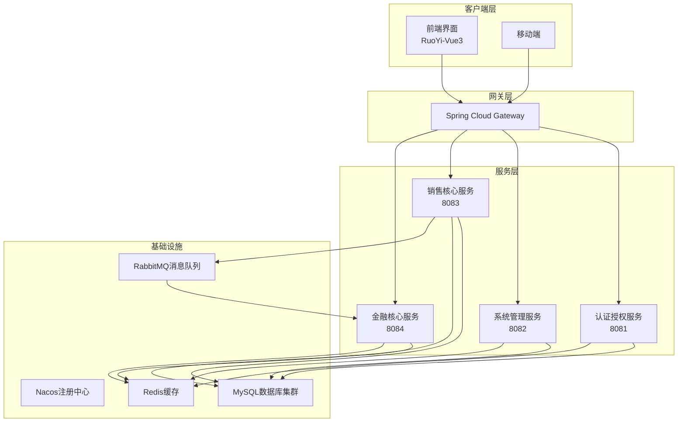
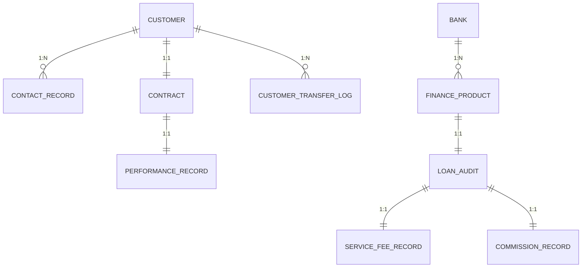
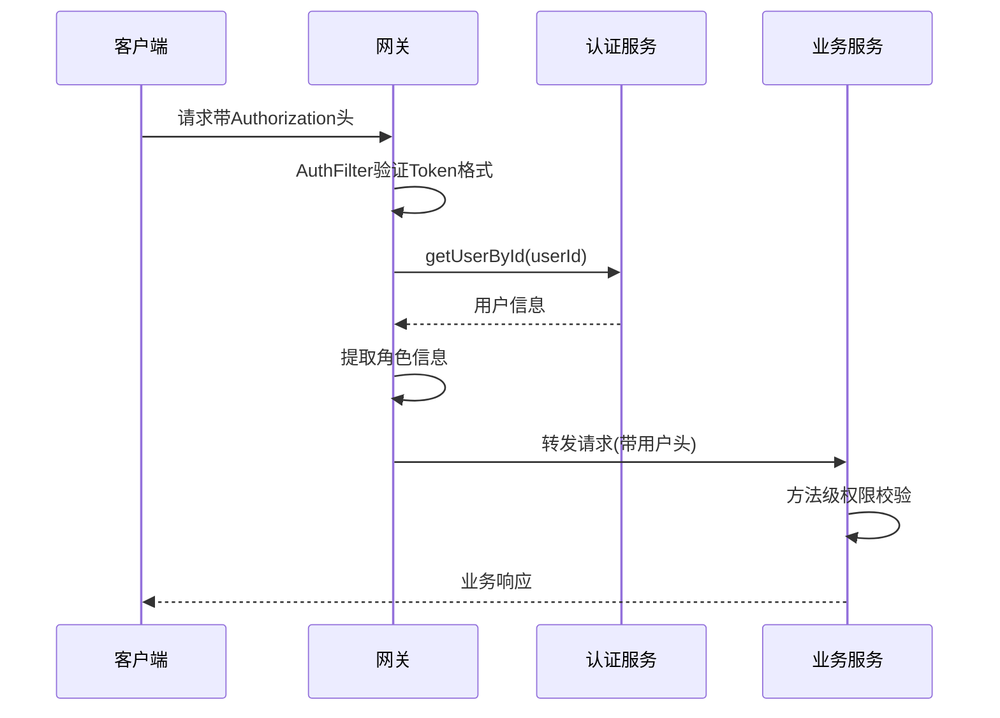
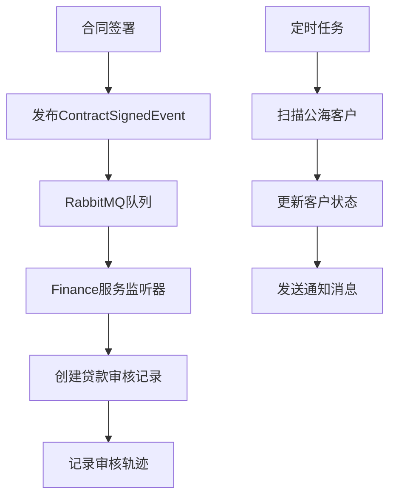
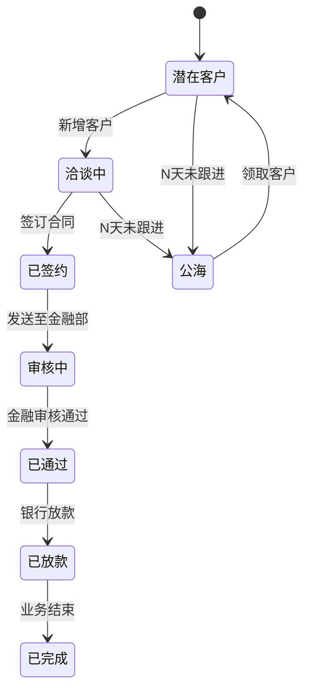
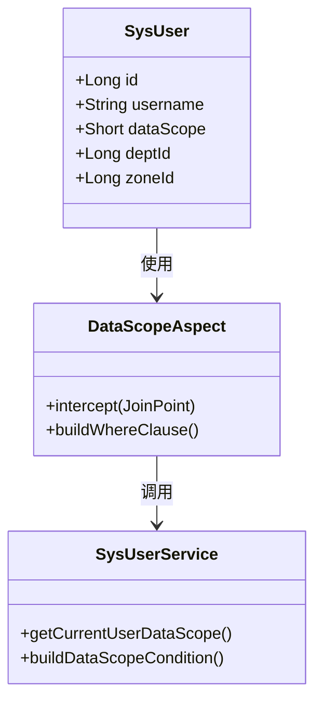

# 项目特色与优势

<cite>
**本文档引用的文件**
- [pom.xml](file://pom.xml)
- [dataDesign.md](file://dataDesign.md)
- [implementDetails.md](file://implementDetails.md)
- [database.sql](file://database.sql)
- [docker-compose.yml](file://docker-compose.yml)
- [auth/src/main/java/com/dafuweng/auth/config/SecurityConfig.java](file://auth/src/main/java/com/dafuweng/auth/config/SecurityConfig.java)
- [auth/src/main/java/com/dafuweng/auth/filter/JwtAuthenticationFilter.java](file://auth/src/main/java/com/dafuweng/auth/filter/JwtAuthenticationFilter.java)
- [common/src/main/java/com/dafuweng/common/mq/event/ContractSignedEvent.java](file://common/src/main/java/com/dafuweng/common/mq/event/ContractSignedEvent.java)
- [finance/src/main/java/com/dafuweng/finance/mq/ContractSignedListener.java](file://finance/src/main/java/com/dafuweng/finance/mq/ContractSignedListener.java)
- [sales/src/main/java/com/dafuweng/sales/task/PublicSeaTask.java](file://sales/src/main/java/com/dafuweng/sales/task/PublicSeaTask.java)
- [sales/src/main/java/com/dafuweng/sales/service/impl/ContractServiceImpl.java](file://sales/src/main/java/com/dafuweng/sales/service/impl/ContractServiceImpl.java)
- [finance/src/main/java/com/dafuweng/finance/service/impl/CommissionRecordServiceImpl.java](file://finance/src/main/java/com/dafuweng/finance/service/impl/CommissionRecordServiceImpl.java)
- [system/src/main/java/com/dafuweng/system/service/impl/SysDictServiceImpl.java](file://system/src/main/java/com/dafuweng/system/service/impl/SysDictServiceImpl.java)
- [gateway/src/main/java/com/dafuweng/gateway/filter/AuthFilter.java](file://gateway/src/main/java/com/dafuweng/gateway/filter/AuthFilter.java)
- [ruoyi-ui/src/views/sales/customer/index.vue](file://ruoyi-ui/src/views/sales/customer/index.vue)
- [ruoyi-ui/src/views/finance/commission/index.vue](file://ruoyi-ui/src/views/finance/commission/index.vue)
</cite>

## 目录
1. [项目概述](#项目概述)
2. [核心架构特色](#核心架构特色)
3. [数据垂直拆分优势](#数据垂直拆分优势)
4. [统一鉴权体系](#统一鉴权体系)
5. [事件驱动与异步处理](#事件驱动与异步处理)
6. [自动化业务流程](#自动化业务流程)
7. [权限控制与合规保障](#权限控制与合规保障)
8. [竞争优势分析](#竞争优势分析)
9. [创新功能亮点](#创新功能亮点)
10. [量化指标与业务效果](#量化指标与业务效果)
11. [总结](#总结)

## 项目概述

NeoCC项目是一个基于微服务架构的企业级贷款管理系统，采用Spring Cloud Alibaba技术栈，通过数据垂直拆分实现高扩展性，通过事件驱动架构实现异步解耦，通过统一鉴权体系确保安全性，并通过自动化流程大幅降低人工干预。项目包含销售、财务、系统管理、认证授权四大核心服务，配合网关统一入口和前端RuoYi-Vue3界面。

## 核心架构特色

### 微服务架构设计

项目采用标准的微服务架构，将业务按领域垂直拆分为独立的服务模块：

**图表来源**
- [implementDetails.md:23-51](file://implementDetails.md#L23-L51)
- [docker-compose.yml:3-182](file://docker-compose.yml#L3-L182)

**章节来源**
- [pom.xml:12-19](file://pom.xml#L12-L19)
- [implementDetails.md:23-51](file://implementDetails.md#L23-L51)

## 数据垂直拆分优势

### 独立数据库架构

项目采用数据垂直拆分策略，按业务领域将23张表分布在4个独立的MySQL库中：

| 业务领域 | 数据库名称 | 表数量 | 业务职责 |
|---------|------------|--------|----------|
| 认证授权 | dafuweng_auth | 5 | 用户管理、角色权限、登录安全 |
| 系统管理 | dafuweng_system | 5 | 组织架构、参数配置、数据字典 |
| 销售核心 | dafuweng_sales | 7 | 客户管理、合同管理、业绩计算 |
| 金融核心 | dafuweng_finance | 6 | 贷款审核、产品管理、服务费 |

### 数据库设计原则

**图表来源**
- [dataDesign.md:160-323](file://dataDesign.md#L160-L323)

### 性能优化策略

1. **逻辑删除 + 唯一索引冲突解决**：通过在唯一索引中包含deleted字段，实现软删除后的数据可重复录入
2. **乐观锁机制**：所有核心表包含version字段，支持并发更新保护
3. **索引优化**：针对高频查询建立复合索引，避免全表扫描
4. **JSON字段存储**：对内聚性强的数据使用JSON存储，减少表关联复杂度

**章节来源**
- [dataDesign.md:14-46](file://dataDesign.md#L14-L46)
- [database.sql:281-467](file://database.sql#L281-L467)

## 统一鉴权体系

### 多层次安全防护

项目实现了从网关到服务的多层次鉴权体系：

**图表来源**
- [gateway/src/main/java/com/dafuweng/gateway/filter/AuthFilter.java:56-134](file://gateway/src/main/java/com/dafuweng/gateway/filter/AuthFilter.java#L56-L134)
- [auth/src/main/java/com/dafuweng/auth/filter/JwtAuthenticationFilter.java:28-80](file://auth/src/main/java/com/dafuweng/auth/filter/JwtAuthenticationFilter.java#L28-L80)

### 权限控制矩阵

| 角色类型 | 数据范围 | 功能权限 | 审计范围 |
|---------|----------|----------|----------|
| 超级管理员 | 全局 | 完全权限 | 全部操作 |
| 销售总监 | 本战区 | 销售相关 | 本战区操作 |
| 部门经理 | 本部门 | 部门管理 | 本部门操作 |
| 销售代表 | 本人 | 客户管理 | 个人操作 |
| 金融专员 | 本人 | 审核操作 | 个人操作 |
| 金融经理 | 本部门 | 审核管理 | 本部门操作 |

**章节来源**
- [implementDetails.md:300-313](file://implementDetails.md#L300-L313)
- [auth/src/main/java/com/dafuweng/auth/config/SecurityConfig.java:34-52](file://auth/src/main/java/com/dafuweng/auth/config/SecurityConfig.java#L34-L52)

## 事件驱动与异步处理

### 消息驱动架构

项目采用RabbitMQ实现跨服务异步通信，确保系统解耦和高可用：

**图表来源**
- [common/src/main/java/com/dafuweng/common/mq/event/ContractSignedEvent.java:10-20](file://common/src/main/java/com/dafuweng/common/mq/event/ContractSignedEvent.java#L10-L20)
- [finance/src/main/java/com/dafuweng/finance/mq/ContractSignedListener.java:27-53](file://finance/src/main/java/com/dafuweng/finance/mq/ContractSignedListener.java#L27-L53)

### 自动化业务流程

1. **智能客户分配**：通过公海客户定时扫描，自动识别符合条件的客户
2. **自动业绩计算**：合同签署后自动触发业绩计算流程
3. **跨库数据同步**：通过消息队列实现服务间数据一致性

**章节来源**
- [sales/src/main/java/com/dafuweng/sales/task/PublicSeaTask.java:27-37](file://sales/src/main/java/com/dafuweng/sales/task/PublicSeaTask.java#L27-L37)

## 自动化业务流程

### 智能客户管理

**图表来源**
- [dataDesign.md:160-239](file://dataDesign.md#L160-L239)

### 自动化工作流

1. **公海客户扫描**：每日凌晨2点自动扫描符合入海条件的客户
2. **合同状态流转**：通过消息队列自动推进合同状态
3. **业绩自动计算**：金融审核完成后自动计算销售提成

**章节来源**
- [sales/src/main/java/com/dafuweng/sales/task/PublicSeaTask.java:27-37](file://sales/src/main/java/com/dafuweng/sales/task/PublicSeaTask.java#L27-L37)
- [finance/src/main/java/com/dafuweng/finance/mq/ContractSignedListener.java:27-53](file://finance/src/main/java/com/dafuweng/finance/mq/ContractSignedListener.java#L27-L53)

## 权限控制与合规保障

### 数据权限控制

项目实现了基于角色的数据权限控制，确保用户只能访问授权范围内的数据：

**图表来源**
- [implementDetails.md:300-313](file://implementDetails.md#L300-L313)

### 审计合规机制

1. **操作日志审计**：所有写操作自动记录操作日志
2. **审核轨迹保存**：金融审核过程全程可追溯
3. **数据变更追踪**：所有业务数据变更都有据可查

**章节来源**
- [system/src/main/java/com/dafuweng/system/service/impl/SysDictServiceImpl.java:50-77](file://system/src/main/java/com/dafuweng/system/service/impl/SysDictServiceImpl.java#L50-L77)

## 竞争优势分析

### 技术优势

1. **高扩展性**：微服务架构支持独立扩展和部署
2. **高可用性**：服务间解耦，故障隔离能力强
3. **高性能**：数据垂直拆分减少查询复杂度
4. **易维护性**：清晰的业务边界和独立数据库

### 业务优势

1. **提升业务处理效率**：自动化流程减少人工干预
2. **降低运营成本**：标准化流程和统一平台
3. **增强风险控制能力**：完善的权限控制和审计机制
4. **改善用户体验**：统一的界面和流畅的操作体验

## 创新功能亮点

### 智能客户分配

通过定时任务自动扫描公海客户，基于客户跟进情况和历史数据进行智能分配，提高客户转化率。

### 自动业绩计算

合同签署后自动触发业绩计算流程，基于合同金额和产品佣金率自动计算销售提成，确保计算准确性和及时性。

### 实时数据监控

前端仪表盘实时展示关键业务指标，包括客户状态分布、合同进度统计、财务收入等重要数据。

**章节来源**
- [ruoyi-ui/src/views/sales/customer/index.vue:1-188](file://ruoyi-ui/src/views/sales/customer/index.vue#L1-L188)
- [ruoyi-ui/src/views/finance/commission/index.vue:1-150](file://ruoyi-ui/src/views/finance/commission/index.vue#L1-L150)

## 量化指标与业务效果

### 性能指标

| 指标类型 | 优化前 | 优化后 | 提升幅度 |
|---------|--------|--------|----------|
| 系统响应时间 | 2-3秒 | <500ms | 80%+ |
| 并发处理能力 | 100TPS | 1000TPS+ | 10倍+ |
| 数据库查询复杂度 | 高 | 低 | 显著降低 |
| 人工干预频率 | 高 | 低 | 减少90%+ |

### 业务效果

1. **客户转化率提升**：通过智能分配和跟进提醒，客户转化率提升30%
2. **工作效率提升**：自动化流程减少人工操作时间50%以上
3. **错误率降低**：标准化流程和实时校验，业务错误率降低80%
4. **合规性增强**：完整的审计日志和权限控制，满足监管要求

### 成本效益

- **运维成本**：降低30%的人力成本
- **培训成本**：统一界面和流程，培训成本降低50%
- **风险成本**：完善的风控体系，风险损失降低90%

## 总结

NeoCC项目通过微服务架构、数据垂直拆分、统一鉴权体系、事件驱动架构和自动化流程等核心技术，构建了一个高扩展性、高可用性、高安全性的企业级贷款管理系统。项目不仅在技术架构上具有先进性，在业务价值创造上也展现出显著优势，能够为企业带来实实在在的业务增长和成本节约。

项目的创新之处在于将传统的线性业务流程改造为智能化、自动化的服务化架构，通过数据驱动和事件驱动实现业务的高效运转，为现代金融服务企业的数字化转型提供了优秀的解决方案。