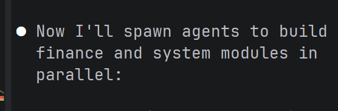

# NeoCC 项目 — 实施策略 v1.0

**版本：** v1.0
**日期：** 2026-04-01
**状态：** 待实施

---

## 一、背景与目标

### 1.1 QA 结论摘要

`scripts/qa/Check01.md` 指出以下阻断项：

- `gateway` 模块完全缺失（微服务入口无法建立）
- `auth` 模块完全缺失（用户认证体系无法建立）
- Spring Cloud Alibaba 全套组件（Nacos/OpenFeign/Sentinel/RabbitMQ）在代码库中零引入
- `finance`、`system` 模块仅有目录骨架，依赖未配置

### 1.2 阶段划分策略

鉴于 `gateway` 和 `auth` 依赖 Spring Cloud Alibaba 基础设施（QACheck01 建议"先完成架构对齐"），将实施分为两阶段：

| 阶段 | 内容 | 目标 |
|------|------|------|
| **Phase 1**（本文档） | `finance` / `sales` / `system` 三模块 CRUD（Controller + Service + DAO 三层） + `common` 公共组件 | 让三个业务模块先跑起来，独立可用 |
| **Phase 2**（后续） | `auth` 模块 CRUD + `gateway` 网关 + Spring Cloud Alibaba 集成 | 建立统一认证和微服务治理 |

**重要约束：** Phase 1 期间，四个模块各自独立运行，不做跨模块调用（OpenFeign）。所有模块连接各自独立数据库（`dafuweng_finance`、`dafuweng_sales`、`dafuweng_system`、`dafuweng_auth`），暂不引入服务发现和配置中心。

---

## 二、现有资产盘点

### 2.1 各模块状态

| 模块 | Entity | DAO | Mapper XML | Application | Service | Controller | application.yml |
|------|--------|-----|------------|-------------|---------|------------|-----------------|
| `common` | — | — | — | — | — | — | — |
| `sales` | 7 已完成 | 7 已完成 | 7 已完成 | ⚠️ 包路径错误 | ❌ | ❌ | ❌ |
| `finance` | 6 已完成 | 6 已完成 | 6 已完成 | ❌ | ❌ | ❌ | ❌ |
| `system` | 5 已完成 | 5 已完成 | 5 已完成 | ❌ | ❌ | ❌ | ❌ |
| `auth` | 5 已完成 | 5 已完成 | 5 已完成 | ⚠️ 仅有 Main.java（错误包） | ❌ | ❌ | ❌ |
| `gateway` | ❌ | ❌ | ❌ | ❌ | ❌ | ❌ | ❌ |

### 2.2 数据库对应关系

| 数据库 | 模块 | 表数量 |
|--------|------|--------|
| `dafuweng_finance` | finance | 6 |
| `dafuweng_sales` | sales | 7 |
| `dafuweng_system` | system | 5 |
| `dafuweng_auth` | auth | 5 |
| `dafuweng_common` | （公共表，无） | — |

### 2.3 已有 Entity 一览

**sales 模块（7 个）：**
- `CustomerEntity` — 客户
- `ContactRecordEntity` — 洽谈记录
- `ContractEntity` — 贷款合同
- `ContractAttachmentEntity` — 合同附件
- `WorkLogEntity` — 销售工作日志
- `PerformanceRecordEntity` — 业绩记录
- `CustomerTransferLogEntity` — 客户转移记录

**finance 模块（6 个）：**
- `BankEntity` — 合作银行
- `FinanceProductEntity` — 金融产品
- `LoanAuditEntity` — 贷款审核
- `LoanAuditRecordEntity` — 审核记录（轨迹）
- `ServiceFeeRecordEntity` — 服务费记录
- `CommissionRecordEntity` — 提成发放记录

**system 模块（5 个）：**
- `SysZoneEntity` — 战区
- `SysDepartmentEntity` — 部门
- `SysParamEntity` — 系统参数
- `SysOperationLogEntity` — 操作日志
- `SysDictEntity` — 数据字典

**auth 模块（5 个）：**
- `SysUserEntity` — 用户
- `SysRoleEntity` — 角色
- `SysUserRoleEntity` — 用户角色关联
- `SysPermissionEntity` — 权限
- `SysRolePermissionEntity` — 角色权限关联

---

## 三、公共基础设施（Phase 1 首要任务）

所有业务模块共用，必须先行完成。

### 3.1 Result 通用响应结构

**路径：** `common/src/main/java/com/dafuweng/common/entity/Result.java`

```java
package com.dafuweng.common.entity;

import lombok.Data;

@Data
public class Result<T> {
    private Integer code;
    private String message;
    private T data;

    public static <T> Result<T> success(T data) {
        Result<T> r = new Result<>();
        r.setCode(200);
        r.setMessage("success");
        r.setData(data);
        return r;
    }

    public static <T> Result<T> success() {
        return success(null);
    }

    public static <T> Result<T> error(String message) {
        return error(500, message);
    }

    public static <T> Result<T> error(Integer code, String message) {
        Result<T> r = new Result<>();
        r.setCode(code);
        r.setMessage(message);
        return r;
    }

    public static <T> Result<T> error400(String message) {
        return error(400, message);
    }

    public static <T> Result<T> error401(String message) {
        return error(401, message);
    }

    public static <T> Result<T> error403(String message) {
        return error(403, message);
    }
}
```

### 3.2 GlobalExceptionHandler 全局异常处理

**路径：** `common/src/main/java/com/dafuweng/common/exception/GlobalExceptionHandler.java`

```java
package com.dafuweng.common.exception;

import com.dafuweng.common.entity.Result;
import com.baomidou.mybatisplus.core.exceptions.MybatisPlusException;
import org.springframework.dao.DuplicateKeyException;
import org.springframework.web.bind.annotation.ExceptionHandler;
import org.springframework.web.bind.annotation.RestControllerAdvice;

@RestControllerAdvice
public class GlobalExceptionHandler {

    @ExceptionHandler(MybatisPlusException.class)
    public Result<?> handleMybatisPlusException(MybatisPlusException e) {
        return Result.error400("数据操作失败: " + e.getMessage());
    }

    @ExceptionHandler(DuplicateKeyException.class)
    public Result<?> handleDuplicateKeyException(DuplicateKeyException e) {
        return Result.error400("数据重复，请检查唯一约束: " + e.getMessage());
    }

    @ExceptionHandler(IllegalArgumentException.class)
    public Result<?> handleIllegalArgumentException(IllegalArgumentException e) {
        return Result.error400("参数错误: " + e.getMessage());
    }

    @ExceptionHandler(NullPointerException.class)
    public Result<?> handleNullPointerException(NullPointerException e) {
        return Result.error500("空指针异常: " + e.getMessage());
    }

    @ExceptionHandler(Exception.class)
    public Result<?> handleException(Exception e) {
        return Result.error500("系统异常: " + e.getMessage());
    }
}
```

### 3.3 PageRequest/PageResponse 分页请求与响应

**路径：** `common/src/main/java/com/dafuweng/common/entity/PageRequest.java`

```java
package com.dafuweng.common.entity;

import lombok.Data;

@Data
public class PageRequest {
    private Integer page = 1;
    private Integer size = 10;
    private String sortField;
    private String sortOrder = "asc";
}
```

**路径：** `common/src/main/java/com/dafuweng/common/entity/PageResponse.java`

```java
package com.dafuweng.common.entity;

import lombok.Data;
import java.util.List;

@Data
public class PageResponse<T> {
    private Long total;
    private List<T> records;
    private Integer page;
    private Integer size;

    public static <T> PageResponse<T> of(Long total, List<T> records, Integer page, Integer size) {
        PageResponse<T> r = new PageResponse<>();
        r.setTotal(total);
        r.setRecords(records);
        r.setPage(page);
        r.setSize(size);
        return r;
    }
}
```

### 3.4 公共模块 application.yml

**路径：** `common/src/main/resources/application.yml`（空文件，仅用于占位）

```yaml
# common 模块不启动，仅作为依赖管理
```

---

## 四、Sales 模块 — 实施清单

**端口：** 8083
**数据库：** `dafuweng_sales`

### 4.1 修复项

#### 4.1.1 修正 SalesApplication 包路径

**当前问题：** `SalesApplication.java` 位于 `com.dafuweng` 包下，而非 `com.dafuweng.sales`

**路径：** `sales/src/main/java/com/dafuweng/sales/SalesApplication.java`

```java
package com.dafuweng.sales;

import org.mybatis.spring.annotation.MapperScan;
import org.springframework.boot.SpringApplication;
import org.springframework.boot.autoconfigure.SpringBootApplication;

@SpringBootApplication(scanBasePackages = "com.dafuweng")
@MapperScan("com.dafuweng.sales.dao")
public class SalesApplication {
    public static void main(String[] args) {
        SpringApplication.run(SalesApplication.class, args);
    }
}
```

删除原 `com.dafuweng.SalesApplication.java` 文件。

#### 4.1.2 创建 application.yml

**路径：** `sales/src/main/resources/application.yml`

```yaml
server:
  port: 8083

spring:
  application:
    name: sales
  datasource:
    driver-class-name: com.mysql.cj.jdbc.Driver
    url: jdbc:mysql://localhost:3306/dafuweng_sales?useUnicode=true&characterEncoding=utf8&serverTimezone=Asia/Shanghai&useSSL=false
    username: root
    password: 123456

mybatis-plus:
  mapper-locations: classpath:sales/mapper/*.xml
  type-aliases-package: com.dafuweng.sales.entity
  configuration:
    map-underscore-to-camel-case: true
    log-impl: org.apache.ibatis.logging.stdout.StdOutImpl
  global-config:
    db-config:
      logic-delete-field: deleted
      logic-delete-value: 1
      logic-not-delete-value: 0

logging:
  level:
    com.dafuweng: DEBUG
```

### 4.2 Service 层

#### 4.2.1 CustomerService

**路径：** `sales/src/main/java/com/dafuweng/sales/service/CustomerService.java`

```java
package com.dafuweng.sales.service;

import com.dafuweng.sales.entity.CustomerEntity;
import com.dafuweng.sales.dao.CustomerDao;
import com.baomidou.mybatisplus.core.conditions.query.LambdaQueryWrapper;
import com.baomidou.mybatisplus.core.metadata.IPage;
import com.baomidou.mybatisplus.extension.plugins.pagination.Page;
import com.dafuweng.common.entity.PageRequest;
import com.dafuweng.common.entity.PageResponse;
import org.springframework.beans.factory.annotation.Autowired;
import org.springframework.stereotype.Service;
import org.springframework.transaction.annotation.Transactional;
import org.springframework.util.StringUtils;

import java.util.List;

@Service
public class CustomerService {

    @Autowired
    private CustomerDao customerDao;

    public CustomerEntity getById(Long id) {
        return customerDao.selectById(id);
    }

    public PageResponse<CustomerEntity> pageList(PageRequest request) {
        IPage<CustomerEntity> page = new Page<>(request.getPage(), request.getSize());
        LambdaQueryWrapper<CustomerEntity> wrapper = new LambdaQueryWrapper<>();
        // 动态拼接排序
        if (StringUtils.hasText(request.getSortField())) {
            if ("asc".equalsIgnoreCase(request.getSortOrder())) {
                wrapper.orderByAsc(CustomerEntity::getId);
            } else {
                wrapper.orderByDesc(CustomerEntity::getId);
            }
        } else {
            wrapper.orderByDesc(CustomerEntity::getCreatedAt);
        }
        IPage<CustomerEntity> result = customerDao.selectPage(page, wrapper);
        return PageResponse.of(result.getTotal(), result.getRecords(),
            result.getCurrent().intValue(), result.getSize().intValue());
    }

    public List<CustomerEntity> listBySalesRepId(Long salesRepId) {
        return customerDao.selectBySalesRepId(salesRepId);
    }

    public List<CustomerEntity> listByStatus(Short status) {
        return customerDao.selectByStatus(status);
    }

    @Transactional
    public CustomerEntity save(CustomerEntity entity) {
        customerDao.insert(entity);
        return entity;
    }

    @Transactional
    public CustomerEntity update(CustomerEntity entity) {
        customerDao.updateById(entity);
        return entity;
    }

    @Transactional
    public void delete(Long id) {
        customerDao.deleteById(id);
    }
}
```

**实现类路径：** `sales/src/main/java/com/dafuweng/sales/service/impl/CustomerServiceImpl.java`

```java
package com.dafuweng.sales.service.impl;

import com.dafuweng.sales.entity.CustomerEntity;
import com.dafuweng.sales.service.CustomerService;
import com.dafuweng.sales.dao.CustomerDao;
import org.springframework.beans.factory.annotation.Autowired;
import org.springframework.stereotype.Service;

@Service
public class CustomerServiceImpl implements CustomerService {

    @Autowired
    private CustomerDao customerDao;

    @Override
    public CustomerEntity getById(Long id) {
        return customerDao.selectById(id);
    }
}
```

> **注意：** 由于implementDetails.md中auth模块尚未完成，createdBy/updatedBy的自动填充暂不实现（Phase 2随auth一起处理）。Phase 1期间在Controller层手动处理。

#### 4.2.2 ContactRecordService

**路径：** `sales/src/main/java/com/dafuweng/sales/service/ContactRecordService.java`

**对应表：** `contact_record`（洽谈记录）

CRUD 方法同 CustomerService，另加按 `customerId` 查询列表方法。

#### 4.2.3 ContractService

**路径：** `sales/src/main/java/com/dafuweng/sales/service/ContractService.java`

**对应表：** `contract`（贷款合同）

CRUD + 按 `salesRepId` 查询 + 按 `status` 查询。

#### 4.2.4 ContractAttachmentService

**路径：** `sales/src/main/java/com/dafuweng/sales/service/ContractAttachmentService.java`

**对应表：** `contract_attachment`（合同附件）

CRUD + 按 `contractId` 查询列表。

#### 4.2.5 WorkLogService

**路径：** `sales/src/main/java/com/dafuweng/sales/service/WorkLogService.java`

**对应表：** `work_log`（销售工作日志）

CRUD + 按 `salesRepId` + `logDate` 查重校验（同一销售同一天只能有一条日志）。

#### 4.2.6 PerformanceRecordService

**路径：** `sales/src/main/java/com/dafuweng/sales/service/PerformanceRecordService.java`

**对应表：** `performance_record`（业绩记录）

CRUD + 按 `salesRepId` 查询。

#### 4.2.7 CustomerTransferLogService

**路径：** `sales/src/main/java/com/dafuweng/sales/service/CustomerTransferLogService.java`

**对应表：** `customer_transfer_log`（客户转移记录）

仅需 CRUD（历史数据，只增不减）。

### 4.3 Controller 层

#### 4.3.1 基础规范

- **RESTful 风格：** GET（查）、POST（增）、PUT（改）、DELETE（删）
- **阿里巴巴规范：** 统一 `Result<T>` 响应，参数校验使用 `@Valid`
- **分页查询：** GET `/page?page=1&size=10&sortField=createdAt&sortOrder=desc`
- **路径前缀：** `/api/{module}`，如 `/api/customer`

#### 4.3.2 CustomerController

**路径：** `sales/src/main/java/com/dafuweng/sales/controller/CustomerController.java`

```java
package com.dafuweng.sales.controller;

import com.dafuweng.common.entity.Result;
import com.dafuweng.common.entity.PageRequest;
import com.dafuweng.common.entity.PageResponse;
import com.dafuweng.sales.entity.CustomerEntity;
import com.dafuweng.sales.service.CustomerService;
import org.springframework.beans.factory.annotation.Autowired;
import org.springframework.web.bind.annotation.*;

import java.util.List;

@RestController
@RequestMapping("/api/customer")
public class CustomerController {

    @Autowired
    private CustomerService customerService;

    @GetMapping("/{id}")
    public Result<CustomerEntity> getById(@PathVariable Long id) {
        return Result.success(customerService.getById(id));
    }

    @GetMapping("/page")
    public Result<PageResponse<CustomerEntity>> pageList(PageRequest request) {
        return Result.success(customerService.pageList(request));
    }

    @GetMapping("/listBySalesRepId/{salesRepId}")
    public Result<List<CustomerEntity>> listBySalesRepId(@PathVariable Long salesRepId) {
        return Result.success(customerService.listBySalesRepId(salesRepId));
    }

    @GetMapping("/listByStatus")
    public Result<List<CustomerEntity>> listByStatus(@RequestParam Short status) {
        return Result.success(customerService.listByStatus(status));
    }

    @PostMapping
    public Result<CustomerEntity> save(@RequestBody CustomerEntity entity) {
        return Result.success(customerService.save(entity));
    }

    @PutMapping
    public Result<CustomerEntity> update(@RequestBody CustomerEntity entity) {
        return Result.success(customerService.update(entity));
    }

    @DeleteMapping("/{id}")
    public Result<Void> delete(@PathVariable Long id) {
        customerService.delete(id);
        return Result.success();
    }
}
```

#### 4.3.3 ContactRecordController

**路径：** `sales/src/main/java/com/dafuweng/sales/controller/ContactRecordController.java`

对应接口：
- `GET /api/contactRecord/{id}`
- `GET /api/contactRecord/page`
- `GET /api/contactRecord/listByCustomerId/{customerId}`
- `POST /api/contactRecord`
- `PUT /api/contactRecord`
- `DELETE /api/contactRecord/{id}`

#### 4.3.4 ContractController

**路径：** `sales/src/main/java/com/dafuweng/sales/controller/ContractController.java`

对应接口：
- `GET /api/contract/{id}`
- `GET /api/contract/page`
- `GET /api/contract/listBySalesRepId/{salesRepId}`
- `GET /api/contract/listByStatus`
- `POST /api/contract`
- `PUT /api/contract`
- `DELETE /api/contract/{id}`

#### 4.3.5 ContractAttachmentController

**路径：** `sales/src/main/java/com/dafuweng/sales/controller/ContractAttachmentController.java`

对应接口：
- `GET /api/contractAttachment/{id}`
- `GET /api/contractAttachment/listByContractId/{contractId}`
- `POST /api/contractAttachment`
- `PUT /api/contractAttachment`
- `DELETE /api/contractAttachment/{id}`

#### 4.3.6 WorkLogController

**路径：** `sales/src/main/java/com/dafuweng/sales/controller/WorkLogController.java`

对应接口：
- `GET /api/workLog/{id}`
- `GET /api/workLog/page`
- `GET /api/workLog/listBySalesRepId/{salesRepId}`
- `POST /api/workLog`
- `PUT /api/workLog`
- `DELETE /api/workLog/{id}`

#### 4.3.7 PerformanceRecordController

**路径：** `sales/src/main/java/com/dafuweng/sales/controller/PerformanceRecordController.java`

对应接口：
- `GET /api/performanceRecord/{id}`
- `GET /api/performanceRecord/page`
- `GET /api/performanceRecord/listBySalesRepId/{salesRepId}`
- `POST /api/performanceRecord`
- `PUT /api/performanceRecord`
- `DELETE /api/performanceRecord/{id}`

#### 4.3.8 CustomerTransferLogController

**路径：** `sales/src/main/java/com/dafuweng/sales/controller/CustomerTransferLogController.java`

对应接口：
- `GET /api/customerTransferLog/{id}`
- `GET /api/customerTransferLog/page`
- `GET /api/customerTransferLog/listByCustomerId/{customerId}`
- `POST /api/customerTransferLog`
- `PUT /api/customerTransferLog`（实际业务不应允许修改）
- `DELETE /api/customerTransferLog/{id}`（实际业务不应允许删除）

---

## 五、Finance 模块 — 实施清单

**端口：** 8084
**数据库：** `dafuweng_finance`

### 5.1 新建 Application 类

**路径：** `finance/src/main/java/com/dafuweng/finance/FinanceApplication.java`

```java
package com.dafuweng.finance;

import org.mybatis.spring.annotation.MapperScan;
import org.springframework.boot.SpringApplication;
import org.springframework.boot.autoconfigure.SpringBootApplication;

@SpringBootApplication(scanBasePackages = "com.dafuweng")
@MapperScan("com.dafuweng.finance.dao")
public class FinanceApplication {
    public static void main(String[] args) {
        SpringApplication.run(FinanceApplication.class, args);
    }
}
```

删除原 `com.dafuweng.FinanceApplication.java`。

### 5.2 创建 application.yml

**路径：** `finance/src/main/resources/application.yml`

```yaml
server:
  port: 8084

spring:
  application:
    name: finance
  datasource:
    driver-class-name: com.mysql.cj.jdbc.Driver
    url: jdbc:mysql://localhost:3306/dafuweng_finance?useUnicode=true&characterEncoding=utf8&serverTimezone=Asia/Shanghai&useSSL=false
    username: root
    password: 123456

mybatis-plus:
  mapper-locations: classpath:finance/mapper/*.xml
  type-aliases-package: com.dafuweng.finance.entity
  configuration:
    map-underscore-to-camel-case: true
    log-impl: org.apache.ibatis.logging.stdout.StdOutImpl
  global-config:
    db-config:
      logic-delete-field: deleted
      logic-delete-value: 1
      logic-not-delete-value: 0

logging:
  level:
    com.dafuweng: DEBUG
```

### 5.3 Service 层（6 个 Service）

| Service 接口 | 对应 Entity | 特殊方法 |
|-------------|------------|---------|
| `BankService` | `BankEntity` | 按 `status` 查询合作中银行列表 |
| `FinanceProductService` | `FinanceProductEntity` | 按 `bankId` 查询、按 `status` 上架产品 |
| `LoanAuditService` | `LoanAuditEntity` | 按 `contractId` 查一条、按 `financeSpecialistId` 查列表 |
| `LoanAuditRecordService` | `LoanAuditRecordEntity` | 按 `loanAuditId` 查审核轨迹 |
| `ServiceFeeRecordService` | `ServiceFeeRecordEntity` | 按 `contractId` 查服务费记录 |
| `CommissionRecordService` | `CommissionRecordEntity` | 按 `salesRepId` 查提成列表 |

各 Service 均实现标准 CRUD（`getById`、`pageList`、`save`、`update`、`delete`）。

### 5.4 Controller 层（6 个 Controller）

| Controller | 路径前缀 | 说明 |
|------------|---------|------|
| `BankController` | `/api/bank` | 银行管理 |
| `FinanceProductController` | `/api/financeProduct` | 金融产品管理 |
| `LoanAuditController` | `/api/loanAudit` | 贷款审核（Finance专员使用） |
| `LoanAuditRecordController` | `/api/loanAuditRecord` | 审核轨迹（只读） |
| `ServiceFeeRecordController` | `/api/serviceFeeRecord` | 服务费记录 |
| `CommissionRecordController` | `/api/commissionRecord` | 提成发放记录 |

---

## 六、System 模块 — 实施清单

**端口：** 8082
**数据库：** `dafuweng_system`

### 6.1 新建 Application 类

**路径：** `system/src/main/java/com/dafuweng/system/SystemApplication.java`

```java
package com.dafuweng.system;

import org.mybatis.spring.annotation.MapperScan;
import org.springframework.boot.SpringApplication;
import org.springframework.boot.autoconfigure.SpringBootApplication;

@SpringBootApplication(scanBasePackages = "com.dafuweng")
@MapperScan("com.dafuweng.system.dao")
public class SystemApplication {
    public static void main(String[] args) {
        SpringApplication.run(SystemApplication.class, args);
    }
}
```

删除原 `com.dafuweng.SystemApplication.java`。

### 6.2 创建 application.yml

**路径：** `system/src/main/resources/application.yml`

```yaml
server:
  port: 8082

spring:
  application:
    name: system
  datasource:
    driver-class-name: com.mysql.cj.jdbc.Driver
    url: jdbc:mysql://localhost:3306/dafuweng_system?useUnicode=true&characterEncoding=utf8&serverTimezone=Asia/Shanghai&useSSL=false
    username: root
    password: 123456

mybatis-plus:
  mapper-locations: classpath:system/mapper/*.xml
  type-aliases-package: com.dafuweng.system.entity
  configuration:
    map-underscore-to-camel-case: true
    log-impl: org.apache.ibatis.logging.stdout.StdOutImpl
  global-config:
    db-config:
      logic-delete-field: deleted
      logic-delete-value: 1
      logic-not-delete-value: 0

logging:
  level:
    com.dafuweng: DEBUG
```

### 6.3 Service 层（5 个 Service）

| Service 接口 | 对应 Entity | 特殊方法 |
|-------------|------------|---------|
| `SysZoneService` | `SysZoneEntity` | 按 `status` 查询、查所有战区 |
| `SysDepartmentService` | `SysDepartmentEntity` | 按 `zoneId` 查部门树（递归）、按 `parentId` 查子部门 |
| `SysParamService` | `SysParamEntity` | 按 `paramKey` 精确查、按 `paramGroup` 分组查 |
| `SysOperationLogService` | `SysOperationLogEntity` | 按 `userId` 查、按 `module` 查、无法修改删除（仅增） |
| `SysDictService` | `SysDictEntity` | 按 `dictType` 查同一类型所有字典项 |

**注意：** `SysOperationLogService` 只有 `save` 和分页查询，无 `update` 和 `delete`（操作日志只增）。

### 6.4 Controller 层（5 个 Controller）

| Controller | 路径前缀 | 说明 |
|------------|---------|------|
| `SysZoneController` | `/api/sysZone` | 战区管理 |
| `SysDepartmentController` | `/api/sysDepartment` | 部门管理（含树形） |
| `SysParamController` | `/api/sysParam` | 系统参数管理 |
| `SysOperationLogController` | `/api/sysOperationLog` | 操作日志（只读） |
| `SysDictController` | `/api/sysDict` | 数据字典管理 |

---

## 七、Auth 模块 — Phase 2 任务（本文档不实施）

**说明：** `auth` 模块的 Entity、DAO、Mapper XML 均已存在，但无 Application 类、无 Spring Boot 依赖、无 Service、无 Controller。Phase 2 需完成：

1. `auth/pom.xml` 引入 `spring-boot-starter-web`、`mybatis-plus-spring-boot3-starter`、`shiro-spring`（版本自选）
2. 创建 `AuthApplication.java`
3. 创建 `application.yml`（端口 8081）
4. 实现 `AuthService`（登录、BCrypt 密码校验、Session 管理）和 `SysUserService` 等 CRUD
5. 实现 `AuthController`（`/api/auth/login`、`/api/auth/logout`）
6. 实现 Shiro 配置（`ShiroRealm`、`ShiroFilter`）

**注意：** implementDetails.md 中 auth 模块使用 SHA-256 加密（`SimpleHash("SHA-256", ...)`），这是 P0 级错误，正确做法应为 BCrypt。Phase 2 实施时必须修正为 BCrypt。

---

## 八、Gateway 模块 — Phase 2 任务（本文档不实施）

**说明：** `gateway` 模块完全不存在，implementDetails.md 要求基于 Spring Cloud Gateway 实现路由 + 鉴权。Phase 2 需完成：

1. 新建 `gateway` 模块目录
2. `gateway/pom.xml` 引入 `spring-cloud-starter-gateway`、`spring-cloud-starter-loadbalancer`
3. 创建路由规则：`/api/sales/**` → `lb://sales`，`/api/finance/**` → `lb://finance`，`/api/system/**` → `lb://system`，`/api/auth/**` → `lb://auth`
4. 实现 JWT Token 校验过滤器（从请求头提取 `Authorization: Bearer <token>`）
5. 引入 Nacos 服务发现（Phase 2 后期）

---

## 九、实施顺序与依赖关系

```
Phase 1 实施顺序：

Step 1: common 模块
  └─> Result.java
  └─> GlobalExceptionHandler.java
  └─> PageRequest.java / PageResponse.java

Step 2: sales 模块（最完整，仅需补 Service/Controller）
  └─> 修正 SalesApplication 包路径
  └─> 创建 application.yml
  └─> 7 个 Service（接口 + 实现类）
  └─> 7 个 Controller

Step 3: finance 模块（次完整）
  └─> 创建 FinanceApplication.java
  └─> 创建 application.yml
  └─> 6 个 Service
  └─> 6 个 Controller

Step 4: system 模块
  └─> 创建 SystemApplication.java
  └─> 创建 application.yml
  └─> 5 个 Service
  └─> 5 个 Controller

Phase 2（后续文档）：
  Step 5: auth 模块（Entity/DAO 已就绪，补 Application/Service/Controller）
  Step 6: gateway 模块（新建）
  Step 7: Spring Cloud Alibaba 集成（Nacos/OpenFeign）
```

**可并行开发：** finance 和 system 两个模块彼此独立，可同时启动两个并行的开发流。sales 和 finance 可并行。auth 和 gateway 需 Phase 2。

---

## 十、接口规范（阿里巴巴 + RESTful）

### 10.1 统一响应格式

```json
// 成功
{
  "code": 200,
  "message": "success",
  "data": { ... }
}

// 失败
{
  "code": 400,
  "message": "参数错误: xxx",
  "data": null
}
```

### 10.2 分页响应

```json
{
  "code": 200,
  "message": "success",
  "data": {
    "total": 100,
    "records": [ ... ],
    "page": 1,
    "size": 10
  }
}
```

### 10.3 HTTP 方法对应关系

| 方法 | 路径 | 说明 |
|------|------|------|
| GET | `/api/customer/{id}` | 根据 ID 查询 |
| GET | `/api/customer/page?page=1&size=10` | 分页查询 |
| GET | `/api/customer/listBySalesRepId/{salesRepId}` | 条件查询 |
| POST | `/api/customer` | 新增 |
| PUT | `/api/customer` | 修改 |
| DELETE | `/api/customer/{id}` | 删除 |

### 10.4 批量操作（可选扩展）

| 方法 | 路径 | 说明 |
|------|------|------|
| POST | `/api/customer/batch` | 批量新增 |
| DELETE | `/api/customer/batch` | 批量删除 |

---

##十一、接口完整列表

### sales 模块（7 组 × 6 接口 = 42 接口）

| Controller | 接口数 |
|------------|--------|
| CustomerController | 6 |
| ContactRecordController | 6 |
| ContractController | 6 |
| ContractAttachmentController | 6 |
| WorkLogController | 6 |
| PerformanceRecordController | 6 |
| CustomerTransferLogController | 6 |

### finance 模块（6 组 × 6 接口 = 36 接口）

| Controller | 接口数 |
|------------|--------|
| BankController | 6 |
| FinanceProductController | 6 |
| LoanAuditController | 6 |
| LoanAuditRecordController | 6 |
| ServiceFeeRecordController | 6 |
| CommissionRecordController | 6 |

### system 模块（5 组，OperationLog 仅 3 接口，共 28 接口）

| Controller | 接口数 |
|------------|--------|
| SysZoneController | 6 |
| SysDepartmentController | 6 |
| SysParamController | 6 |
| SysOperationLogController | 3（无 update/delete） |
| SysDictController | 6 |

**Phase 1 总计：约 106 个接口**

---

## 十二、Phase 2 预告

| 任务 | 说明 |
|------|------|
| auth 模块完善 | Application + Spring Boot 依赖 + AuthService + AuthController |
| BCrypt 密码修正 | auth 模块中 SHA-256 → BCrypt |
| gateway 网关 | 新建 gateway 模块，Spring Cloud Gateway 路由 |
| OpenFeign 客户端 | 各模块间跨库调用（如 sales 调用 system 查部门） |
| Nacos 服务注册/发现 | Spring Cloud Alibaba 2022.0.0.0 |
| 操作日志切面 | `@OperationLog` 注解，AOP 自动记录 |
| MetaObjectHandler | 自动填充 createdBy/updatedBy/createdAt/updatedAt |

---

## 十三、非实施范围（NOT in Scope）

1. **Spring Cloud Alibaba 集成** — Nacos、OpenFeign、Sentinel、RabbitMQ 全部不引入
2. **Gateway 网关** — 不新建
3. **Auth 模块** — Entity/DAO 已存在，但不实施 Service/Controller
4. **跨模块调用** — sales ↔ finance、sales ↔ system 等跨库调用暂不实现
5. **Shiro 认证** — auth 模块的 Shiro 配置暂不实施
6. **操作日志切面** — `@OperationLog` AOP 暂不实施
7. **MetaObjectHandler 自动填充** — createdBy/updatedBy 暂由 Controller 手动处理

---

## 十四、验收标准

Phase 1 完成后，以下条件必须满足：

1. `mvn clean compile -pl sales,finance,system -DskipTests` 均通过
2. `mvn spring-boot:run -pl sales` 可在 `localhost:8083` 启动成功
3. `mvn spring-boot:run -pl finance` 可在 `localhost:8084` 启动成功
4. `mvn spring-boot:run -pl system` 可在 `localhost:8082` 启动成功
5. 每个 Controller 的每个接口可响应（暂不校验业务逻辑正确性）
6. 数据库四个库（`dafuweng_sales`、`dafuweng_finance`、`dafuweng_system`、`dafuweng_auth`）均已完成初始化（`database.sql` 已执行）
